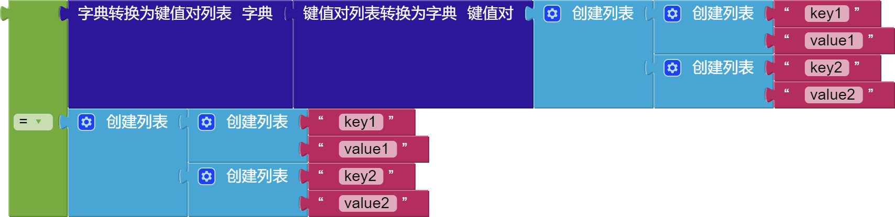
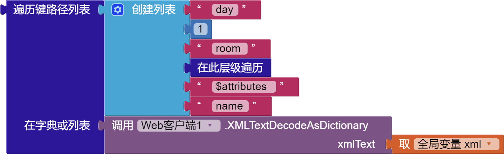

目录：

* [介绍](#dictionaries)
* [创建空字典](#create-empty-dictionary)
* [创建字典](#make-a-dictionary)
* [键值对](#pair)
* [获取键的值](#get-value-for-key)
* [设置键的值](#set-value-for-key)
* [删除键的条目](#delete-entry-for-key)
* [获取键路径的值](#get-value-at-key-path)
* [设置键路径的值](#set-value-for-key-path)
* [获取键列表](#get-keys)
* [获取值列表](#get-values)
* [键是否在字典中？](#is-key-in-dictionary)
* [字典的长度](#size-of-dictionary)
* [list of pairs to dictionary](#list-of-pairs-to-dictionary)
* [dictionary to list of pairs](#dictionary-to-list-of-pairs)
* [复制字典](#copy-dictionary)
* [merge into dictionary](#merge-into-dictionary)
* [list by walking key path](#list-by-walking-key-path)
* [walk all at level](#walk-all-at-level)
* [是否为字典？](#is-a-dictionary)

## 介绍   {#dictionaries}

Dictionaries, called in other languages terms such as maps, associative arrays or lists, are data structures that associate one value, often called the key, with another value. A common way of displaying dictionaries is using the JavaScript Object Notation (JSON), for example:

```json
{
  "id":  1,
  "name":  "Tim the Beaver",
  "school": {
    "name": "Massachusetts Institute of Technology"
  },
  "enrolled": true,
  "classes": ["6.001", "18.01", "8.01"]
}
```

The above example shows that in JSON the keys (quoted text before the `:`) can map to different types of values. The allowed types are number, text, other dictionaries, booleans, and lists. In the blocks language, you can bulid this dictionary as follows:


**Figure 1**: A blocks representation of the JSON code snippet shown above.

***
### 创建空字典   {#create-empty-dictionary}


The `create empty dictionary`{:.dictionary.block} block creates a dictionary without any key-value pairs. Entries can be added to the empty dictionary using the `set value for key`{:.dictionary.block} block. The `create empty dictionary`{:.dictionary.block} block can also be turned into a `make a dictionary`{:.dictionary.block} block by using the blue mutator button to add `pair`{:.dictionary.block} entries.

***
### 创建字典   {#make-a-dictionary}


The `make a dictionary`{:.dictionary.block} is used to create a dictionary with a set of `pair`{:.dictionary.block}s known in advance. Additional entries can be added using `set value for key`{:.dictionary.block}.

***
### 键值对   {#pair}


The `pair`{:.dictionary.block} block is a special purpose block used for constructing dictionaries.

***
### 获取键的值   {#get-value-for-key}


`获取键的值`{:.dictionary.block} 块检查字典是否包含给定键的对应值，如果是，则返回该值；否则，返回“未找到”参数的值。

此代码块的行为类似于[`列表`](lists.html)的 [`在键值对中查找`{:.list.block}](lists.html#lookupinpairs) 。

***
### 设置键的值   {#set-value-for-key}


The `set value for key`{:.dictionary.block} block sets the corresponding value for the given `key` in the `dictionary` to `value`. If no mapping exists for `key`, a new one will be created. Otherwise, the existing value is replaced by the new value.

***
### 删除键的条目   {#delete-entry-for-key}


The `delete entry for key`{:.dictionary.block} block removes the key-value mapping in the dictionary for the given key. If no entry for the key exists in the dictionary, the dictionary is not modified.

***
### 获取键路径的值   {#get-value-at-key-path}

`获取键路径的值`{:.dictionary.block} 块是 `获取键的值`{:.dictionary.block} 块的`更高级版本`，它不是获取特定键的值，而是逐层遍历路径，逐层深入数据结构获取值。

`获取键的值`{:.dictionary.block} 块等同于`获取键路径的值`{:.dictionary.block} 块路径长度为 1。

例如，以下两个块将返回 `"Tim the Beaver"`{:.text.block}：

 

它从初始字典开始，使用提供的“路径”遍历数据结构，以便检索深度嵌套在复杂数据结构中的值。

它最适合处理来自 Web 服务的 JSON 数据，从初始输入开始，它获取“键路径”中的第一个元素，并检查该点是否存在键（如果输入是字典）或索引（如果输入是列表），如果是，它选择该项目作为输入，并继续检查“关键路径”中的下一个元素，继续检查整个路径，此时它返回该位置的内容，或者“未找到”参数的值。

**不明白？看例子最直观！**

```json
{
  "id":  1,
  "name":  "Tim the Beaver",
  "school": {
    "name": "Massachusetts Institute of Technology"
  },
  "enrolled": true,
  "classes": ["6.001", "18.01", "8.01"]
}
```

例如，给定上面的 JSON 字典，以下使用 `获取键路径的值`{:.dictionary.block} 将产生结果 `"Massachusetts Institute of Technology"`{:.text.block}。


`获取键路径的值`{:.dictionary.block} 允许路径包含表示混合字典和列表时要遍历的元素索引的数字。

例如，如果我们想知道 Tim 正在上的第二堂课，我们可以执行以下操作：


这将返回值：`"18.01"`

***
### 设置键路径的值   {#set-value-for-key-path}


The `set value for key path`{:.dictionary.block} block updates the value at a specific `key path` in a data structure. It is the mirror of `get value for key path`{:.dictionary.block}, which retrieves a value at a specific `key path`. The path **must be valid**, except for the last key, which if a mapping does not exist will create a mapping to the new value. Otherwise, the existing value is replaced with the new value.

***
### 获取键列表   {#get-keys}


The `get keys`{:.dictionary.block} returns a list of keys in the dictionary.

***
### 获取值列表   {#get-values}


The `get values`{:.dictionary.block} returns a list containing the values in the dictionary. Modifying the contents of a value in the list will also modify it in the dictionary.

***
### 键是否在字典中？   {#is-key-in-dictionary}


`键是否在字典中？`{:.dictionary.block} 测试字典中是否存在该键，如果存在则返回 `真`{:.logic.block}，否则返回 `假`{:.logic.block}。

***
### 字典的长度   {#size-of-dictionary}


`字典的长度`{:.dictionary.block} 块返回字典中存在的键值对的数量。

***
### list of pairs to dictionary   {#list-of-pairs-to-dictionary}


The `list of pairs to dictionary`{:.dictionary.block} block converts an associative list of the form `((key1 value1) (key2 value2) ...)` into a dictionary mapping the keys to their values.
Because dictionaries provide better lookup performance than associative lists, if you want to perform many operations on a data structure it is advisable to use this block to convert the associative list into a dictionary first.

***
### dictionary to list of pairs   {#dictionary-to-list-of-pairs}


The `dictionary to list of pairs`{:.dictionary.block} converts a dictionary into an associative list.
This block reverses the conversion performed by the [`list of pairs to dictionary`{:.list.block}](#list-of-pairs-to-dictionary) block.



***
### copy dictionary   {#copy-dictionary}


The `copy dictionary`{:.dictionary.block} makes a deep copy of the given dictionary. This means that all of the values are copied recursively and that changing a value in the copy will not change it in the original.

***
### merge into dictionary   {#merge-into-dictionary}


The `merge into dictionary from dictionary`{:.dictionary.block} block ccopies the key-value pairs from one dictionary into another, overwriting any keys in the target dictionary.

***
### list by walking key path   {#list-by-walking-key-path}


The `list by walking key path`{:.dictionary.block} block works similarly to the `get value at key path`{:.dictionary.block}, but creates a list of values rather than returning a single value. It works by starting at the given dictionary and walking down the tree of objects following the given path. Unlike the `get value at key path`{:.dictionary.block} though, its path can be composed of three major types: dictionary keys, list indices, and the [`walk all at level`{:.dictionary.block}](#walk-all-at-level) block. If a key or index is provided, the specific path is taken at that point in the tree. If the `walk all at level`{:.dictionary.block} is specified, every value at that point is followed in succession (breadth-first), at which point the walk continues from the next element in the path. Any element that matches the whole path is added to the output list.

**Examples**

Consider the following JSON and blocks:

```json
{
  "people": [{
    "first_name": "Tim",
    "last_name": "Beaver"
  },{
    "first_name": "John",
    "last_name": "Smith",
  },{
    "first_name": "Jane",
    "last_name": "Doe"
  }]
}
```


If `global data`{:.variable.block} contains a dictionary represented by the JSON, then the `list by walking key path`{:.dictionary.block} block will produce the list `["Tim", "Beaver"]`{:.list.block}. First, the value of the `"people"`{:.text.block} tag, that is the list of people, is chosen. Next, the first element in the list is chosen. Lastly, the walk all at level block selects the values in the object at that point, that is, the values `"Tim"`{:.text.block} and `"Beaver"`{:.text.block}.

You can also use `walk all at level`{:.dictionary.block} at a level containing a list. For example, the following block selects the first names of all of the people in the structure, i.e., `["Tim", "John", "Jane"]`{:.list.block}.


This block can also be used with XML parsed using the [`Web.XMLTextDecodeAsDictionary`{:.method.block}](/reference/components/connectivity.html#Web.XMLTextDecodeAsDictionary) block. Consider the following XML document:

```xml
<schedule>
  <day>
    <room name="Hewlitt" />
    <room name="Bleil" />
  </day>
  <day>
    <room name="Kiva" />
    <room name="Star" />
  </day>
</schedule>
```

You can use the following blocks to get a list of the names of the rooms on the first day, i.e. `["Hewlitt", "Bleil"]`{:.list.block}.



***
### walk all at level   {#walk-all-at-level}


The `walk all at level`{:.dictionary.block} block is a specialized block that can be used in the key path of a `list by walking key path`{:.dictionary.block}. When encountered during a walk, it causes every item at that level to be explored. For dictionaries, this means that every value is visited. For lists, each item in the list is visited. This can be used to aggregate information from a list of items in a dictionary, such as the first name of every person in a database represented by JSON objects. See the [`list by walking key path`{:.dictionary.block}](#list-by-walking-key-path) block for examples.

***
### 是否为字典？   {#is-a-dictionary}


The `is a dictionary?`{:.dictionary.block} block tests to see whether the `thing` given to it is a dictionary or not. It will return `真`{:.logic.block} if the `thing` is a dictionary and `假`{:.logic.block} otherwise.
