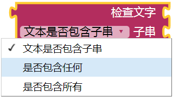

* [字符串](#string)
* [合并字符串](#join)
* [求长度](#length)
* [是否为空](#isempty)
* [字符串比较](#compare)
* [删除空格](#trim)
* [大写](#upcase)
* [小写](#downcase)
* [求起始位置](#startsat)
* [是否包含](#contains)
* [是否包含（任何）](#containsany)
* [是否包含（所有）](#containsall)
* [分解（首项）](#splitatfirst)
* [分解（任意首项）](#splitatfirstofany)
* [分解](#split)
* [分解（任意）](#splitatany)
* [用空格分解](#splitatspaces)
* [截取](#segment)
* [全部替换](#replaceall)
* [模糊文本](#obfuscatetext)
* [是一个字符串？](#isstring)
* [反转](#reverse)
* [替换所有映射](#replaceallmappings)

***
### " " (字符串)   {#string}

包含文本字符串。
该字符串可以包含任何字符（字母、数字或其他特殊字符）。 在 App Inventor 上，它将被视为一个文本对象。

***
### 合并字符串   {#join}

合并所有输入以生成单个字符串，如果没有输入，则返回一个空字符串。

***
### 求长度   {#length}

返回字符串中包含空格的字符数，这是给定文本字符串的长度。

***
### 是否为空   {#isempty}

返回字符串是否包含任何字符（包括空格），当字符串长度为 0 时，返回 `真`{:.logic.block}， 否则，返回 `假`{:.logic.block}。

***
### 字符串比较 < > = ≠ {#compare}

根据选择的下拉列表，返回第一个字符串是否按字典顺序 <、>、= 或≠第二个字符串。
如果一个字符串按字母顺序大于另一个字符串，则认为它在`ASCII`顺序上大于另一个字符串，比如：cat > Cat。

***
### 删除空格   {#trim}

删除输入字符串前面或尾部的任何空格并返回结果。`注：不会删除中间的任何空格！`

***
### 大写   {#upcase}

返回转换为全部大写的文本字符串的副本。

***
### 小写   {#downcase}

返回转换为全部小写的文本字符串的副本。

***
### 求起始位置   {#startsat}

返回 *子串* 在文本中首次出现的首个字符位置，如果不存在则返回 0。 例如，`havanabanana` 中 `ana` 的位置是 4。

***
### 是否包含   {#contains}

如果 *子串* 出现在文本中，则返回 `真`{:.logic.block}， 否则，返回 `假`{:.logic.block}。

***
### 是否包含（任何）   {#containsany}

如果 *子串列表* 中的任何子串出现在文本中，则返回 `真`{:.logic.block}， 否则，返回 `假`{:.logic.block}。

通过选择`是否包含`代码块中下拉框来获取此代码块：

***
### 是否包含（所有）   {#containsall}

如果 *子串列表* 中的所有子串都出现在文本中，则返回 `真`{:.logic.block}， 否则，返回 `假`{:.logic.block}。

通过选择`是否包含`代码块中下拉框来获取此代码块：

***
### 分解（首项）   {#splitatfirst}

使用 `分隔符` 第一次出现的位置作为分割点将给定文本分成两部分，并返回由分割点之前的部分和分割点之后的部分组成的两项列表。例如：

使用逗号作为分割点分割 `apple,banana,cherry,dogfood` 将返回两个项目的列表：第一个是文本 `apple`，第二个是文本 `banana,cherry,dogfood`。请注意，`apple` 后面的逗号不会出现在结果中，因为那是分界点。

***
### 分解（任意首项）   {#splitatfirstofany}

使用 `分隔符(列表)` 中任意项目的第一个位置作为分割点，将给定文本划分为两个项目的列表。例如：

通过列表 `[ba,ap]` 拆分 `i love apples bananas apples grapes` 将产生一个包含两个项目的列表，第一个是 `i love`，第二个是 `ples bananas apples grapes`。

***
### 分解   {#split}

使用 `分隔符` 作为分割点将文本分成多个部分并生成结果列表。例如：

用 `,`（逗号）拆分 `one,two,three,four` 返回列表 `["one","two","three","four"]`。

用 `-potato,` 拆分 `one-potato,two-potato,three-potato,four` 返回列表 `["one","two","three","four"]`。

***
### 分解（任意）   {#splitatany}

使用 `分隔符(列表)` 中的任意项目作为分割点将给定文本划分为列表，并返回结果列表。例如：

使用 *[",","rry"]* 作为双元素列表拆分 `appleberry,banana,cherry,dogfood`，返回一个包含四个项目的列表：`["applebe","Banana","che","Dogfood"]`。

***
### 用空格分解   {#splitatspaces}

在任意出现空格的地方分割给定文本，返回子串列表。

***
### 截取   {#segment}

提取从起始位置开始指定长度的部分文本。

***
### 全部替换   {#replaceall}

返回使用替换内容替换所有出现的子字符串而获得的新文本字符串。例如：

`她喜欢吃东西。 她热爱写作。 她喜欢编码` 作为文本，`她` 作为片段，`汉娜` 作为替换，替换的结果是：`汉娜喜欢吃东西。 汉娜喜欢写作。 汉娜喜欢编码`。

***
### 模糊文本   {#obfuscatetext}

将文本内容进行一定的混淆，使得最终编译成安装包后，其中的敏感信息不容易被泄漏。例如在创建要分发的包含机密信息（例如 API 密钥）的应用程序时使用此选项。

`警告：对于专家及高手而言，这种方式的安全性仍然是非常的低！！！`

***
### 是一个字符串？  {#isstring}

如果 *输入* 是文本对象，则返回 `真`{:.logic.block}， 否则，返回 `假`{:.logic.block}。

***
### 反转   {#reverse}

反转给定的文本，例如，`reverse` 将变为 `esrever`。

***
### 替换所有映射 {#replaceallmappings}

给定映射字典作为输入，将文本中的key替换为字典中的相应值，返回映射替换后的文本。替换规则有如下两种：

#### 字典顺序 {#replaceallmappingsdictionary}

如果指定了字典顺序，当一个key是另一个key的子串时，则第一个被替换的是基于字典中的顺序，也就是最早的条目首先被替换。

#### 最长字符串优先顺序 {#replaceallmappingslongeststring}

如果指定了最长字符串顺序优先，则当一个key是另一个key的子串时，第一个被替换是较长的那个。
