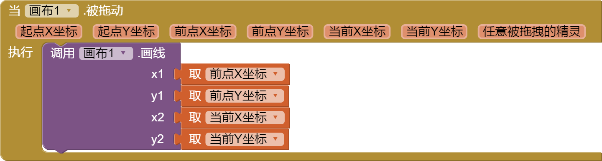

* TOC
{:toc}

[&laquo; 返回首页](index.html)
# <i class="mdi mdi-draw"></i>  绘画动画组件

目录：

1.   [球形精灵](#Ball)
1.   [画布](#Canvas)
1.   [图像精灵](#ImageSprite)

##   球形精灵  {#Ball}

可以放置在 [`画布`](#Canvas) 上的圆形“精灵”，它可以对触摸和拖动做出反应，
与其他精灵（[`图像精灵`](#ImageSprite) 和其他 `球形精灵`）及`画布`的边缘进行交互，并根据其属性值移动。

例如，让一个`球形精灵`每 500 毫秒（半秒）向`画布`的顶部移动 4 个像素，您可以将 [`速度`](#Ball.Speed) 属性设置为 4 [像素]，
[`间隔`](#Ball.Interval) 属性为 500 [毫秒]，[`方向`](#Ball.Heading) 属性为90 [度]，[`启用`](#Ball.Enabled) 属性为`真`{:.logic.block}。 
这些及其他属性可以随时更改。

`球形精灵` 和 `图像精灵` 的区别在于：`图像精灵`可以通过设置图像文件改变它的外观；
而`球形精灵`的外观只能改变其[`画笔颜色`](#Ball.PaintColor) 和 [`半径`](#Ball.Radius) 属性。

### 属性  {#Ball-Properties}

{:.properties}

{:id="Ball.Enabled" .boolean} *启用*
: 控制`球形精灵`在其速度非零时是否移动。

{:id="Ball.Heading" .number} *方向*
: `球形精灵` 在 x 轴方向上以度数表示的方向，图示如下：

 

{:id="Ball.Interval" .number} *间隔*
: 更新`球形精灵`位置的时间间隔（以毫秒为单位）。例如，如果`间隔` 为 50，[`速度`](#Ball.Speed) 为 10，则`球形精灵`将每50毫秒移动10个像素。

{:id="Ball.OriginAtCenter" .boolean .wo .do} *中心坐标*
: (X, Y) 坐标是否是`球形精灵`的中心，`真`{:.logic.block} 表示 (X, Y) 是其中心坐标，`假`{:.logic.block} 则表示 (X, Y) 是其**左上角**坐标。

{:id="Ball.PaintColor" .color} *填充色*
: `球形精灵`的颜色。

{:id="Ball.Radius" .number} *半径*
: 从`球形精灵`中心到其边缘的距离。

{:id="Ball.Speed" .number} *速度*
: `球形精灵`移动的速度。如果 [`启用`](#Ball.Enabled) 是`真`{:.logic.block}，`球形精灵`每隔[`间隔`](#Ball.Interval)毫秒移动的像素数量。

{:id="Ball.Visible" .boolean} *可见性*
: 设置精灵是否可见。

{:id="Ball.X" .number} *X坐标*
: `球形精灵`的水平坐标，随着`球形精灵`向右移动而增加。

  如果属性 [`中心坐标`](#Ball.OriginAtCenter) 为 `真`{:.logic.block}，则坐标为 `球形精灵` 的中心；否则，它是`球形精灵`的最左边的点。

{:id="Ball.Y" .number} *Y坐标*
: `球形精灵`的垂直坐标，随着`球形精灵`向下移动而增加。

  如果属性 [`中心坐标`](#Ball.OriginAtCenter) 为 `真`{:.logic.block}，则坐标为 `球形精灵` 的中心，否则为 `球形精灵` 的最高点。

{:id="Ball.Z" .number} *Z坐标*
: `球形精灵`应如何相对于其他`球形精灵`和`图像精灵`分层，编号较高的层位于编号较低的层之前。

### 事件  {#Ball-Events}

{:.events}

{:id="Ball.CollidedWith"} 被碰撞时(*其他精灵*{:.component})
: 事件将在两个启用的精灵（[`球形精灵`](#Ball)或[`图像精灵`](#ImageSprite)）碰撞时触发。

  *请注意，检查与旋转的`图像精灵`碰撞当前会检查精灵的未旋转位置，因此对于旋转的高窄或矮宽精灵来说，碰撞检查将不准确。*

{:id="Ball.Dragged"} 被拖动时(*起点X坐标*{:.number},*起点Y坐标*{:.number},*前点X坐标*{:.number},*前点Y坐标*{:.number},*当前X坐标*{:.number},*当前Y坐标*{:.number})
: 拖动事件的处理程序。在所有调用中，“起始”坐标是第一次触摸屏幕的位置，“当前”坐标描述当前线段的端点。

  在给定拖动中的第一次调用时，“前一个”坐标与起始坐标相同；随后，它们是先前调用的“当前”坐标。
  
  请注意，除非专门调用 [`移动到指定位置`](#Ball.MoveTo)，否则 `球形精灵` 实际上不会移动到任何地方以响应 `被拖动` 事件。

{:id="Ball.EdgeReached"} 到达边缘时(*边缘数值*{:.number})
: 当`球形精灵`到达屏幕的边缘时调用事件处理程序。

  如果随后使用该边缘数值调用 [`反弹`](#Ball.Bounce)方法，则精灵将从它到达的边缘开始反弹。
  
  这里的边缘表示为一个整数，表示八个方向之一：

  | -4：西北 | 1：北 | 2：东北 |
  | -3：西  | **边缘数值** | 3：东 |
  | -2：西南 | -1：南 | 4：东南 |

{:id="Ball.Flung"} 被划动时(*x坐标*{:.number},*y坐标*{:.number},*速度*{:.number},*方向*{:.number},*速度X分量*{:.number},*速度Y分量*{:.number})
: 当在精灵上进行猛击手势（快速滑动）时：提供猛击开始的 (x,y) 坐标位置，相对于画布的左上角。

  该方法还提供投射的速度（每毫秒像素数）和[方向](#Ball.Heading)（0-360 度），以及投射矢量的 x 速度和 y 速度分量。

{:id="Ball.NoLongerCollidingWith"} 结束碰撞时(*其他精灵*{:.component})
: 该事件表示一对精灵不再发生碰撞。

{:id="Ball.TouchDown"} 被按压时(*x坐标*{:.number},*y坐标*{:.number})
: 当用户开始触摸精灵时（将手指放在精灵上并停留）：提供相对于画布左上角的触摸 (x,y) 坐标位置。

{:id="Ball.TouchUp"} 被松开时(*x坐标*{:.number},*y坐标*{:.number})
: 当用户停止触摸精灵时（在 `被按压` 事件后抬起手指）：提供相对于画布左上角的触摸 (x,y) 坐标位置。

{:id="Ball.Touched"} 被触碰时(*x坐标*{:.number},*y坐标*{:.number})
: 当用户触摸精灵然后立即抬起手指时：提供相对于画布左上角的触摸 (x,y) 坐标位置。

### 方法  {#Ball-Methods}

{:.methods}

{:id="Ball.Bounce" class="method"} <i/> 反弹(*边缘数值*{:.number})
: 使这个`球形精灵`弹起，就像从墙上弹起来一样。对于正常反弹，`边缘数值`参数应该是 [`到达边缘时`](#Ball.EdgeReached) 返回的参数。

{:id="Ball.CollidingWith" class="method returns boolean"} <i/> 碰撞检测(*其他精灵*{:.component})
: 表示此`球形精灵`和传递的`其他精灵`之间是否已发生碰撞，如发生则返回`真`。

{:id="Ball.MoveIntoBounds" class="method"} <i/> 移动到边界()
: 如果精灵的一部分超出边界，则将精灵移回到边界内，否则没有任何效果。

  * 如果精灵太宽而无法适应画布，则会将精灵的左侧与画布的左侧对齐。
  
  * 如果精灵太高而无法适应画布，则会将精灵的顶部与画布的顶部对齐。

{:id="Ball.MoveTo" class="method"} <i/> 移动到指定位置(*x坐标*{:.number},*y坐标*{:.number})
: 设置`球形精灵`的 x 和 y 坐标。如果 [`中心坐标`](#Ball.OriginAtCenter) 为 `真`，则 `球形精灵` 的中心将放置在这里；否则，`球形精灵`的左上角将放置在指定的坐标处。

{:id="Ball.MoveToPoint" class="method"} <i/> 移动到坐标(*坐标*{:.list})
: 移动球，使其原点位于指定的 x 和 y 坐标处。（与上面方法效果没有区别，仅参数形式差异）

{:id="Ball.PointInDirection" class="method"} <i/> 转向指定位置(*x坐标*{:.number},*y坐标*{:.number})
: 转动此`球形精灵`方向以指向坐标为 (x, y) 的点。

{:id="Ball.PointTowards" class="method"} <i/> 转向指定对象(*目标精灵*{:.component})
: 转动此`球形精灵`方向以指向给定的`目标精灵`。新的方向将平行于连接两个精灵中心点的线。

##   画布  {#Canvas}

二维触摸感应矩形面板，可以在上面进行绘图和移动精灵。

  [`背景颜色`](#Canvas.BackgroundColor)、[`填充色`](#Canvas.PaintColor)、[`背景图像`](#Canvas.BackgroundImage)、[`宽度`](#Canvas.Width) 和 `画布` 的 [`高度`](#Canvas.Height) 可以在界面设计视图或程序设计视图中设置。“宽度”和“高度”以像素px为单位测量，并且必须为正值。

  `画布`上的任何位置都可以指定为一对`(X, Y)`值，其中：

  * X 是距`画布`左边缘的像素数
  * Y 是距`画布`上边缘的像素数

  有一些事件可以告诉何时何地触摸了`画布`或拖动了精灵（[`球形精灵`](#ImageSprite) 或 [`球形精灵`](#Ball)）。还有一些用于绘制点、线、圆、形状、圆弧和文本的方法。

### 属性  {#Canvas-Properties}

{:.properties}

{:id="Canvas.BackgroundColor" .color} *背景颜色*
: 将画布的背景颜色指定为 alpha-red-green-blue 整数，即`0xAARRGGBB`。

  alpha`00`表示完全透明，`FF`表示不透明。仅当没有背景图像时才显示背景颜色，即背景图像显示优先于。

{:id="Canvas.BackgroundImage" .text} *背景图像*
: 指定`画布`背景图像的文件名称。

{:id="Canvas.BackgroundImageinBase64" .text .wo .bo} *背景Base64图像*
: 设置Base64格式的背景图片。这需要 API 级别 >= 8。对于 API 级别低于 8 的设备，设置此选项最终会得到空白背景。

{:id="Canvas.ExtendMovesOutsideCanvas" .boolean} *可移动到画布外*
: 确定是否可以移动超出画布边界。默认为 `假`，通常应该是 `假`，提供该属性是为了向后兼容。

{:id="Canvas.FontSize" .number} *字体大小*
: 指定画布上绘制的文本的字体大小。

{:id="Canvas.Height" .number .bo} *高度*
: 设置`画布`的垂直高度，以像素px为单位。

{:id="Canvas.HeightPercent" .number .wo .bo} *高度百分比*
: 设置`画布`的垂直高度相对于整个[`屏幕高度`](userinterface.html#Screen.Height)的百分比。

{:id="Canvas.LineWidth" .number} *线宽*
: 指定在画布上绘制的线条的宽度。

{:id="Canvas.PaintColor" .color} *填充色*
: 将绘画颜色指定为 alpha-red-green-blue 整数，即`0xAARRGGBB`。

  alpha`00`表示完全透明，`FF`表示不透明。

{:id="Canvas.TapThreshold" .number} *点击阈值*
: 指定区分拖动和点击的移动阈值。

{:id="Canvas.TextAlignment" .number} *文本对齐*
: 指定画布文本的对齐方式：

  * 居中
  
  * 正常（从 [`绘制文本`](#Canvas.DrawText) 或 [`沿角度绘制文本`](#Canvas.DrawTextAtAngle) 中的指定点开始）
  
  * 相反（从 [`绘制文本`](#Canvas.DrawText) 或 [`沿角度绘制文本`](#Canvas.DrawTextAtAngle) 中的指定点结束）

{:id="Canvas.Visible" .boolean} *可见性*
: 设置`画布`是否显示在屏幕上，值是`真`{:.logic.block}则`画布`显示，`假`{:.logic.block}则隐藏。

{:id="Canvas.Width" .number .bo} *宽度*
: 设置`画布`的水平宽度，以像素px为单位。

{:id="Canvas.WidthPercent" .number .wo .bo} *宽度百分比*
: 设置`画布`的水平宽度相对于[`屏幕宽度`](userinterface.html#Screen.Width)的百分比。

### 事件  {#Canvas-Events}

{:.events}

{:id="Canvas.Dragged"} 被拖动时(*起点X坐标*{:.number},*起点Y坐标*{:.number},*前点X坐标*{:.number},*前点Y坐标*{:.number},*当前X坐标*{:.number},*当前Y坐标*{:.number},*有精灵被拖动*{:.boolean})
: 当用户从一个点（前点X坐标，前点Y坐标）拖动到另一点（当前X坐标，当前Y坐标）时。坐标（起点X坐标，起点Y坐标）指示用户第一次触摸屏幕的位置，`有精灵被拖动`表示当前有一个精灵正在被拖动（`假`则表示当前没有精灵正在被拖动）。

{:id="Canvas.Flung"} 被划动时(*x坐标*{:.number},*y坐标*{:.number},*速度*{:.number},*方向*{:.number},*速度X分量*{:.number},*速度Y分量*{:.number},*有精灵被划动*{:.boolean})
: 当在画布上进行猛击手势（快速滑动）时：提供猛击开始的 (x,y) 坐标位置，相对于画布的左上角。

  该方法还提供投射的速度（每毫秒像素数）和[方向](#Ball.Heading)（0-360 度），以及投射矢量的 x 速度和 y 速度分量。

  如果精灵位于猛击手势的起始点附近，则值`有精灵被划动`为 `真`。

{:id="Canvas.TouchDown"} 被按压时(*x坐标*{:.number},*y坐标*{:.number})
: 当用户开始触摸精灵时（将手指放在精灵上并停留）：提供相对于画布左上角的触摸 (x,y) 坐标位置。

{:id="Canvas.TouchUp"} 被松开时(*x坐标*{:.number},*y坐标*{:.number})
: 当用户停止触摸精灵时（在 `被按压` 事件后抬起手指）：提供相对于画布左上角的触摸 (x,y) 坐标位置。

{:id="Canvas.Touched"} 被触碰时(*x坐标*{:.number},*y坐标*{:.number},*有精灵被触碰*{:.boolean})
: 当用户触摸精灵然后立即抬起手指时：提供相对于画布左上角的触摸 (x,y) 坐标位置。

  如果同时也触摸到了精灵，则 `有精灵被触碰` 为 `真`，否则为 `假`。

### 方法  {#Canvas-Methods}

{:.methods}

{:id="Canvas.Clear" class="method"} <i/> 清除画布()
: 清除画布，但不删除背景图像（如果设置了的话）。

{:id="Canvas.DrawArc" class="method"} <i/> 画弧(*左*{:.number},*顶*{:.number},*右*{:.number},*底*{:.number},*起始角度*{:.number},*扫过角度*{:.number},*是否包含圆心*{:.boolean},*填充*{:.boolean})
: 通过从指定椭圆（由左、上、右和下指定）绘制圆弧，在画布上绘制圆弧。

  向右旋转时起始角度为0，顺时针旋转时起始角度增大。
  
  当 `是否包含圆心` 为 `真` 时，将绘制扇形而不是圆弧。
  
  当 `填充` 为 `真` 时，将绘制填充弧（或扇形），而不仅仅是轮廓。

  详细用法请参考[《App Inventor 2 绘图之画布画弧(DrawArc)函数的用法》](../creative/DrawArc.html)。

{:id="Canvas.DrawCircle" class="method"} <i/> 画圆(*圆心x坐标*{:.number},*圆心y坐标*{:.number},*半径*{:.number},*填充*{:.boolean})
: 在画布上以给定坐标为中心绘制一个具有给定半径的圆（`填充`参数指定是否填充）。

{:id="Canvas.DrawLine" class="method"} <i/> 画直线(*x1坐标*{:.number},*y1坐标*{:.number},*x2坐标*{:.number},*y2坐标*{:.number})
: 在画布上给定坐标之间(从x1,y1点到x2,y2点)绘制一条线。

  典型用法参考（实现画笔绘画功能）：

  

{:id="Canvas.DrawPoint" class="method"} <i/> 画点(*x坐标*{:.number},*y坐标*{:.number})
: 在画布上给定坐标处绘制一个点。

{:id="Canvas.DrawShape" class="method"} <i/> 画多边形(*坐标点列表*{:.list},*填充*{:.boolean})
: 在画布上绘制多边形。

  `坐标点列表` 应该是一个包含子列表（其中两个数字代表坐标）的列表。
  
  第一个点和最后一个点不需要相同。例如 ((x1 y1) (x2 y2) (x3 y3)) 当 `填充` 为 `真` 时，形状将被填充颜色。

{:id="Canvas.DrawText" class="method"} <i/> 绘制文本(*文本*{:.text},*x坐标*{:.number},*y坐标*{:.number})
: 使用 [`字体大小`](#Canvas.FontSize) 和 [`文本对齐`](#Canvas.TextAlignment) 属性的值绘制相对于指定坐标的指定文本。

{:id="Canvas.DrawTextAtAngle" class="method"} <i/> 沿角度绘制文本(*文本*{:.text},*x坐标*{:.number},*y坐标*{:.number},*angle*{:.number})
: 使用 [`字体大小`](#Canvas.FontSize) 和 [`文本对齐`](#Canvas.TextAlignment) 属性的值从指定坐标开始以**指定角度**绘制指定文本。

{:id="Canvas.GetBackgroundPixelColor" class="method returns color"} <i/> 获取背景像素色值(*x坐标*{:.number},*y坐标*{:.number})
: 获取给定坐标处像素的颜色，不包括精灵。

{:id="Canvas.GetPixelColor" class="method returns color"} <i/> 获取像素色值(*x坐标*{:.number},*y坐标*{:.number})
: 获取给定坐标处像素的颜色，包括精灵。

{:id="Canvas.Save" class="method returns text"} <i/> 保存()
: 将此画布的图片（包括背景图像和绘制内容）保存到设备的外部存储(file:///)中。如果发生错误，将触发[屏幕](userinterface.html#Screen)的 [出现错误时](userinterface.html#Screen.ErrorOccurred) 事件。

  此函数的`返回值`是已保存的图片的路径。

{:id="Canvas.SaveAs" class="method returns text"} <i/> 另存为...(*文件名*{:.text})
: 将此画布的图片以指定的文件名保存到设备的外部存储文件中，文件名必须以“.jpg”、“.jpeg”或“.png”之一结尾（文件类型：JPEG 或 PNG）。

{:id="Canvas.SetBackgroundPixelColor" class="method"} <i/> 设置背景像素色值(*x坐标*{:.number},*y坐标*{:.number},*颜色*{:.color})
: 设置给定像素的颜色。如果坐标超出范围，则不会生效。

##   图像精灵  {#ImageSprite}

  可以放置在 [`画布`](#Canvas) 上的“精灵”，它可以对触摸和拖动做出反应，与其他精灵（[`球形精灵`](#Ball) 和其他 `图像精灵` 进行交互） ) 和 `画布` 的边缘，并根据其属性值移动。

  它的外观是其 [`图片`](#ImageSprite.Picture) 属性中指定的图像的外观（除非其 [`可见性`](#ImageSprite.Visible) 属性是 `假`{:.logic.block}）。

  例如，要让`图像精灵`每 1000 毫秒（一秒）向左移动 10 个像素，可以将 [`速度`](#ImageSprite.Speed) 属性设置为 10 (pixels)，[`间隔` ](#ImageSprite.Interval) 属性设置为 1000 (毫秒)，[`方向`](#ImageSprite.Heading) 属性设置为 180 (度)，[`启用`](#ImageSprite.Enabled) 属性设置为 `真 `{:.logic.block}。
  
  [`旋转`](#ImageSprite.Rotates) 属性为 `真`{:.logic.block} 的精灵将随着精灵方向的变化而旋转其图像。
  
  *检查与旋转精灵的碰撞当前会检查精灵的未旋转位置，因此对于旋转的高窄或矮宽精灵来说，碰撞检查将不准确。*
  
  任何精灵属性都可以通过程序控制随时修改。

### 属性  {#ImageSprite-Properties}

{:.properties}

{:id="ImageSprite.Enabled" .boolean} *启用*
: 控制`图像精灵`在其速度非零时是否移动。

{:id="ImageSprite.Heading" .number} *方向*
: `图像精灵` 在 x 轴方向上以度数表示的方向，图示如下：

 

{:id="ImageSprite.Height" .number .bo} *高度*
: `图像精灵` 的高度（以像素px为单位）。

{:id="ImageSprite.Interval" .number} *间隔*
: 更新`图像精灵`位置的时间间隔（以毫秒为单位）。例如，如果`间隔` 为 50，[`速度`](#ImageSprite.Speed) 为 10，则`图像精灵`将每50毫秒移动10个像素。

{:id="ImageSprite.Picture" .text} *图片*
: 指定精灵图片的路径。

{:id="ImageSprite.Rotates" .boolean} *旋转*
: 如果为 `真`，则精灵图像将旋转以匹配精灵的方向。

  如果为 `假`，则当精灵改变方向时，精灵图像不会旋转。
  
  精灵围绕其中心点旋转。

{:id="ImageSprite.Speed" .number} *速度*
: `图像精灵`移动的速度。如果 [`启用`](#ImageSprite.Enabled) 是`真`{:.logic.block}，`图像精灵`每隔[`间隔`](#ImageSprite.Interval)毫秒移动的像素数量。

{:id="ImageSprite.Visible" .boolean} *可见性*
: 设置精灵是否可见。

{:id="ImageSprite.Width" .number .bo} *宽度*
: `图像精灵` 的宽度（以像素px为单位）。

{:id="ImageSprite.X" .number} *X坐标*
: `图像精灵` 左边缘的水平坐标，随着 `图像精灵` 向右移动而增加。

{:id="ImageSprite.Y" .number} *Y坐标*
: `图像精灵` 上边缘的垂直坐标，随着 `图像精灵` 向下移动而增加。

{:id="ImageSprite.Z" .number} *Z坐标*
: `图像精灵`应如何相对于其他`球形精灵`和`图像精灵`分层，编号较高的层位于编号较低的层之前。

### 事件  {#ImageSprite-Events}

{:.events}

{:id="ImageSprite.CollidedWith"} 被碰撞时(*其他精灵*{:.component})
: 事件将在两个启用的精灵（[`球形精灵`](#Ball)或[`图像精灵`](#ImageSprite)）碰撞时触发。

  *请注意，检查与旋转的`图像精灵`碰撞当前会检查精灵的未旋转位置，因此对于旋转的高窄或矮宽精灵来说，碰撞检查将不准确。*

{:id="ImageSprite.Dragged"} 被拖动时(*起点X坐标*{:.number},*起点Y坐标*{:.number},*前点X坐标*{:.number},*前点Y坐标*{:.number},*当前X坐标*{:.number},*当前Y坐标*{:.number})
: 拖动事件的处理程序。在所有调用中，“起始”坐标是第一次触摸屏幕的位置，“当前”坐标描述当前线段的端点。

  在给定拖动中的第一次调用时，“前一个”坐标与起始坐标相同；随后，它们是先前调用的“当前”坐标。
  
  请注意，除非专门调用 [`移动到指定位置`](#ImageSprite.MoveTo)，否则 `图像精灵` 实际上不会移动到任何地方以响应 `被拖动` 事件。

{:id="ImageSprite.EdgeReached"} 到达边缘时(*边缘数值*{:.number})
: 当`图像精灵`到达屏幕的边缘时调用事件处理程序。

  如果随后使用该边缘数值调用 [`反弹`](#ImageSprite.Bounce)方法，则精灵将从它到达的边缘开始反弹。
  
  这里的边缘表示为一个整数，表示八个方向之一：

  | -4：西北 | 1：北 | 2：东北 |
  | -3：西  | **边缘数值** | 3：东 |
  | -2：西南 | -1：南 | 4：东南 |

{:id="ImageSprite.Flung"} 被划动时(*x坐标*{:.number},*y坐标*{:.number},*速度*{:.number},*方向*{:.number},*速度X分量*{:.number},*速度Y分量*{:.number})
: 当在精灵上进行猛击手势（快速滑动）时：提供猛击开始的 (x,y) 坐标位置，相对于画布的左上角。

  该方法还提供投射的速度（每毫秒像素数）和[方向](#ImageSprite.Heading)（0-360 度），以及投射矢量的 x 速度和 y 速度分量。

{:id="ImageSprite.NoLongerCollidingWith"} 结束碰撞时(*其他精灵*{:.component})
: 该事件表示一对精灵不再发生碰撞。

{:id="ImageSprite.TouchDown"} 被按压时(*x坐标*{:.number},*y坐标*{:.number})
: 当用户开始触摸精灵时（将手指放在精灵上并停留）：提供相对于画布左上角的触摸 (x,y) 坐标位置。

{:id="ImageSprite.TouchUp"} 被松开时(*x坐标*{:.number},*y坐标*{:.number})
: 当用户停止触摸精灵时（在 `被按压` 事件后抬起手指）：提供相对于画布左上角的触摸 (x,y) 坐标位置。

{:id="ImageSprite.Touched"} 被触碰时(*x坐标*{:.number},*y坐标*{:.number})
: 当用户触摸精灵然后立即抬起手指时：提供相对于画布左上角的触摸 (x,y) 坐标位置。

### 方法  {#ImageSprite-Methods}

{:.methods}

{:id="ImageSprite.Bounce" class="method"} <i/> 反弹(*边缘数值*{:.number})
: 使这个`图像精灵`弹起，就像从墙上弹起来一样。对于正常反弹，`边缘数值`参数应该是 [`到达边缘时`](#ImageSprite.EdgeReached) 返回的参数。

{:id="ImageSprite.CollidingWith" class="method returns boolean"} <i/> 碰撞检测(*其他精灵*{:.component})
: 表示此`图像精灵`和传递的`其他精灵`之间是否已发生碰撞，如发生则返回`真`。

{:id="ImageSprite.MoveIntoBounds" class="method"} <i/> 移动到边界()
: 如果精灵的一部分超出边界，则将精灵移回到边界内，否则没有任何效果。

  * 如果精灵太宽而无法适应画布，则会将精灵的左侧与画布的左侧对齐。
  
  * 如果精灵太高而无法适应画布，则会将精灵的顶部与画布的顶部对齐。

{:id="ImageSprite.MoveTo" class="method"} <i/> 移动到指定位置(*x坐标*{:.number},*y坐标*{:.number})
: 移动`图像精灵`使其左上角位于指定的 (x,y) 坐标处。

{:id="ImageSprite.MoveToPoint" class="method"} <i/> 移动到坐标(*坐标*{:.list})
: 移动`图像精灵`使其原点位于指定的 (x,y) 坐标处。（与上面方法效果没有区别，仅参数形式差异）

{:id="ImageSprite.PointInDirection" class="method"} <i/> 转向指定位置(*x坐标*{:.number},*y坐标*{:.number})
: 转动此`图像精灵`方向以指向坐标为 (x, y) 的点。

{:id="ImageSprite.PointTowards" class="method"} <i/> 转向指定对象(*目标精灵*{:.component})
: 转动此`图像精灵`方向以指向给定的`目标精灵`。新的方向将平行于连接两个精灵中心点的线。
