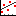

* TOC
{:toc}

[&laquo; 返回首页](index.html)
# <i class="mdi mdi-chart-line"></i>  图表组件

目录：

1.   [图表](#Chart)
1.   [二维图表数据](#ChartData2D)
1.   [趋势线](#Trendline)

##   图表  {#Chart}

图表组件用于绘制其附加数据（如[`二维图表数据`](#ChartData2D)组件）的组件。有五种不同的图表类型，包括折线图、面积图、散点图、条形图和饼图，可通过[`类型`](#Chart.Type) 属性修改。

图表组件有其他可以更改外观的属性，例如 [`描述`](#Chart.Description)、[`启用网格`](#Chart.GridEnabled)。

图表的入门教程请查看[《【App Inventor 2 数据可视化】使用柱状图和饼图收集数据》](https://bbs.tsingfun.com/thread-1442-1-1.html?f=ref)。

### 属性  {#Chart-Properties}

{:.properties}

{:id="Chart.BackgroundColor" .color} *背景颜色*
: 设置`图表`的背景颜色，使用RGBA数值表示。

{:id="Chart.Description" .text} *描述*
: 指定图表内描述标签显示的文本。指定空字符串 ("") 将不会显示标签。

{:id="Chart.GridEnabled" .boolean} *启用网格*
: 更改图表网格的可见性，如果图表类型设置为带轴的图表（适用于面积图、条形图、折线图、散点图类型，*饼图不适用*）。

{:id="Chart.Height" .number .bo} *高度*
: 设置`图表`的垂直高度，以像素px为单位。

{:id="Chart.HeightPercent" .number .wo .bo} *高度百分比*
: 设置`图表`的垂直高度相对于整个[`屏幕高度`](userinterface.html#Screen.Height)的百分比。

{:id="Chart.Labels" .list .bo} *标签列表*
: 将图表的 x 轴标签更改为指定的列表，如果图表类型设置为带轴图表。

  列表的第一个条目对应于数据的最小 x 值，第二个为最小 x 值 + 1，依此类推。

  如果没有为 x 值指定标签，则使用默认值使用（该位置的轴刻度的 x 值）。

{:id="Chart.LabelsFromString" .text .wo .do} *CSV字符串标签*
: 指定要设置到图表 x 轴的标签，如果当前是一个带有 x 轴的图表。

  标签被指定为逗号分隔（CSV格式）的值字符串，类似的用法参考[`标签列表`](#Chart.Labels)。

{:id="Chart.LegendEnabled" .boolean} *启用图例*
: 更改图表图例的可见性。

{:id="Chart.PieRadius" .number .wo .do} *饼图半径*
: 设置图表的饼图半径，如果当前类型是不是饼图，该值则没有效果。

{:id="Chart.Type" .com.google.appinventor.components.common.ChartTypeEnum .do} *类型*
: 指定图表的类型，它决定如何可视化数据。

{:id="Chart.Visible" .boolean} *可见性*
: 设置`图表`是否显示在屏幕上，值是`真`{:.logic.block}则`图表`显示，`假`{:.logic.block}则隐藏。

{:id="Chart.Width" .number .bo} *宽度*
: 设置`图表`的水平宽度，以像素px为单位。

{:id="Chart.WidthPercent" .number .wo .bo} *宽度百分比*
: 设置`图表`的水平宽度相对于[`屏幕宽度`](userinterface.html#Screen.Width)的百分比。

### 事件  {#Chart-Events}

{:.events}

{:id="Chart.EntryClick"} 数据点被点击时(*数据序列*{:.component},*x坐标*{:.any},*y坐标*{:.number})
: 指示用户单击`图表`中的数据点，返回指定点的 x轴 和 y轴值。

### 方法  {#Chart-Methods}

{:.methods}
无

##   二维图表数据  {#ChartData2D}

二维图表数据组件表示图表组件中的单个二维数据序列。例如：如果是折线图，则为一条线；如果是条形图，则为一条条形图图表。

数据组件负责处理图表的数据，数据组件的点对应 x 和 y 值。**可以将该组件拖到图表上，也就是将其直接附加到图表组件上。**

### 属性  {#ChartData2D-Properties}

{:.properties}

{:id="ChartData2D.Color" .color} *颜色*
: 指定数据序列的颜色，使用RGBA数值表示。

{:id="ChartData2D.Colors" .list .bo} *颜色列表*
: 指定数据序列的RGBA颜色数值列表。

  如果数据多于颜色，颜色将交替显示。例如，如果有红色和蓝色两种颜色，则颜色顺序为：红、蓝、红、蓝...

{:id="ChartData2D.DataFileXColumn" .text .wo .do} *数据文件x列*
: 从 [`数据文件`](storage.html#DataFile) 组件导入数据时， [`数据源`](#ChartData2D.Source) 使用的值。

  这个值表示数据文件中用于 x 条目的列数据序列。例如，如果列的第一个值是“时间”，并且指定了“时间”列值，将使用该列用于 x 值。
  
  如果未指定值，则使用默认值生成 x 值。

{:id="ChartData2D.DataFileYColumn" .text .wo .do} *数据文件y列*
: 从 [`数据文件`](storage.html#DataFile) 组件导入数据时， [`数据源`](#ChartData2D.Source) 使用的值。

  这个值表示数据文件中用于 y 条目的列数据序列。例如，如果列的第一个值为“温度”，并且指定了“温度”列值，将使用该列 y 值。
  
  如果未指定值，则使用默认值生成 y 值。

{:id="ChartData2D.DataSourceKey" .text .wo .do} *数据源键标识符*
: 为附加数据源导入的值设置键标识符。类似 [`微数据库`](storage.html#TinyDB) 组件的标签，使用它标识具体的值。

  该属性是“界面设计”视图专用的属性，应在设置图表数据组件的数据源后修改成相应的标识值。

  每种兼容数据源的适用值的完整列表如下：

    * 对于 [`微数据库`](storage.html#TinyDB) 和 [`云数据库`](storage.html#CloudDB)，这是标签值。
    * 对于 [`加速度传感器`](sensors.html#AccelerometerSensor)，该值应为以下之一：X Y 或 Z
    * 对于 [`陀螺仪传感器`](sensors.html#GyroscopeSensor)，该值应为以下之一：X Y 或 Z
    * 对于 [`位置传感器`](sensors.html#LocationSensor)，该值应为以下之一：纬度、经度、高度或速度
    * 对于 [`方向传感器`](sensors.html#OrientationSensor)，该值应为以下之一：俯仰角、方位角或横滚角
    * 对于 [`计步器`](sensors.html#Pedometer)，该值应为以下之一：行走步数、简单步数或距离
    * 对于 [`距离传感器`](sensors.html#ProximitySensor)，该值应为距离。
    * 对于 [`蓝牙客户端`](connectivity.html#BluetoothClient)，该值表示要从该值中删除的前缀。
      
      例如，如果值的格式为“t:12”，则前缀可以指定为“t:”，然后前缀将从数据中删除。如果是纯数值的话，则不能指定任何值。

{:id="ChartData2D.ElementsFromPairs" .text .wo .do} *元素来自键值对*
: 用于数据序列的逗号分隔（CSV）元素列表。值格式化如下：x1,y1,x2,y2,x3,y3。值成对获取， x 和 y 值形成一个条目。

{:id="ChartData2D.Label" .text} *标签*
: 指定数据序列标签的文本。

{:id="ChartData2D.LineType" .com.google.appinventor.components.common.LineTypeEnum .wo .do} *线型*
: 更改数据序列的线的类型，前提是数据组件附加到基于折线的图表（适用于`面积图`和`折线图`）。

  有效类型包括`折线`、`曲线`、`阶梯`。

{:id="ChartData2D.PointShape" .com.google.appinventor.components.common.PointStyleEnum .wo .do} *点型*
: 更改数据序列的点的形状，前提是数据组件附加到`散点图`的图表。

  有效类型包括`圆形`、`方形`、`三角`、`十字`、`叉号`。

{:id="ChartData2D.Source" .component .wo .do} *数据源*
: 设置数据组件的数据源。有效的选择包括：[`加速度传感器`](sensors.html#AccelerometerSensor)、[`蓝牙客户端`](connectivity.html#BluetoothClient)、[`云数据库`](storage.html#CloudDB)、[`数据文件`](storage.html#DataFile)、[`陀螺仪传感器`](sensors.html#GyroscopeSensor)、[`位置传感器`](sensors.html#LocationSensor)、[`方向传感器`](sensors.html#OrientationSensor)、[`计步器`](sensors.html#Pedometer)、[`距离传感器`](sensors.html#ProximitySensor)、[`微数据库`](storage.html#TinyDB) 和 [`Web客户端`](connectivity.html#Web)。 
  
  `数据源` 值还需要有效的 DataSourceValue、WebColumn 或 DataFileColumn 属性，取决于附加的数据源的类型（更改数据源后，所需的属性会显示在“属性”菜单中）。

  如果 [`数据源键标识符`](#ChartData2D.DataSourceKey) 标识的数据在附加的数据源组件中更新，然后数据也会在图表数据组件中更新。

{:id="ChartData2D.SpreadsheetUseHeaders" .boolean .wo .do} *使用电子表格头*
: 如果选中，[电子表格](storage.html#Spreadsheet)的第一行将用于解释 x 和 y 列值。 否则，x 和 y 列应该是列引用，例如 A 或 B。

{:id="ChartData2D.SpreadsheetXColumn" .text .wo .do} *电子表格X列*
: 设置要从附加的[电子表格](storage.html#Spreadsheet)组件中解析 x 列的值。如果未指定列，则会生成 x 列值的默认值。

{:id="ChartData2D.SpreadsheetYColumn" .text .wo .do} *电子表格Y列*
: 设置要从附加的[电子表格](storage.html#Spreadsheet)组件中解析 y 列的值。如果未指定列，则会生成 y 列值的默认值。

{:id="ChartData2D.WebXColumn" .text .wo .do} *Web客户端X列*
: 从 [Web客户端](connectivity.html#Web) 组件源导入数据时使用的值。该值表示来自 [Web客户端](connectivity.html#Web) 的用于数据系列 x 条目的列。例如，如果以 JSON 格式检索 [Web客户端](connectivity.html#Web) 内容，并且存在带有“Time”标签的数组，则可以指定“Time”列值以使用该数组。

{:id="ChartData2D.WebYColumn" .text .wo .do} *Web客户端Y列*
: 从 [Web客户端](connectivity.html#Web) 组件源导入数据时使用的值。该值表示来自 [Web客户端](connectivity.html#Web) 的用于数据系列 y 条目的列。 例如，如果以 JSON 格式检索 [Web客户端](connectivity.html#Web) 内容，并且存在带有“Temperature”标签的数组，则可以指定“Temperature”列值以使用该数组。

### 事件  {#ChartData2D-Events}

{:.events}

{:id="ChartData2D.EntryClick"} 数据点被点击时(*x坐标*{:.any},*y坐标*{:.number})
: 指示用户单击`图表`中的数据点，返回指定点的 x轴 和 y轴值。

### 方法  {#ChartData2D-Methods}

{:.methods}

{:id="ChartData2D.AddEntry" class="method"} <i/> 添加数据点(*x*{:.text},*y*{:.text})
: 添加具有指定 x 和 y 值的条目。 值可以指定为文本或数字。 对于折线图、散点图、面积图和条形图，两个值都应代表数字。
  
  对于条形图，x 值四舍五入到最接近的整数。
  
  对于饼图，x 值是文本值。

{:id="ChartData2D.RemoveEntry" class="method"} <i/> 删除数据点(*x*{:.text},*y*{:.text})
: 删除具有指定 x 和 y 值的条目（前提是该条目存在）。
  
  有关有效条目值的说明，请参阅 [`添加数据点`](#ChartData2D.AddEntry)。

{:id="ChartData2D.ChangeDataSource" class="method"} <i/> 改变数据源(*source*{:.component},*keyValue*{:.text})
: 将组件的数据源更改为具有指定键值的指定组件源。 

  请参阅 [`数据源`](#ChartData2D.Source) 属性了解适用的组件。
  
  请参阅 [`数据源键标识符`](#ChartData2D.DataSourceKey) 属性了解 keyValue 的解释。
  
  对于 [数据文件](storage.html#DataFile) 和 [Web客户端](connectivity.html#Web) 组件，keyValue 应为 CSV 格式的字符串，其中第一个值对应于 x 列，第二个值对应于 y 值。

{:id="ChartData2D.Clear" class="method"} <i/> 清除数据序列()
: 从数据系列中删除所有条目。

{:id="ChartData2D.DoesEntryExist" class="method returns boolean"} <i/> 数据点是否存在(*x*{:.text},*y*{:.text})
: 返回一个布尔值，指定是否存在具有指定 x 和 y 值的条目。 如果该值存在，则返回布尔值 `真`，否则返回 `假`。

  有关有效条目值的说明，请参阅 [`添加数据点`](#ChartData2D.AddEntry)。

{:id="ChartData2D.GetAllEntries" class="method returns list"} <i/> 获取所有数据点()
: 返回数据系列的所有条目。
  
  返回的值是一个列表，其中列表的每个元素都是按顺序包含条目值的列表。

{:id="ChartData2D.GetEntriesWithXValue" class="method returns list"} <i/> 获取X值数据点(*x*{:.text})
: 返回与指定 x 值匹配的数据系列的所有条目。

  有关返回列表格式的说明，请参阅 [`获取所有数据点`](#ChartData2D.GetAllEntries)

{:id="ChartData2D.GetEntriesWithYValue" class="method returns list"} <i/> 获取Y值数据点(*y*{:.text})
: 返回与指定 y 值匹配的数据系列的所有条目。

  有关返回列表格式的说明，请参阅 [`获取所有数据点`](#ChartData2D.GetAllEntries)

{:id="ChartData2D.ImportFromCloudDB" class="method"} <i/> 从云数据库导入(*云数据库*{:.component},*标签*{:.text})
: 通过获取指定标签值标识的值，从指定的 [云数据库](storage.html#CloudDB) 组件导入数据。

  预期的 [云数据库](storage.html#CloudDB) 值是一个列表，其格式与 [`从列表导入`](#ChartData2D.ImportFromList) 中描述的相同。

  不覆盖任何数据。

{:id="ChartData2D.ImportFromDataFile" class="method"} <i/> 从数据文件导入(*数据文件*{:.component},*x值列*{:.text},*y值列*{:.text})
: 通过采用指定的 x 列作为 x 值以及指定的 y 列作为 y 值，从指定的 [数据文件](storage.html#DataFile) 组件导入数据。 [数据文件](storage.html#DataFile) 的源文件应为 CSV 或 JSON 文件。

  对任何列参数传递空测试将导致使用默认值，即条目的索引。对于第一个条目，默认值为 1，对于第二个条目，默认值为 2，依此类推。

{:id="ChartData2D.ImportFromList" class="method"} <i/> 从列表导入(*list*{:.list})
: 将指定列表参数中的数据导入到数据序列中。
  
  该列表预计包含也是列表的元素。 每个列表元素预计有 2 个值，第一个是 x 值，第二个是 y 值。
  
  无效的列表条目将被简单地跳过。
  
  现有数据不会被清除。

{:id="ChartData2D.ImportFromSpreadsheet" class="method"} <i/> 从电子表格导入(*sheet*{:.component},*xColumn*{:.text},*yColumn*{:.text},*useHeaders*{:.boolean})
: 通过将指定的 x 列作为 x 值，将指定的 y 列作为 y 值，从指定的[电子表格](storage.html#Spreadsheet)组件导入数据。

  在调用此函数之前，必须调用电子表格组件的 ReadSheet 方法来加载数据。 不需要在电子表格组件中使用 GotSheet 事件。

  空列填充默认值（1、2、3、... 对于条目 1、2、3、...）。

{:id="ChartData2D.ImportFromTinyDB" class="method"} <i/> 从微数据库导入(*tinyDB*{:.component},*tag*{:.text})
: 通过获取指定标签值标识的值，从指定的 [微数据库](storage.html#TinyDB) 组件导入数据。

  预期的 [微数据库](storage.html#TinyDB) 值是一个列表，其格式与 [`从列表导入`](#ChartData2D.ImportFromList) 中描述的相同。

  不覆盖任何数据。

{:id="ChartData2D.ImportFromWeb" class="method"} <i/> 从Web客户端导入(*web*{:.component},*xValueColumn*{:.text},*yValueColumn*{:.text})
: 通过将指定的 x 列作为 x 值，将指定的 y 列作为 y 值，从指定的 [Web客户端](connectivity.html#Web) 组件导入数据。 在调用此函数之前，必须调用 [Web客户端](connectivity.html#Web) 组件的 Get 方法来加载数据。 无需在 Web 组件中使用 gotValue 事件。

  [Web客户端](connectivity.html#Web) 组件的预期响应是 JSON 或 CSV 格式的文件，以便此函数正常工作。

  空列填充默认值（1、2、3、... 对于条目 1、2、3、...）。

{:id="ChartData2D.RemoveDataSource" class="method"} <i/> 删除数据源()
: 从图表数据组件中删除当前附加的数据源。
  
  这样做将导致不再发送来自数据源的更新，但是，当前数据不会被删除。

##   趋势线  {#Trendline}

`趋势线`组件可用于可视化由 [`二维图表数据`](#ChartData2D) 组件表示的数据系列的趋势。必须将其添加到 [`图表`](#Chart) 组件。要关联 [`二维图表数据`](#ChartData2D) 实例，请在应用程序的设计视图中设置 [`图表数据`](#Trendline.ChartData) 属性，或使用设置代码块。如果关联的 [`二维图表数据`](#ChartData2D) 发生变化，`趋势线`将自动更新。

`趋势线`有四种模型：线性、二次、对数和指数。根据您使用的模型，`趋势线`组件的某些属性将提供相关值。

* 线性：y = m*x + b，其中 m 为线性系数，b 为 Y 截距
* 二次：y = a\*x2 + b*x + c，其中 a 为二次系数，b 为线性系数，c 为 Y 截距
* 对数：y = a + b*ln(x)，其中 a 为对数常数，b 为对数系数
* 指数：y = a*bx，其中 a 为指数系数，b 为指数基数

对于所有模型，r2 相关性将通过 [`拟合系数`](#Trendline.RSquared) 属性块报告。

注：此组件对AI伴侣要求最低版本为v2.70 (旧版本请扫码升级：帮助 -> AI伴侣信息)，编译为apk则不受限制安装后可正常运行。

### 属性  {#Trendline-Properties}

{:.properties}

{:id="Trendline.ChartData" .component .wo} *图表数据*
: 要计算最佳拟合线的数据系列。

{:id="Trendline.Color" .color} *颜色*
: 最佳拟合线的颜色。

{:id="Trendline.CorrelationCoefficient" .number .ro .bo} *相关系数*
: 趋势线与数据的相关系数。

{:id="Trendline.ExponentialBase" .number .ro .bo} *指数项底数*
: 方程 y = a*b^x 中指数项的底数。

{:id="Trendline.ExponentialCoefficient" .number .ro .bo} *指数项系数*
: 方程 y = a*b^x 中指数项的系数。

{:id="Trendline.Extend" .boolean} *拓展*
: 是否将最佳拟合线延伸至数据之外。

{:id="Trendline.LinearCoefficient" .number .ro .bo} *线性系数*
: 趋势线中线性项的系数。

{:id="Trendline.LogarithmCoefficient" .number .ro .bo} *对数系数*
: 方程 y = a + b*ln(x) 中对数项的系数。

{:id="Trendline.LogarithmConstant" .number .ro .bo} *对数常数*
: 对数方程 y = a + b*ln(x) 中的常数项。

{:id="Trendline.Model" .com.google.appinventor.components.common.BestFitModelEnum} *模型*
: 用于最佳拟合线的模型。

{:id="Trendline.Predictions" .list .ro .bo} *预测*
: 对趋势线的预测。

{:id="Trendline.QuadraticCoefficient" .number .ro .bo} *二次系数*
: 趋势线中二次项的系数（如果有）。

{:id="Trendline.RSquared" .number .ro .bo} *拟合系数*
: 趋势线的拟合系数R平方。

{:id="Trendline.Results" .dictionary .ro .bo} *结果*
: 获取最佳拟合线计算的最新值的副本。

{:id="Trendline.StrokeStyle" .com.google.appinventor.components.common.StrokeStyleEnum} *线条样式*
: 最佳拟合线的线的样式。

{:id="Trendline.StrokeWidth" .number} *线条宽度*
: 最佳拟合线的线的宽度。

{:id="Trendline.Visible" .boolean} *可见性*
: 最佳拟合线是否可见。

{:id="Trendline.XIntercepts" .any .ro .bo} *X轴交点*
: 趋势线与X轴的交点（若有）。可能的值有NaN（不相交时），单个数值（只有一个交点）或者多个值的列表。

{:id="Trendline.YIntercept" .number .ro .bo} *Y轴交点*
: 趋势线的Y轴交点（常数项）。

### 事件  {#Trendline-Events}

{:.events}

{:id="Trendline.Updated"} 已更新(*结果*{:.dictionary})
: 表示最佳拟合线已更新的事件。

### 方法  {#Trendline-Methods}

{:.methods}

{:id="Trendline.DisconnectFromChartData" class="method"} <i/> 断开数据集()
: 断开与趋势线关联的数据集。

{:id="Trendline.GetResultValue" class="method returns any"} <i/> 获取结果值(*值*{:.text})
: 获取最佳拟合线的计算值，该值根据使用的模型不同而变化。例如，线型模型会有斜率和Y交点，而平方模型有x^2，斜率和交点。
