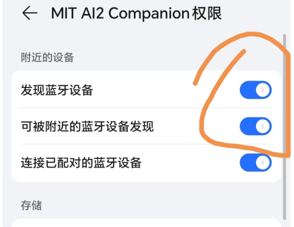
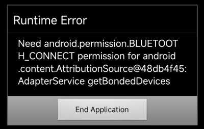
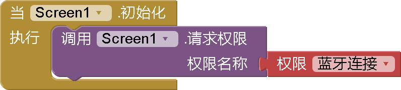
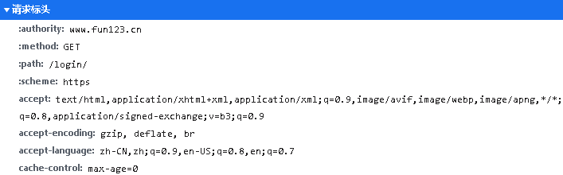
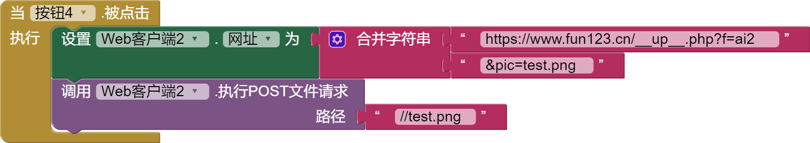

* TOC
{:toc}

[&laquo; 返回首页](index.html)
# <i class="mdi mdi-access-point"></i>  通信连接组件

目录：

* [Activity启动器](#ActivityStarter)
* [蓝牙客户端](#BluetoothClient)
* [蓝牙服务器](#BluetoothServer)
* [串口通信器](#Serial)
* [Web客户端](#Web)
  * [SimpleBase64 *拓展：图像Base64编解码传输*](#SimpleBase64)
  * [KIO4_Base64 *拓展：更强大的图像Base64编解码工具，解码后的图像可写入到文件*](../extensions/KIO4_Base64.html)
* [MQTT *拓展：轻量级物联网传输协议*](#Mqtt)
* [Socket *拓展：TCP/IP传输协议*](#Socket)

***
## Activity启动器  {#ActivityStarter}

使用`启动Activity`方法启动一个Activity（活动）的组件。

  可启动的Activity包括：
  * 为 Android 应用启动另一个 App Inventor。 首先通过下载源代码并使用文件资源管理器或解压缩utility，找到一个名为“youngandroidproject/project.properties”的文件，找出另一个程序的的类。 
  
    文件的第一行将开始使用“main=”并后跟类名。
    例如：`main=com.gmail.Bitdiddle.Ben.HelloPurr.Screen1`（第一个组件表明它是由 Ben.Bitdiddle@gmail.com 创建）要让您的 `Activity启动器` 启动此应用程序，设置以下属性：
    * `ActivityPackage` 到类名，删除最后一个组件（例如： `com.gmail.Bitdiddle.Ben.HelloPurr`)
    * `ActivityClass` 到整个类名（例如：`com.gmail.Bitdiddle.Ben.HelloPurr.Screen1`)
  * 通过设置以下属性启动相机应用程序：
    * `Action`: `android.intent.action.MAIN`
    * `ActivityPackage`: `com.android.camera`
    * `ActivityClass`: `com.android.camera.Camera`
  * 执行网络搜索。 假设您要搜索的词是“vampire”（您可以随意替换自己的选择），将属性设置为：
    * `Action`: `android.intent.action.WEB_SEARCH`
    * `ExtraKey`: `query`
    * `ExtraValue`: `vampire`
    * `ActivityPackage`: `com.google.android.providers.enhancedgooglesearch`
    * `ActivityClass`: `com.google.android.providers.enhancedgooglesearch.Launcher`
  * 打开浏览器到指定的网页。 假设您要访问的页面是“www.fun123.cn”（您可以随意替换自己的选择），将属性设置为：
    * `Action`: `android.intent.action.VIEW`
    * `DataUri`: `http://www.fun123.cn`
    * 调用第三方地图也可以使用这个启动器：
    * 调用高德地图的uri参考地址：[https://lbs.amap.com/api/uri-api/guide/mobile-web/point/#point-on-lnglat](https://lbs.amap.com/api/uri-api/guide/mobile-web/point/#point-on-lnglat)
    * 调用百度地图的uri参考地址：[https://lbsyun.baidu.com/index.php?title=uri/api/web](https://lbsyun.baidu.com/index.php?title=uri/api/web)
  * 打开系统照相机（比[照相机](media.html#Camera)组件打开的界面会丰富一些）
    * `Action`: `android.media.action.STILL_IMAGE_CAMERA`
  * 可选取多个文件（图片、音频、视频等）：
    * `Action`: `android.intent.action.GET_CONTENT`


### 属性  {#ActivityStarter-Properties}

{:.properties}

{:id="ActivityStarter.Action" .text} *Action*
: 指定将用于启动Activity活动的操作。

{:id="ActivityStarter.ActivityClass" .text} *Activity类名*
: 指定将启动的特定组件的Class类部分。

{:id="ActivityStarter.ActivityPackage" .text} *Activity包名*
: 指定将启动的特定组件的包部分。

{:id="ActivityStarter.DataType" .text} *数据类型*
: 指定要传递给Activity活动的 MIME 类型。

{:id="ActivityStarter.DataUri" .text} *数据URI*
: 指定将用于启动Activity活动的数据URI。

{:id="ActivityStarter.ExtraKey" .text} *ExtraKey*
: 指定将传递给Activity活动的额外键。（已过时，应使用 Extras）

{:id="ActivityStarter.ExtraValue" .text} *ExtraValue*
: 指定将传递给Activity活动的额外值。（已过时，应使用 Extras）

{:id="ActivityStarter.Extras" .list .bo} *Extras*
: 返回将作为额外数据传递给Activity活动的键值对列表。

{:id="ActivityStarter.Result" .text .ro .bo} *结果*
: 返回Activity活动的结果。

{:id="ActivityStarter.ResultName" .text} *结果名称*
: 指定一个名称，用于从Activity活动中获取结果。

{:id="ActivityStarter.ResultType" .text .ro .bo} *结果类型*
: 从Activity活动中返回的结果 MIME 类型。

{:id="ActivityStarter.ResultUri" .text .ro .bo} *结果URI地址*
: 从Activity活动中返回的结果URI。

### 事件  {#ActivityStarter-Events}

{:.events}

{:id="ActivityStarter.ActivityCanceled"} 取消活动调用()
: 如果此 `Activity启动器` 因为Activity活动被取消而返回，则引发该事件。

{:id="ActivityStarter.AfterActivity"} 活动调用结束(*result*{:.text})
: 此 `Activity启动器` 返回后触发的事件。

### 方法  {#ActivityStarter-Methods}

{:.methods}

{:id="ActivityStarter.ResolveActivity" class="method returns text"} <i/> 处理活动信息()
: 返回与此 `Activity启动器` 对应的Activity活动名称，如果找不到相应的Activity活动，则为空字符串。

{:id="ActivityStarter.StartActivity" class="method"} <i/> 启动活动对象()
: 启动这个 `Activity启动器` 对应的Activity活动。

***
## 蓝牙客户端  {#BluetoothClient}

使用 `蓝牙客户端` 通过蓝牙将您的设备连接到其他设备。这个组件使用串行端口配置文件 (SPP) 进行通信。 

如果您有兴趣使用低能耗蓝牙，请看 [BluetoothLE](http://iot.appinventor.mit.edu/#/bluetoothle/bluetoothleintro) 扩展。


### 属性  {#BluetoothClient-Properties}

{:.properties}

{:id="BluetoothClient.AddressesAndNames" .list .ro .bo} *地址及名称*
: 返回配对的蓝牙设备列表，返回的列表每个元素都是一个字符串，由设备地址、一个空格和设备的名称组成。

  **蓝牙设备列表为空？**

  {:.vip}
  你可能没有开启AI伴侣或编译后App的发现蓝牙权限，这里以AI伴侣为例，勾上即可：<br/>
  

{:id="BluetoothClient.Available" .boolean .ro .bo} *可用状态*
: 如果设备上有蓝牙功能，则返回`真`{:.logic.block}，否则返回`假`{:.logic.block}。

{:id="BluetoothClient.CharacterEncoding" .text} *字符编码*
: 返回发送和接收文本时使用的字符集编码（如GBK，UTF-8）。

{:id="BluetoothClient.DelimiterByte" .number} *分隔符字节码*
: 调用 ReceiveText、ReceiveSignedBytes 或 ReceiveUnsignedBytes 返回传递负数时使用的分隔符字节码。

{:id="BluetoothClient.DisconnectOnError" .boolean} *错误时断开连接*
: 指定 蓝牙客户端/蓝牙服务器 是否在发生错误时自动断开连接。

{:id="BluetoothClient.Enabled" .boolean .ro .bo} *启用*
: 如果启用了蓝牙，返回`真`{:.logic.block}，否则返回`假`{:.logic.block}。

{:id="BluetoothClient.HighByteFirst" .boolean} *高位优先*
: 指定发送和接收数字时是否使用最高有效位字节优先。

{:id="BluetoothClient.IsConnected" .boolean .ro .bo} *是否已连接*
: 如果已建立与蓝牙设备的连接，则返回 `真`{:.logic.block}。

{:id="BluetoothClient.PollingRate" .number} *轮询率*
: 返回蓝牙客户端配置的轮询速率值。

{:id="BluetoothClient.Secure" .boolean} *启用安全连接*
: 指定是否启用安全连接。

### 事件  {#BluetoothClient-Events}

{:.events}
无

**中文网注：**

蓝牙客户端没有“当收到数据时”的事件（即收到服务端数据后触发的事件），只能通过定时器定期轮询接收数据，可以考虑使用BluetoothLE低功耗蓝牙[拓展](../extensions/index.html)，它拥有这个事件。

### 方法  {#BluetoothClient-Methods}

{:.methods}

{:id="BluetoothClient.BytesAvailableToReceive" class="method returns number"} <i/> 获取接收字节数()
: 返回输入流中可用的字节数。

{:id="BluetoothClient.Connect" class="method returns boolean"} <i/> 连接(*地址*{:.text})
: 连接到指定地址的蓝牙设备。

  **连接报错？ Runtime Error: Need android.permission.BLUETOOTH_CONNECT ...**

  

  {:.vip}
  这时需要请求蓝牙连接权限，参考代码如下：<br/>
  

{:id="BluetoothClient.ConnectWithUUID" class="method returns boolean"} <i/> 连接指定设备(*地址*{:.text},*唯一编号*{:.text})
: 连接到指定地址和UUID的蓝牙设备。

{:id="BluetoothClient.Disconnect" class="method"} <i/> 断开连接()
: 断开已连接的蓝牙设备。

{:id="BluetoothClient.IsDevicePaired" class="method returns boolean"} <i/> 检查设备是否配对(*地址*{:.text})
: 检查指定地址的蓝牙设备是否已配对。

{:id="BluetoothClient.ReceiveSigned1ByteNumber" class="method returns number"} <i/> 接收单字节带符号数字()
: 读取带符号的 1 字节数字。

{:id="BluetoothClient.ReceiveSigned2ByteNumber" class="method returns number"} <i/> 接收双字节带符号数字()
: 读取带符号的 2 字节数字。

{:id="BluetoothClient.ReceiveSigned4ByteNumber" class="method returns number"} <i/> 接收四字节带符号数字()
: 读取带符号的 4 字节数字。

{:id="BluetoothClient.ReceiveSignedBytes" class="method returns list"} <i/> 接收带符号字节数组(*字节数*{:.number})
: 从输入流中读取指定数量(`字节数`)的带符号的字节，并将它们作为列表返回。

    如果 `字节数` 为负数，则读取到分隔符字节码（*分隔符字节码*属性指定的）为止，分隔符字节码包含在返回的列表中。

{:id="BluetoothClient.ReceiveText" class="method returns text"} <i/> 接收文本(*字节数*{:.number})
: 从输入流中读取指定数量(`字节数`)的带符号的字节，并将它们转换为文本。

    如果 `字节数` 为负数，则读取到分隔符字节码（*分隔符字节码*属性指定的）为止。

{:id="BluetoothClient.ReceiveUnsigned1ByteNumber" class="method returns number"} <i/> 接收单字节无符号数字()
: 读取一个无符号的 1 字节数字。

{:id="BluetoothClient.ReceiveUnsigned2ByteNumber" class="method returns number"} <i/> 接收双字节无符号数字()
: 读取一个无符号的 2 字节数字。

{:id="BluetoothClient.ReceiveUnsigned4ByteNumber" class="method returns number"} <i/> 接收四字节无符号数字()
: 读取一个无符号的 4 字节数字。

{:id="BluetoothClient.ReceiveUnsignedBytes" class="method returns list"} <i/> 接收无符号字节数组(*字节数*{:.number})
: 从输入流中读取指定数量(`字节数`)的无符号的字节，并将它们作为列表返回。

    如果 `字节数` 为负数，则读取到分隔符字节码（*分隔符字节码*属性指定的）为止，分隔符字节码包含在返回的列表中。

{:id="BluetoothClient.Send1ByteNumber" class="method"} <i/> 发送单字节数字(*数值*{:.text})
: 将指定的`数值`字符串转换成整数，并将其作为 1 个字节写入到输出流。

    如果`数值`无法转换为整数，或转换的整数 1 个字节不够表达，就会触发 Screen 的 ErrorOccurred 事件，然后方法直接返回，不会向输出流中写入任何字节。

{:id="BluetoothClient.Send2ByteNumber" class="method"} <i/> 发送双字节数字(*数值*{:.text})
: 将指定的`数值`字符串转换成整数，并将其作为 2 个字节写入到输出流。

    如果`数值`无法转换为整数，或转换的整数 2 个字节不够表达，就会触发 Screen 的 ErrorOccurred 事件，然后方法直接返回，不会向输出流中写入任何字节。

{:id="BluetoothClient.Send4ByteNumber" class="method"} <i/> 发送四字节数字(*数值*{:.text})
: 将指定的`数值`字符串转换成整数，并将其作为 4 个字节写入到输出流。

    如果`数值`无法转换为整数，或转换的整数 4 个字节不够表达，就会触发 Screen 的 ErrorOccurred 事件，然后方法直接返回，不会向输出流中写入任何字节。

{:id="BluetoothClient.SendBytes" class="method"} <i/> 发送字节数组(*列表*{:.list})
: 从指定列表中取出每个元素，将其转换为字符串，字符串转换成整数，并将其作为 1 个字节写入到输出流。

    如果一个元素无法转换为整数，或转换的整数 1 个字节不够表达，就会触发 Screen 的 ErrorOccurred 事件，然后方法直接返回，不会向输出流中写入任何字节。

{:id="BluetoothClient.SendText" class="method"} <i/> 发送文本(*文本*{:.text})
: 将指定文本转换为字节并将它们写入到输出流。

***
## 蓝牙服务器  {#BluetoothServer}

使用 `蓝牙服务器` 组件将您的设备变成接收来自其他使用 `蓝牙客户端` 组件的应用程序连接的服务器。

### 属性  {#BluetoothServer-Properties}

{:.properties}

{:id="BluetoothServer.Available" .boolean .ro .bo} *可用状态*
: 如果设备上有蓝牙功能，则返回`真`{:.logic.block}，否则返回`假`{:.logic.block}。

{:id="BluetoothServer.CharacterEncoding" .text} *字符编码*
: 返回发送和接收文本时使用的字符编码。

{:id="BluetoothServer.DelimiterByte" .number} *分隔符字节码*
: 调用 ReceiveText、ReceiveSignedBytes 或 ReceiveUnsignedBytes 返回传递负数时使用的分隔符字节码。

{:id="BluetoothServer.Enabled" .boolean .ro .bo} *启用*
: 如果启用了蓝牙，返回`真`{:.logic.block}，否则返回`假`{:.logic.block}。

{:id="BluetoothServer.HighByteFirst" .boolean} *高位优先*
: 指定发送和接收数字时是否使用最高有效位字节优先。

{:id="BluetoothServer.IsAccepting" .boolean .ro .bo} *接收状态*
: 如果此 `蓝牙服务器` 组件正在接受一个传入连接，则返回`真`{:.logic.block}。

{:id="BluetoothServer.IsConnected" .boolean .ro .bo} *连接状态*
: 如果与蓝牙设备已建立连接，则返回 `真`{:.logic.block}。

{:id="BluetoothServer.Secure" .boolean} *启用安全连接*
: 指定是否启用安全连接。

### 事件  {#BluetoothServer-Events}

{:.events}

{:id="BluetoothServer.ConnectionAccepted"} 接受连接()
: 表示已接受蓝牙连接。

**中文网注：**

蓝牙服务端没有“当收到数据时”的事件（即收到客户端数据后触发的事件），只能通过定时器定期轮询接收数据，可以考虑使用BluetoothLE低功耗蓝牙[拓展](../extensions/index.html)，它拥有这个事件。

### 方法  {#BluetoothServer-Methods}

{:.methods}

{:id="BluetoothServer.AcceptConnection" class="method"} <i/> 接受连接(*服务名*{:.text})
: 接受使用串行端口配置文件 (SPP) 进行通信的传入连接。

{:id="BluetoothServer.AcceptConnectionWithUUID" class="method"} <i/> 接受与指定设备连接(*服务名*{:.text},*唯一编号*{:.text})
: 接受指定 UUID 的传入连接。

{:id="BluetoothServer.BytesAvailableToReceive" class="method returns number"} <i/> 获取接收字节数()
: 返回输入流中可用的字节数。

{:id="BluetoothServer.Disconnect" class="method"} <i/> 断开连接()
: 断开当前已连接的蓝牙设备。

{:id="BluetoothServer.ReceiveSigned1ByteNumber" class="method returns number"} <i/> 接收单字节带符号数字()
: 读取带符号的 1 字节数字。

{:id="BluetoothServer.ReceiveSigned2ByteNumber" class="method returns number"} <i/> 接收双字节带符号数字()
: 读取带符号的 2 字节数字。

{:id="BluetoothServer.ReceiveSigned4ByteNumber" class="method returns number"} <i/> 接收四字节带符号数字()
: 读取带符号的 4 字节数字。

{:id="BluetoothServer.ReceiveSignedBytes" class="method returns list"} <i/> 接收带符号字节数组(*字节数*{:.number})
: 从输入流中读取指定数量(`字节数`)的带符号的字节，并将它们作为列表返回。

    如果 `字节数` 为负数，则读取到分隔符字节码（*分隔符字节码*属性指定的）为止，分隔符字节码包含在返回的列表中。

{:id="BluetoothServer.ReceiveText" class="method returns text"} <i/> 接收文本(*字节数*{:.number})
: 从输入流中读取指定数量(`字节数`)的带符号的字节，并将它们转换为文本。

    如果 `字节数` 为负数，则读取到分隔符字节码（*分隔符字节码*属性指定的）为止。

{:id="BluetoothServer.ReceiveUnsigned1ByteNumber" class="method returns number"} <i/> 接收单字节无符号数字()
: 读取一个无符号的 1 字节数字。

{:id="BluetoothServer.ReceiveUnsigned2ByteNumber" class="method returns number"} <i/> 接收双字节无符号数字()
: 读取一个无符号的 2 字节数字。

{:id="BluetoothServer.ReceiveUnsigned4ByteNumber" class="method returns number"} <i/> 接收四字节无符号数字()
: 读取一个无符号的 4 字节数字。

{:id="BluetoothServer.ReceiveUnsignedBytes" class="method returns list"} <i/> 接收无符号字节数组(*字节数*{:.number})
: 从输入流中读取指定数量(`字节数`)的无符号的字节，并将它们作为列表返回。

    如果 `字节数` 为负数，则读取到分隔符字节码（*分隔符字节码*属性指定的）为止，分隔符字节码包含在返回的列表中。

{:id="BluetoothServer.Send1ByteNumber" class="method"} <i/> 发送单字节数字(*数值*{:.text})
: 将指定的`数值`字符串转换成整数，并将其作为 1 个字节写入到输出流。

    如果`数值`无法转换为整数，或转换的整数 1 个字节不够表达，就会触发 Screen 的 ErrorOccurred 事件，然后方法直接返回，不会向输出流中写入任何字节。

{:id="BluetoothServer.Send2ByteNumber" class="method"} <i/> 发送双字节数字(*数值*{:.text})
: 将指定的`数值`字符串转换成整数，并将其作为 2 个字节写入到输出流。

    如果`数值`无法转换为整数，或转换的整数 2 个字节不够表达，就会触发 Screen 的 ErrorOccurred 事件，然后方法直接返回，不会向输出流中写入任何字节。

{:id="BluetoothServer.Send4ByteNumber" class="method"} <i/> 发送四字节数字(*数值*{:.text})
: 将指定的`数值`字符串转换成整数，并将其作为 4 个字节写入到输出流。

    如果`数值`无法转换为整数，或转换的整数 4 个字节不够表达，就会触发 Screen 的 ErrorOccurred 事件，然后方法直接返回，不会向输出流中写入任何字节。

{:id="BluetoothServer.SendBytes" class="method"} <i/> 发送字节数组(*列表*{:.list})
: 从指定列表中取出每个元素，将其转换为字符串，字符串转换成整数，并将其作为 1 个字节写入到输出流。

    如果一个元素无法转换为整数，或转换的整数 1 个字节不够表达，就会触发 Screen 的 ErrorOccurred 事件，然后方法直接返回，不会向输出流中写入任何字节。

{:id="BluetoothServer.SendText" class="method"} <i/> 发送文本(*文本*{:.text})
: 将指定文本转换为字节并将它们写入到输出流。

{:id="BluetoothServer.StopAccepting" class="method"} <i/> 停止接受连接()
: 停止接受传入连接。

***
## 串口通信器  {#Serial}

串口通信组件。

### 属性  {#Serial-Properties}

{:.properties}

{:id="Serial.BaudRate" .number} *波特率*
: 返回当前波特率。

{:id="Serial.BufferSize" .number} *缓冲区大小*
: 返回缓冲区大小（以字节为单位）

{:id="Serial.IsInitialized" .boolean .ro .bo} *是否已初始化*
: 当串口已初始化时返回 `真`。

{:id="Serial.IsOpen" .boolean .ro .bo} *是否打开*
: 当串口连接打开时返回 `真`。

### 事件  {#Serial-Events}

{:.events}
无


### 方法  {#Serial-Methods}

{:.methods}

{:id="Serial.CloseSerial" class="method returns boolean"} <i/> 关闭串口()
: 关闭串口连接。关闭时返回 `真`。

{:id="Serial.InitializeSerial" class="method"} <i/> 初始化串口()
: 初始化串口连接。

{:id="Serial.OpenSerial" class="method returns boolean"} <i/> 打开串口()
: 打开串口连接。 打开时返回 `真`。

{:id="Serial.PrintSerial" class="method"} <i/> 打印串口(*data*{:.text})
: 将给定数据写入串口，并在末尾添加一个新行。

{:id="Serial.ReadSerial" class="method returns text"} <i/> 读取串口()
: 从串口读取数据。

{:id="Serial.WriteSerial" class="method"} <i/> 写入串口(*data*{:.text})
: 将给定数据写入串口。

***
## Web客户端  {#Web}

为 HTTP GET、POST、PUT 和 DELETE 请求提供功能的非可视组件。

### 属性  {#Web-Properties}

{:.properties}

{:id="Web.AllowCookies" .boolean} *允许使用Cookies*
: 指定是否允许使用Cookies。（Cookies是一种浏览器本地缓存技术，用于缓存一些用户个性数据、身份验证信息等。常见的如“30天免登陆”功能就是将用户登录验证信息保存到Cookies，有效期30天。还有诸如你的搜索偏好，浏览偏好等设置也是通过Cookies进行保存的）

{:id="Web.RequestHeaders" .list .bo} *请求标头*
: 设置请求标头。以下是一个请求标头示例截图：

  

  请求标头信息，格式为`包含双项子列表的列表`数据。其中，各子列表中第一项表示请求头的字段名，而第二项则表示对应的字段值，既可以是单个数值，也可以是包含多个数值的列表。

  设置案例如下：

  

{:id="Web.ResponseFileName" .text} *响应文件名称*
: 指定保存响应数据的文件的名称，如果 [保存响应信息](#Web.SaveResponse) 为`真` 且 [响应文件名称](#Web.ResponseFileName) 为空，则自动创建一个新文件名。

{:id="Web.SaveResponse" .boolean} *保存响应信息*
: 指定是否将响应数据保存到文件中。

{:id="Web.Timeout" .number} *超时时间(ms)*
: 返回每个请求在超时前等待响应的毫秒数，如果设置为`0`，则请求将无限期等待响应。

{:id="Web.Url" .text} *URL网址*
: 指定待请求的URL网址.

### 事件  {#Web-Events}

{:.events}

{:id="Web.GotFile"} 获得文件(*URL网址*{:.text},*响应代码*{:.number},*响应类型*{:.text},*文件名*{:.text})
: 当请求完成时触发该事件，以文件形式返回内容。

{:id="Web.GotText"} 获得文本(*URL网址*{:.text},*响应代码*{:.number},*响应类型*{:.text},*响应内容*{:.text})
: 当请求完成时触发该事件，以文本形式返回内容。

{:id="Web.TimedOut"} 超时(*URL网址*{:.text})
: 当请求超时触发该事件。

### 方法  {#Web-Methods}

{:.methods}

{:id="Web.BuildRequestData" class="method returns text"} <i/> 创建数据请求(*列表*{:.list})
: 将表示名称和值对的二元素列表转换为 `application/x-www-form-urlencoded` 媒体类型格式的字符串，适合传递给[执行POST文本请求](#Web.PostText)。

{:id="Web.ClearCookies" class="method"} <i/> 清除Cookies()
: 清除此 Web客户端 组件的所有 Cookies。

{:id="Web.Delete" class="method"} <i/> 删除()
: 使用 [URL网址](#Web.Url) 属性执行 HTTP DELETE 请求并获取响应数据。

  * 如果 [保存响应数据](#Web.SaveResponse) 属性为真，则响应数据将保存在文件中，并且 [获得文件](#Web.GotFile) 事件被触发。[响应文件名称](#Web.ResponseFileName) 属性可用于指定文件的名称。

  * 如果 [保存响应数据](#Web.SaveResponse) 属性为假，[获得文本](#Web.GotText) 事件将触发。

{:id="Web.Get" class="method"} <i/> 执行GET请求()
: 使用 [URL网址](#Web.Url) 属性执行 HTTP GET 请求并获取响应数据。

  * 如果 [保存响应数据](#Web.SaveResponse) 属性为真，则响应数据将保存在文件中，并且 [获得文件](#Web.GotFile) 事件被触发。[响应文件名称](#Web.ResponseFileName) 属性可用于指定文件的名称。

  * 如果 [保存响应数据](#Web.SaveResponse) 属性为假，[获得文本](#Web.GotText) 事件将触发。

{:id="Web.HtmlTextDecode" class="method returns text"} <i/> 解码HTML文本(*HTML文本*{:.text})
: Decodes the given HTML text value.

   HTML Character Entities such as `&amp;`, `&lt;`, `&gt;`, `&apos;`, and `&quot;` are
 changed to `&`, `<`, `>`, `'`, and `"`.
 Entities such as `&#xhhhh;`, and `&#nnnn;` are changed to the appropriate characters.

{:id="Web.JsonObjectEncode" class="method returns text"} <i/> 编码JSON对象(*JSON对象*{:.any})
: Returns the value of a built-in type (i.e., boolean, number, text, list, dictionary)
 in its JavaScript Object Notation representation. If the value cannot be
 represented as JSON, the Screen's ErrorOccurred event will be run, if any,
 and the Web component will return the empty string.

{:id="Web.JsonTextDecode" class="method returns any"} <i/> 解码JSON文本(*JSON文本*{:.text})
: Decodes the given JSON encoded value to produce a corresponding AppInventor value.
 A JSON list `[x, y, z]` decodes to a list `(x y z)`,  A JSON object with key A and value B,
 (denoted as `{A:B}`) decodes to a list `((A B))`, that is, a list containing the two-element
 list `(A B)`.

   Use the method [JsonTextDecodeWithDictionaries](#Web.JsonTextDecodeWithDictionaries) if you
 would prefer to get back dictionary objects rather than lists-of-lists in the result.

{:id="Web.JsonTextDecodeWithDictionaries" class="method returns any"} <i/> JsonTextDecodeWithDictionaries(*JSON文本*{:.text})
: Decodes the given JSON encoded value to produce a corresponding App Inventor value.
 A JSON list [x, y, z] decodes to a list (x y z). A JSON Object with name A and value B,
 denoted as \{a: b\} decodes to a dictionary with the key a and value b.

{:id="Web.PatchFile" class="method"} <i/> 执行PATCH文件请求(*文件路径*{:.text})
: PATCH方式发送通用文件，用法类似 [执行POST文件请求](#Web.PostFile) 。

  * 如果 [保存响应数据](#Web.SaveResponse) 属性为真，则响应数据将保存在文件中，并且 [获得文件](#Web.GotFile) 事件被触发。[响应文件名称](#Web.ResponseFileName) 属性可用于指定文件的名称。

  * 如果 [保存响应数据](#Web.SaveResponse) 属性为假，[获得文本](#Web.GotText) 事件将触发。

{:id="Web.PatchText" class="method"} <i/> 执行PATCH文本请求(*文本*{:.text})
: 使用 [URL网址](#Web.Url) 属性和指定文本执行 HTTP PATCH 请求。文本的字符集使用 UTF-8 进行编码。

  * 如果 [保存响应数据](#Web.SaveResponse) 属性为真，则响应数据将保存在文件中，并且 [获得文件](#Web.GotFile) 事件被触发。[响应文件名称](#Web.ResponseFileName) 属性可用于指定文件的名称。

  * 如果 [保存响应数据](#Web.SaveResponse) 属性为假，[获得文本](#Web.GotText) 事件将触发。

{:id="Web.PatchTextWithEncoding" class="method"} <i/> 执行PATCH编码文本请求(*文本*{:.text},*编码*{:.text})
: 使用 [URL网址](#Web.Url) 属性和指定文本执行 HTTP PATCH 请求。文本的字符集使用指定的编码方式进行编码。

  * 如果 [保存响应数据](#Web.SaveResponse) 属性为真，则响应数据将保存在文件中，并且 [获得文件](#Web.GotFile) 事件被触发。[响应文件名称](#Web.ResponseFileName) 属性可用于指定文件的名称。

  * 如果 [保存响应数据](#Web.SaveResponse) 属性为假，[获得文本](#Web.GotText) 事件将触发。

{:id="Web.PostFile" class="method"} <i/> 执行POST文件请求(*文件路径*{:.text})
: POST方式发送通用文件，同 curl -F 参数，可用于**二进制文件上传**，参考代码如下：

  

  文件上传服务器结果如下：
  
  

  服务器代码请参考[《App Inventor 2 实现上传文件到服务器全方案总结》](../pro/file_upload.html)。

  * 如果 [保存响应数据](#Web.SaveResponse) 属性为真，则响应数据将保存在文件中，并且 [获得文件](#Web.GotFile) 事件被触发。[响应文件名称](#Web.ResponseFileName) 属性可用于指定文件的名称。

  * 如果 [保存响应数据](#Web.SaveResponse) 属性为假，[获得文本](#Web.GotText) 事件将触发。

{:id="Web.PostText" class="method"} <i/> 执行POST文本请求(*文本*{:.text})
: 使用 [URL网址](#Web.Url) 属性和指定文本执行 HTTP POST 请求。文本的字符集使用 UTF-8 进行编码。

   * 如果 [保存响应数据](#Web.SaveResponse) 属性为真，则响应数据将保存在文件中，并且 [获得文件](#Web.GotFile) 事件被触发。[响应文件名称](#Web.ResponseFileName) 属性可用于指定文件的名称。

  * 如果 [保存响应数据](#Web.SaveResponse) 属性为假，[获得文本](#Web.GotText) 事件将触发。

{:id="Web.PostTextWithEncoding" class="method"} <i/> 执行POST编码文本请求(*文本*{:.text},*编码*{:.text})
: 使用 [URL网址](#Web.Url) 属性和指定文本执行 HTTP POST 请求。文本的字符集使用指定的编码方式进行编码。

   * 如果 [保存响应数据](#Web.SaveResponse) 属性为真，则响应数据将保存在文件中，并且 [获得文件](#Web.GotFile) 事件被触发。[响应文件名称](#Web.ResponseFileName) 属性可用于指定文件的名称。

  * 如果 [保存响应数据](#Web.SaveResponse) 属性为假，[获得文本](#Web.GotText) 事件将触发。

{:id="Web.PutFile" class="method"} <i/> 执行PUT文件请求(*文件路径*{:.text})
: PUT方式发送通用文件，用法类似 [执行POST文件请求](#Web.PostFile) 。

   * 如果 [保存响应数据](#Web.SaveResponse) 属性为真，则响应数据将保存在文件中，并且 [获得文件](#Web.GotFile) 事件被触发。[响应文件名称](#Web.ResponseFileName) 属性可用于指定文件的名称。

  * 如果 [保存响应数据](#Web.SaveResponse) 属性为假，[获得文本](#Web.GotText) 事件将触发。

{:id="Web.PutText" class="method"} <i/> 执行PUT文本请求(*文本*{:.text})
: 使用 [URL网址](#Web.Url) 属性和指定文本执行 HTTP PUT 请求。文本的字符集使用 UTF-8 进行编码。

   * 如果 [保存响应数据](#Web.SaveResponse) 属性为真，则响应数据将保存在文件中，并且 [获得文件](#Web.GotFile) 事件被触发。[响应文件名称](#Web.ResponseFileName) 属性可用于指定文件的名称。

  * 如果 [保存响应数据](#Web.SaveResponse) 属性为假，[获得文本](#Web.GotText) 事件将触发。

{:id="Web.PutTextWithEncoding" class="method"} <i/> 执行PUT编码文本请求(*文本*{:.text},*编码*{:.text})
: 使用 [URL网址](#Web.Url) 属性和指定文本执行 HTTP PUT 请求。文本的字符集使用指定的编码方式进行编码。

   * 如果 [保存响应数据](#Web.SaveResponse) 属性为真，则响应数据将保存在文件中，并且 [获得文件](#Web.GotFile) 事件被触发。[响应文件名称](#Web.ResponseFileName) 属性可用于指定文件的名称。

  * 如果 [保存响应数据](#Web.SaveResponse) 属性为假，[获得文本](#Web.GotText) 事件将触发。

{:id="Web.UriDecode" class="method returns text"} <i/> URI解码(*文本*{:.text})
: 对已编码的文本值进行URI解码操作，解码后的内容是原始的文本。如：`%E6%B8%B8%20%E6%88%8F` --解码--> `游 戏`。

{:id="Web.UriEncode" class="method returns text"} <i/> URI编码(*文本*{:.text})
: 对给定的文本进行URI编码操作，编码后可用于URL网址。如：`游 戏` --编码--> `%E6%B8%B8%20%E6%88%8F`。

* 空格不能用于URL网址中，需要编码成`%20`，中文也是一样，要编码成UTF-8格式。

{:id="Web.XMLTextDecode" class="method returns any"} <i/> 解码XML文本(*XML文本*{:.text})
: Decodes the given XML string to produce a list structure. `<tag>string</tag>` decodes to
 a list that contains a pair of tag and string.  More generally, if obj1, obj2, ...
 are tag-delimited XML strings, then `<tag>obj1 obj2 ...</tag>` decodes to a list
 that contains a pair whose first element is tag and whose second element is the
 list of the decoded obj's, ordered alphabetically by tags.

   Examples:
   * `<foo><123/foo>` decodes to a one-item list containing the pair `(foo 123)`
   * `<foo>1 2 3</foo>` decodes to a one-item list containing the pair `(foo "1 2 3")`
   * `<a><foo>1 2 3</foo><bar>456</bar></a>` decodes to a list containing the pair `(a X)`
     where X is a 2-item list that contains the pair `(bar 123)` and the pair `(foo "1 2 3")`.

   If the sequence of obj's mixes tag-delimited and non-tag-delimited items, then the
 non-tag-delimited items are pulled out of the sequence and wrapped with a "content" tag.
 For example, decoding `<a><bar>456</bar>many<foo>1 2 3</foo>apples<a></code>`
 is similar to above, except that the list X is a 3-item list that contains the additional pair
 whose first item is the string "content", and whose second item is the list (many, apples).
 This method signals an error and returns the empty list if the result is not well-formed XML.

{:id="Web.XMLTextDecodeAsDictionary" class="method returns any"} <i/> XMLTextDecodeAsDictionary(*XmlText*{:.text})
: Decodes the given XML string to produce a dictionary structure. The dictionary includes the
 special keys `$tag`, `$localName`, `$namespace`, `$namespaceUri`, `$attributes`, and `$content`,
 as well as a key for each unique tag for every node, which points to a list of elements of
 the same structure as described here.

   The `$tag` key is the full tag name, e.g., foo:bar. The `$localName` is the local portion of
 the name (everything after the colon `:` character). If a namespace is given (everything before
 the colon `:` character), it is provided in `$namespace` and the corresponding URI is given
 in `$namespaceUri`. The attributes are stored in a dictionary in `$attributes` and the
 child nodes are given as a list under `$content`.

   **有关特殊Keys的更多信息**

   Consider the following XML document:

   ```xml
     <ex:Book xmlns:ex="http://example.com/">
       <ex:title xml:lang="en">On the Origin of Species</ex:title>
       <ex:author>Charles Darwin</ex:author>
     </ex:Book>
   ```

   When parsed, the `$tag` key will be `"ex:Book"`, the `$localName` key will be `"Book"`, the
 `$namespace` key will be `"ex"`, `$namespaceUri` will be `"http://example.com/"`, the
 `$attributes` key will be a dictionary `{}` (xmlns is removed for the namespace), and the
 `$content` will be a list of two items representing the decoded `<ex:title>` and `<ex:author>`
 elements. The first item, which corresponds to the `<ex:title>` element, will have an
 `$attributes` key containing the dictionary `{"xml:lang": "en"}`. For each `name=value`
 attribute on an element, a key-value pair mapping `name` to `value` will exist in the
 `$attributes` dictionary. In addition to these special keys, there will also be `"ex:title"`
 and `"ex:author"` to allow lookups faster than having to traverse the `$content` list.

***
## SimpleBase64 *拓展*  {#SimpleBase64}

SimpleBase64.aix 拓展下载：

{:.vip}
[com.ghostfox.SimpleBase64.aix](extension/com.ghostfox.SimpleBase64.aix)

SimpleBase64 demo程序下载：

{:.vip}
[base64_demo.aia](extension/base64_demo.aia)

提供图像的Base64编码及解码方法，便于图像文件的通信传输。此插件仅提供2个函数，使用非常方便，几乎没有学习成本。


### 属性  {#SimpleBase64-Properties}

{:.properties}
无

### 事件  {#SimpleBase64-Events}

{:.events}
无

### 方法  {#SimpleBase64-Methods}

{:.methods}

* EncodeImage
* DecodeImage


***
## MqttClient [*拓展*](http://ullisroboterseite.de/android-AI2-PahoMQTT-en.html)  {#Mqtt}

.aix 拓展及demo程序打包下载：

{:.vip}
[UrsAI2Paho.zip](extension/UrsAI2Paho.zip)

`MQTT`是机器对机器(M2M)/物联网(IoT)连接协议。它被设计为一个极其轻量级的发布/订阅消息传输协议。

对于需要较小代码占用空间和/或网络带宽非常宝贵的远程连接非常有用，是专为受限设备和低带宽、高延迟或不可靠的网络而设计。

这些原则也使该协议成为新兴的“机器到机器”(M2M)或物联网(IoT)世界的连接设备，以及带宽和电池功率非常高的移动应用的理想选择。

例如，它已被用于通过卫星链路与代理通信的传感器、与医疗服务提供者的拨号连接，以及一系列家庭自动化和小型设备场景。它也是移动应用的理想选择，因为它体积小，功耗低，数据包最小，并且可以有效地将信息分配给一个或多个接收器。 　　

**特点：**
  * 开放消息协议，简单易实现
  * 发布订阅模式，一对多消息发布
  * 基于TCP/IP网络连接,提供有序，无损，双向连接。
  * 1字节固定报头，2字节心跳报文，最小化传输开销和协议交换，有效减少网络流量。
  * 消息QoS支持，可靠传输保证

***
## ClientSocket [*拓展*](https://community.appinventor.mit.edu/t/tcp-ip-extension/7142)  {#Socket}

.aix 拓展下载：

{:.vip}
[com.gmail.at.moicjarod.aix](extension/com.gmail.at.moicjarod.aix)

demo程序下载：

{:.vip}
[TestSocket.aia](extension/TestSocket.aia)

提供TCP/IP连接及通信功能。

### 属性  {#ClientSocket-Properties}

{:.properties}

* serverAddress (R/W)
* serverPort (R/W)
* timeoutms (R/W)
* hexaStringMode (R/W)
* connectionState (RO)
* debugMessages (RW)

### 事件  {#ClientSocket-Events}

{:.events}

* Connect
* Disconnect
* SendData

### 方法  {#ClientSocket-Methods}

{:.methods}

* DataReceived
* RemoteConnectionClosed

发送文本消息时，`hexaStringMode`设为 false；发送16制消息时，`hexaStringMode`设为 true，例如：0x012 ---> “303132” 字符串发送，接收的数据也是16进制字符串。

连接的超时时间默认是 2000 毫秒，可以设置修改。

##### *已知的bug*：

* 消息不能超过 1024 字节。

* 如果与服务器的连接丢失（不是服务器关闭，而是 wifi 连接问题），则不会有任何事件触发（但崩溃现已修复）。
