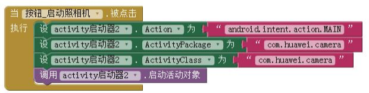

* TOC
{:toc}

[&laquo; 返回](../connectivity.html#ActivityStarter)

## App包名和类名的查看
由 App Inventor 2 创建的应用要弄清包名和类名，可通过下载其应用程序的源代码，然后使用文件资源管理器或解压缩程序解压 .aia源文件（文件的扩展名修改成.zip 或.rar，然后解压），在解压后的文件夹下找到 `youngandroidproject/project.properties`，打开 `project.properties` 文件的第一行是 `main=`, 紧接着是类名。

如 `appinventor.ai_powerhope.HelloPurr.Screen1`： `main`后面去掉最后一个组件即为包名，如 `appinventor.ai_powerhope.HelloPurr`。

如果要更方便和直观的在手机上查看安装的APP的包名和类名，可以在手机上安装专门的查看应用包名的App，如“**包名查看器**”：

## 不同品牌手机可能略有不同

另外，利用Activity启动器调用系统某些功能时，不同品牌手机可能略有不同，需要借助“包名查看器”这类软件查看相应系统功能的包名和类名。

如华为 Mate8 的照相机 的包名和类名都为 `com.huawei.camera`，和标准安卓系统提供的相机的包名和类名是有区别的。

下面代码是利用 Activity启动器启动华为 Mate8 系统的照相机：

如果在使用Activity启动器启动其它应用的时候，如果出现启动不了或者找不到相应的 Activity 的情况，请检查包名、类名这些信息是否正确。
