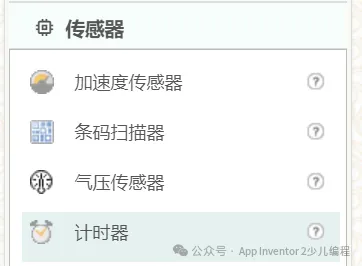
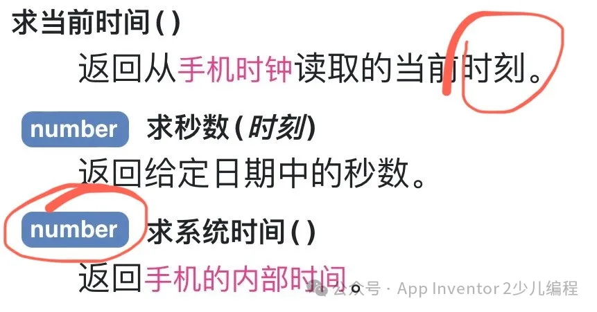
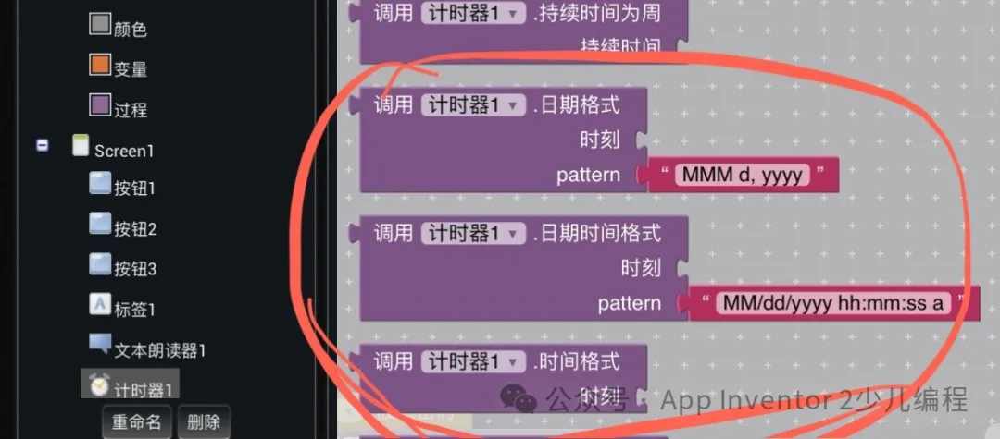
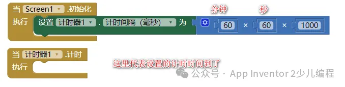

* TOC
{:toc}

[&laquo; 返回首页](../index.html)

## 计时器在界面设计中的哪里？

## 计时器怎么启动？

默认计时器是自动启用的，也可程序控制它的属性“启用计时”和“不启用计时”。

## 怎么确定计时器执行没？

定一个数字全局变量，计时方法里面自增，然后输出显示在一个标签上，查看数字结果。

## 怎么获取手机当前时间？

## 格式化时间，上面函数返回的当前时刻格式化成文本：

## 24小时格式怎么写？

## 如何定时一小时？

代码如下：

## 如何定点执行，比如到20:23分执行？

计时器计时间隔1000ms（即1秒），计时事件中取当前时间，格式化成指定格式的文本，然后用逻辑判断代码块，和你要想到的时间点文本进行比较，如果相等，则到了你预定的时间点，做你预想的事情。
