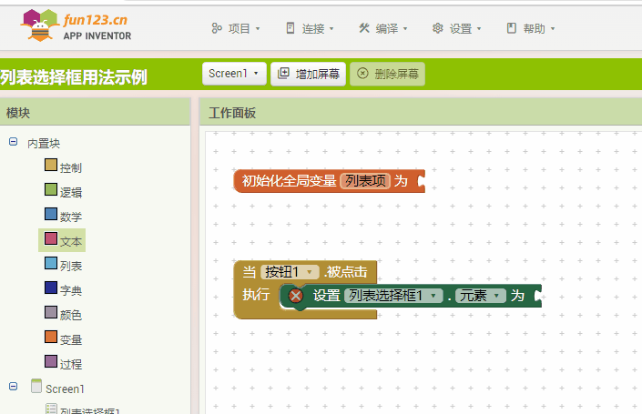

* TOC
{:toc}

[&laquo; 返回首页](../index.html)

## 列表选择框（ListPicker）基本用法

1. ### 设置固定的列表项，设置“元素字串”属性，多个列表项使用**英文**逗号分隔：

    

    点击效果如下：

    

1. ### 选择完成后的事件处理，最终选中的数据通过“选中项”属性获取：

    

1. ### 通过代码块动态设置列表选择框的列表项：
    
    

    效果如下：

    
    
    
1. ### 设置“显示搜索框”属性，也可以通过代码设置该属性：

    

    效果如下：

    
    
