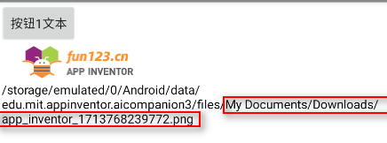
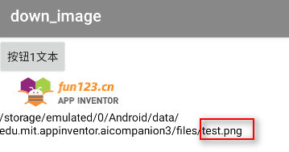

* TOC
{:toc}

[&laquo; 返回首页](../index.html)

## App Inventor 2 如何下载/保存网络图片？

首先，需要使用“Web客户端”组件，需要和网络url进行数据交互的场景就要考虑使用它。

### 设置好网络图片的url，然后执行Get方法即可，代码如下：

{:.vip}

{:.vip}
### 其中，特别要注意的是`保存相应信息`属性设置为`真`，这样才能将目标网络图片保存到本地设备：

如果不指定`相应文件名称`属性，则保存在本地的图片文件默认是以时间戳作为文件名的一部分的，如下：

重新请求一次，文件名发生了变化：

### 指定`相应文件名称`属性，则图片文件名就是指定的名称：

重新请求一次，会图片文件会原路径进行覆盖。
