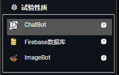
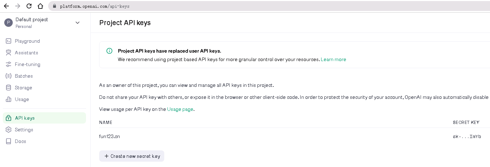
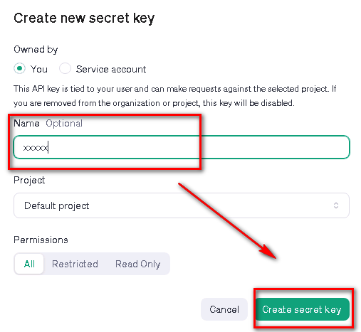
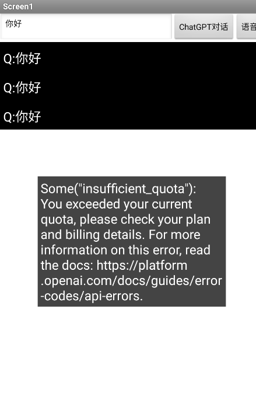
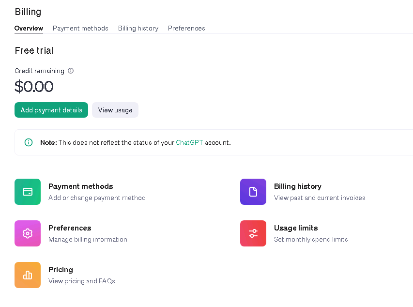

* TOC
{:toc}

[&laquo; 返回首页](../index.html)

本文主要介绍ChatGPT如何自定义接入以及接入原理，具体ChatBot等组件的使用方法看这里：

[《重磅！App Inventor 2 中文网已支持ChatGPT组件，数个代码块即可打造可用的智能AI对话机器人》](https://mp.weixin.qq.com/s?__biz=MzA5NTE5OTg1MA==&mid=2247483885&idx=1&sn=c1d1e6de653cc02185379eb162393b7d&chksm=9043b6e8a7343ffe7cddccd22b21b2eb3324380625b9fe696e01bc8ad7e91751563e0b6940bb&scene=21#wechat_redirect)

中文文档[点此](../experimental.html)查看。

## 如何接入OpenAI

由于国内无法访问OpenAI，KX上网可选大陆及香港（被屏蔽）以外才行。因此对于大多数人来说，想体验或使用ChatGPT就不太便利，不过App Inventor 2 为我们提供了相对便利的一种方式，即“试验性质”下的“ChatBot”及“ImageBot”组件（要求AI伴侣版本 >= v2.67）：

都是调用ChatGPT，ChatBot是AI对话，ImageBot是AI绘图。这时我们无需KX上网，因为它是通过MIT代理服务器进行执行的，国内可以访问MIT代理服务器，因此间接就能访问OpenAI了，这的确可以算是GPT的最佳体验方式了，当然AI绘图也能体验。

## 通过token（访问令牌）接入

token的作用是用于访问mit代理服务器的一个认证，如需有效令牌请参照[《App Inventor 2 使用MIT代理的组件访问令牌的获取方法》](../../creative/token.html)，同一个账号，token是一样的。

不过，为了方便轻松访问这些组件，默认ApiKey为空，那么将会使用MIT获取的ApiKey。由于这需要花钱，因此目前每天的使用次数受到限制。 注意：如果您打包应用程序并分发它，则您应用程序的所有使用都将受到相同的配额限制。 如果您希望分发使用这些服务的应用程序，建议使用MIT的 ApiKey 进行测试，但最终发布时使用你自己的 ApiKey。

**如果提供你自己从 OpenAI 获取的 ApiKey，则不受 MIT 施加的限制**。

## 通过ApiKey接入

ChatGPT ApiKey接入：[https://platform.openai.com/api-keys](https://platform.openai.com/api-keys)

如果测试报错：Some("insufficient_quota")，如下：

{:.vip}
说明ApiKey配额不足，需要绑定信用卡进行扣费才能正常使用（国内的卡不行）。

[https://platform.openai.com/settings/organization/billing/payment-methods](https://platform.openai.com/settings/organization/billing/payment-methods)

[https://platform.openai.com/settings/organization/billing/overview](https://platform.openai.com/settings/organization/billing/overview)

{:.vip}
据官方社区回复，试用版的ApiKey配额需要再创建账户的3个月之内试用，超过3个月只能绑定信用卡扣费才能正常使用ApiKey进行访问。
