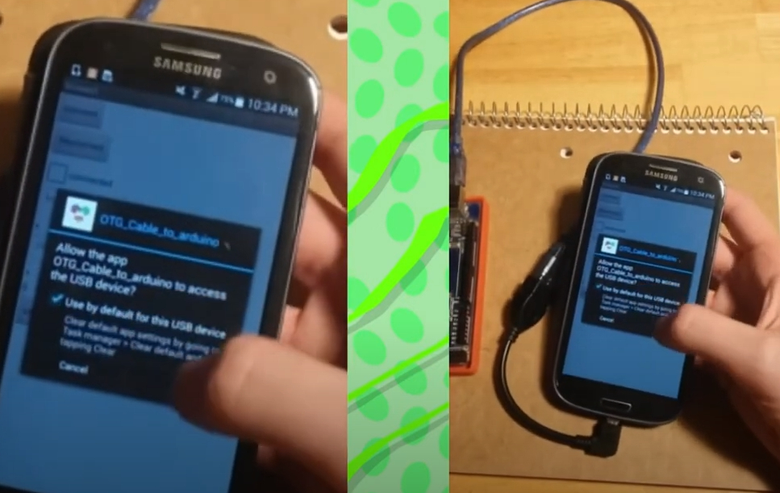

* TOC
{:toc}

[&laquo; 返回串口通信器](../connectivity.html#Serial)

手机串口通信模型如下：

视频介绍了App Inventor 2 串口组件的使用方法，以及如何利用手机串口与Arduino硬件进行通信。串口通信波特率：9600。英文原版视频如下：

<iframe width="930" height="500" src="//player.bilibili.com/player.html?bvid=BV1Ns421A7rs&high_quality=1&autoplay=0" frameborder="no" allowfullscreen="true"></iframe>

可以看到，手机串口连接时，没有像PC那样指定“COM3”等端口，而是直接使用默认的USB设备：

