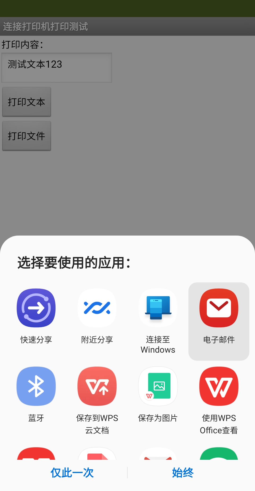
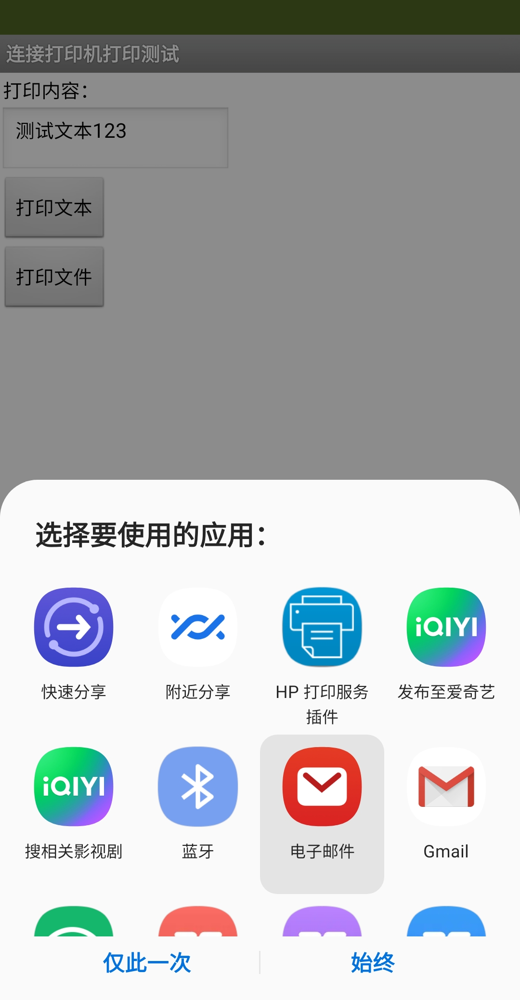
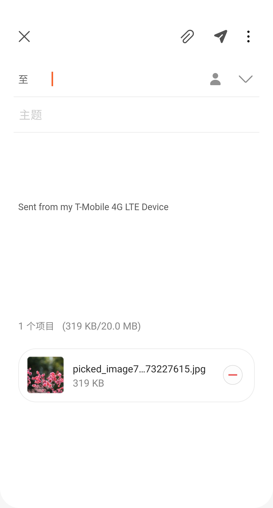
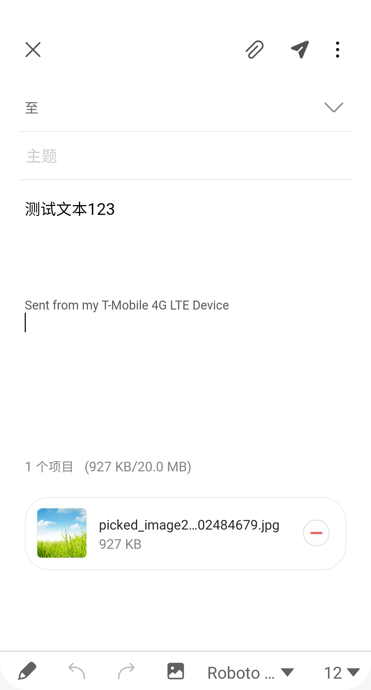
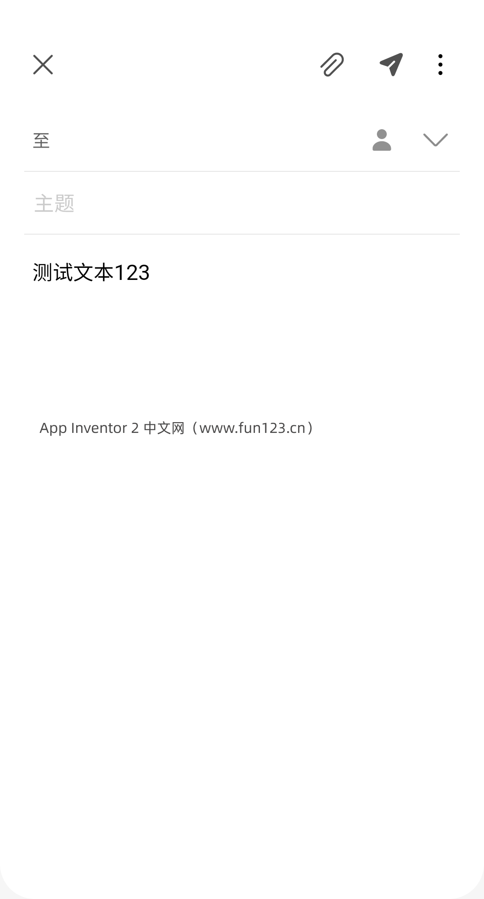

* TOC
{:toc}

[&laquo; 返回首页](index.html)
# <i class="mdi mdi-share-variant-outline"></i>  社交应用组件

目录：

* [联系人选择框](#ContactPicker)
* [邮箱地址选择框](#EmailPicker)
* [电话拨号器](#PhoneCall)
* [电话号选择框](#PhoneNumberPicker)
* [信息分享器](#Sharing)
* [短信收发器](#Texting)
* [推特客户端](#Twitter)

## 联系人选择框  {#ContactPicker}

A button that, when clicked on, displays a list of the contacts to choose among. After the user
 has made a selection, the following properties will be set to information about the chosen
 contact:

  - [`ContactName`](#ContactPicker.ContactName): the contact's name
  - [`EmailAddress`](#ContactPicker.EmailAddress): the contact's primary email address
  - [`EmailAddressList`](#ContactPicker.EmailAddressList): a list of the contact's email addresses
  - [`ContactUri`](#ContactPicker.ContactUri): the contact's URI on the device
  - [`PhoneNumber`](#ContactPicker.PhoneNumber): the contact's primary phone number (on Later Android Verisons)
  - [`PhoneNumberList`](#ContactPicker.PhoneNumberList): a list of the contact's phone numbers (on Later Android Versions)
  - [`Picture`](#ContactPicker.Picture): the name of the file containing the contact's image, which can be used as a Picture property value for the Image or ImageSprite component.

 Other properties affect the appearance of the button ([`TextAlignment`](#ContactPicker.TextAlignment),
 [`BackgroundColor`](#ContactPicker.BackgroundColor), etc.) and whether it can be clicked on ([`Enabled`](#ContactPicker.Enabled)).

 The `ContactPicker` component might not work on all phones. For example, on Android systems
 before system 3.0, it cannot pick phone numbers, and the list of email addresses will contain
 only one email.

### 属性  {#ContactPicker-Properties}

{:.properties}

{:id="ContactPicker.BackgroundColor" .color} *背景颜色*
: 设置`联系人选择框`的背景颜色，使用RGBA数值表示，如果设置了[`图像`](#ContactPicker.Image)属性，则不能显示背景颜色直到删除[`图像`](#ContactPicker.Image)属性为止。

{:id="ContactPicker.ContactName" .text .ro .bo} *ContactName*
: Returns the full name of the selected contact, or the empty string if a name is unavailable.

{:id="ContactPicker.ContactUri" .text .ro .bo} *ContactUri*
: Returns a URI that specifies the location of the contact on the device.

{:id="ContactPicker.EmailAddress" .text .ro .bo} *EmailAddress*
: Returns the primary email address of the selected contact, or the empty string if an email
 address is unavailable.

{:id="ContactPicker.EmailAddressList" .list .ro .bo} *EmailAddressList*
: Returns a list of email addresses associated with the selected contact.

{:id="ContactPicker.Enabled" .boolean} *启用*
: 设置`联系人选择框`是否可以被激活和点击。

{:id="ContactPicker.FontBold" .boolean} *粗体*
: 设置`联系人选择框`的显示字体是否是粗体。（注：有些字体不支持粗体）。

{:id="ContactPicker.FontItalic" .boolean} *斜体*
: 设置`联系人选择框`的显示字体是否是斜体。（注：有些字体不支持斜体）。

{:id="ContactPicker.FontSize" .number} *字体大小*
: 设置`联系人选择框`的字体大小，以像素px为单位。

{:id="ContactPicker.FontTypeface" .number .do} *字体*
: 设置`联系人选择框`的字体，目前支持的字体有：default,  serif,  sans serif,  和 monospace。

{:id="ContactPicker.Height" .number .bo} *高度*
: 设置`联系人选择框`的垂直高度，以像素px为单位。

{:id="ContactPicker.HeightPercent" .number .wo .bo} *高度百分比*
: 设置`联系人选择框`的垂直高度相对于整个[`屏幕高度`](userinterface.html#Screen.Height)的百分比。

{:id="ContactPicker.Image" .text} *图像*
: 设置`联系人选择框`图像的路径，如果同时设置了`图像`和[`背景颜色`](#ContactPicker.BackgroundColor)，则仅`图像`可见。

{:id="ContactPicker.PhoneNumber" .text .ro .bo} *PhoneNumber*
: Returns the primary phone number associated with the selected contact, or the empty string if
 no phone number is associated with the contact.

{:id="ContactPicker.PhoneNumberList" .list .ro .bo} *PhoneNumberList*
: Returns a list of phone numbers associated with the selected contact.

{:id="ContactPicker.Picture" .text .ro .bo} *Picture*
: Returns a picture URI for the selected contact, which can be
 used to retrieve the contact's photo and other fields.

{:id="ContactPicker.Shape" .number .do} *形状*
: 设置`联系人选择框`的形状，此属性的有效值为：

  `0`（默认）

  `1` （圆形）

  `2`（矩形）

  `3`（椭圆形）。
  
  如果设置了[`图像`](#ContactPicker.Image)，则`形状`将不可见。

{:id="ContactPicker.ShowFeedback" .boolean} *显示反馈*
: 设置`联系人选择框`指定 [`图像`](#ContactPicker.Image)后被按压是否显示视觉反馈。

{:id="ContactPicker.Text" .text} *文本*
: 设置`联系人选择框`的显示文本。

{:id="ContactPicker.TextAlignment" .number .do} *文本对齐*
: 设置`联系人选择框`文本的对齐方式，有效值有： 

  `0`（正常；例如，如果文本从左到右书写，则左对齐）

  `1`（居中）

  `2`（相反；例如，如果文本从左到右书写，则右对齐）。

{:id="ContactPicker.TextColor" .color} *文本颜色*
: 设置`联系人选择框`的文本颜色，使用RGBA数值表示。

{:id="ContactPicker.Visible" .boolean} *可见性*
: 设置`联系人选择框`是否显示在屏幕上，值是`真`{:.logic.block}则`联系人选择框`显示，`假`{:.logic.block}则隐藏。

{:id="ContactPicker.Width" .number .bo} *宽度*
: 设置`联系人选择框`的水平宽度，以像素px为单位。

{:id="ContactPicker.WidthPercent" .number .wo .bo} *宽度百分比*
: 设置`联系人选择框`的水平宽度相对于[`屏幕宽度`](userinterface.html#Screen.Width)的百分比。

### 事件  {#ContactPicker-Events}

{:.events}

{:id="ContactPicker.AfterPicking"} AfterPicking()
: Event to be raised after the `ContactPicker` activity returns its
 result and the properties have been filled in.

{:id="ContactPicker.BeforePicking"} BeforePicking()
: Event to raise when the `ContactPicker` is clicked or the picker is shown
 using the [`Open`](#ContactPicker.Open) method.  This event occurs before the picker is displayed, and
 can be used to prepare the picker before it is shown.

{:id="ContactPicker.GotFocus"} GotFocus()
: Indicates the cursor moved over the `ContactPicker` so it is now possible
 to click it.

{:id="ContactPicker.LostFocus"} LostFocus()
: Indicates the cursor moved away from the `ContactPicker` so it is now no
 longer possible to click it.

{:id="ContactPicker.TouchDown"} TouchDown()
: Indicates that the `ContactPicker` was pressed down.

{:id="ContactPicker.TouchUp"} TouchUp()
: Indicates that the `ContactPicker` has been released.

### 方法  {#ContactPicker-Methods}

{:.methods}

{:id="ContactPicker.Open" class="method"} <i/> Open()
: Opens the `ContactPicker`, as though the user clicked on it.

{:id="ContactPicker.ViewContact" class="method"} <i/> ViewContact(*uri*{:.text})
: Opens the selected contact's entry in the device's default Contacts app.

## 邮箱地址选择框  {#EmailPicker}

An `EmailPicker` is a kind of text box. If the user begins entering the name or email address of
 a contact, the phone will show a dropdown menu of choices that complete the entry. If there are
 many contacts, the dropdown can take several seconds to appear, and can show intermediate
 results while the matches are being computed.

 The initial contents of the text box and the contents< after user entry is in the [`Text`](#EmailPicker.Text)
 property. If the [`Text`](#EmailPicker.Text) property is initially empty, the contents of the [`Hint`](#EmailPicker.Hint)
 property will be faintly shown in the text box as a hint to the user.

 Other properties affect the appearance of the text box ([`TextAlignment`](#EmailPicker.TextAlignment),
 [`BackgroundColor`](#EmailPicker.BackgroundColor), etc.) and whether it can be used ([`Enabled`](#EmailPicker.Enabled)).

 Text boxes like this are usually used with [`Button`](userinterface.html#Button) components, with
 the user clicking on the button when text entry is complete.

### 属性  {#EmailPicker-Properties}

{:.properties}

{:id="EmailPicker.BackgroundColor" .color} *背景颜色*
: `邮箱地址选择框` 的背景色，可以在“界面设计”视图或“程序设计”视图中通过颜色名字选择一个颜色，`默认`背景颜色为：default（阴影 3-D 外观）。

{:id="EmailPicker.Enabled" .boolean} *启用*
：如果设置为`真`{:.logic.block}则用户可以在 `邮箱地址选择框` 中输入文本。

{:id="EmailPicker.FontBold" .boolean .do} *粗体*
: 设置`邮箱地址选择框`的显示字体是否是粗体。（注：有些字体不支持粗体）。

{:id="EmailPicker.FontItalic" .boolean .do} *斜体*
: 设置`邮箱地址选择框`的显示字体是否是粗体。（注：有些字体不支持粗体）。

{:id="EmailPicker.FontSize" .number} *字体大小*
: 设置`邮箱地址选择框`的字体大小，以像素px为单位。

{:id="EmailPicker.FontTypeface" .number .do} *字体*
: 设置`邮箱地址选择框`的字体，目前支持的字体有：`0` (default), `1` (serif), `2` (sansserif), 和 `3` (monospace)。

{:id="EmailPicker.Height" .number .bo} *高度*
: 设置`邮箱地址选择框`的垂直高度，以像素px为单位。

{:id="EmailPicker.HeightPercent" .number .wo .bo} *高度百分比*
: 设置`邮箱地址选择框`的垂直高度相对于整个[`屏幕高度`](userinterface.html#Screen.Height)的百分比。

{:id="EmailPicker.Hint" .text} *Hint*
: `EmailPicker` hint for the user.

{:id="EmailPicker.Text" .text} *文本*
: `邮箱地址选择框`中的文本，可以在“界面设计”视图或“程序设计”视图中设置，或由用户输入（除非 [`启用`](#EmailPicker.Enabled) 属性为 `假`{:.logic.block}）。

{:id="EmailPicker.TextAlignment" .number .do} *文本对齐*
: 设置`邮箱地址选择框`文本的对齐方式，有效值有： 

  `0`（正常；例如，如果文本从左到右书写，则左对齐）

  `1`（居中）

  `2`（相反；例如，如果文本从左到右书写，则右对齐）。

{:id="EmailPicker.TextColor" .color} *文本颜色*
: 设置`邮箱地址选择框`的文本颜色，使用RGBA数值表示。

{:id="EmailPicker.Visible" .boolean} *可见性*
: 设置`邮箱地址选择框`是否显示在屏幕上，值是`真`{:.logic.block}则`邮箱地址选择框`显示，`假`{:.logic.block}则隐藏。

{:id="EmailPicker.Width" .number .bo} *宽度*
: 设置`邮箱地址选择框`的水平宽度，以像素px为单位。

{:id="EmailPicker.WidthPercent" .number .wo .bo} *宽度百分比*
: 设置`邮箱地址选择框`的水平宽度相对于[`屏幕宽度`](userinterface.html#Screen.Width)的百分比。

### 事件  {#EmailPicker-Events}

{:.events}

{:id="EmailPicker.GotFocus"} GotFocus()
: Event raised when the `EmailPicker` is selected for input, such as by
 the user touching it.

{:id="EmailPicker.LostFocus"} LostFocus()
: Event raised when the `EmailPicker` is no longer selected for input, such
 as if the user touches a different text box.

### 方法  {#EmailPicker-Methods}

{:.methods}

{:id="EmailPicker.RequestFocus" class="method"} <i/> RequestFocus()
: Request focus to current `EmailPicker`.

## 电话拨号器  {#PhoneCall}

 A non-visible component that makes a phone call to the number specified in the
 [`PhoneNumber`](#PhoneCall.PhoneNumber) property, which can be set either in the Designer or Blocks Editor.
 The component has a [`MakePhoneCall`](#PhoneCall.MakePhoneCall) method, enabling the program to launch a phone call.
 You may also use [`MakePhoneCallDirect`](#PhoneCall.MakePhoneCallDirect) to directly initiate a phone call without user
 interaction. However, apps using this block may require further review by Google if submitted
 to the Play Store so it is advised to use [`MakePhoneCall`](#PhoneCall.MakePhoneCall) instead.

 Often, this component is used with the [`ContactPicker`](#ContactPicker) component, which lets the user
 select a contact from the ones stored on the phone and sets the
 [`PhoneNumber`](#PhoneCall.PhoneNumber) property to [`ContactPicker`'s `PhoneNumber`](#ContactPicker.PhoneNumber) property.

 To directly specify the phone number (e.g., 650-555-1212), set the [`PhoneNumber`](#PhoneCall.PhoneNumber)
 property to a Text with the specified digits (e.g., "6505551212"). Dashes, dots, and parentheses
 may be included (e.g., "(650)-555-1212") but will be ignored; spaces may not be included.

### 属性  {#PhoneCall-Properties}

{:.properties}

{:id="PhoneCall.PhoneNumber" .text} *PhoneNumber*
: Specifies the phone number to call.

### 事件  {#PhoneCall-Events}

{:.events}

{:id="PhoneCall.IncomingCallAnswered"} IncomingCallAnswered(*phoneNumber*{:.text})
: Event indicating that an incoming phone call is answered. `phoneNumber`{:.variable.block} is
 the incoming call phone number.

{:id="PhoneCall.PhoneCallEnded"} PhoneCallEnded(*status*{:.number},*phoneNumber*{:.text})
: Event indicating that a phone call has ended. The `status`{:.variable.block} can be any of:

   - `1`: Incoming call was missed or rejected
   - `2`: Incoming call was answered and hung up
   - `3`: Outgoing call was hung up.

{:id="PhoneCall.PhoneCallStarted"} PhoneCallStarted(*status*{:.number},*phoneNumber*{:.text})
: Event indicating that a phone call has started. The `status`{:.variable.block} can be any of:

   - `1`: Incoming call is ringing
   - `2`: Outgoing call is dialled

### 方法  {#PhoneCall-Methods}

{:.methods}

{:id="PhoneCall.MakePhoneCall" class="method"} <i/> MakePhoneCall()
: Launches the default dialer app set to start a phone call using the number in the
 [`PhoneNumber`](#PhoneCall.PhoneNumber) property.

{:id="PhoneCall.MakePhoneCallDirect" class="method"} <i/> MakePhoneCallDirect()
: Directly initiates a phone call using the number in the [`PhoneNumber`](#PhoneCall.PhoneNumber) property,
 bypassing user interaction to start the call. **Most apps should use
 [`MakePhoneCall`](#PhoneCall.MakePhoneCall) instead, which requires no permissions.**

## 电话号选择框  {#PhoneNumberPicker}

A button that, when clicked on, displays a list of the contacts' phone numbers to choose among.
 After the user has made a selection, the following properties will be set to information about
 the chosen contact:

  - [`ContactName`](#PhoneNumberPicker.ContactName): the contact's name
  - [`PhoneNumber`](#PhoneNumberPicker.PhoneNumber): the contact's phone number
  - [`EmailAddress`](#PhoneNumberPicker.EmailAddress): the contact's email address
  - [`Picture`](#PhoneNumberPicker.Picture): the name of the file containing the contact's image, which can be used as a Picture property value for the Image or ImageSprite component.

 Other properties affect the appearance of the button ([`TextAlignment`](#PhoneNumberPicker.TextAlignment),
 [`BackgroundColor`](#PhoneNumberPicker.BackgroundColor), etc.) and whether it can be clicked on ([`Enabled`](#PhoneNumberPicker.Enabled)).

 The `PhoneNumberPicker` component may not work on all Android devices. For example, on Android
 systems before system 3.0, the returned lists of phone numbers and email addresses will be empty.

### 属性  {#PhoneNumberPicker-Properties}

{:.properties}

{:id="PhoneNumberPicker.BackgroundColor" .color} *背景颜色*
: 设置`电话号选择框`的背景颜色，使用RGBA数值表示，如果设置了[`图像`](#PhoneNumberPicker.Image)属性，则不能显示背景颜色直到删除[`图像`](#PhoneNumberPicker.Image)属性为止。

{:id="PhoneNumberPicker.ContactName" .text .ro .bo} *ContactName*
: Returns the full name of the selected contact, or the empty string if a name is unavailable.

{:id="PhoneNumberPicker.ContactUri" .text .ro .bo} *ContactUri*
: Returns a URI that specifies the location of the contact on the device.

{:id="PhoneNumberPicker.EmailAddress" .text .ro .bo} *EmailAddress*
: Returns the primary email address of the selected contact, or the empty string if an email
 address is unavailable.

{:id="PhoneNumberPicker.EmailAddressList" .list .ro .bo} *EmailAddressList*
: Returns a list of email addresses associated with the selected contact.

{:id="PhoneNumberPicker.Enabled" .boolean} *启用*
: 设置`电话号选择框`是否可以被激活和点击。

{:id="PhoneNumberPicker.FontBold" .boolean} *粗体*
: 设置`电话号选择框`的显示字体是否是粗体。（注：有些字体不支持粗体）。

{:id="PhoneNumberPicker.FontItalic" .boolean} *斜体*
: 设置`电话号选择框`的显示字体是否是斜体。（注：有些字体不支持斜体）。

{:id="PhoneNumberPicker.FontSize" .number} *字体大小*
: 设置`电话号选择框`的字体大小，以像素px为单位。

{:id="PhoneNumberPicker.FontTypeface" .number .do} *字体*
: 设置`电话号选择框`的字体，目前支持的字体有：default,  serif,  sans serif,  和 monospace。

{:id="PhoneNumberPicker.Height" .number .bo} *高度*
: 设置`电话号选择框`的垂直高度，以像素px为单位。

{:id="PhoneNumberPicker.HeightPercent" .number .wo .bo} *高度百分比*
: 设置`电话号选择框`的垂直高度相对于整个[`屏幕高度`](userinterface.html#Screen.Height)的百分比。

{:id="PhoneNumberPicker.Image" .text} *图像*
: 设置`电话号选择框`图像的路径，如果同时设置了`图像`和[`背景颜色`](#PhoneNumberPicker.BackgroundColor)，则仅`图像`可见。

{:id="PhoneNumberPicker.PhoneNumber" .text .ro .bo} *PhoneNumber*
: Returns the primary phone number associated with the selected contact, or the empty string if
 no phone number is associated with the contact.

{:id="PhoneNumberPicker.PhoneNumberList" .list .ro .bo} *PhoneNumberList*
: Returns a list of phone numbers associated with the selected contact.

{:id="PhoneNumberPicker.Picture" .text .ro .bo} *Picture*
: Returns a picture URI for the selected contact, which can be
 used to retrieve the contact's photo and other fields.

{:id="PhoneNumberPicker.Shape" .number .do} *形状*
: 设置`电话号选择框`的形状，此属性的有效值为：

  `0`（默认）

  `1` （圆形）

  `2`（矩形）

  `3`（椭圆形）。
  
  如果设置了[`图像`](#PhoneNumberPicker.Image)，则`形状`将不可见。

{:id="PhoneNumberPicker.ShowFeedback" .boolean} *显示反馈*
: 设置`电话号选择框`指定 [`图像`](#PhoneNumberPicker.Image)后被按压是否显示视觉反馈。

{:id="PhoneNumberPicker.Text" .text} *文本*
: 设置`电话号选择框`的显示文本。

{:id="PhoneNumberPicker.TextAlignment" .number .do} *文本对齐*
: 设置`电话号选择框`文本的对齐方式，有效值有： 

  `0`（正常；例如，如果文本从左到右书写，则左对齐）

  `1`（居中）

  `2`（相反；例如，如果文本从左到右书写，则右对齐）。

{:id="PhoneNumberPicker.TextColor" .color} *文本颜色*
: 设置`电话号选择框`的文本颜色，使用RGBA数值表示。

{:id="PhoneNumberPicker.Visible" .boolean} *可见性*
: 设置`电话号选择框`是否显示在屏幕上，值是`真`{:.logic.block}则`电话号选择框`显示，`假`{:.logic.block}则隐藏。

{:id="PhoneNumberPicker.Width" .number .bo} *宽度*
: 设置`电话号选择框`的水平宽度，以像素px为单位。

{:id="PhoneNumberPicker.WidthPercent" .number .wo .bo} *宽度百分比*
: 设置`电话号选择框`的水平宽度相对于[`屏幕宽度`](userinterface.html#Screen.Width)的百分比。

### 事件  {#PhoneNumberPicker-Events}

{:.events}

{:id="PhoneNumberPicker.AfterPicking"} AfterPicking()
: Event to be raised after the `PhoneNumberPicker` activity returns its
 result and the properties have been filled in.

{:id="PhoneNumberPicker.BeforePicking"} BeforePicking()
: Event to raise when the `PhoneNumberPicker` is clicked or the picker is shown
 using the [`Open`](#PhoneNumberPicker.Open) method.  This event occurs before the picker is displayed, and
 can be used to prepare the picker before it is shown.

{:id="PhoneNumberPicker.GotFocus"} GotFocus()
: Indicates the cursor moved over the `PhoneNumberPicker` so it is now possible
 to click it.

{:id="PhoneNumberPicker.LostFocus"} LostFocus()
: Indicates the cursor moved away from the `PhoneNumberPicker` so it is now no
 longer possible to click it.

{:id="PhoneNumberPicker.TouchDown"} TouchDown()
: Indicates that the `PhoneNumberPicker` was pressed down.

{:id="PhoneNumberPicker.TouchUp"} TouchUp()
: Indicates that the `PhoneNumberPicker` has been released.

### 方法  {#PhoneNumberPicker-Methods}

{:.methods}

{:id="PhoneNumberPicker.Open" class="method"} <i/> Open()
: Opens the `PhoneNumberPicker`, as though the user clicked on it.

{:id="PhoneNumberPicker.ViewContact" class="method"} <i/> ViewContact(*uri*{:.text})
: Opens the selected contact's entry in the device's default Contacts app.

## 信息分享器  {#Sharing}

`信息分享器`是一个不可见的组件，可以让App和设备上其他App之间共享数据或文件。
该组件将显示已安装的可处理所提供信息的App列表，并允许用户选择一个App来共享内容，例如邮件App、社交网络App、短信App等。

  文件路径可以来自其他组件，例如[`照相机`](media.html#Camera) 或 [`图像选择框`](media.html#ImagePicker)，但也可以指定直接从存储中读取。
  请注意：不同的设备处理的存储路径可能不同，例如有一个名为 `arrow.gif` 的文件在文件夹 `Appinventor/assets` 中，它的表示方式可能是：

 - `"file:///sdcard/Appinventor/assets/arrow.gif"`; 或
 - `"/storage/Appinventor/assets/arrow.gif"`

  * `分享消息` 弹出其他App的界面：弹出的是文档（保存文本到文档）、地图（文本作为搜索地址）、蓝牙（传输文本数据）之类的App，**没有打印机相关的，打印机App在`分享文件`的方式才弹出**。

  

  * `分享文件`、`分享文件及消息` 弹出其他App的界面：`分享文件`的方式弹出的App几乎非常全面了，包括打印机App（打印分享的文件）。`分享文件及消息`弹出的和`分享文件`是一致的。

  

### 属性  {#Sharing-Properties}

{:.properties}
无

### 事件  {#Sharing-Events}

{:.events}
无

### 方法  {#Sharing-Methods}

{:.methods}

{:id="Sharing.ShareFile" class="method"} <i/> 分享文件(*文件*{:.text})
: 通过显示可用的应用程序列表并允许用户从列表中选择一个，通过手机上安装的任何功能强大的应用程序共享文件。选定的应用程序将打开，向其中传入文件。

{:id="Sharing.ShareFileWithMessage" class="method"} <i/> 分享文件及消息(*文件*{:.text},*消息*{:.text})
: 通过显示可用的应用程序列表并允许用户从列表中选择一个，通过手机上安装的任何功能强大的应用程序共享文件及消息。选定的应用程序将打开，向其中传入文件及消息。

{:id="Sharing.ShareMessage" class="method"} <i/> 分享消息(*消息*{:.text})
: 通过显示可用的应用程序列表并允许用户从列表中选择一个，通过手机上安装的任何功能强大的应用程序共享消息。所选应用程序将打开，并向其中传入消息。

## 短信收发器  {#Texting}

当调用组件 [`发送消息`](#Texting.SendMessage) 方法时，将启动设备的首选短信应用程序将属性中指定的短信内容发送到 [`电话号码`](#Texting.PhoneNumber) 属性中指定的电话中。
  
  也可以通过调用 [`直接发送消息`](#Texting.SendMessageDirect) 直接发送短信，而无需进行交互，但前提是应用程序已请求危险权限。

  * 如果 [`启用消息接收`](#Texting.ReceivingEnabled) 属性设为 1，将不会收到消息。 
  * 如果 [`启用消息接收`](#Texting.ReceivingEnabled) 属性设为 2，消息将仅在应用程序正在运行的时候才被接收。
  * 如果 [`启用消息接收`](#Texting.ReceivingEnabled) 属性设置 3，则消息将在应用程序正在运行时被接收；当应用程序未运行时，消息将排队给用户显示通知消息。

  当消息到达时，将触发 [`收到消息`](#Texting.MessageReceived) 事件，并提供发送号码和消息。

  包含此组件的应用程序即使在后台也会收到消息（即当它在屏幕上不可见时），而且**只要应用程序安装在手机上了，即使没有运行也能收到消息**。

  如果应用程序不在手机前台运行，收到短信时手机将在通知栏中显示一条通知。选中通知栏的通知将调出该应用程序，作为应用程序开发人员，你可能希望为用户提供控制 `启用消息接收` 的能力，这样他们就可以让手机忽略短信。

 
  如果 [`启用谷歌语音`](#Texting.GoogleVoiceEnabled) 属性为`真`{:.logic.block}，则可以通过 Wifi 使用谷歌语音发送消息。

  此选项要求用户拥有谷歌语音帐户并且手机手机上安装了语音应用程序，谷歌语音选项仅适用于支持 Android 2.0 (Eclair) 或更高版本。
  
  **不幸的是，由于以下原因，谷歌语音App中引入的变更，导致谷歌语音不再被接收。**

  要指定电话号码（例如 650-555-1212），请将 `电话号码` 属性设置为文本字符串与指定的数字（例如，6505551212），可能包含破折号、点和括号（例如，(650)-555-1212）会被忽略，但是不能有空格。

  应用程序指定电话号码的另一种方法是包含 [`电话号选择框`](#PhoneNumberPicker) 组件，它允许用户从手机中存储的电话号码中选择一个联系人。

### 属性  {#Texting-Properties}

{:.properties}

{:id="Texting.GoogleVoiceEnabled" .boolean} *GoogleVoiceEnabled*
: If this property is true, then SendMessage will attempt to send messages over
 WiFi, using Google voice.

{:id="Texting.Message" .text} *Message*
: The message that will be sent when the [`SendMessage`](#Texting.SendMessage) method is called.
 The maximum length of a standard SMS message is usually 170. It may be less for languages
 using diacritical marks.

{:id="Texting.PhoneNumber" .text} *电话号码*
: The number that the message will be sent to when the SendMessage method is called.  The 
 number is a text string with the specified digits (e.g., 6505551212).  Dashes, dots, 
 and parentheses may be included (e.g., (650)-555-1212) but will be ignored; spaces
 should not be included.

{:id="Texting.ReceivingEnabled" .number} *启用消息接收*
: If set to 1 (OFF) no messages will be received. If set to 2 (FOREGROUND) or 3 (ALWAYS) the
 component will respond to messages if it is running. In the case of 2 (FOREGROUND), messages
 received while the app is not running are discarded. In the case of 3 (ALWAYS), messages
 receive while the app is not running will show a notification. Selecting the notification
 will bring up the app and signal the [`MessageReceived`](#Texting.MessageReceived) event. Messages
 received when the app is dormant will be queued, and so several
 [`MessageReceived`](#Texting.MessageReceived) events might appear when the app awakens. As an app
 developer, it would be a good idea to give your users control over this property, so they can
 make their phones ignore text messages when your app is installed.

### 事件  {#Texting-Events}

{:.events}

{:id="Texting.MessageReceived"} 收到消息(*数值*{:.text},*消息内容*{:.text})
: Event that's raised when a text message is received by the phone. **Using this block will add
 [dangerous permissions](//developer.android.com/guide/topics/permissions/overview#dangerous_permissions)
 that will require additional approval if your app is submitted to the Google Play Store.**

### 方法  {#Texting-Methods}

{:.methods}

{:id="Texting.SendMessage" class="method"} <i/> 发送消息()
: Launch the phone's default text messaging app with the message and phone number prepopulated.

{:id="Texting.SendMessageDirect" class="method"} <i/> 直接发送消息()
: Send a text message. **Using this block will add
 [dangerous permissions](https://developer.android.com/guide/topics/permissions/overview#dangerous_permissions)
 that will require additional approval if your app is submitted to the Google Play Store.**

## 推特客户端（*国内无法使用*）  {#Twitter}

A non-visible component that enables communication with [Twitter](https://twitter.com). Once a
 user has logged into their Twitter account (and the authorization has been confirmed successful
 by the [`IsAuthorized`](#Twitter.IsAuthorized) event), many more operations are available:

 - Searching Twitter for tweets or labels ([`SearchTwitter`](#Twitter.SearchTwitter))
 - Sending a Tweet ([`Tweet`](#Twitter.Tweet))
 - Sending a Tweet with an Image ([`TweetWithImage`](#Twitter.TweetWithImage))
 - Directing a message to a specific user ([`DirectMessage`](#Twitter.DirectMessage))
 - Receiving the most recent messages directed to the logged-in user ([`RequestDirectMessages`](#Twitter.RequestDirectMessages))
 - Following a specific user ([`Follow`](#Twitter.Follow))
 - Ceasing to follow a specific user ([`StopFollowing`](#Twitter.StopFollowing))
 - Getting a list of users following the logged-in user ([`RequestFollowers`](#Twitter.RequestFollowers))
 - Getting the most recent messages of users followed by the logged-in user ([`RequestFriendTimeline`](#Twitter.RequestFriendTimeline))
 - Getting the most recent mentions of the logged-in user ([`RequestMentions`](#Twitter.RequestMentions))

 You must obtain a Consumer Key and Consumer Secret for Twitter authorization specific to your
 app from http://twitter.com/oauth_clients/new

### 属性  {#Twitter-Properties}

{:.properties}

{:id="Twitter.ConsumerKey" .text} *ConsumerKey*
: The consumer key to be used when authorizing with Twitter via OAuth.

{:id="Twitter.ConsumerSecret" .text} *ConsumerSecret*
: The consumer secret to be used when authorizing with Twitter via OAuth.

{:id="Twitter.DirectMessages" .list .ro .bo} *DirectMessages*
: This property contains a list of the most recent messages mentioning the logged-in user.
 Initially, the list is empty. To set it, the program must:

   1. Call the [`Authorize`](#Twitter.Authorize) method.
   2. Wait for the [`IsAuthorized`](#Twitter.IsAuthorized) event.
   3. Call the [`RequestDirectMessages`](#Twitter.RequestDirectMessages) method.
   4, Wait for the [`DirectMessagesReceived`](#Twitter.DirectMessagesReceived) event.

   The value of this property will then be set to the list of direct messages retrieved (and
 maintain that value until any subsequent call to [`RequestDirectMessages`](#Twitter.RequestDirectMessages)).

{:id="Twitter.Followers" .list .ro .bo} *Followers*
: This property contains a list of the followers of the logged-in user. Initially, the list is
 empty. To set it, the program must:

   1. Call the [`Authorize`](#Twitter.Authorize) method.
   2. Wait for the [`IsAuthorized`](#Twitter.IsAuthorized) event.
   3. Call the [`RequestFollowers`](#Twitter.RequestFollowers) method.
   4. Wait for the [`FollowersReceived`](#Twitter.FollowersReceived) event.

   The value of this property will then be set to the list of followers (and maintain its value
 until any subsequent call to [`RequestFollowers`](#Twitter.RequestFollowers)).

{:id="Twitter.FriendTimeline" .list .ro .bo} *FriendTimeline*
: This property contains the 20 most recent messages of users being followed. Initially, the
 list is empty. To set it, the program must:
 
   1. Call the [`Authorize`](#Twitter.Authorize) method.
   2. Wait for the [`IsAuthorized`](#Twitter.IsAuthorized) event.
   3. Specify users to follow with one or more calls to the [`Follow`](#Twitter.Follow) method.
   4. Call the [`RequestFriendTimeline`](#Twitter.RequestFriendTimeline)  method.
   5. Wait for the [`FriendTimelineReceived`](#Twitter.FriendTimelineReceived) event.

   The value of this property will then be set to the list of messages (and maintain its value
 until any subsequent call to [`RequestFriendTimeline`](#Twitter.RequestFriendTimeline).

{:id="Twitter.Mentions" .list .ro .bo} *Mentions*
: This property contains a list of mentions of the logged-in user. Initially, the list is empty.
 To set it, the program must:
 
   1. Call the [`Authorize`](#Twitter.Authorize) method.
   2. Wait for the [`IsAuthorized`](#Twitter.IsAuthorized) event.
   3. Call the [`RequestMentions`](#Twitter.RequestMentions) method.
   4. Wait for the [`MentionsReceived`](#Twitter.MentionsReceived) event.
 
   The value of this property will then be set to the list of mentions (and will maintain its
 value until any subsequent calls to [`RequestMentions`](#Twitter.RequestMentions)).

{:id="Twitter.SearchResults" .list .ro .bo} *SearchResults*
: This property, which is initially empty, is set to a list of search results after the program:

   1. Calls the [`SearchTwitter`](#Twitter.SearchTwitter) method.
   2. Waits for the [`SearchSuccessful`](#Twitter.SearchSuccessful) event.

   The value of the property will then be the same as the parameter to
 [`SearchSuccessful`](#Twitter.SearchSuccessful). Note that it is not necessary to call the [`Authorize`](#Twitter.Authorize)
 method before calling [`SearchTwitter`](#Twitter.SearchTwitter).

{:id="Twitter.Username" .text .ro .bo} *Username*
: The user name of the authorized user. Empty if there is no authorized user.

### 事件  {#Twitter-Events}

{:.events}

{:id="Twitter.DirectMessagesReceived"} DirectMessagesReceived(*messages*{:.list})
: This event is raised when the recent messages requested through
 [`RequestDirectMessages`](#Twitter.RequestDirectMessages) have been retrieved. A list of the messages can then be found
 in the `messages`{:.variable.block} parameter or the [`DirectMessages`](#Twitter.DirectMessages) property.

{:id="Twitter.FollowersReceived"} FollowersReceived(*followers2*{:.list})
: This event is raised when all of the followers of the logged-in user requested through
 [`RequestFollowers`](#Twitter.RequestFollowers) have been retrieved. A list of the followers can then be found in
 the `followers`{:.variable.block} parameter or the [`Followers`](#Twitter.Followers) property.

{:id="Twitter.FriendTimelineReceived"} FriendTimelineReceived(*timeline*{:.list})
: This event is raised when the messages requested through [`RequestFriendTimeline`](#Twitter.RequestFriendTimeline) have
 been retrieved. The `timeline`{:.variable.block} parameter and the [`FriendTimeline`](#Twitter.FriendTimeline)
 property will contain a list of lists, where each sub-list contains a status update of the
 form (username message).

{:id="Twitter.IsAuthorized"} IsAuthorized()
: This event is raised after the program calls [`Authorize`](#Twitter.Authorize) if the authorization was
 successful. It is also called after a call to [`CheckAuthorized`](#Twitter.CheckAuthorized) if we already have a
 valid access token. After this event has been raised, any other method for this component can
 be called.

{:id="Twitter.MentionsReceived"} MentionsReceived(*mentions*{:.list})
: This event is raised when the mentions of the logged-in user requested through
 [`RequestMentions`](#Twitter.RequestMentions) have been retrieved. A list of the mentions can then be found in
 the `mentions`{:.variable.block} parameter or the [`Mentions`](#Twitter.Mentions) property.

{:id="Twitter.SearchSuccessful"} SearchSuccessful(*searchResults*{:.list})
: This event is raised when the results of the search requested through
 [`SearchTwitter`](#Twitter.SearchTwitter) have been retrieved. A list of the results can then be found in
 the `results`{:.variable.block} parameter or the [`SearchResults`](#Twitter.SearchResults) property.

### 方法  {#Twitter-Methods}

{:.methods}

{:id="Twitter.Authorize" class="method"} <i/> Authorize()
: Redirects user to login to Twitter via the Web browser using the OAuth protocol if we don't already have authorization.

{:id="Twitter.CheckAuthorized" class="method"} <i/> CheckAuthorized()
: Check whether we already have access, and if so, causes the [`IsAuthorized`](#Twitter.IsAuthorized) event
 handler to be called.

{:id="Twitter.DeAuthorize" class="method"} <i/> DeAuthorize()
: Removes Twitter authorization from this running app instance.

{:id="Twitter.DirectMessage" class="method"} <i/> DirectMessage(*user*{:.text},*message*{:.text})
: This sends a direct (private) message to the specified user. The message will be trimmed if it
 exceeds 160 characters.

   __Requirements__: This should only be called after the [`IsAuthorized`](#Twitter.IsAuthorized) event has
 been raised, indicating that the user has successfully logged in to Twitter.

{:id="Twitter.Follow" class="method"} <i/> Follow(*user*{:.text})
: Starts following a user.

{:id="Twitter.RequestDirectMessages" class="method"} <i/> RequestDirectMessages()
: Requests the 20 most recent direct messages sent to the logged-in user. When the messages have
 been retrieved, the system will raise the [`DirectMessagesReceived`](#Twitter.DirectMessagesReceived) event and set
 the [`DirectMessages`](#Twitter.DirectMessages) property to the list of messages.

   __Requirements__: This should only be called after the [`IsAuthorized`](#Twitter.IsAuthorized) event has
 been raised, indicating that the user has successfully logged in to Twitter.

{:id="Twitter.RequestFollowers" class="method"} <i/> RequestFollowers()
: Gets who is following you.

{:id="Twitter.RequestFriendTimeline" class="method"} <i/> RequestFriendTimeline()
: Gets the most recent 20 messages in the user's timeline.

{:id="Twitter.RequestMentions" class="method"} <i/> RequestMentions()
: Requests the 20 most recent mentions of the logged-in user. When the mentions have been
 retrieved, the system will raise the [`MentionsReceived`](#Twitter.MentionsReceived) event and set the
 [`Mentions`](#Twitter.Mentions) property to the list of mentions.

   __Requirements__: This should only be called after the [`IsAuthorized`](#Twitter.IsAuthorized) event has
 been raised, indicating that the user has successfully logged in to Twitter.

{:id="Twitter.SearchTwitter" class="method"} <i/> SearchTwitter(*query*{:.text})
: This searches Twitter for the given String query.

   __Requirements__: This should only be called after the [`IsAuthorized`](#Twitter.IsAuthorized) event has
 been raised, indicating that the user has successfully logged in to Twitter.

{:id="Twitter.StopFollowing" class="method"} <i/> StopFollowing(*user*{:.text})
: Stops following a user.

{:id="Twitter.Tweet" class="method"} <i/> Tweet(*status*{:.text})
: This sends a tweet as the logged-in user with the specified Text, which will be trimmed if it
 exceeds 160 characters.

   __Requirements__: This should only be called after the [`IsAuthorized`](#Twitter.IsAuthorized) event has
 been raised, indicating that the user has successfully logged in to Twitter.

{:id="Twitter.TweetWithImage" class="method"} <i/> TweetWithImage(*status*{:.text},*imagePath*{:.text})
: This sends a tweet as the logged-in user with the specified Text and a path to the image to be
 uploaded, which will be trimmed if it exceeds 160 characters. If an image is not found or
 invalid, the update will not be sent.

   __Requirements__: This should only be called after the [`IsAuthorized`](#Twitter.IsAuthorized) event has
 been raised, indicating that the user has successfully logged in to Twitter.
