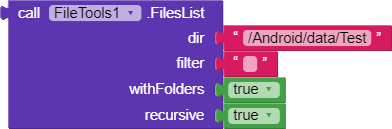

* TOC
{:toc}

[&laquo; 返回首页](index.html)
# <i class="mdi mdi-database"></i>  数据存储组件

目录：

1.   [云数据库](#CloudDB)
1.   [数据文件](#DataFile)
1.   [文件管理器](#File)
    * [FileTools *拓展*：提供额外的更强大的文件相关操作](#FileTools)
1.   [电子表格](#Spreadsheet)
1.   [微数据库](#TinyDB)
1.   [网络微数据库](#TinyWebDB)

##   云数据库  {#CloudDB}

`云数据库`是一个不可见组件，允许您将数据存储在连接到互联网的数据库服务器上（使用Redis），这样你的App上所有用户就能共享数据。 默认情况下，数据将存储在 MIT 维护的服务器中，但是您可以设置和运行自己的服务器。 设置[`服务地址`](#CloudDB.RedisServer)属性和[`服务端口`](#CloudDB.RedisPort)属性以访问您自己的服务器。

### 属性  {#CloudDB-Properties}

{:.properties}

{:id="CloudDB.ProjectID" .text .ro} *项目编号*
: 获取此云数据库项目的编号。

{:id="CloudDB.RedisPort" .number .ro} *服务端口*
: 要使用的Redis服务器端口，默认为6381。

{:id="CloudDB.RedisServer" .text .ro} *服务地址*
: 用于存储数据的Redis服务器地址，“DEFAULT”表示默认使用MIT服务器。

{:id="CloudDB.Token" .text .ro .do} *令牌*
: 此字段包含用于登录到支持的Redis服务器的身份验证令牌。 如果上面服务地址设置“DEFAULT”的话，这个值请不要编辑，系统会自动填上。 
一个系统管理员还可以为您提供一个特殊值，可用于在彼此之间共享数据来自多人的多个项目。如果使用您自己的Redis服务器，请在服务器的配置并在此处输入。

{:id="CloudDB.UseSSL" .boolean .ro .do} *使用SSL*
: 设置为`真`{:.logic.block}则使用SSL加密通道与云数据库/Redis服务器通信。如果上面服务地址设置“DEFAULT”的话，这个应该设置为`真`{:.logic.block}。

### 事件  {#CloudDB-Events}

{:.events}

{:id="CloudDB.CloudDBError"} 云数据库错误(*消息*{:.text})
: 表示与云数据库Redis服务器通信时发生错误。

{:id="CloudDB.DataChanged"} 数据发生变化(*标签*{:.text},*值*{:.any})
: 表示云数据库项目中的数据发生了变化，事件触发时`标签`{:.text.block}已被更新成最新的`值`{:.variable.block}。

{:id="CloudDB.FirstRemoved"} FirstRemoved(*值*{:.any})
: Event triggered by the [`RemoveFirstFromList`](#CloudDB.RemoveFirstFromList) function. The argument
 `值`{:.variable.block} is the object that was the first in the list, and which is now
 removed.

{:id="CloudDB.GotValue"} GotValue(*tag*{:.text},*value*{:.any})
: Indicates that a [`GetValue`](#CloudDB.GetValue) request has succeeded.

{:id="CloudDB.TagList"} TagList(*value*{:.list})
: Event triggered when we have received the list of known tags. Run in response to a call to the
 [`GetTagList`](#CloudDB.GetTagList) function.

{:id="CloudDB.UpdateDone"} UpdateDone(*tag*{:.text},*operation*{:.text})
: Indicates that operations that store data to CloudDB have completed.

### 方法  {#CloudDB-Methods}

{:.methods}

{:id="CloudDB.AppendValueToList" class="method"} <i/> AppendValueToList(*tag*{:.text},*itemToAdd*{:.any})
: Append a value to the end of a list atomically. If two devices use this function simultaneously, both will be appended and no data lost.

{:id="CloudDB.ClearTag" class="method"} <i/> ClearTag(*tag*{:.text})
: Remove the tag from CloudDB.

{:id="CloudDB.CloudConnected" class="method returns boolean"} <i/> CloudConnected()
: Returns `真`{:.logic.block} if we are on the network and will likely be able to connect to
 the `CloudDB` server.

{:id="CloudDB.GetTagList" class="method"} <i/> GetTagList()
: Asks `CloudDB` to retrieve all the tags belonging to this project. The
 resulting list is returned in the event [`TagList`](#CloudDB.TagList).

{:id="CloudDB.GetValue" class="method"} <i/> GetValue(*tag*{:.text},*valueIfTagNotThere*{:.any})
: `GetValue` asks `CloudDB` to get the value stored under the given tag.
 It will pass the result to the [`GotValue`](#CloudDB.GotValue) will be given.

{:id="CloudDB.RemoveFirstFromList" class="method"} <i/> RemoveFirstFromList(*tag*{:.text})
: Obtain the first element of a list and atomically remove it. If two devices use this function
 simultaneously, one will get the first element and the the other will get the second element,
 or an error if there is no available element. When the element is available, the
 [`FirstRemoved`](#CloudDB.FirstRemoved) event will be triggered.

{:id="CloudDB.StoreValue" class="method"} <i/> StoreValue(*tag*{:.text},*valueToStore*{:.any})
: Asks `CloudDB` to store the given `value`{:.variable.block} under the given
 `tag`{:.text.block}.

##   数据文件  {#DataFile}

不可见组件，用于读取 CSV 和 JSON 数据格式的文件，提供各个维度的列表数据，便于解析出我们想要的数据，也可以作为其他组件的数据源。

### 属性  {#DataFile-Properties}

{:.properties}

{:id="DataFile.ColumnNames" .list .ro .bo} *列名列表*
: 获取当前已加载的源文件的列名列表。
  * 对于 CSV 文件，将返回第一行的数据列表。
  * 对于 JSON 文件，将返回 JSON 对象中的键列表。

{:id="DataFile.Columns" .list .ro .bo} *列数据*
: 获取当前已加载的源文件的列数据列表。

{:id="DataFile.DefaultScope" .com.google.appinventor.components.common.FileScopeEnum .wo .do} *默认范围*
: 指定使用`数据文件`组件访问文件的默认范围。App范围适用于大多数应用程序。兼容模式可用于旧的应用程序（新约束之前）Android 上的文件访问。

{:id="DataFile.Rows" .list .ro .bo} *行数据*
: 获取当前已加载的源文件的行数据列表。

{:id="DataFile.SourceFile" .text .wo .do} *源文件*
: 设置数据解析的源文件，然后**异步解析**文件。结果存储在 [`列数据`](#DataFile.Columns) 、[`行数据`](#DataFile.Rows) 及 [`列名列表`](#DataFile.ColumnNames) 属性中。文件格式为 CSV 或 JSON 格式。

### 事件  {#DataFile-Events}

{:.events}
无

### 方法  {#DataFile-Methods}

{:.methods}

{:id="DataFile.ReadFile" class="method"} <i/> 读取文件(*文件名*{:.text})
: 开始加载数据源文件，文件内容的格式是 CSV 或 JSON。 
  * 在 `文件名`{:.text.block} 前加上 `/` 来读取SD 卡上的特定文件（例如，`/myFile.txt` 将读取该文件 `/sdcard/myFile.txt`）。
  * 读取应用程序打包的资源（也适用于AI伴侣)，`文件名`{:.text.block} 以 `//`（两个斜杠）开始。
  * 如果一个`文件名`{:.text.block} 不以 `/` 开头，打包的应用程序会从应用程序的私有存储读取，AI伴侣则是`/sdcard/AppInventor/data`目录。

##   文件管理器  {#File}

不可见组件，用于写入或读取设备上的文件，外部文件的路径均由[`范围`](#File.Scope) 属性指定，不论应用程序是AI伴侣运行还是已编译、以及应用运行的 Android 版本。

由于较新版本的 Android 要求将文件存储在App特定目录中，因此 `默认范围` 设置为 `App`，如果使用的是旧版 Android 并且需要访问兼容的公共存储，将 `默认范围` 属性更改为`兼容`，当然你也可以使用代码块来修改`范围`属性。

  **下面是每种`范围`类型的简述：**

  - **App**  **`[推荐]`** ：Android 2.2及更高版本上文件将从应用程序特定存储中读取和写入，在 Android 早期版本上，文件将写入兼容存储中。

    - App的根目录为：`/storage/emulated/0/Android/data`。读写文件在指定的 `files` 目录下，如图：

    

    （这是AI伴侣的App目录，如果最终编译apk运行，则到 `appinventor.ai_admin.[project_name]` 目录下查看文件）

    - 写入文件的参考代码如下：

    

    - 生成的文件如下：

    

  - **程序包** ：从应用程序包中读取文件，应用程序包属于**只读存储**，不可写入。
  - **缓存**   ：文件将从应用程序的缓存目录读取和写入，可以在缓存中重新创建临时文件，也允许用户清理临时文件以重新获得存储空间。
  - **兼容**   ：文件将使用 App Inventor 在nb187版本之前的规则从文件系统读取和写入，也就是说，将从中读取以单个`/`开头的文件名写入外部存储目录的根目录，例如 `/sdcard/`。
      兼容功能***将无法在 Android 11 或更高版本上运行***。 ***中文网注：我们与MIT官方最新版本一样，`出于安全性考虑，不支持直接从根目录访问文件，如/sdcard/`，推荐使用App模式。***
  - **私有**   ：文件将从应用程序的私有目录读取和写入，使用这个范围存储的数据对其他App不可见。 与App模式类似，读写文件的目录在 `files` 的 `data子目录` 下：

    

  - **共享**   ：文件将从设备的共享媒体目录中读取和写入，例如`图片`目录。

  1. 注1：在 `兼容` 模式下，文件名可以采用以下三种形式之一：
   - 私有文件：没有前导 `/` ，写入应用程序私有存储（例如，`file.txt`）
   - 外部文件：有一个前导的`/`，写入公共存储（例如，`/file.txt`）
   - 应用程序包：有两个前导的 `//`，**只能读取**（例如，`//file.txt`）

  1. 注2：在所有范围内，以两个斜杠 (`//`) 开头的文件名是程序包中的文件，**只读，不可写**。

### 属性  {#File-Properties}

{:.properties}

{:id="File.DefaultScope" .com.google.appinventor.components.common.FileScopeEnum .wo .do} *默认范围*
: 指定使用 `文件管理器` 组件访问文件的默认范围，不指定默认 **`私有`**。

{:id="File.ReadPermission" .boolean .wo .do} *读权限*
: 仅用于“界面设计”视图的属性，用于启用`App`范围之外的文件的读取权限。

{:id="File.Scope" .com.google.appinventor.components.common.FileScopeEnum .bo} *范围*
: 表示 `读取文件` 和 `保存文件` 等操作的当前范围。

{:id="File.WritePermission" .boolean .wo .do} *写权限*
: 仅用于“界面设计”视图的属性，用于启用`App`范围之外的文件的写入权限。

### 事件  {#File-Events}

{:.events}

{:id="File.AfterFileSaved"} 文件存储完毕(*文件名*{:.text})
: 当文件内容已被写入完成后，触发该事件。

{:id="File.GotText"} 获得文本(*文本*{:.text})
: 当文件内容已被读取完成后，触发该事件。

### 方法  {#File-Methods}

{:.methods}

{:id="File.AppendToFile" class="method"} <i/> 追加内容(*文本*{:.text},*文件名*{:.text})
: 将文本追加写入到文件末尾。如果文件不存在，则创建该文件。查看 [`保存文件`](#File.SaveFile) 了解有关文件写入位置的信息。

  写入成功后，将触发 [`文件存储完毕`](#File.AfterFileSaved) 事件。

{:id="File.CopyFile" class="method returns boolean"} <i/> 拷贝文件(*源范围*{:.com.google.appinventor.components.common.FileScopeEnum},*源文件名*{:.text},*目标范围*{:.com.google.appinventor.components.common.FileScopeEnum},*目标文件名*{:.text})
: 将第一个文件的内容复制到第二个文件。

{:id="File.Delete" class="method"} <i/> 删除(*文件名*{:.text})
: 从存储中删除文件。

  1. `文件名`{:.text.block} 以 `/` 开头的是用来删除特定的SD卡中的文件（例如，`/myFile.txt` 将读取该文件`/sdcard/myFile.txt`)。 

  1. `文件名`{:.text.block} 开头没有 `/`，则删除位于程序的私有存储中文件。
  
  1. 以`//`（双斜杠）开头的`文件名`{:.text.block} 是程序包资产文件，是只读的，无法删除会报错。

{:id="File.Exists" class="method returns boolean"} <i/> 是否存在(*范围*{:.com.google.appinventor.components.common.FileScopeEnum},*路径*{:.text})
: 测试在指定范围内给出的路径是否存在。

{:id="File.IsDirectory" class="method returns boolean"} <i/> 是否是目录(*范围*{:.com.google.appinventor.components.common.FileScopeEnum},*路径*{:.text})
: 测试在指定范围内给出的路径是否是目录。

{:id="File.ListDirectory" class="method returns list"} <i/> 列出目录(*范围*{:.com.google.appinventor.components.common.FileScopeEnum},*目录名称*{:.text})
: 获取给定目录中的文件和目录列表。

{:id="File.MakeDirectory" class="method returns boolean"} <i/> 创建目录(*范围*{:.com.google.appinventor.components.common.FileScopeEnum},*目录名称*{:.text})
: 创建一个新目录，只要在完成时目录存在，就返回 `真`，也就是创建之前目录已经存在的话，也是返回 `真`。

{:id="File.MakeFullPath" class="method returns text"} <i/> 制作完整路径(*范围*{:.com.google.appinventor.components.common.FileScopeEnum},*路径*{:.text})
: 将范围和路径转换为单个字符串形式的完整路径，便于其他组件使用。

  关于Android存储路径更深入请参考《[Android存储系统基础知识：内部存储，外部存储，App特定目录ASD 及 getASD代码实现](../creative/asd.html)》。

{:id="File.MoveFile" class="method returns boolean"} <i/> 移动文件(*源文件范围*{:.com.google.appinventor.components.common.FileScopeEnum},*源文件名*{:.text},*目标文件范围*{:.com.google.appinventor.components.common.FileScopeEnum},*目标文件名*{:.text})
: 将文件从一个位置移动到另一个位置。

{:id="File.ReadFrom" class="method"} <i/> 读取文件(*文件名*{:.text})
: 从存储中的文件中读取文本。
  
  1. `文件名`{:.text.block} 以 `/` 开头的是用来读取 SD 卡上的特定文件（例如，`/myFile.txt` 将读取该文件`/sdcard/myFile.txt`)。 
  
  1. 以`//`（双斜杠）开头的`文件名`{:.text.block} 是读取应用程序打包的资源（也适用于AI伴侣）。
  
  1. `文件名`{:.text.block} 开头没有 `/`，它将从应用程序的私有存储中读取文件。

{:id="File.RemoveDirectory" class="method returns boolean"} <i/> 删除目录(*范围*{:.com.google.appinventor.components.common.FileScopeEnum},*目录名称*{:.text},*递归处理*{:.boolean})
: 从文件系统中删除目录。如果递归为`真`，所有内容都将被删除；如果递归为`假`，则只有该目录为空时才能被删除。

{:id="File.SaveFile" class="method"} <i/> 保存文件(*文本*{:.text},*文件名*{:.text})
: 将文本保存到文件中。

  1. `文件名`{:.text.block} 以 `/` 开头则该文件是写入 SD 卡（例如，写入 `/myFile.txt` 会将文件写入`/sdcard/myFile.txt`)。
  
  1. `文件名`{:.text.block} 开头没有 `/`，它将是写入程序的私有数据目录中，其他人无法访问该目录手机上的程序。
  
  1. AI伴侣较为特殊，它作为一个独立的App拥有一个私有目录，但是在测试多个项目时，由于这些App都是运行在AI伴侣的App上，因此会共用AI伴侣的私有目录，当这些程序编译后独立运行，则私有目录就各自独立，互不干扰了。

  **请注意**：如果文件已存在，此块将覆盖该文件。如果你想给文件添加内容请使用 [`追加内容`](#File.AppendToFile) 方法添加到现有文件。

## FileTools 拓展  {#FileTools}
<!--(https://community.kodular.io/t/filetools-some-tools-to-work-with-files/40051)-->

提供一些额外的更加强大的文件相关的操作。是 [`文件管理器`](#File) 的加强拓展。

.aix 拓展下载：

{:.vip}
[com.sunny.FileTools.aix](extension/com.sunny.FileTools.aix)

FileTools demo程序下载：

{:.vip}
[FileTools.aia](extension/FileTools.aia)

### 属性  {#FileTools-Properties}

{:.properties}
无

### 事件  {#FileTools-Events}

{:.events}
无

### 方法  {#FileTools-Methods}

{:.methods}

1. 

    返回应用程序特定目录的路径。

1. 
  
    返回可用存储目录的列表。

1. 
  
    将文件从源文件夹复制到目标文件夹。

1. 
  
    将文件从源异步复制到目标。使用此功能复制大文件以避免运行时错误。

1. 
  
    如果应用程序特定目录不存在，则创建该目录。
    
    ASD(app specific directory)相关知识请参考《[Android存储系统基础知识：内部存储，外部存储，App特定目录ASD 及 getASD代码实现](../creative/asd.html)》。

1. 
  
    创建一个目录。它用布尔值 true 或 false 触发“Directory Created”。

1. 
  
    删除给定的文件或文件夹。如果是目录，则所有子目录将被删除，这可能需要一些时间。它会触发布尔值 true 或 false 的“FileDeleted”事件。

1. 

    

    如果文件或文件夹存在则返回 true，否则返回 false。

1. 
  
    从给定目录返回文件列表（如果存在）。使用文件扩展名作为过滤器，如 mp3、txt 等。如果您不想使用过滤器，则使用空字符串。另外，如果不想获取子目录，则设置 ' withFolders' to false else true。如果recursive设置为true，那么它也会递归地从子目录中获取文件。

1. 
  
    与 FilesList 的工作方式相同，但它异步获取文件列表，这拒绝了从具有如此多文件的目录获取文件列表时出现任何运行时错误的机会。它会引发带有文件列表的“GotFileList”事件。

1. 
  
    从资产返回文件列表。

1. 
  
    如果存在则返回路径中的文件名。

1. 
  
    返回文件或文件夹的当前大小。

1. 
  
    从文件名返回文件路径。在这种情况下，它将返回 /storage/sdcard/mFile.txt。

1. 
  
    返回给定目录的文件夹列表。

1. 
  
    返回目录的可用大小（以字节为单位）。注意：它使用绝对文件路径。

1. 
  
    将文件路径转换为内容 uri。

1. 
  
    将文件从源异步移动到目标。

1. 
  
    检查给定路径是否是完整路径。例如：/testt.txt 和 /mnt/sdcard/Android/com.sunny.notez/files/testt.txt 不相同。

1. 
  
    返回文件夹/文件是否可执行。

1. 
  
    如果路径是文件则返回 true，否则返回 false。

1. 
  
    如果文件/文件夹被隐藏则返回 true，否则返回 false。

1. 
  
    如果文件/文件夹可读则返回 true，否则返回 false。

1. 
  
    如果文件/文件夹可写则返回 true，否则返回 false。

1. 
  
    给定格式的文件/文件夹的最后修改时间。

1. 
  
    给定文件的 Mime 类型。在上述情况下，它将返回 text/plain。

1. 
  
    将文件从源移动到目标并删除源文件。

1. 
  
    将内容 uri 转换为文件路径。

1. 
  
    重命名文件而不删除它。

1. 

    返回目录的总空间。注意：它使用绝对文件路径。

##   电子表格（*依赖谷歌服务，国内无法使用*）  {#Spreadsheet}

电子表格是一个不可见的组件，用于存储和接收来自使用 Google Sheets API 的 Google Sheets 文档。

要使用此组件，首先必须拥有 Google Developer 帐户，然后，必须在该 Google Developer 下创建一个新项目帐户，在该项目上启用 Google Sheets API，最后创建一个Sheets API 的服务帐户。

有关如何创建服务帐户以及在何处查找的说明使用 Google 表格组件的其他相关信息，可以在<a href='/reference/other/googlesheets-api-setup.html'>此处</a>找到。

行号和列号是从 1 开始索引的。

### 属性  {#Spreadsheet-Properties}

{:.properties}

{:id="Spreadsheet.ApplicationName" .text .do} *ApplicationName*
: The name of your application, used when making API calls.

{:id="Spreadsheet.CredentialsJson" .text} *CredentialsJson*
: The JSON File with credentials for the Service Account

{:id="Spreadsheet.SpreadsheetID" .text} *SpreadsheetID*
: The ID for the Google Sheets file you want to edit. You can find the spreadsheetID in the URL of the Google Sheets file.

### 事件  {#Spreadsheet-Events}

{:.events}

{:id="Spreadsheet.ErrorOccurred"} ErrorOccurred(*errorMessage*{:.text})
: Triggered whenever an API call encounters an error. Details about the error are in `errorMessage`.

{:id="Spreadsheet.FinishedAddCol"} FinishedAddCol(*columnNumber*{:.number})
: The callback event for the [`AddCol`](#Spreadsheet.AddCol) block, called once the
 values on the table have been updated. Additionally, this returns the
 column number for the new column.

{:id="Spreadsheet.FinishedAddRow"} FinishedAddRow(*rowNumber*{:.number})
: The callback event for the [`AddRow`](#Spreadsheet.AddRow) block, called once the
 values on the table have been updated. Additionally, this returns the
 row number for the new row.

{:id="Spreadsheet.FinishedClearRange"} FinishedClearRange()
: The callback event for the [`ClearRange`](#Spreadsheet.ClearRange) block, called once the
 values on the table have been updated.

{:id="Spreadsheet.FinishedRemoveCol"} FinishedRemoveCol()
: The callback event for the [`RemoveCol`](#Spreadsheet.RemoveCol) block, called once the
 values on the table have been updated.

{:id="Spreadsheet.FinishedRemoveRow"} FinishedRemoveRow()
: The callback event for the [`RemoveRow`](#Spreadsheet.RemoveRow) block, called once the
 values on the table have been updated.

{:id="Spreadsheet.FinishedWriteCell"} FinishedWriteCell()
: The callback event for the [`WriteCell`](#Spreadsheet.WriteCell) block, called once the
 values on the table have been updated.

{:id="Spreadsheet.FinishedWriteCol"} FinishedWriteCol()
: The callback event for the [`WriteCol`](#Spreadsheet.WriteCol) block, called once the
 values on the table have been updated.

{:id="Spreadsheet.FinishedWriteRange"} FinishedWriteRange()
: The callback event for the [`WriteRange`](#Spreadsheet.WriteRange) block, called once the
 values on the table have been updated.

{:id="Spreadsheet.FinishedWriteRow"} FinishedWriteRow()
: The callback event for the [`WriteRow`](#Spreadsheet.WriteRow) block, called once the
 values on the table have been updated.

{:id="Spreadsheet.GotCellData"} GotCellData(*cellData*{:.text})
: The callback event for the [`ReadCell`](#Spreadsheet.ReadCell) block. The `cellData` is
 the text value in the cell.

{:id="Spreadsheet.GotColData"} GotColData(*colDataList*{:.list})
: The callback event for the [`ReadCol`](#Spreadsheet.ReadCol) block. The `colDataList` is a
 list of text cell-values in order of increasing row number.

{:id="Spreadsheet.GotFilterResult"} GotFilterResult(*return_rows*{:.list},*return_data*{:.list})
: The callbeck event for the [`ReadWithQuery`](#Spreadsheet.ReadWithQuery) block. The `response`
 is a list of rows, where each row satisfies the query.

{:id="Spreadsheet.GotRangeData"} GotRangeData(*rangeData*{:.list})
: The callback event for the [`ReadRange`](#Spreadsheet.ReadRange) block. The `rangeData` is
 a list of rows, where the dimensions are the same as the rangeReference.

{:id="Spreadsheet.GotRowData"} GotRowData(*rowDataList*{:.list})
: The callback event for the [`ReadRow`](#Spreadsheet.ReadRow) block. The `rowDataList` is a
 list of text cell-values in order of increasing column number.

{:id="Spreadsheet.GotSheetData"} GotSheetData(*sheetData*{:.list})
: The callback event for the [`ReadSheet`](#Spreadsheet.ReadSheet) block. The `sheetData` is a
 list of rows.

### 方法  {#Spreadsheet-Methods}

{:.methods}

{:id="Spreadsheet.AddCol" class="method"} <i/> AddCol(*sheetName*{:.text},*data*{:.list})
: Given a list of values as `data`, appends the values to the next empty
 column of the sheet. It will always start from the top row and continue
 downwards. Once complete, it triggers the [`FinishedAddCol`](#Spreadsheet.FinishedAddCol)
 callback event.

{:id="Spreadsheet.AddRow" class="method"} <i/> AddRow(*sheetName*{:.text},*data*{:.list})
: Given a list of values as `data`, appends the values to the next
 empty row of the sheet. It will always start from the left most column and
 continue to the right. Once complete, it triggers the [`FinishedAddRow`](#Spreadsheet.FinishedAddRow)
 callback event. Additionally, this returns the row number for the new row.

{:id="Spreadsheet.ClearRange" class="method"} <i/> ClearRange(*sheetName*{:.text},*rangeReference*{:.text})
: Empties the cells in the given range. Once complete, this block triggers
 the [`FinishedClearRange`](#Spreadsheet.FinishedClearRange) callback event.

{:id="Spreadsheet.GetCellReference" class="method returns text"} <i/> GetCellReference(*row*{:.number},*col*{:.number})
: Converts the integer representation of rows and columns to A1-Notation used
 in Google Sheets for a single cell. For example, row 1 and col 2
 corresponds to the string \"B1\".

{:id="Spreadsheet.GetRangeReference" class="method returns text"} <i/> GetRangeReference(*row1*{:.number},*col1*{:.number},*row2*{:.number},*col2*{:.number})
: Converts the integer representation of rows and columns for the corners of
 the range to A1-Notation used in Google Sheets. For example, selecting the
 range from row 1, col 2 to row 3, col 4 corresponds to the string "B1:D3".

{:id="Spreadsheet.ReadCell" class="method"} <i/> ReadCell(*sheetName*{:.text},*cellReference*{:.text})
: On the page with the provided sheetName, reads the cell at the given
 cellReference and triggers the [`GotCellData`](#Spreadsheet.GotCellData) callback event. The
 cellReference can be either a text block with A1-Notation, or the result of
 the [`getCellReference`](#Spreadsheet.getCellReference) block.

{:id="Spreadsheet.ReadCol" class="method"} <i/> ReadCol(*sheetName*{:.text},*colNumber*{:.number})
: On the page with the provided sheetName, reads the column at the given
 colNumber and triggers the [`GotColData`](#Spreadsheet.GotColData) callback event.

{:id="Spreadsheet.ReadRange" class="method"} <i/> ReadRange(*sheetName*{:.text},*rangeReference*{:.text})
: On the page with the provided sheetName, reads the cells at the given
 rangeReference and triggers the [`GotRangeData`](#Spreadsheet.GotRangeData) callback event. The
 rangeReference can be either a text block with A1-Notation, or the result
 of the [`getRangeReference`](#Spreadsheet.getRangeReference) block.

{:id="Spreadsheet.ReadRow" class="method"} <i/> ReadRow(*sheetName*{:.text},*rowNumber*{:.number})
: On the page with the provided sheetName, reads the row at the given
 rowNumber and triggers the [`GotRowData`](#Spreadsheet.GotRowData) callback event.

{:id="Spreadsheet.ReadSheet" class="method"} <i/> ReadSheet(*sheetName*{:.text})
: Reads the <b>entire</b> Google Sheets document and triggers the
 [`GotSheetData`](#Spreadsheet.GotSheetData) callback event.

{:id="Spreadsheet.ReadWithExactFilter" class="method"} <i/> ReadWithExactFilter(*sheetName*{:.text},*colID*{:.number},*value*{:.text})
: Filters a Google Sheet for rows where the given column number matches the provided value.

{:id="Spreadsheet.ReadWithPartialFilter" class="method"} <i/> ReadWithPartialFilter(*sheetName*{:.text},*colID*{:.number},*value*{:.text})
: Filters a Google Sheet for rows where the given column number contains the provided value string.

{:id="Spreadsheet.RemoveCol" class="method"} <i/> RemoveCol(*sheetName*{:.text},*colNumber*{:.number})
: Deletes the column with the given column number from the table. This does
 not clear the column, but removes it entirely. The sheet's grid id can be
 found at the end of the url of the Google Sheets document, right after the
 "gid=". Once complete, it triggers the [`FinishedRemoveCol`](#Spreadsheet.FinishedRemoveCol)
 callback event.

{:id="Spreadsheet.RemoveRow" class="method"} <i/> RemoveRow(*sheetName*{:.text},*rowNumber*{:.number})
: Deletes the row with the given row number (1-indexed) from the table. This
 does not clear the row, but removes it entirely. The sheet's grid id can be
 found at the end of the url of the Google Sheets document, right after the
 "gid=". Once complete, it triggers the [`FinishedRemoveRow`](#Spreadsheet.FinishedRemoveRow)
 callback event.

{:id="Spreadsheet.WriteCell" class="method"} <i/> WriteCell(*sheetName*{:.text},*cellReference*{:.text},*data*{:.any})
: Given text or a number as `data`, writes the value to the cell. It will
 override any existing data in the cell with the one provided. Once complete,
 it triggers the [`FinishedWriteCell`](#Spreadsheet.FinishedWriteCell) callback event.

{:id="Spreadsheet.WriteCol" class="method"} <i/> WriteCol(*sheetName*{:.text},*colNumber*{:.number},*data*{:.list})
: Given a list of values as `data`, writes the values to the column with the
 given column number, overriding existing values from top down. (Note: It
 will not erase the entire column.) Once complete, it triggers the
 [`FinishedWriteCol`](#Spreadsheet.FinishedWriteCol) callback event.

{:id="Spreadsheet.WriteRange" class="method"} <i/> WriteRange(*sheetName*{:.text},*rangeReference*{:.text},*data*{:.list})
: Given list of lists as `data`, writes the values to cells in the range. The
 number of rows and columns in the range must match the dimensions of your
 data. This method will override existing data in the range. Once complete,
 it triggers the [`FinishedWriteRange`](#Spreadsheet.FinishedWriteRange) callback event.

{:id="Spreadsheet.WriteRow" class="method"} <i/> WriteRow(*sheetName*{:.text},*rowNumber*{:.number},*data*{:.list})
: Given a list of values as `data`, writes the values to the row  with the
 given row number, overriding existing values from left to right. (Note: It
 will not erase the entire row.) Once complete, it triggers the
 [`FinishedWriteRow`](#Spreadsheet.FinishedWriteRow) callback event.

##   微数据库  {#TinyDB}

`微数据库`是一个不可见的组件，用于存储应用程序的数据。

 使用 App Inventor 创建的应用程序在每次运行时都会进行初始化，这意味着如果一个应用程序设置变量的值，然后用户退出应用程序，该变量的值将在下次运行应用程序时不会被记住。
 相比之下，微数据库是一个持久化的数据存储，每次运行应用程序时，存储在“微数据库”中的数据都能被记住并获取。例如游戏中保存最高分，并在每次玩游戏时获取它。

 1. 数据项由标签和值组成，要存储数据项需要指定标签（标签必须是文本块，为数据命名），然后可以根据标签获取存储在该标签下的数据。

 1. 不能使用“微数据库”在手机上的两个不同App之间传递数据，可以在多屏应用的**不同屏幕之间共享数据**。

 1. 在使用AI伴侣开发应用时，使用该**AI伴侣的所有应用都将共用一个微数据库**，而一旦应用打包之后，数据的共享将不复存在。因此在开发过程中，每次创建新项目时，都需留心清空微数据库。

 总结下来，就是“微数据库”只能在同一个App间共享数据，AI伴侣算一个App（所有被测试的程序均归到AI伴侣App上），程序打包编译apk后算作各自的App。

### 属性  {#TinyDB-Properties}

{:.properties}

{:id="TinyDB.Namespace" .text} *命名空间*
: 用于存储数据的命名空间。

### 事件  {#TinyDB-Events}

{:.events}
无

### 方法  {#TinyDB-Methods}

{:.methods}

{:id="TinyDB.ClearAll" class="method"} <i/> 清除所有数据()
: 清除整个数据存储。

{:id="TinyDB.ClearTag" class="method"} <i/> 清除标签数据(*标签*{:.text})
: 清除指定 `标签`{:.text.block} 下的数据。

{:id="TinyDB.GetTags" class="method returns any"} <i/> 获取标签数据()
: 返回数据存储中所有标签的列表（是一个列表对象）。

{:id="TinyDB.GetValue" class="method returns any"} <i/> 获取数值(*标签*{:.text},*无标签时返回值*{:.any})
: 获取指定 `标签`{:.text.block} 下的数据，如果没有该标签，则返回 `无标签时返回值`{:.variable.block} 中指定的值。

{:id="TinyDB.StoreValue" class="method"} <i/> 保存数值(*tag*{:.text},*存储值*{:.any})
: 将 `存储值`{:.variable.block} 保存到指定 `标签`{:.text.block} 下，当应用程序重新启动时，存储仍然存在于手机上。
 
: `存储值`可以是文本，也可以是数字。重复保存同一个标签的话，第二次会覆盖第一次的值，即以最新存储的值为准。

**拓展**

* 微数据库的`存储值`可以是列表吗？我们写了一个测试程序如下：

    

    测试结果是：2。说明**值取出后成功还原了列表**，也说明**列表是能够直接存储**进微数据库的。

##   网络微数据库  {#TinyWebDB}

`网络微数据库` 组件通过与Web服务通信以存储及查询数据，虽然这个组件是有用的，**但是非常有限**，主要是作为对那些想要创建自己的组件与 Web 对话的`Demo应用`。

随附的 Web 服务位于 [http://tinywebdb.appinventor.mit.edu](http://tinywebdb.appinventor.mit.edu)。该组件有方法[保存数值](#TinyWebDB.StoreValue) 和[获取数值](#TinyWebDB.GetValue) ，“保存”和“获取”的含义取决于Web服务。在目前的实现中，所有标签和值是字符串（文本），后续版本可能会放开这一限制。

**中文网注：**

MIT官方的功能很单一，目前国内也有免费的网络微数据库，功能上也进行了一定的拓展，详细可以去各自的网站上查看中文文档。网站如下：

[https://tinywebdb.cn/](https://tinywebdb.cn/)

[https://tinywebdb.appinventor.space/](https://tinywebdb.appinventor.space/)   *经过测试，单个键值的大小不可超过9000字节，否则可能保存失败。*

### 属性  {#TinyWebDB-Properties}

{:.properties}

{:id="TinyWebDB.ServiceURL" .text} *服务地址*
: 指定Web服务的 URL，默认值是 [http://tinywebdb.appinventor.mit.edu](http://tinywebdb.appinventor.mit.edu)。

### 事件  {#TinyWebDB-Events}

{:.events}

{:id="TinyWebDB.GotValue"} GotValue(*网络微数据库标签*{:.text},*网络微数据库数值*{:.any})
: [`获取数值`](#TinyWebDB.GetValue) 请求服务器执行成功时触发该事件。

{:id="TinyWebDB.ValueStored"} 数值存储完毕()
: [`保存数值`](#TinyWebDB.StoreValue) 请求服务器执行成功时触发该事件。

{:id="TinyWebDB.WebServiceError"} 发生Web服务故障(*消息*{:.text})
: 与Web服务器的通信发出错误信号时触发该事件。

### 方法  {#TinyWebDB-Methods}

{:.methods}

{:id="TinyWebDB.GetValue" class="method"} <i/> 获取数值(*标签*{:.text})
: `获取数值` 请求Web服务获取存储在指定 `标签`{:.text.block} 下的值，如果 `标签`{:.text.block} 下没有存储值，则返回什么取决于Web服务。

  该组件接受返回任何内容，然后 [`获取数值`](#TinyWebDB.GotValue) 事件将在完成时触发。

{:id="TinyWebDB.StoreValue" class="method"} <i/> 保存数值(*标签*{:.text},*待存储值*{:.any})
: 向Web服务发送请求，将给定的 `待存储值`{:.variable.block} 存储在指定的 `标签`{:.text.block} 下，[`数值存储完成`](#TinyWebDB.ValueStored) 事件将在完成时触发。
