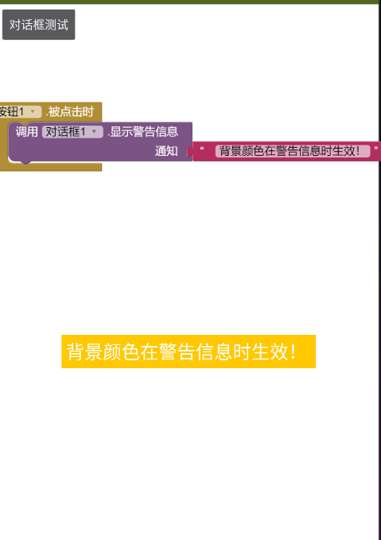
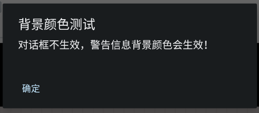

* TOC
{:toc}

[&laquo; 返回首页](index.html)
# <i class="mdi mdi-view-split-horizontal"></i>  用户界面（UI）组件

目录：

1.   [屏幕（Screen）](#Screen)
1.   [按钮（Button）](#Button)
1.   [复选框（CheckBox）](#CheckBox)
1.    [日期选择框（DatePicker）](#DatePicker)
1.   [图像（Image）](#Image)
  * [TaifunImage *拓展：图像高级处理*](../extensions/TaifunImage.html)
  * [SimpleBase64 *拓展：图像Base64编解码*](connectivity.html#SimpleBase64)
1.   [标签（Label）](#Label)
1.   [列表选择器（ListPicker）](#ListPicker)
1.   [列表显示框（ListView）](#ListView)
1.   [对话框（Notifier）](#Notifier)
1.   [密码输入框（PasswordTextBox）](#PasswordTextBox)
1.   [滑动条（Slider）](#Slider)
1.   [下拉框（Spinner）](#Spinner)
1.   [切换开关（Switch）](#Switch)
1.   [文本输入框（TextBox）](#TextBox)
1.   [时间选择框（TimePicker）](#TimePicker)
1.   [Web浏览框（WebViewer）](#WebViewer)


##   屏幕  {#Screen}

包含程序中所有其他组件的顶层组件。

### 属性  {#Screen-Properties}

{:.properties}

{:id="Screen.AboutScreen" .text} *关于屏幕*
: 有关屏幕的信息，系统菜单 -> “关于此应用程序”选中时出现。它用来向用户介绍你的应用程序，在多屏幕应用程序中，每个屏幕都拥有“关于屏幕”的信息。

{:id="Screen.AccentColor" .color .do} *交互性颜色*
: 这是新版本Android中用于突出显示和其他用户界面交互的交互性颜色。受此属性影响的包括 [`对话框`](#Notifier)、[`日期选择框`](#DatePicker) 等组件**触发的弹出框**。

  > PrimaryColor：  主题颜色。app的主要颜色，即整个屏幕和所有控件的主要颜色，首选颜色。
  >
  > SecondaryColor：提示性颜色。这颜色一般比PrimaryColor亮一些或暗一些，取决于白天模式还是黑暗模式。一般用于提示相关动作或信息，提示性颜色。
  >
  > AccentColor：   交互性颜色。这颜色一般用于交互性的控件颜色，比如FloatingButton、TextField、Cursor、ProgressBar、Selection、Links等具体交互性的颜色。
  >
  > 另外附上Android Material设计图的Color说明：
  >
  > 

{:id="Screen.PrimaryColor" .color .do} *主题颜色*
: 这是用作 Android 主题部分的主要颜色，包括“屏幕”标题栏颜色。

{:id="Screen.PrimaryColorDark" .color .do} *深色主题颜色*
: 这是当 [`主题`](#Screen.Theme) 属性指定为 `深色` 时使用的主要颜色。它适用于许多元素，包括“屏幕”的标题栏。

{:id="Screen.AlignHorizontal" .number} *水平对齐*
: 表示屏幕内容如何水平对齐的数字，含义如下：

  `1` （左对齐）

  `2` （右对齐）

  `3` （水平居中）

{:id="Screen.AlignVertical" .number} *垂直对齐*
: 表示屏幕内容如何垂直对齐的数字，含义如下：

  `1` （顶部对齐）

  `2` （垂直居中）

  `3` （底部对齐）
  
  如果屏幕可滚动，垂直对齐将没有效果。

{:id="Screen.AppName" .text .wo .do} *应用名称*
: 这是手机中安装的应用程序的显示名称。如果“应用名称”为空，则当项目构建时，它将被设置为项目的名称。

{:id="Screen.BackgroundColor" .color} *背景颜色*
: 设置`屏幕`的背景颜色，使用RGBA数值表示，如果设置了[`背景图像`](#Screen.BackgroundImage)属性，则不能显示背景颜色直到删除[`背景图像`](#Screen.BackgroundImage)属性为止。

{:id="Screen.BackgroundImage" .text} *背景图像*
: 设置`屏幕`背景图像的路径，如果同时设置了 `背景图像` 和 `背景颜色`，则只有 `背景图像` 可见。

{:id="Screen.BigDefaultText" .boolean} *文本变大*
: 选中（或设置`真`）后，所有默认大小的文本都会增加大小。

{:id="Screen.BlocksToolkit" .text .wo .do} *块工具包*
: 表示屏幕子集的 JSON 字符串。模板应用程序的作者可以使用它来控制项目中可用的组件、设计器属性和代码块。

{:id="Screen.OpenScreenAnimation" .text} *开屏动画*
: 设置此表单打开的过渡动画类型。

{:id="Screen.CloseScreenAnimation" .text} *关屏动画*
: 设置表单关闭和返回到后面表单的过渡动画类型。

{:id="Screen.DefaultFileScope" .com.google.appinventor.components.common.FileScopeEnum .wo .do} *默认文件作用域*
: 设置组件访问文件时使用的默认作用域。注意 [`文件管理器`](storage.html#File) 组件有自己的属性来控制文件作用域。

{:id="Screen.Width" .number .ro .bo} *宽度*
: 返回屏幕宽度（以像素px为单位）（x 尺寸）。

{:id="Screen.Height" .number .ro .bo} *高度*
: 返回屏幕高度（以像素px为单位）（y 尺寸）。

{:id="Screen.HighContrast" .boolean} *高对比度*
: 选中（或设置`真`）后，将打开高对比度模式。

{:id="Screen.Icon" .text .wo .do} *图标*
: 设置图像，用于应用程序图标显示，需是方形尺寸 png 或 jpeg 图像，最大分辨率 1024 x 1024 像素。

  **较大的图像可能会导致编译或安装应用程序失败**。
  
  构建服务器将为 Android 设备生成标准尺寸的图像。

{:id="Screen.Platform" .text .ro .bo} *平台*
: 获取运行应用程序的底层平台的名称。目前，这是文本`Android`，将来可能会支持其他平台。

{:id="Screen.PlatformVersion" .text .ro .bo} *平台版本*
: 获取运行应用程序的平台的版本号。这通常是带点的版本数字，例如 10.0，但是，它可以返回任何值，因此需要考虑处理意外的数据。如果平台版本不可用，将返回空文本。

{:id="Screen.ScreenOrientation" .text} *屏幕方向*
: 指定屏幕方向，为文本值。常用的值为：

  * 横向 (`landscape`)

  * 纵向 (`portrait`)

  * 传感器 (`sensor`)

  * 用户 (`user`)

  * 未指定 (`unspecified`)

  查看 Android 开发者可能的完整列表的文档[选项](https://developer.android.com/reference/android/R.attr.html#screenOrientation)。

{:id="Screen.Scrollable" .boolean} *允许滚动*
: 勾选（或设置`真`）后，屏幕上会出现一个垂直滚动条，应用程序高度能超出设备的物理高度。未选中时，应用程序高度受限于设备的高度。

{:id="Screen.ShowListsAsJson" .boolean .do} *以JSON格式显示列表*
: 如果为`真`{:.logic.block}（默认值），列表将显示为 JSON/Python 表示法中的字符串，例如 `[1, "a", true]`。

  如果为`假`{:.logic.block}，则列表将显示在 LISP 中表示法，例如 `(1 a true)`。

    **注意：** 该属性仅出现在 Screen1 中，Screen1 的值决定了应用程序中所有屏幕的行为。

{:id="Screen.ShowStatusBar" .boolean} *显示状态栏*
: 状态栏是屏幕最上面的栏，该属性设置状态栏是否是可见的。

{:id="Screen.Sizing" .text .wo .do} *屏幕大小*
: 如果设置为响应式（默认），屏幕布局将使用设备的实际分辨率。请参阅App中的[响应式设计文档](../other/responsiveDesign.html)了解更多信息。

  如果设置为`固定大小`，将为单个固定尺寸屏幕创建屏幕布局并自动缩放。

    **注意：** 此属性仅出现在 Screen1 上，并控制该应用程序中所有屏幕的大小。

{:id="Screen.Theme" .text .wo .do} *主题*
: 选择应用程序的主题，主题只能在编译时设置，与AI伴侣在实时开发期间会有细微的差别。可选项有：

    * `Classic`（经典），与旧版本的 App Inventor 相同

    * `Device Default`（设备默认），与当前运行的 Android 设备主题一致，可通过[“主题颜色”](#Screen.PrimaryColor)设置。

    * `Black Title Text`（黑色标题），这也是“设备默认”主题，但标题文本为黑色
    
    * `Dark`（深色主题），这是“设备默认”主题的深色版本，可通过[“深色主题颜色”](#Screen.PrimaryColorDark)设置。

{:id="Screen.Title" .text} *标题*
: 设置标题属性，在表单的标题栏为表单设置新的标题。

{:id="Screen.TitleVisible" .boolean} *标题展示*
: 标题栏是屏幕顶部的灰色栏，该属性设置标题栏是否是可见的。

{:id="Screen.TutorialURL" .text .wo .do} *侧边栏教程网址*
: 设置侧边栏中文教程URL地址。

{:id="Screen.VersionCode" .number .wo .do} *版本编号*
: 每次为应用商店创建新的 Android 应用程序包文件(APK)时都必须递增的整数值。

{:id="Screen.VersionName" .text .wo .do} *版本名称*
: 可以更改的字符串，以允许应用商店用户区分不同版本的应用程序。

### 事件  {#Screen-Events}

{:.events}

{:id="Screen.BackPressed"} 回退时()
: 设备后退按钮已按下。

{:id="Screen.ErrorOccurred"} 出现错误时(*组件*{:.component},*函数名称*{:.text},*错误编号*{:.number},*消息*{:.text})
: 发生错误时触发该事件。只有某些错误才会触发，对于这些错误，系统将默认显示通知，可以使用此事件来定制错误处理逻辑。

{:id="Screen.Initialize"} 初始化()
: 初始化事件在屏幕启动时运行，并且每个屏幕**仅运行一次**。

{:id="Screen.OtherScreenClosed"} 关闭其他屏幕时(*其他屏幕名称*{:.text},*返回结果*{:.any})
: 当另一个屏幕关闭并且控制权返回到此屏幕时触发该事件。

{:id="Screen.PermissionDenied"} 权限被拒绝时(*组件*{:.component},*函数名称*{:.text},*权限名称*{:.text})
: 当请求所需权限被用户拒绝时要处理的事件。

{:id="Screen.PermissionGranted"} 权限被授予时(*权限名称*{:.text})
: 当请求所需权限被用户授予时要处理的事件。该事件仅在获得许可时运行，是 [`请求权限`](#Screen.AskForPermission) 方法的响应。

{:id="Screen.ScreenOrientationChanged"} 屏幕方向改变时()
: 屏幕方向已改变时触发此事件。

### 方法  {#Screen-Methods}

{:.methods}

{:id="Screen.AskForPermission" class="method"} <i/> 请求权限(*权限名称*{:.text})
: 请求用户授予对敏感权限的访问权限，例如`精确定位`权限。

  如果用户许可了授权，[`权限被授予时`](#Screen.PermissionGranted) 事件将被触发；如果用户拒绝授权，[`权限被拒绝时`](#Screen.PermissionDenied)事件将被触发。

   **注意：** 最佳做法是仅在需要时请求权限，App Inventor组件将在必要时执行。不建议在[`初始化`](#Screen.Initialize) 事件中使用`请求权限`，除非访问该权限对你的应用是预先需要的，例如导航应用需要定位服务。

{:id="Screen.HideKeyboard" class="method"} <i/> 隐藏键盘()
: 隐藏软键盘。


##   按钮（Button）  {#Button}

按钮具有检测点击的功能，它的外观可以被改变，比如是否可点击 (`启用`)，可以在“界面设计”视图或“程序设计”视图中修改其属性。

### 属性  {#Button-Properties}

{:.properties}

{:id="Button.BackgroundColor" .color} *背景颜色*
: 设置`按钮`的背景颜色，使用RGBA数值表示，如果设置了[`图像`](#Button.Image)属性，则不能显示背景颜色直到删除[`图像`](#Button.Image)属性为止。

{:id="Button.Enabled" .boolean} *启用*
: 设置`按钮`是否可以被点击。

{:id="Button.FontBold" .boolean} *粗体*
: 设置`按钮`的显示字体是否是粗体。（注：有些字体不支持粗体）。

{:id="Button.FontItalic" .boolean} *斜体*
: 设置`按钮`的显示字体是否是斜体。（注：有些字体不支持斜体）。

{:id="Button.FontSize" .number} *字体大小*
: 设置`按钮`的字体大小，以像素px为单位。

{:id="Button.FontTypeface" .number .do} *字体*
: 设置`按钮`的字体，目前支持的字体有：default,  serif,  sans serif,  和 monospace。

  要使用自定义字体，请将 **.ttf** 字体文件上传并选中它。

{:id="Button.Height" .number .bo} *高度*
: 设置`按钮`的垂直高度，以像素px为单位。

{:id="Button.HeightPercent" .number .wo .bo} *高度百分比*
: 设置`按钮`的垂直高度相对于整个[`屏幕高度`](userinterface.html#Screen.Height)的百分比。

{:id="Button.Image" .text} *图像*
: 设置`按钮`图像的路径，如果同时设置了`图像`和[`背景颜色`](#Button.BackgroundColor)，则仅`图像`可见。

{:id="Button.Shape" .number .do} *形状*
: 设置`按钮`的形状，此属性的有效值为：

  `0`（默认）

  `1` （圆形）

  `2`（矩形）

  `3`（椭圆形）。

  如果设置了[`图像`](#Button.Image)，则`形状`将不可见。

{:id="Button.ShowFeedback" .boolean} *显示反馈*
: 设置`按钮`指定 [`图像`](#Button.Image)后被按压是否显示视觉反馈。

{:id="Button.Text" .text} *文本*
: 设置`按钮`的显示文本。

{:id="Button.TextAlignment" .number .do} *文本对齐*
: 设置`按钮`文本的对齐方式，有效值有： 

  `0`（正常；例如，如果文本从左到右书写，则左对齐）

  `1`（居中）

  `2`（相反；例如，如果文本从左到右书写，则右对齐）。

{:id="Button.TextColor" .color} *文本颜色*
: 设置`按钮`的文本颜色，使用RGBA数值表示。

{:id="Button.Visible" .boolean} *可见性*
: 设置`按钮`是否显示在屏幕上，值是`真`{:.logic.block}则`按钮`显示，`假`{:.logic.block}则隐藏。

{:id="Button.Width" .number .bo} *宽度*
: 设置`按钮`的水平宽度，以像素px为单位。

{:id="Button.WidthPercent" .number .wo .bo} *宽度百分比*
: 设置`按钮`的水平宽度相对于[`屏幕宽度`](userinterface.html#Screen.Width)的百分比。

### 事件  {#Button-Events}

{:.events}

{:id="Button.Click"} 被点击()
: 表示用户点击并放开了`按钮`。

{:id="Button.GotFocus"} 获得焦点()
: 表示光标移到`按钮`上了，因此现在可以单击它。

{:id="Button.LongClick"} 被慢点击()
: 表示用户按住了`按钮`。

{:id="Button.LostFocus"} 失去焦点()
: 表示光标从`按钮`移开，因此现在无法再单击它。

{:id="Button.TouchDown"} 被按压()
: 表示`按钮`被按下。

{:id="Button.TouchUp"} 被松开()
: 表示按下的`按钮`已被放开。

### 方法  {#Button-Methods}

{:.methods}
无


##   复选框  {#CheckBox}

 `复选框`组件可以检测用户点击，并更改其布尔状态。

 当用户点击`复选框`组件时会触发事件，有很多属性可以影响其外观，可以在“界面设计”视图或“程序设计”视图中进行设置。

### 属性  {#CheckBox-Properties}

{:.properties}

{:id="CheckBox.BackgroundColor" .color} *背景颜色*
: 设置`复选框`的背景颜色，使用RGBA数值表示。

{:id="CheckBox.Checked" .boolean} *选中*
: 设置`复选框`是否处于选中状态，值是`真`{:.logic.block}则`复选框`选中，`假`{:.logic.block}则未选中。

{:id="CheckBox.Enabled" .boolean} *启用*
: 设置`复选框`是否可以被点击。

{:id="CheckBox.FontBold" .boolean .do} *粗体*
: 设置`复选框`的显示字体是否是粗体。（注：有些字体不支持粗体）。

{:id="CheckBox.FontItalic" .boolean .do} *斜体*
: 设置`复选框`的显示字体是否是斜体。（注：有些字体不支持斜体）。

{:id="CheckBox.FontSize" .number} *字体大小*
: 设置`复选框`的字体大小，以像素px为单位。

{:id="CheckBox.FontTypeface" .number .do} *字体*
: 设置`复选框`的字体，目前支持的字体有：default,  serif,  sans serif,  和 monospace。

  要使用自定义字体，请将 **.ttf** 字体文件上传并选中它。

{:id="CheckBox.Height" .number .bo} *高度*
: 设置`复选框`的垂直高度，以像素px为单位。

{:id="CheckBox.HeightPercent" .number .wo .bo} *高度百分比*
: 设置`复选框`的垂直高度相对于整个[`屏幕高度`](userinterface.html#Screen.Height)的百分比。

{:id="CheckBox.Text" .text} *文本*
: 设置`复选框`的显示文本。

{:id="CheckBox.TextColor" .color} *文本颜色*
: 设置`复选框`的文本颜色，使用RGBA数值表示。

{:id="CheckBox.Visible" .boolean} *可见性*
: 设置`复选框`是否显示在屏幕上，值是`真`{:.logic.block}则`复选框`显示，`假`{:.logic.block}则隐藏。

{:id="CheckBox.Width" .number .bo} *宽度*
: 设置`复选框`的水平宽度，以像素px为单位。

{:id="CheckBox.WidthPercent" .number .wo .bo} *宽度百分比*
: 设置`复选框`的水平宽度相对于[`屏幕宽度`](userinterface.html#Screen.Width)的百分比。

### 事件  {#CheckBox-Events}

{:.events}

{:id="CheckBox.Changed"} 状态被改变()
: 用户点击，`复选框`选中状态发生改变时触发该事件。

{:id="CheckBox.GotFocus"} 获得焦点()
: `复选框`获得焦点时，触发该事件。

{:id="CheckBox.LostFocus"} 失去焦点()
: `复选框`失去焦点时，触发该事件。

### 方法  {#CheckBox-Methods}

{:.methods}
无


##   日期选择框  {#DatePicker}

单击一个按钮弹出对话框以允许用户选择日期(公历)。

  注意：日期和时间可使用 [计时器](sensors.html#Clock) 组件中的方法进行操作。

### 属性  {#DatePicker-Properties}

{:.properties}

{:id="DatePicker.BackgroundColor" .color} *背景颜色*
: 设置`日期选择框`的背景颜色，使用RGBA数值表示，如果设置了[`图像`](#DatePicker.Image)属性，则不能显示背景颜色直到删除[`图像`](#DatePicker.Image)属性为止。

{:id="DatePicker.Enabled" .boolean} *启用*
: 设置`日期选择框`是否可以被激活和点击。

{:id="DatePicker.FontBold" .boolean} *粗体*
: 设置`日期选择框`的显示字体是否是粗体。（注：有些字体不支持粗体）。

{:id="DatePicker.FontItalic" .boolean} *斜体*
: 设置`日期选择框`的显示字体是否是斜体。（注：有些字体不支持斜体）。

{:id="DatePicker.FontSize" .number} *字体大小*
: 设置`日期选择框`的字体大小，以像素px为单位。

{:id="DatePicker.FontTypeface" .number .do} *字体*
: 设置`日期选择框`的字体，目前支持的字体有：default,  serif,  sans serif,  和 monospace。

  要使用自定义字体，请将 **.ttf** 字体文件上传并选中它。

{:id="DatePicker.Height" .number .bo} *高度*
: 设置`日期选择框`的垂直高度，以像素px为单位。

{:id="DatePicker.HeightPercent" .number .wo .bo} *高度百分比*
: 设置`日期选择框`的垂直高度相对于整个[`屏幕高度`](userinterface.html#Screen.Height)的百分比。

{:id="DatePicker.Image" .text} *图像*
: 设置`日期选择框`图像的路径，如果同时设置了`图像`和[`背景颜色`](#DatePicker.BackgroundColor)，则仅`图像`可见。

{:id="DatePicker.Instant" .InstantInTime .ro .bo} *时刻*
: 返回上次使用 `日期选择框` 选择的日期的时间对象。

{:id="DatePicker.Year" .number .ro .bo} *年度*
: 返回上次使用 `日期选择框` 选择的年份。

{:id="DatePicker.Month" .number .ro .bo} *月份*
: 返回上次使用 `日期选择框` 选择的月份数。

{:id="DatePicker.MonthInText" .text .ro .bo} *月份名称*
: 返回上次使用 `日期选择框` 选择的月份名称。

{:id="DatePicker.Day" .number .ro .bo} *日期*
: 返回上次使用 `日期选择框` 选择的日期数字。

{:id="DatePicker.Shape" .number .do} *形状*
: 设置`日期选择框`的形状，此属性的有效值为：

  `0`（默认）

  `1` （圆形）

  `2`（矩形）

  `3`（椭圆形）。
  
  如果设置了[`图像`](#DatePicker.Image)，则`形状`将不可见。

{:id="DatePicker.ShowFeedback" .boolean} *显示反馈*
: 设置`日期选择框`指定 [`图像`](#DatePicker.Image)后被按压是否显示视觉反馈。

{:id="DatePicker.Text" .text} *文本*
: 设置`日期选择框`的显示文本。

{:id="DatePicker.TextAlignment" .number .do} *文本对齐*
: 设置`日期选择框`文本的对齐方式，有效值有： 

  `0`（正常；例如，如果文本从左到右书写，则左对齐）

  `1`（居中）

  `2`（相反；例如，如果文本从左到右书写，则右对齐）。

{:id="DatePicker.TextColor" .color} *文本颜色*
: 设置`日期选择框`的文本颜色，使用RGBA数值表示。

{:id="DatePicker.Visible" .boolean} *可见性*
: 设置`日期选择框`是否显示在屏幕上，值是`真`{:.logic.block}则`日期选择框`显示，`假`{:.logic.block}则隐藏。

{:id="DatePicker.Width" .number .bo} *宽度*
: 设置`日期选择框`的水平宽度，以像素px为单位。

{:id="DatePicker.WidthPercent" .number .wo .bo} *宽度百分比*
: 设置`日期选择框`的水平宽度相对于[`屏幕宽度`](userinterface.html#Screen.Width)的百分比。

### 事件  {#DatePicker-Events}

{:.events}

{:id="DatePicker.AfterDateSet"} 完成日期设定()
: 用户在对话框中选择日期后运行的事件。

{:id="DatePicker.GotFocus"} 获得焦点()
: 表示光标已经移到`日期选择框`上，因此现在可以点击它。

{:id="DatePicker.LostFocus"} 失去焦点()
: 表示光标已从`日期选择框`移开，因此现在不能点击它了。

{:id="DatePicker.TouchDown"} 被按压()
: 表示`日期选择框`按钮被按下。

{:id="DatePicker.TouchUp"} 被松开()
: 表示`日期选择框`按钮被松开。

### 方法  {#DatePicker-Methods}

{:.methods}

{:id="DatePicker.LaunchPicker" class="method"} <i/> 打开选择框()
: 启动日期选择器对话框。在用户确认选择后，[`完成日期设定`](#DatePicker.AfterDateSet) 事件将被触发。

{:id="DatePicker.SetDateToDisplay" class="method"} <i/> 设置日期显示(*年*{:.number},*月*{:.number},*日*{:.number})
: 允许用户设置日期选择器打开时显示的日期。

  月份字段的有效值为 1-12，日期字段的有效值为 1-31。

{:id="DatePicker.SetDateToDisplayFromInstant" class="method"} <i/> 设置显示某时刻的日期(*时刻*{:.InstantInTime})
: 选择器打开时允许用户设置显示指定时刻的日期。

  时刻用于 [`计时器`](sensors.html#Clock)、[`日期选择框`](#DatePicker) 和 [`时间选择框`](#TimePicker) 组件。

##   图像  {#Image}

用于显示图像和基本动画的组件。要显示的图片以及图像外观的其他方面，可以在“界面设计”视图或“程序设计”视图中进行设置。

**中文网注：**图像组件如果设置图片为gif的话，设计视图中图片预览会展示动图，但是通过AI伴侣测试或编译成apk真机测试，就会发现图片不会动，只会展示静态图片。那么如何展示动图呢？两种思路：

{:.vip}
1、使用网络 url 的 gif 图片，设置为 [Web浏览框](#WebViewer) 的链接地址，会自动播放网络动图，一直循环播放不能控制停止，除非修改链接地址为其他。<br/>
2、准备多张静态图，不同状态，[计时器](sensors.html#Clock)如每隔 50 毫秒设置并使用“图像”组件显示一张静态图片，快速轮动起来就是动画效果，这种效果也很好，它的好处还有，可以程序控制停止计时器即停止播放动画。

### 属性  {#Image-Properties}

{:.properties}

{:id="Image.AlternateText" .text .wo} *替代文本*
: 对图像的描述文本，当无法正确加载图片时，这段文本描述将会被显示。（同HTML中 `alt` 属性 ``````）。

{:id="Image.Animation" .text .wo .bo} *动画形式*
: 一种简单的动画形式，可以将少量动画效果附加到图像上。包括：

  * 向右慢移：`ScrollRightSlow`
  * 向右移动：`ScrollRight`
  * 向右快移：`ScrollRightFast`
  * 向左慢移：`ScrollLeftSlow`
  * 向左移动：`ScrollLeft`
  * 向左快移：`ScrollLeftFast`
  * 停止移动：`Stop`

{:id="Image.Clickable" .boolean} *可点击*
: 设置`图像`是否可点击（即是否触发[`被点击`](#Image.Click)事件，默认不触发）。

{:id="Image.Height" .number .bo} *高度*
: 设置`图像`的垂直高度，以像素px为单位。

{:id="Image.HeightPercent" .number .wo .bo} *高度百分比*
: 设置`图像`的垂直高度相对于整个[`屏幕高度`](userinterface.html#Screen.Height)的百分比。

{:id="Image.Picture" .text} *图片*
: 设置`图像`的图片路径。

{:id="Image.RotationAngle" .number} *旋转角度*
: `图像`显示图片的角度发生了旋转。此旋转不会出现在“界面设计”视图的屏幕上，只会出现在设备上。

{:id="Image.ScalePictureToFit" .boolean .wo} *自动缩放图片*
: 设置是否应自动调整图片大小以匹配`图像`组件的大小。

{:id="Image.Scaling" .number .bo} *缩放模式*
: 此属性确定图片如何根据图像的高度或宽度进行缩放。

  * 比例缩放(0)：可保留图片的宽高比例。
  * 自动缩放(1)：自动调整图片的宽高，与`图像`组件区域匹配。

{:id="Image.Visible" .boolean} *可见性*
: 设置`图像`是否显示在屏幕上，值是`真`{:.logic.block}则`图像`显示，`假`{:.logic.block}则隐藏。

{:id="Image.Width" .number .bo} *宽度*
: 设置`图像`的水平宽度，以像素px为单位。

{:id="Image.WidthPercent" .number .wo .bo} *宽度百分比*
: 设置`图像`的水平宽度相对于[`屏幕宽度`](userinterface.html#Screen.Width)的百分比。

### 事件  {#Image-Events}

{:.events}

{:id="Image.Click"} 被点击()
: 单击图像时触发该事件。**注意：**必须将[`可点击`](#Image.Clickable)属性勾上，或设置属性值为`真`，才能触发此事件！！

### 方法  {#Image-Methods}

{:.methods}
无


##   标签  {#Label}

标签是用于显示文本的组件。

标签显示由 `文本` 属性指定的文本内容，其他属性可以在“界面设计”视图或“程序设计”视图中进行设置，控制文本的外观和位置等。

### 属性  {#Label-Properties}

{:.properties}

{:id="Label.BackgroundColor" .color} *背景颜色*
: 指定`标签`的背景颜色，使用RGBA数值表示。

{:id="Label.FontBold" .boolean .do} *粗体*
: 指定`标签`的文本是否为粗体（有些字体不支持粗体）。

{:id="Label.FontItalic" .boolean .do} *斜体*
: : 指定`标签`的文本是否为斜体（有些字体不支持斜体）。

{:id="Label.FontSize" .number} *字体大小*
: 指定`标签`文本的字体大小，以像素px为单位。

{:id="Label.FontTypeface" .number .do} *字体*
: 设置`标签`文本的字体，目前支持的字体有：default,  serif,  sans serif,  和 monospace。

  要使用自定义字体，请将 **.ttf** 字体文件上传并选中它。

{:id="Label.HTMLContent" .text .ro .bo} *HTML内容*
: 在`HTML格式`为`真`{:.logic.block}时，以 HTML 形式返回`标签`的内容。

{:id="Label.HTMLFormat" .boolean .do} *HTML格式*
: 指定`标签`的文本格式是否是HTML格式。

{:id="Label.HasMargins" .boolean} *具有外边距*
: 指定`标签`是否有外边距。

{:id="Label.Height" .number .bo} *高度*
: 设置`标签`的垂直高度，以像素px为单位。

{:id="Label.HeightPercent" .number .wo .bo} *高度百分比*
: 设置`标签`的垂直高度相对于整个[`屏幕高度`](userinterface.html#Screen.Height)的百分比。

{:id="Label.Text" .text} *文本*
: 设置`标签`的显示文本。

{:id="Label.TextAlignment" .number .do} *文本对齐*
: 指定`标签`文本的对齐方式，有效值有： 

  `0`（正常；例如，如果文本从左到右书写，则左对齐）

  `1`（居中）

  `2`（相反；例如，如果文本从左到右书写，则右对齐）。

{:id="Label.TextColor" .color} *文本颜色*
: 设置`标签`的文本颜色，使用RGBA数值表示。

{:id="Label.Visible" .boolean} *可见性*
: 设置`标签`是否显示在屏幕上，值是`真`{:.logic.block}则`标签`显示，`假`{:.logic.block}则隐藏。

{:id="Label.Width" .number .bo} *宽度*
: 设置`标签`的水平宽度，以像素px为单位。

{:id="Label.WidthPercent" .number .wo .bo} *宽度百分比*
: 设置`标签`的水平宽度相对于[`屏幕宽度`](userinterface.html#Screen.Width)的百分比。

### 事件  {#Label-Events}

{:.events}
无


### 方法  {#Label-Methods}

{:.methods}
无


##   列表选择器&nbsp;&nbsp;[<i class="mdi mdi-cursor-default-click-outline"></i>示例](guide/ListPicker.html)  {#ListPicker}

一个按钮，单击该按钮会显示文本列表，供用户选择。文本可以在“界面设计”视图或“程序设计”视图中使用[`元素字串`](#ListPicker.ElementsFromString) 属性指定，多个字符串使用**英文的逗号**(',')连接
  （例如，`选择1,选择2,选择3`）或在“程序设计”视图中设置[`元素`](#ListPicker.Elements)属性，是一个列表属性。

[`显示搜索框`](#ListPicker.ShowFilterBar)属性设置为 `真`{:.logic.block}，将生成可搜索列表，其他属性影响按钮的外观 ([`文本对齐`](#ListPicker.TextAlignment),
  [`背景颜色`](#ListPicker.BackgroundColor)等) 以及是否可以被点击（[`启用`](#ListPicker.Enabled)）。

### 属性  {#ListPicker-Properties}

{:.properties}

{:id="ListPicker.BackgroundColor" .color} *背景颜色*
: 设置`列表选择器`的背景颜色，使用RGBA数值表示，如果设置了[`图像`](#ListPicker.Image)属性，则不能显示背景颜色直到删除[`图像`](#ListPicker.Image)属性为止。

{:id="ListPicker.Elements" .list .bo} *元素列表*
: 指定要显示的选项列表。

{:id="ListPicker.ElementsFromString" .text .wo} *元素字串*
: 将一串英文逗号分隔字符串设置为选项列表，列表项分别是逗号分割后的每一项。

{:id="ListPicker.Enabled" .boolean} *启用*
: 设置`列表选择器`是否可以被激活和点击。

{:id="ListPicker.FontBold" .boolean} *粗体*
: 设置`列表选择器`的显示字体是否是粗体。（注：有些字体不支持粗体）。

{:id="ListPicker.FontItalic" .boolean} *斜体*
: 设置`列表选择器`的显示字体是否是斜体。（注：有些字体不支持斜体）。

{:id="ListPicker.FontSize" .number} *字体大小*
: 设置`列表选择器`的字体大小，以像素px为单位。

{:id="ListPicker.FontTypeface" .number .do} *字体*
: 设置`列表选择器`的字体，目前支持的字体有：default,  serif,  sans serif,  和 monospace。

  要使用自定义字体，请将 **.ttf** 字体文件上传并选中它。

{:id="ListPicker.Height" .number .bo} *高度*
: 设置`列表选择器`的垂直高度，以像素px为单位。

{:id="ListPicker.HeightPercent" .number .wo .bo} *高度百分比*
: 设置`列表选择器`的垂直高度相对于整个[`屏幕高度`](userinterface.html#Screen.Height)的百分比。

{:id="ListPicker.Image" .text} *图像*
: 设置`列表选择器`图像的路径，如果同时设置了`图像`和[`背景颜色`](#ListPicker.BackgroundColor)，则仅`图像`可见。

{:id="ListPicker.ItemBackgroundColor" .color} *项背景色*
: `列表选择器`项的背景颜色。

{:id="ListPicker.ItemTextColor" .color} *项文本色*
: `列表选择器`项的文本颜色。

{:id="ListPicker.Selection" .text} *选中项*
: 返回当前选中的列表项。

  当程序修改它时，[`选中项索引`](#ListPicker.SelectionIndex) 属性也会更改为 [`列表选择器`](#ListPicker) 中具有给定值的第一项。如果该值不在 [`元素列表`](#ListPicker.Elements) 中，则 [`选中项索引`](#ListPicker.SelectionIndex) 将设置为 0。

{:id="ListPicker.SelectionIndex" .number .bo} *选中项索引*
: 获取/设置当前选中项的索引。

{:id="ListPicker.Shape" .number .do} *形状*
: 设置`列表选择器`的形状，此属性的有效值为：

  `0`（默认）

  `1` （圆形）

  `2`（矩形）

  `3`（椭圆形）。
  
  如果设置了[`图像`](#Button.Image)，则`形状`将不可见。

{:id="ListPicker.ShowFeedback" .boolean} *显示反馈*
: 设置`列表选择器`指定 [`图像`](#ListPicker.Image)后被按压是否显示视觉反馈。

{:id="ListPicker.ShowFilterBar" .boolean} *显示搜索框*
: If `真`{:.logic.block}, the ListPicker will show a search filter bar.

{:id="ListPicker.Text" .text} *文本*
: 设置`列表选择器`的显示文本。

{:id="ListPicker.TextAlignment" .number .do} *文本对齐*
: 设置`列表选择器`文本的对齐方式，有效值有： 

  `0`（正常；例如，如果文本从左到右书写，则左对齐）

  `1`（居中）

  `2`（相反；例如，如果文本从左到右书写，则右对齐）。

{:id="ListPicker.TextColor" .color} *文本颜色*
: 设置`列表选择器`的文本颜色，使用RGBA数值表示。

{:id="ListPicker.Title" .text} *标题*
: 可选标题显示在选项列表的顶部。

{:id="ListPicker.Visible" .boolean} *可见性*
: 设置`列表选择器`是否显示在屏幕上，值是`真`{:.logic.block}则`列表选择器`显示，`假`{:.logic.block}则隐藏。

{:id="ListPicker.Width" .number .bo} *宽度*
: 设置`列表选择器`的水平宽度，以像素px为单位。

{:id="ListPicker.WidthPercent" .number .wo .bo} *宽度百分比*
: 设置`列表选择器`的水平宽度相对于[`屏幕宽度`](userinterface.html#Screen.Width)的百分比。

### 事件  {#ListPicker-Events}

{:.events}

{:id="ListPicker.AfterPicking"} 选择完成()
: 在`列表选择器`选框返回其选择结果且属性已设置后，触发该事件。

{:id="ListPicker.BeforePicking"} 准备选择()
: 单击`列表选择器` 或使用 [打开选框](#ListPicker.Open) 方法显示选择器时引发的事件。

  此事件发生在选择器显示之前，可用于在显示选择器之前准备好选择器。

{:id="ListPicker.GotFocus"} 获得焦点()
: 表示光标移到`列表选择器`上，因此现在可以单击它。

{:id="ListPicker.LostFocus"} 失去焦点()
: 表示光标已离开`列表选择器`，因此现在无法再单击它。

{:id="ListPicker.TouchDown"} 被按压()
: 表示`列表选择器`被按下。

{:id="ListPicker.TouchUp"} 被松开()
: 表示`列表选择器`按压已释放。

### 方法  {#ListPicker-Methods}

{:.methods}

{:id="ListPicker.Open" class="method"} <i/> 打开选框()
: 打开`列表选择器`，就像用户单击它一样。

##   列表显示框  {#ListView}

可见组件，可在 [`屏幕`](#Screen) 上展示文本和图像元素的列表。

可以使用 [`元素字串`](#ListView.ElementsFromString) 属性设置简单的字符串列表。

可以使用 [`列表数据`](#ListView.ListData) 和 [`布局`](#ListView.ListViewLayout) 属性创建包含多个字符串和/或图像的更复杂的元素列表。[布局信息](../other/advanced-listview.html)

**警告**：如果该组件 [`高度`](#ListView.Height) 设置为填充父级，则在可滚动的屏幕上将无法正常工作。

### 属性  {#ListView-Properties}

{:.properties}

{:id="ListView.BackgroundColor" .color} *背景颜色*
: 设置`列表显示框`的背景颜色。

{:id="ListView.Elements" .list .bo} *元素*
: 设置要显示的选项列表。将列表设置给元素属性，列表显示框即可展示列表内容，多次设置会刷新为最新的列表的内容。

{:id="ListView.ElementsFromString" .text .wo} *元素字串*
: 设置指定列表字符串作为选项列表，其中元素以英文逗号分隔，如：`奶酪,水果,培根,萝卜`。

{:id="ListView.FontSizeDetail" .number} *列表项字体大小*
: 设置`列表显示框`**列表项**的文本字体大小。

{:id="ListView.FontTypeface" .number .do} *字体*
: 设置`列表显示框`的字体，目前支持的字体有：default,  serif,  sans serif,  和 monospace。

  要使用自定义字体，请将 **.ttf** 字体文件上传并选中它。

{:id="ListView.FontTypefaceDetail" .number .do} *列表项字体*
: 设置`列表显示框`**列表项**的字体，目前支持的字体有：default,  serif,  sans serif,  和 monospace。

  要使用自定义字体，请将 **.ttf** 字体文件上传并选中它。

{:id="ListView.Height" .number .bo} *高度*
: 设置`列表显示框`的垂直高度，以像素px为单位。

{:id="ListView.HeightPercent" .number .wo .bo} *高度百分比*
: 设置`列表显示框`的垂直高度相对于整个[`屏幕高度`](userinterface.html#Screen.Height)的百分比。

{:id="ListView.ImageHeight" .number} *图像高度*
: 设置布局包含图像的`列表显示框`的图像高度。

{:id="ListView.ImageWidth" .number} *图像宽度*
: 设置布局包含图像的`列表显示框`的图像宽度。

{:id="ListView.ListData" .text .do} *列表数据*
: 指定要在 `列表显示框` 元素中显示的数据。

  此属性设置 [`布局`](#ListView.ListViewLayout) 中指定的元素。例如，如果选择的布局是“Image,MainText”，则此属性将允许定义任意数量的元素，每个元素包含 Image 的文件名和 MainText 的字符串。

  “界面视图”专属属性。

{:id="ListView.ListViewLayout" .number .do} *布局*
: 设置`列表显示框`行的布局类型。该属性仅可在“界面设计”视图设置。

{:id="ListView.Orientation" .number} *方向*
: 指定布局的方向。可以是：

  * 1：“垂直”，逐行显示元素。

  * 2：“水平”，一次显示一个元素，并允许用户向左或向右滑动以浏览元素。

{:id="ListView.Selection" .text} *选中项*
: 返回 `列表显示框` 中 [`选中项索引`](#ListView.SelectionIndex) 位置处的文本。

{:id="ListView.SelectionColor" .color} *选中项颜色*
: 选中项的文本颜色。

{:id="ListView.SelectionDetailText" .text .ro .bo} *选中项详细文本*
: 返回 `列表显示框` 中由 [`选中项索引`](#ListView.SelectionIndex) 设置的位置处的辅助文本或详细文本。

{:id="ListView.SelectionIndex" .number .bo} *选中项索引*
: 当前所选项目的索引，从“1”开始。 如果未选择任何项目，则该值为“0”。

  如果尝试将其设置为小于“1”或大于`列表显示框` 中项目数的数字，则“选中项索引”将设置为“0”，并且 [选中项](#ListView. Selection) 将被设置为空文本。

{:id="ListView.ShowFilterBar" .boolean} *显示搜索框*
: 设置搜索框的可见性。

{:id="ListView.TextColor" .color} *文本颜色*
: 设置`列表显示框`的文本颜色，使用RGBA数值表示。

{:id="ListView.TextColorDetail" .color} *详细文本的颜色*
: 指定 `列表显示框` 布局中详细文本的颜色

{:id="ListView.TextSize" .number} *文本大小*
: 指定 `列表显示框` 项目的文本字体大小

{:id="ListView.Visible" .boolean} *可见性*
: 设置`列表显示框`是否显示在屏幕上，值是`真`{:.logic.block}则`列表显示框`显示，`假`{:.logic.block}则隐藏。

{:id="ListView.Width" .number .bo} *宽度*
: 设置`列表显示框`的水平宽度，以像素px为单位。

{:id="ListView.WidthPercent" .number .wo .bo} *宽度百分比*
: 设置`列表显示框`的水平宽度相对于[`屏幕宽度`](userinterface.html#Screen.Width)的百分比。

### 事件  {#ListView-Events}

{:.events}

{:id="ListView.AfterPicking"} 选择完成()
: 在列表中选择元素后触发的简单事件。所选元素可通过 [`选中项`](#ListView.Selection) 属性获取。

### 方法  {#ListView-Methods}

{:.methods}

{:id="ListView.CreateElement" class="method returns dictionary"} <i/> 创建列表元素(*主文本*{:.text},*详细文本*{:.text},*图像文件名*{:.text})
: 创建一个列表元素（列表项），其中主文本为必填项，详细文本及图像文件名则为可选项。

{:id="ListView.GetDetailText" class="method returns text"} <i/> 获取详细文本(*列表元素*{:.dictionary})
: 获取`列表显示框`某个元素的详细文本。

{:id="ListView.GetImageName" class="method returns text"} <i/> 获取图像文件名(*列表元素*{:.dictionary})
: 获取已上传到媒体的 `列表显示框` 元素的图像的文件名。

{:id="ListView.GetMainText" class="method returns text"} <i/> 获取主文本(*列表元素*{:.dictionary})
: 获取 `列表显示框` 元素的主文本。

{:id="ListView.Refresh" class="method"} <i/> 刷新()
: 重新加载 `列表显示框` 以反映数据中的任何更改。

{:id="ListView.RemoveItemAtIndex" class="method"} <i/> 删除索引处项目(*索引*{:.number})
: 从列表中给定索引处删除项目。

##   对话框  {#Notifier}

通过各种方法显示弹出消息、创建Android日志的通知组件。

### 属性  {#Notifier-Properties}

{:.properties}

{:id="Notifier.BackgroundColor" .color .wo} *背景颜色*
: 指定警告信息（不是对话框）的背景颜色。比如指定橙色背景属性后：

  * 警告信息背景颜色生效：

    

  * 对话框背景颜色不生效：

    

{:id="Notifier.NotifierLength" .number .do} *显示时长*
: 指定警告信息显示的时长——“短延时”或“长延时”。

{:id="Notifier.TextColor" .color} *文本颜色*
: 指定警告信息（不是对话框）的文本颜色。

### 事件  {#Notifier-Events}

{:.events}

{:id="Notifier.AfterChoosing"} 选择完成(*选择值*{:.text})
: 用户选择 [`显示选择对话框`](#Notifier.ShowChooseDialog) 后触发的事件。

{:id="Notifier.AfterTextInput"} 输入完成(*响应*{:.text})
: 用户响应 [`显示文本对话框`](#Notifier.ShowTextDialog) 后触发的事件。

{:id="Notifier.ChoosingCanceled"} 选择取消()
: 当用户取消选择[`显示选择对话框`](#Notifier.ShowChooseDialog)选项时触发的事件。

{:id="Notifier.TextInputCanceled"} 输入取消()
: 用户取消[`显示密码对话框`](#Notifier.ShowPasswordDialog) 或 [`显示文本对话框`](#Notifier.ShowTextDialog)时触发的事件。

### 方法  {#Notifier-Methods}

{:.methods}

{:id="Notifier.DismissProgressDialog" class="method"} <i/> 关闭进程对话框()
: 关闭由 [显示进程对话框](#Notifier.ShowProgressDialog) 块创建的警告信息弹窗。

{:id="Notifier.LogError" class="method"} <i/> 错误日志(*消息*{:.text})
: 将错误基本的消息写入 Android 系统日志。 有关如何访问日志的信息，请参阅 Google Android 文档。

{:id="Notifier.LogInfo" class="method"} <i/> 信息日志(*消息*{:.text})
: 将信息级别的消息写入 Android 日志。

{:id="Notifier.LogWarning" class="method"} <i/> 警告日志(*消息*{:.text})
: 将警告级别的消息写入 Android 日志。 有关如何访问日志的信息，请参阅 Google Android 文档。

{:id="Notifier.ShowAlert" class="method"} <i/> 显示警告信息(*notice*{:.text})
: 显示临时通知信息的弹窗。

{:id="Notifier.ShowChooseDialog" class="method"} <i/> 显示选择对话框(*消息*{:.text},*标题*{:.text},*按钮1文本*{:.text},*按钮2文本*{:.text},*允许撤销*{:.boolean})
: 显示一个带有两个按钮的对话框，用户可以从中进行选择。

  如果 `允许撤销` 是 `真`{:.logic.block}，将会有一个额外的 `取消` 按钮。 按下按钮将引发 [`选择完成`](#Notifier.AfterChoosing) 事件。 [`选择完成`](#Notifier.AfterChoosing) 的“选择值”参数将是按下的按钮上的文本，如果按下了“取消”按钮，则为“取消”。 如果取消，[`输入取消`](#Notifier.TextInputCanceled) 事件也将触发。

{:id="Notifier.ShowMessageDialog" class="method"} <i/> 显示消息对话框(*消息*{:.text},*标题*{:.text},*按钮文本*{:.text})
: 显示一个消息提醒的对话框，其中包含一个可消除提醒的按钮。

{:id="Notifier.ShowPasswordDialog" class="method"} <i/> 显示密码对话框(*消息*{:.text},*标题*{:.text},*允许撤销*{:.boolean})
: 显示一个对话框，用户可以在其中输入密码（输入被屏蔽），之后将触发 [`输入完成`](#Notifier.AfterTextInput) 事件。

  如果 `允许撤销` 是 `真`{:.logic.block}，将会有一个额外的 取消 按钮。 [`输入完成`](#Notifier.AfterTextInput) 和 [`输入取消`](#Notifier.TextInputCanceled) 事件的行为方式与 [`显示文本对话框`](#Notifier.ShowTextDialog) 中描述的相同。

{:id="Notifier.ShowProgressDialog" class="method"} <i/> 显示进程对话框(*消息*{:.text},*标题*{:.text})
: 显示一个带有可选标题和消息的对话框（如果不需要，可以使用空字符串）。

  该对话框包含一个旋转的表示加载中的图片，表明程序正在运行。用户无法取消它，必须由程序调用 [`关闭进程对话框`](#Notifier.DismissProgressDialog) 方法将其关闭。

{:id="Notifier.ShowTextDialog" class="method"} <i/> 显示文本对话框(*消息*{:.text},*标题*{:.text},*允许撤销*{:.boolean})
: 显示一个对话框，用户可以在其中输入文本，然后将触发 [`输入完成`](#Notifier.AfterTextInput) 事件。

  如果 `允许撤销` 是 `真`{:.logic.block}，将会有一个额外的 取消 按钮。 输入文本将引发 [`输入完成`](#Notifier.AfterTextInput) 事件。 [`输入完成`](#Notifier.AfterTextInput) 的“响应”参数将是输入的文本，如果按下“取消”按钮，则为“取消”。 如果取消，[`输入取消`](#Notifier.TextInputCanceled) 事件也将触发。


##   密码输入框  {#PasswordTextBox}

用户在`密码输入框`组件中输入密码，该组件会隐藏已在其中键入的文本。

 

  `密码输入框`与普通的 [`文本输入框`](#TextBox) 组件相同，只是它不明文显示用户键入的字符。

  可以使用 [`文本`](#PasswordTextBox.Text) 属性获取或设置框中文本的值。 如果 [`文本`](#PasswordTextBox.Text) 为空，可以使用 [`提示`](#PasswordTextBox.Hint) 属性向用户提供输入内容的建议。 [`提示`](#PasswordTextBox.Hint) 在框中显示为浅淡色文本。

  密码文本框组件通常与 [`按钮`](#Button) 组件一起使用。 用户输入文本后点击“按钮”。

### 属性  {#PasswordTextBox-Properties}

{:.properties}

{:id="PasswordTextBox.BackgroundColor" .color} *背景颜色*
: 设置`密码输入框`的背景颜色。所有视图中均可设置，默认背景颜色为“默认”（阴影 3D 外观）。

{:id="PasswordTextBox.Enabled" .boolean} *启用*
: 设置`密码输入框`是否可以接受用户输入。

{:id="PasswordTextBox.FontBold" .boolean .do} *粗体*
: 设置`密码输入框`的显示字体是否是粗体。（注：有些字体不支持粗体）。

{:id="PasswordTextBox.FontItalic" .boolean .do} *斜体*
: 设置`密码输入框`的显示字体是否是斜体。（注：有些字体不支持斜体）。

{:id="PasswordTextBox.FontSize" .number} *字体大小*
: 设置`密码输入框`的字体大小，以像素px为单位。

{:id="PasswordTextBox.FontTypeface" .number .do} *字体*
: 设置`密码输入框`的字体，目前支持的字体有：`0` (default), `1` (serif), `2` (sansserif), 和 `3` (monospace)。

  要使用自定义字体，请将 **.ttf** 字体文件上传并选中它。

{:id="PasswordTextBox.Height" .number .bo} *高度*
: 设置`密码输入框`的垂直高度，以像素px为单位。

{:id="PasswordTextBox.HeightPercent" .number .wo .bo} *高度百分比*
: 设置`密码输入框`的垂直高度相对于整个[`屏幕高度`](userinterface.html#Screen.Height)的百分比。

{:id="PasswordTextBox.Hint" .text} *提示*
: 设置`密码输入框`的提示信息，如果 [`文本`](#PasswordTextBox.Text) 为空，则该提示信息在框中显示为浅淡色文本。

{:id="PasswordTextBox.NumbersOnly" .boolean} *仅限数字*
: 如果为 `真`，则此`密码输入框`仅接受数字作为键盘输入。

  数字可以包含小数点和可选的前导减号（负数）。这仅适用于键盘输入（不可粘贴）。
  
  即便“仅限数字”属性为 `真`，也可使用 [`文本`](#PasswordTextBox.Text) 属性将文本设置为任何内容。

{:id="PasswordTextBox.PasswordVisible" .boolean .bo} *显示密码*
: 指定密码是隐藏（默认）还是显示。

{:id="PasswordTextBox.Text" .text} *文本*
: `密码输入框`中的文本，所有视图中均可进行设置，也可以由用户输入（除非 [`启用`](#PasswordTextBox.Enabled) 属性为 `假`）。

{:id="PasswordTextBox.TextAlignment" .number .do} *文本对齐*
: 设置`密码输入框`文本的对齐方式，有效值有： 

  `0`（正常；例如，如果文本从左到右书写，则左对齐）

  `1`（居中）

  `2`（相反；例如，如果文本从左到右书写，则右对齐）。

{:id="PasswordTextBox.TextColor" .color} *文本颜色*
: 设置`密码输入框`的文本颜色，使用RGBA数值表示。

{:id="PasswordTextBox.Visible" .boolean} *可见性*
: 设置`密码输入框`是否显示在屏幕上，值是`真`{:.logic.block}则`密码输入框`显示，`假`{:.logic.block}则隐藏。

{:id="PasswordTextBox.Width" .number .bo} *宽度*
: 设置`密码输入框`的水平宽度，以像素px为单位。

{:id="PasswordTextBox.WidthPercent" .number .wo .bo} *宽度百分比*
: 设置`密码输入框`的水平宽度相对于[`屏幕宽度`](userinterface.html#Screen.Width)的百分比。

### 事件  {#PasswordTextBox-Events}

{:.events}

{:id="PasswordTextBox.GotFocus"} 获得焦点()
: 选择`密码输入框`进行输入（例如用户触摸它）时引发的事件。

{:id="PasswordTextBox.LostFocus"} 失去焦点()
: 当不再选择`密码输入框`进行输入时引发事件，例如用户触摸其他的输入框。

### 方法  {#PasswordTextBox-Methods}

{:.methods}

{:id="PasswordTextBox.RequestFocus" class="method"} <i/> 焦点请求()
: 请求焦点到当前的`密码输入框`。


##   滑动条  {#Slider}

滑动条是一个添加可拖动滑块的进度条，你可以触摸它并向左右拖动设置滑块的位置。当滑块滑块被拖动时，它将触发[`位置被改变`](#Slider.PositionChanged) 事件，报告 `滑动条` 的滑块位置数值，
  这个数值可用于动态更新另一个组件属性，例如 `文本输入框` 的 [`字体大小`](#TextBox.FontSize) 或 `球形精灵` 的 [半径](animation.html#Ball.Radius)。

  `滑动条` 使用以下默认值，但这些值在“界面设计”和“程序设计”视图中都可以修改：

   * [`最小值`](#Slider.MinValue) = 10
   * [`最大值`](#Slider.MaxValue) = 50
   * [`滑块位置`](#Slider.ThumbPosition) = 30

   **中文网注**：根据会员的反馈，假设值区间设置为 `0 ~ 300`，这时，滑动一个位置变化值是`3`，而`非1`。通过研究源码，因为滑块改变是一个进度整型值控制，它的范围是整数`[0 ~ 100]`，也就是说滑块的**最小控制粒度**是 `1 / 100`，暂时无法实现更高的粒度控制。感谢会员的研究及反馈。

### 属性  {#Slider-Properties}

{:.properties}

{:id="Slider.ColorLeft" .color} *左侧颜色*
: 将`滑动条`左侧滑块的颜色指定为 alpha-red-green-blue 整数，即“0xAARRGGBB”。 alpha“00”表示完全透明，“FF”表示不透明。

{:id="Slider.ColorRight" .color} *右侧颜色*
: 将`滑动条`右侧滑块的颜色指定为 alpha-red-green-blue 整数，即“0xAARRGGBB”。 alpha“00”表示完全透明，“FF”表示不透明。

{:id="Slider.HeightPercent" .number .wo .bo} *高度百分比*
: 将 `滑动条` 的垂直高度指定为 [` 屏幕高度`](userinterface.html#Screen.Height) 的百分比。

{:id="Slider.MaxValue" .number} *最大值*
: 设置滑块的最大值。如果新的最大值小于当前最小值，则最小值和最大值都将设置为该值。
  
  设置最大值会将滑块位置重置为 [`最小值`](#Slider.MinValue) 和 [`最大值`](#Slider.MaxValue) 之间的位置，并触发 [`位置被改变`](#Slider.PositionChanged)` 事件。

{:id="Slider.MinValue" .number} *最小值*
: 设置滑块的最小值。如果新的最小值大于当前最大值，则最小值和最大值都将设置为该值。
  
  设置最小值会将滑块位置重置为 [`最小值`](#Slider.MinValue) 和 [`最大值`](#Slider.MaxValue) 之间的位置，并触发 [`位置被改变`](#Slider.PositionChanged)` 事件。

{:id="Slider.ThumbEnabled" .boolean} *接受滑动*
: 是否显示滑块以允许滑动。

{:id="Slider.ThumbPosition" .number} *滑块位置*
: 设置滑块滑块的位置。如果该值大于 [`最大值`](#Slider.MaxValue)，那么它将被设置为与 [`最大值`](#Slider.MaxValue) 相同的值；如果该值小于[`最小值`](#Slider.MinValue)，那么它将被设置为与 [`最小值`](#Slider.MinValue) 相同的值。

{:id="Slider.Visible" .boolean} *可见性*
: 指定`滑动条`是否应在屏幕上可见。

{:id="Slider.Width" .number .bo} *宽度*
: 指定`滑动条`的水平宽度，以像素px为单位。

{:id="Slider.WidthPercent" .number .wo .bo} *宽度百分比*
: 将`滑动条`的水平宽度指定为[`屏幕宽度`](userinterface.html#Screen.Width)的百分比。

### 事件  {#Slider-Events}

{:.events}

{:id="Slider.PositionChanged"} 位置被改变(*滑块位置*{:.number})
: 指示滑块的位置已改变。

### 方法  {#Slider-Methods}

{:.methods}
无


##   下拉框  {#Spinner}

下拉框组件用于显示带有元素列表的对话框。

  可以通过将 [`元素字串`](#Spinner.ElementsFromString) 属性设置为以英文逗号分隔的值列表（例如“选择1,选择2,选择3”）或通过将 [`元素列表`](#Spinner.Elements) 属性设置为块编辑器中的列表。
  
  `下拉框`是在已选择第一个项目的情况下创建的，因此选择它不会触发 [`选择完成`](#Spinner.AfterSelecting) 事件。因此，将第一个`下拉框`项目设为非选择项（例如“从下面选择...”）会很有用。

### 属性  {#Spinner-Properties}

{:.properties}

{:id="Spinner.Elements" .list .bo} *元素列表*
: 指定要显示的选项列表。

{:id="Spinner.ElementsFromString" .text .wo} *元素字串*
: 将一串英文逗号分隔字符串设置为选项列表，列表项分别是逗号分割后的每一项。

{:id="Spinner.Height" .number .bo} *高度*
: 设置`下拉框`的垂直高度，以像素px为单位。

{:id="Spinner.HeightPercent" .number .wo .bo} *高度百分比*
: 设置`下拉框`的垂直高度相对于整个[`屏幕高度`](userinterface.html#Screen.Height)的百分比。

{:id="Spinner.Prompt" .text} *提示*
: 指定用于下拉框窗口标题的文本。

{:id="Spinner.Selection" .text} *选中项*
: 指定`下拉框`中当前选定的项目。

{:id="Spinner.SelectionIndex" .number .bo} *选中项索引*
: 将`下拉框`选择设置为给定索引处的元素。

  如果尝试将其设置为小于“1”或大于`下拉框`中项目数的数字，则“选中项索引”将设置为“0”，并且 [选中项](#Spinner.Selection) 将被设置为空文本。

{:id="Spinner.Visible" .boolean} *可见性*
: 设置`下拉框`是否显示在屏幕上，值是`真`{:.logic.block}则`下拉框`显示，`假`{:.logic.block}则隐藏。

{:id="Spinner.Width" .number .bo} *宽度*
: 设置`下拉框`的水平宽度，以像素px为单位。

{:id="Spinner.WidthPercent" .number .wo .bo} *宽度百分比*
: 设置`下拉框`的水平宽度相对于[`屏幕宽度`](userinterface.html#Screen.Width)的百分比。

### 事件  {#Spinner-Events}

{:.events}

{:id="Spinner.AfterSelecting"} 选择完成(*selection*{:.text})
: 用户从下拉列表中选择一个项目后触发该事件。

### 方法  {#Spinner-Methods}

{:.methods}

{:id="Spinner.DisplayDropdown" class="method"} <i/> 显示列表()
: 显示下拉列表供用户选择，与用户单击下拉框的操作相同。

##   切换开关（Switch）   {#Switch}

`切换开关`组件可以检测用户点击，并可以更改其布尔状态作为响应。除了外观之外，它与 [`复选框`](#CheckBox) 相同。

  开关具有打开（真）状态和关闭（假）状态。当用户点击`切换开关`组件在状态之间切换时，它会触发[状态被改变](#Switch.Changed)事件。

### 属性  {#Switch-Properties}

{:.properties}

{:id="Switch.BackgroundColor" .color} *背景颜色*
: 设置`切换开关`的背景颜色，使用RGBA数值表示。

{:id="Switch.Enabled" .boolean} *启用*
: 设置`切换开关`是否可以被激活和点击。

{:id="Switch.FontBold" .boolean .do} *粗体*
: 设置`切换开关`的显示字体是否是粗体。（注：有些字体不支持粗体）。

{:id="Switch.FontItalic" .boolean .do} *斜体*
: 设置`切换开关`的显示字体是否是斜体。（注：有些字体不支持斜体）。

{:id="Switch.FontSize" .number} *字体大小*
: 设置`切换开关`的字体大小，以像素px为单位。

{:id="Switch.FontTypeface" .number .do} *字体*
: 设置`切换开关`的字体，目前支持的字体有：default,  serif,  sans serif,  和 monospace。

  要使用自定义字体，请将 **.ttf** 字体文件上传并选中它。

{:id="Switch.Height" .number .bo} *高度*
: 设置`切换开关`的垂直高度，以像素px为单位。

{:id="Switch.HeightPercent" .number .wo .bo} *高度百分比*
: 设置`切换开关`的垂直高度相对于整个[`屏幕高度`](userinterface.html#Screen.Height)的百分比。

{:id="Switch.On" .boolean} *已打开*
: 如果开关处于打开状态，则为 真，否则为 假。

{:id="Switch.Text" .text} *文本*
: 设置`切换开关`的显示文本。

{:id="Switch.TextColor" .color} *文本颜色*
: 设置`切换开关`的文本颜色，使用RGBA数值表示。

{:id="Switch.ThumbColorActive" .color} *打开时滑块颜色*
: 指定`切换开关`处于打开状态时开关滑块的颜色。

{:id="Switch.ThumbColorInactive" .color} *关闭时滑块颜色*
: 指定`切换开关`处于关闭状态时开关滑块的颜色。

{:id="Switch.TrackColorActive" .color} *打开时轨道颜色*
: 指定`切换开关`处于打开状态时的轨道颜色。

{:id="Switch.TrackColorInactive" .color} *关闭时轨道颜色*
: 指定`切换开关`处于关闭状态时的轨道颜色。

{:id="Switch.Visible" .boolean} *可见性*
: 设置`切换开关`是否显示在屏幕上，值是`真`{:.logic.block}则`切换开关`显示，`假`{:.logic.block}则隐藏。

{:id="Switch.Width" .number .bo} *宽度*
: 设置`切换开关`的水平宽度，以像素px为单位。

{:id="Switch.WidthPercent" .number .wo .bo} *宽度百分比*
: 设置`切换开关`的水平宽度相对于[`屏幕宽度`](userinterface.html#Screen.Width)的百分比。

### 事件  {#Switch-Events}

{:.events}

{:id="Switch.Changed"} 状态被改变()
: 用户将“开关”的状态从 “开”更改为“关” 或 “关”更改为“开” 时触发该事件。

{:id="Switch.GotFocus"} 获得焦点()
: `切换开关`成为焦点组件时触发该事件。

{:id="Switch.LostFocus"} 失去焦点()
: `切换开关`不再是焦点组件时触发该事件。

### 方法  {#Switch-Methods}

{:.methods}
无


##   文本输入框  {#TextBox}

用户可在`文本输入框`组件中输入文本。

 
  
  `文本输入框`组件中的初始或用户输入的文本值位于 [`文本`](#TextBox.Text) 属性中。 如果 [`文本`](#TextBox.Text) 为空，可以使用 [`提示`](#TextBox.Hint) 属性向用户提供输入内容的建议。 [`提示`](#TextBox.Hint) 在框中显示为浅淡色文本。

  * [`允许多行`](#TextBox.MultiLine) 属性确定文本是否可以有多于一行。对于单行文本框，当用户按完成键时键盘将自动关闭；要关闭多行文本框的键盘，需要使用 [`隐藏键盘`](#TextBox.HideKeyboard) 方法或依赖用户按返回键。

  * [`仅限数字`](#TextBox.NumbersOnly) 属性限制键盘仅接受数字输入。

  * 其他属性影响文本框的外观（[`文本对齐`](#TextBox.TextAlignment)、[`背景颜色`](#TextBox.BackgroundColor)等）以及是否可以接受用户输入([`启用`](#TextBox.Enabled))。

  文本框通常与 [`按钮`](#Button) 组件一起使用，用户在文本输入完成后单击按钮。

  如果不应显示用户输入的文本，请改用[密码输入框](#PasswordTextBox)。

### 属性  {#TextBox-Properties}

{:.properties}

{:id="TextBox.BackgroundColor" .color} *背景颜色*
: 设置`文本输入框`的背景颜色。所有视图中均可设置，默认背景颜色为“默认”（阴影 3D 外观）。

{:id="TextBox.Enabled" .boolean} *启用*
: 设置`文本输入框`是否可以接受用户输入。

{:id="TextBox.FontBold" .boolean .do} *粗体*
: 设置`文本输入框`的显示字体是否是粗体。（注：有些字体不支持粗体）。

{:id="TextBox.FontItalic" .boolean .do} *斜体*
: 设置`文本输入框`的显示字体是否是斜体。（注：有些字体不支持斜体）。

{:id="TextBox.FontSize" .number} *字体大小*
: 设置`文本输入框`的字体大小，以像素px为单位。

{:id="TextBox.FontTypeface" .number .do} *字体*
: 设置`文本输入框`的字体，目前支持的字体有：`0` (default), `1` (serif), `2` (sansserif), 和 `3` (monospace)。

  要使用自定义字体，请将 **.ttf** 字体文件上传并选中它。

{:id="TextBox.Height" .number .bo} *高度*
: 设置`文本输入框`的垂直高度，以像素px为单位。

{:id="TextBox.HeightPercent" .number .wo .bo} *高度百分比*
: 设置`文本输入框`的垂直高度相对于整个[`屏幕高度`](userinterface.html#Screen.Height)的百分比。

{:id="TextBox.Hint" .text} *提示*
: 设置`文本输入框`的提示信息，如果 [`文本`](#TextBox.Text) 为空，则该提示信息在框中显示为浅淡色文本。

{:id="TextBox.MultiLine" .boolean} *允许多行*
: 如果为 `真`，则此`文本输入框`接受多行输入（使用换行键）。

  对于单行文本框，有一个“完成”键（没有“返回”键），并且按“完成”会隐藏键盘。
  
  多行文本框的键盘需要调用[`隐藏键盘`](#TextBox.HideKeyboard) 方法来隐藏。

{:id="TextBox.NumbersOnly" .boolean} *仅限数字*
: 如果为 `真`，则此`文本输入框`仅接受数字作为键盘输入。

  数字可以包含小数点和可选的前导减号（负数）。这仅适用于键盘输入（不可粘贴）。
  
  即便“仅限数字”属性为 `真`，也可使用 [`文本`](#TextBox.Text) 属性将文本设置为任何内容。

{:id="TextBox.ReadOnly" .boolean} *只读*
: `文本输入框`是否是只读的。

{:id="TextBox.Text" .text} *文本*
: `文本输入框`中的文本，所有视图中均可进行设置，也可以由用户输入（除非 [`启用`](#TextBox.Enabled) 属性为 `假`）。

{:id="TextBox.TextAlignment" .number .do} *文本对齐*
: 设置`文本输入框`文本的对齐方式，有效值有： 

  `0`（正常；例如，如果文本从左到右书写，则左对齐）

  `1`（居中）

  `2`（相反；例如，如果文本从左到右书写，则右对齐）。

{:id="TextBox.TextColor" .color} *文本颜色*
: 设置`文本输入框`的文本颜色，使用RGBA数值表示。

{:id="TextBox.Visible" .boolean} *可见性*
: 设置`文本输入框`是否显示在屏幕上，值是`真`{:.logic.block}则`文本输入框`显示，`假`{:.logic.block}则隐藏。

{:id="TextBox.Width" .number .bo} *宽度*
: 设置`文本输入框`的水平宽度，以像素px为单位。

{:id="TextBox.WidthPercent" .number .wo .bo} *宽度百分比*
: 设置`文本输入框`的水平宽度相对于[`屏幕宽度`](userinterface.html#Screen.Width)的百分比。

### 事件  {#TextBox-Events}

{:.events}

{:id="TextBox.GotFocus"} 获得焦点()
: 选择`文本输入框`进行输入（例如用户触摸它）时引发的事件。

{:id="TextBox.LostFocus"} 失去焦点()
: 当不再选择`文本输入框`进行输入时引发事件，例如用户触摸其他的输入框。

### 方法  {#TextBox-Methods}

{:.methods}

{:id="TextBox.HideKeyboard" class="method"} <i/> 隐藏键盘()
: 隐藏键盘。只有**多行文本框**需要用到这个方法；当用户按下“完成”键时，单行文本框会自动关闭键盘。

{:id="TextBox.RequestFocus" class="method"} <i/> 焦点请求()
: 请求焦点到当前的`文本输入框`。


##   时间选择框  {#TimePicker}

点击该按钮会打开一个对话框以允许用户选择时间。

  注意：日期和时间是使用 [`计时器`](sensors.html#Clock) 组件中的方法进行操作的。

### 属性  {#TimePicker-Properties}

{:.properties}

{:id="TimePicker.BackgroundColor" .color} *背景颜色*
: 设置`时间选择框`的背景颜色，使用RGBA数值表示，如果设置了[`图像`](#TimePicker.Image)属性，则不能显示背景颜色直到删除[`图像`](#TimePicker.Image)属性为止。

{:id="TimePicker.Image" .text} *图像*
: 设置`时间选择框`图像的路径，如果同时设置了`图像`和[`背景颜色`](#TimePicker.BackgroundColor)，则仅`图像`可见。

{:id="TimePicker.Enabled" .boolean} *启用*
: 设置`时间选择框`是否可以被激活和点击。

{:id="TimePicker.FontBold" .boolean} *粗体*
: 设置`时间选择框`的显示字体是否是粗体。（注：有些字体不支持粗体）。

{:id="TimePicker.FontItalic" .boolean} *斜体*
: 设置`时间选择框`的显示字体是否是斜体。（注：有些字体不支持斜体）。

{:id="TimePicker.FontSize" .number} *字体大小*
: 设置`时间选择框`的字体大小，以像素px为单位。

{:id="TimePicker.FontTypeface" .number .do} *字体*
: 设置`时间选择框`的字体，目前支持的字体有：default,  serif,  sans serif,  和 monospace。

  要使用自定义字体，请将 **.ttf** 字体文件上传并选中它。

{:id="TimePicker.Height" .number .bo} *高度*
: 设置`时间选择框`的垂直高度，以像素px为单位。

{:id="TimePicker.HeightPercent" .number .wo .bo} *高度百分比*
: 设置`时间选择框`的垂直高度相对于整个[`屏幕高度`](userinterface.html#Screen.Height)的百分比。

{:id="TimePicker.Instant" .InstantInTime .ro .bo} *时刻*
: 返回上次使用`时间选择框`选取的时刻。

{:id="TimePicker.Hour" .number .ro .bo} *时*
: 返回上次使用`时间选择框`选取时间的小时。

  返回的时间**始终采用 24 小时制**。

{:id="TimePicker.Minute" .number .ro .bo} *分*
: 返回上次使用`时间选择框`选取时间的分钟。

{:id="TimePicker.Shape" .number .do} *形状*
: 设置`时间选择框`的形状，此属性的有效值为：

  `0`（默认）

  `1` （圆形）

  `2`（矩形）

  `3`（椭圆形）。
  
  如果设置了[`图像`](#TimePicker.Image)，则`形状`将不可见。

{:id="TimePicker.ShowFeedback" .boolean} *显示反馈*
: 设置`时间选择框`指定 [`图像`](#TimePicker.Image)后被按压是否显示视觉反馈。

{:id="TimePicker.Text" .text} *文本*
: 设置`时间选择框`的显示文本。

{:id="TimePicker.TextAlignment" .number .do} *文本对齐*
: 设置`时间选择框`文本的对齐方式，有效值有： 

  `0`（正常；例如，如果文本从左到右书写，则左对齐）

  `1`（居中）

  `2`（相反；例如，如果文本从左到右书写，则右对齐）。

{:id="TimePicker.TextColor" .color} *文本颜色*
: 设置`时间选择框`的文本颜色，使用RGBA数值表示。

{:id="TimePicker.Visible" .boolean} *可见性*
: 设置`时间选择框`是否显示在屏幕上，值是`真`{:.logic.block}则`时间选择框`显示，`假`{:.logic.block}则隐藏。

{:id="TimePicker.Width" .number .bo} *宽度*
: 设置`时间选择框`的水平宽度，以像素px为单位。

{:id="TimePicker.WidthPercent" .number .wo .bo} *宽度百分比*
: 设置`时间选择框`的水平宽度相对于[`屏幕宽度`](userinterface.html#Screen.Width)的百分比。

### 事件  {#TimePicker-Events}

{:.events}

{:id="TimePicker.AfterTimeSet"} 完成时间设定()
: 用户在对话框中选择时间后运行的事件。

{:id="TimePicker.GotFocus"} 获得焦点()
: 表示光标已经移到`时间选择框`上，因此现在可以点击它。

{:id="TimePicker.LostFocus"} 失去焦点()
: 表示光标已从`时间选择框`移开，因此现在不能点击它了。

{:id="TimePicker.TouchDown"} 被按下()
: 表示`时间选择框`按钮被按下。

{:id="TimePicker.TouchUp"} 被松开()
: 表示`时间选择框`按钮被松开。

### 方法  {#TimePicker-Methods}

{:.methods}

{:id="TimePicker.LaunchPicker" class="method"} <i/> 打开选择框()
: 启动时间选择器对话框。在用户确认选择后，[完成时间设定](#TimePicker.AfterTimeSet) 事件将被触发。

{:id="TimePicker.SetTimeToDisplay" class="method"} <i/> 设置时间显示(*时*{:.number},*分*{:.number})
: 允许用户设置`时间选择框`打开时显示的时间。

  小时字段的有效值为 0-23，分钟的有效值为 0-59。

{:id="TimePicker.SetTimeToDisplayFromInstant" class="method"} <i/> 设置显示某时刻的时间(*时刻*{:.InstantInTime})
: 选择器打开时允许用户设置显示指定时刻的时间。

  时刻用于 [`计时器`](sensors.html#Clock)、[`日期选择框`](#DatePicker) 和 [`时间选择框`](#TimePicker) 组件。

##   Web浏览框  {#WebViewer}

用于查看网页的组件。

 可以在界面设计视图或程序设计视图中指定 [`首页地址`](#WebViewer.HomeUrl)。可以将视图设置为在点击链接时跟踪链接，并且用户可以填写 Web 表单。

 **警告：** 这不是一个完整的浏览器。例如，按下手机的硬件后退键将退出应用程序，而不是在浏览器历史记录中返回。

 你可以使用 [`页面交换字串`](#WebViewer.WebViewString) 属性在你的App和`Web浏览框`页面中运行的 Javascript 代码之间进行通信。在App中，可以获取或设置 [`页面交换字串`](#WebViewer.WebViewString)。

 在`Web浏览框`中，可以使用 `getWebViewString()` 和 `setWebViewString(text)` 方法操作 `window.AppInventor` 的Javascript对象。

 **> 例如：**如果`Web浏览框`打开包含 Javascript 命令的页面：

 ```javascript
 document.write("在WEB页面Javascript中输出AppInventor设置的交换字串：" + window.AppInventor.getWebViewString());
 ```

 如果你将 [`页面交换字串`](#WebViewer.WebViewString) 设置为“你好！”，则网页将显示：

 ```text
 在WEB页面Javascript中输出AppInventor设置的交换字串：你好！
 ```

 如果网页包含执行命令的 Javascript：

 ```javascript
 windowAppInventor.setWebViewString("使用Javascript设置AppInventor交换字串内容"),
 ```

 那么 [`页面交换字串`](#WebViewer.WebViewString) 属性的值将是：

 ```text
 使用Javascript设置AppInventor交换字串内容
 ```

 从 JavaScript 调用 `setWebViewString` 还将运行 [`WebViewStringChange`](#WebViewer.WebViewStringChange) 事件，以便块可以在 [`页面交换字串`](#WebViewer.WebViewString) 属性更改时进行处理。

 从版本 nb184a 开始，你可以指定以 `http://localhost/` 开头的 `首页地址` 来引用 AI伴侣 和已编译应用程序中的资源。以前，应用程序需要在编译的应用程序中使用 `file:///android_asset/`，并在 AI伴侣 中使用 `/sdcard/AppInventor/assets/`。

 这两个选项都将继续有效，但 `http://localhost/` 方法将在这两种情况下都有效。 你还可以使用 `file:///appinventor_asset/`，它通过防止在你的资产中使用来自 JavaScript 的异步请求访问网络来提供更高的安全性。

### 属性  {#WebViewer-Properties}

{:.properties}

{:id="WebViewer.CurrentPageTitle" .text .ro .bo} *当前页标题*
: 返回当前正在查看的页面的标题。

{:id="WebViewer.CurrentUrl" .text .ro .bo} *当前网址*
: 返回当前正在查看的 URL。如果已通过链接跳转访问新页面，就可能与 [`首页地址`](#WebViewer.HomeUrl) 不同。

{:id="WebViewer.FollowLinks" .boolean} *允许链接跳转*
: 设置在`Web浏览框`中点击链接时是否跟随链接。

  如果点击链接，则可以使用 [`后退`](#WebViewer.GoBack) 和 [`前进`](#WebViewer.GoForward) 导航浏览器历史记录。

{:id="WebViewer.Height" .number .bo} *高度*
: 设置`Web浏览框`的垂直高度，以像素px为单位。

{:id="WebViewer.HeightPercent" .number .wo .bo} *高度百分比*
: 设置`Web浏览框`的垂直高度相对于整个[`屏幕高度`](userinterface.html#Screen.Height)的百分比。

{:id="WebViewer.HomeUrl" .text} *首页地址*
: 设置`Web浏览框`最初应打开的页面的 URL。设置此属性后将加载该页面。

{:id="WebViewer.IgnoreSslErrors" .boolean} *忽略ssl错误*
: 设置是否忽略 SSL 错误，默认为`假`。

  设置为 `真`{:.logic.block} 以忽略错误，使用它接受来自网站的自签名证书。

{:id="WebViewer.PromptforPermission" .boolean} *开启授权提示*
: 设置是否应提示用户在`Web浏览框`中使用地理定位 API 的权限。

  如果为`真`{:.logic.block}，则提示`Web浏览框`的用户授予访问地理定位 API 的权限；如果为`假`{:.logic.block}，则默认已授予权限。

{:id="WebViewer.UsesLocation" .boolean .wo .do} *允许使用定位*
: 设置`Web浏览框`是否可以访问 JavaScript 地理定位 API。

{:id="WebViewer.Visible" .boolean} *可见性*
: 设置`Web浏览框`是否显示在屏幕上，值是`真`{:.logic.block}则`Web浏览框`显示，`假`{:.logic.block}则隐藏。

{:id="WebViewer.WebViewString" .text .bo} *页面交换字串*
: 获取`Web浏览框`的字符串，可以通过`Web浏览框`中的 Javascript 作为 `window.AppInventor` 对象查看该字符串。

{:id="WebViewer.Width" .number .bo} *宽度*
: 设置`Web浏览框`的水平宽度，以像素px为单位。

{:id="WebViewer.WidthPercent" .number .wo .bo} *宽度百分比*
: 设置`Web浏览框`的水平宽度相对于[`屏幕宽度`](userinterface.html#Screen.Width)的百分比。

### 事件  {#WebViewer-Events}

{:.events}

{:id="WebViewer.BeforePageLoad"} 页面即将加载时(*URL网址*{:.text})
: 当页面即将加载时，触发此事件。

{:id="WebViewer.ErrorOccurred"} 出现错误时(*错误码*{:.number},*错误描述*{:.text},*出错网址*{:.text})
: 当发生错误时，将触发此事件。

{:id="WebViewer.PageLoaded"} 页面加载完成时(*URL网址*{:.text})
: 当页面加载完成时，将触发此事件。

{:id="WebViewer.WebViewStringChange"} 页面交换字串改变时(*新字串值*{:.text})
: 从 JavaScript 调用 `AppInventor.setWebViewString` 方法时触发该事件。

  新的 [`页面交换字串`](#WebViewer.WebViewString) 由 `新字串值`{:.variable.block} 参数给出。

### 方法  {#WebViewer-Methods}

{:.methods}

{:id="WebViewer.CanGoBack" class="method returns boolean"} <i/> 能否后退()
: 如果`Web浏览框`可从历史记录列表中后退，则返回 `真`。

{:id="WebViewer.CanGoForward" class="method returns boolean"} <i/> 能否前进()
: 如果`Web浏览框`可从历史记录列表中前进，则返回 `真`。

{:id="WebViewer.ClearCaches" class="method"} <i/> 清除缓存()
: 清除内部Web浏览器的缓存，包括内存和磁盘。当使用`Web浏览框`轮询没有缓存标头控制的页面时，会非常有用。

{:id="WebViewer.ClearCookies" class="method"} <i/> 清除Cookies()
: 清除内部Web浏览器的Cookie。 Cookie会记录一些已登录的账户信息等，如果你想让用户退出网站登录，会非常有用。

{:id="WebViewer.ClearLocations" class="method"} <i/> 清除位置信息()
: 清除已存储的位置权限。当在`Web浏览框`中使用地理定位API时，系统会根据每个URL提示最终用户是否应授予访问其位置的权限。此功能会清除所有位置的此信息。

  由于权限界面在较旧的手机上不可用，因此该功能在较旧的手机上是无效的。

{:id="WebViewer.GoBack" class="method"} <i/> 后退()
: 返回历史列表中的上一页。如果没有上一页，则不执行任何操作。

{:id="WebViewer.GoForward" class="method"} <i/> 前进()
: 前进到历史列表中的下一页。 如果没有下一页，则不执行任何操作。

{:id="WebViewer.GoHome" class="method"} <i/> 回首页()
: 从首页 URL 加载页面。当首页URL 更改时，会自动切换并访问新的首页地址。

{:id="WebViewer.GoToUrl" class="method"} <i/> 访问网址(*URL网址*{:.text})
: 加载给定 URL网址 的页面。

{:id="WebViewer.Reload" class="method"} <i/> 重新加载()
: 重新加载当前页面。

{:id="WebViewer.RunJavaScript" class="method"} <i/> 执行JavaScript代码(*js代码文本*{:.text})
: 在当前页面中执行 JavaScript 代码。

{:id="WebViewer.StopLoading" class="method"} <i/> 停止加载()
: 停止加载当前页面。
