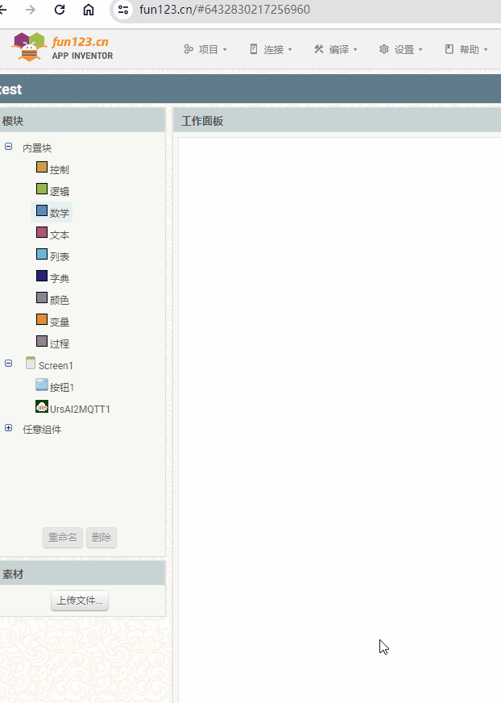
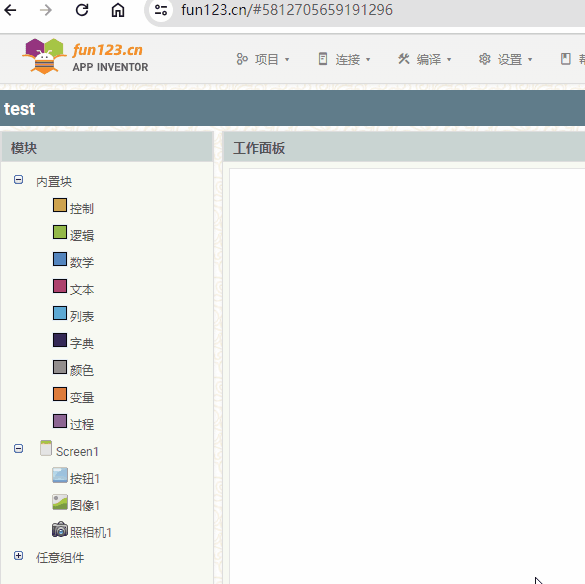

[&laquo; 返回首页](index.html)

App Inventor 2 引入了一项新功能，允许某些块扩展、收缩甚至更改其功能。

顶部具有蓝色框白色齿轮的代码块都是可拓展块。

## 块扩展用法

块扩展可以改变形状，通过单击蓝色图标，用户可以将较小的块拖到较大的块中，从而改变原始块的形状和功能。
再次单击该图标将最小化拓展窗口，并显示修改后的块。

下面的示例演示了 最大值 块扩展。使用“数学”中的“最大值”积木，点击拓展按钮拖动参数至3个，详细步骤如下：

 

**块扩展用法示例**

用户想要找到包含 3 个值的列表中的最小值，默认只有 2 个空间可以连接到值代码块。

要解决此问题，用户单击块上的蓝色齿轮图标并将另一个项目拖到上面，之后就可连接 3 个值代码块，详细步骤如下：

 

**有哪些块扩展？**

* [如果](../blocks/controls.html#if)
* [与](../blocks/logic.html#and)
* [或](../blocks/logic.html#or)
* [+](../blocks/math.html#add)
* [*](../blocks/math.html#multiply)
* [最小值](../blocks/math.html#min)
* [最大值](../blocks/math.html#max)
* [合并字符串](../blocks/text.html#join)
* [创建列表](../blocks/lists.html#makealist)
* [追加列表项](../blocks/lists.html#additems)
* [创建字典](../blocks/dictionaries.html#make-a-dictionary)
* [初始化局部变量（无返回值）](../blocks/variables.html#do)
* [初始化局部变量（有返回值）](../blocks/variables.html#return)
* [定义无返回值过程](../blocks/procedures.html#do)
* [定义返回值过程](../blocks/procedures.html#return)
