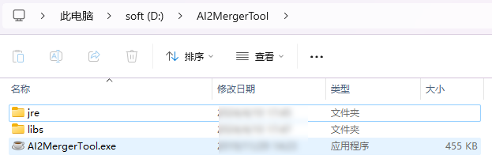
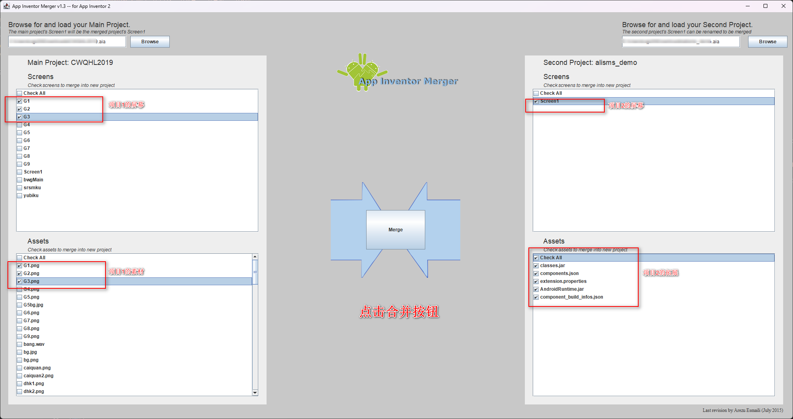
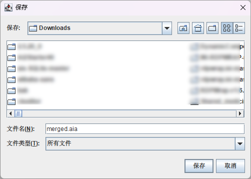
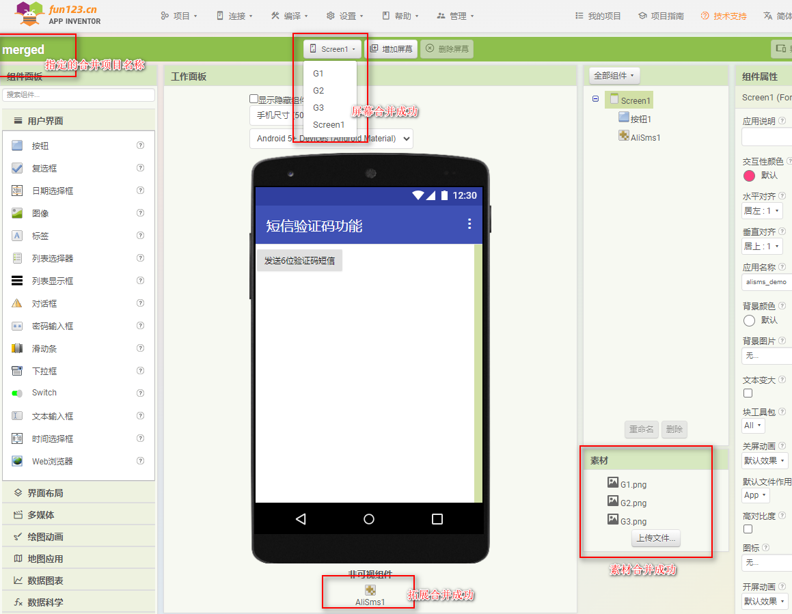

* TOC
{:toc}

[&laquo; 返回首页](index.html)

## AI2合并工具

java写的GUI版本，有基础的同学或linux系统下可以执行  java -jar libs/xxx.jar 运行。

这里直接做好了**免安装jdk、一键启动**的Windows版，直接点击 `AI2MergerTool.exe` 即可运行。

## 开始合并

合并工具启动，选择需要合并的2个.aia项目文件：

选择需要合并的**屏幕、资源、拓展**等。

注意：两边如果同时选中Screen1，会提醒将右边的屏幕改名后合并到最终的项目。

合并完成，保存 merged.aia 文件到本地。

## 合并完成验证

上面合并后的 merged.aia 导入到App Inventor 2 中：

合并后的项目如图，我们指定的项目均已经合并成功。

## 绿色版下载

[微云下载](https://share.weiyun.com/oUyvnURV){:.vip}
