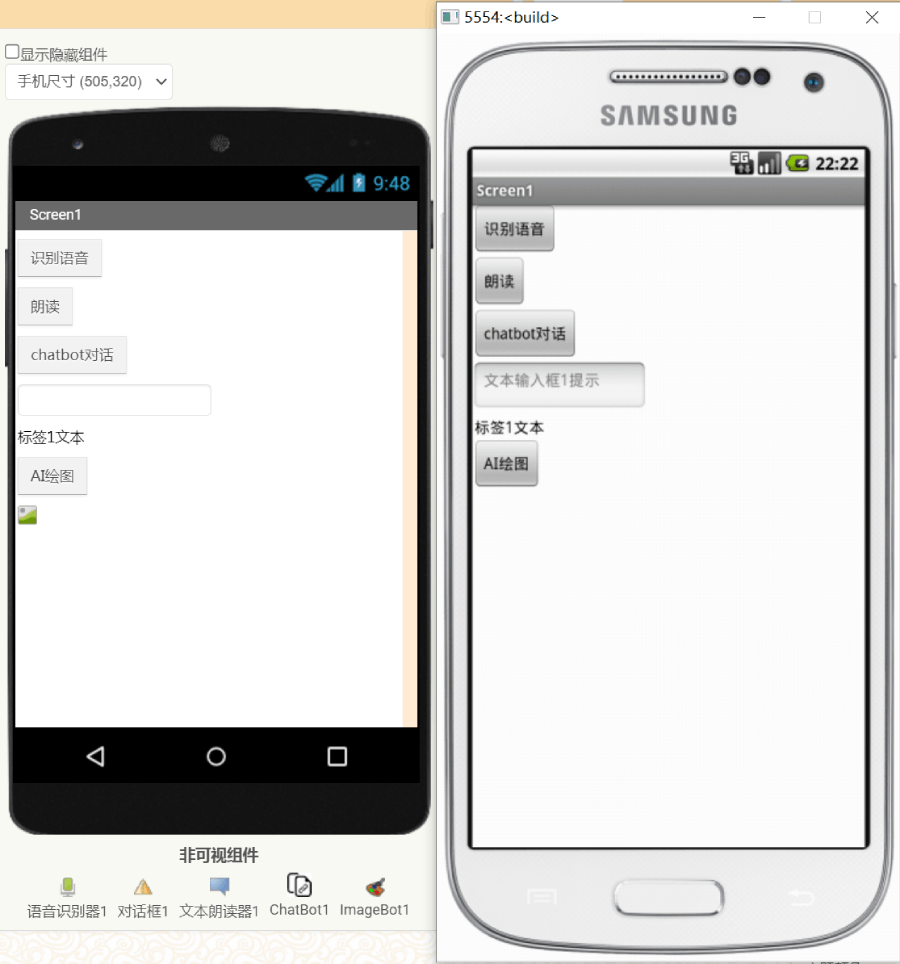
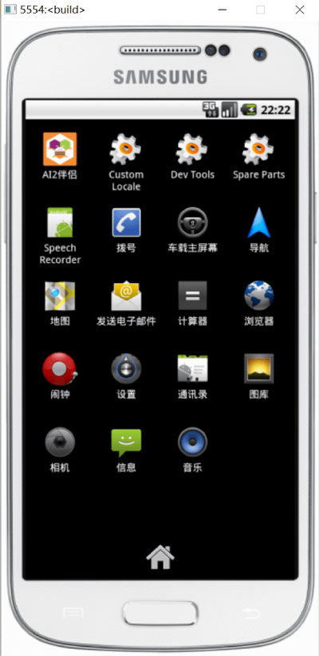

[&laquo; 返回首页](index.html)

## Ai2 Starter模拟器下载
<!--https://ai2-starter.software.informer.com/download/-->
<!--https://share.weiyun.com/MYlivorr-->

Ai2 Starter可极速下载的版本如下：

|   版本    | 文件 | 极速下载地址	  | 特点  |
|---------|---------|---------|
|  Ai2 Starter v4.6 英文原版（AI伴侣v2.46版本）	| .exe  96MB .zip  115MB  |   [安装版下载](https://nchc.dl.sourceforge.net/project/ai2u/ai2u%204.6/Installer/AI2%20Starter%204.6.exe) [绿色版下载](https://sourceforge.net/projects/ai2u/files/ai2u%204.6/Portable/AI2Starter46.zip/download)	 | 原版绿色版更佳。不过内置的AI伴侣版本较老，可能不兼容。 **仅作参考！** |
|    中文绿色最新版（AI伴侣已升级至v2.69）     | .zip 116MB |    [微云下载](https://share.weiyun.com/MYlivorr)      |   以上绿色版基础上，升级了内置**AI伴侣版本至中文最新版v2.69**。 如果之前电脑安装或使用过旧版本，请先点“Hard Reset”后再启动！ **性能优化提升，对电脑要求非常低，虚拟机也可正常使用**，用户体验很不错！ 此方式通信模式是纯本地的，全程**自动交互启动及运行**， &nbsp;&nbsp;经测试即使通信服务器故障也能正常测试。      |

## Ai2 Starter使用步骤

### 连接模拟器

### 连接中

### 参考测试结果

### 内置中文最新版AI2伴侣

## Ai2 Starter模拟器连接一直失败？

在aiStarter正常启动的情况下，“连接” -> “模拟器” 一直失败？如下图：

### 解决方法：

#### 1、确保aiStarter助手正常启动，如下：

#### 2、确定aiStarter助手正常启动的情况下，还是失败，请尝试：

在上面aiStarter助手启动界面，按提示点键盘 **Ctrl + C 停止程序，然后再启动一次**，这时往往就好了，大概率是aiStarter助手的bug。

#### 3、实在还是失败，可能是浏览器禁止跨域造成的，尝试关闭浏览器相关设置，如下：

在搜索栏搜索  Block insecure private network requests   并设置为 Disabled，重新打开浏览器就好了。

#### 4、放弃使用ai2Starter，使用商业模拟器，具体参考：[《App Inventor 2 连接方式：AI伴侣、模拟器、USB》](connect.html)。
