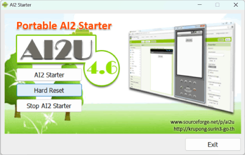
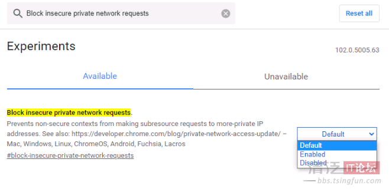

[&laquo; 返回首页](index.html)

## Ai2 Starter模拟器下载
<!--https://ai2-starter.software.informer.com/download/-->
<!--https://share.weiyun.com/od7jYBN1-->

Ai2 Starter目前的最新版本为v4.6，内含AI伴侣版本为v2.46，提供安装版、绿色免安装版、绿色免安装升级版（升级最新版AI伴侣），如下：

|   版本    | 文件 | 极速下载地址	  | 特点  |
|---------|---------|---------|
|  Ai2 Starter v4.6 安装版（AI伴侣v2.46版本）	| .exe 96MB  |   [点此下载](https://nchc.dl.sourceforge.net/project/ai2u/ai2u%204.6/Installer/AI2%20Starter%204.6.exe){:.vip}	 | Windows安装包，安装后启动菜单有快捷方式。 |
|    绿色免安装版（AI伴侣v2.46版本）     | .zip 106MB |    [点此下载](https://sourceforge.net/projects/ai2u/files/ai2u%204.6/Portable/AI2Starter46.zip/download){:.vip}      |   绿色免安装版，解压后即可使用。 相比安装版多了一个管理界面，用于模拟器的启动管理。 AI伴侣需自行升级。      |
|    绿色免安装**升级版**（升级v2.69版AI伴侣）  | .zip 115MB  |  付费下载 联系客服 | 以上绿色版基础上，升级了内置**AI伴侣版本至最新版（已购用户可持续升级）**。 如果之前电脑安装或使用过旧版本，请先点“Hard Reset”后再启动！ 此版本需付费下载，非会员￥19.9，会员优惠价￥9.9。 |

## Ai2 Starter模拟器连接一直失败？

在aiStarter正常启动的情况下，“连接” -> “模拟器” 一直失败？如下图：

### 解决方法：

#### 1、确保aiStarter助手正常启动，如下：

#### 2、确定aiStarter助手正常启动的情况下，还是失败，请尝试：

在上面aiStarter助手启动界面，按提示点键盘 **Ctrl + C 停止程序，然后再启动一次**，这时往往就好了，大概率是aiStarter助手的bug。

#### 3、实在还是失败，可能是浏览器禁止跨域造成的，尝试关闭浏览器相关设置，如下：

在搜索栏搜索  Block insecure private network requests   并设置为 Disabled，重新打开浏览器就好了。

#### 4、放弃使用ai2Starter，使用商业模拟器，具体参考：[《App Inventor 2 连接方式：AI伴侣、模拟器、USB》](connect.html)。
