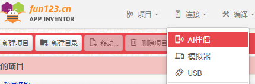

[&laquo; 返回首页](index.html)

## App Inventor 2 连接测试App

从功能上来说大致分为3类，在连接菜单下：

但是每种类型下面仍有一些不同的选择，下面开始介绍各种连接方式的特点：

|   连接方式      | 测试介质	  | 特点  |
|---------|---------|---------|
|  <i class="mdi mdi-cellphone-wireless"></i>  **AI伴侣**	     |   Android手机	 | `特别适合小朋友，简单高效，所见即所得，还能编译成apk真机测试`。 前提是必须有一部安卓手机，并安装好AI伴侣app |
|         |    幕享App      |    将安卓手机投屏到电脑上，即实际利用手机进行测试，前提也是必须得有一部安卓手机。 好处是真机测试，可以一屏展示，适合教学演示。      |
|         |    商业Android模拟器（Mumu，雷电、逍遥） | 适合有一定的动手能力，没有安卓手机的或手机不在身边，使用起来体验也很好，**推荐这种**。 特别适合教学演示，一屏展示效果，而无需电脑手机联合展示。 **缺点**：商业模拟器多少都有一些广告app，还不能删除。|
|         |    桌面版AI伴侣	 | 也是搭建一个安卓模拟器，安装AI伴侣。对电脑显卡要求高，一般电脑用不了。 即便电脑显卡支持，但是本身及AI伴侣版本都很旧，维护者几乎不更新了，`这种方式直接放弃就好了`。 |
|  <i class="mdi mdi-cellphone-link"></i>  **模拟器**	      |    aiStarter 启动默认模拟器	      |    利用aiStarter自动启动无广告的默认模拟器。 不过缺点也很明显：各种速度慢，安卓版本旧，基本可以不考虑。      |
|   <i class="mdi mdi-usb-flash-drive-outline"></i>  **USB**    |     aiStarter 启动USB调试	     |    也是利用aiStarter启动USB调试，通过USB连接你的手机，自动启动你手机上的AI伴侣app进行测试。 相当于用你手机扫了一次二维码，只是这里变成USB自动帮你做了这件事。 和第一种方式本质上是一样的，流程变复杂了些，需要一定动手能力。 好处是可以利用手机助手，将手机投屏到电脑上，用于一屏展示效果（倒不如直接第二种方式）。      |

**综上所述：**

1、小朋友编程的话，直接第一种，使用安卓手机扫二维码测试就行了。

2、对于没有安卓手机的或需要一屏展示效果的，直接第二种使用商业模拟器。

***
## 视频演示

**完整版**

[《App Inventor 2 连接：AI伴侣 + 模拟器 + USB（完整版）》](https://www.bilibili.com/video/BV1Gs4y1u7D5)

**分集介绍**

[《App Inventor 2 连接：AI伴侣（最推荐的测试方式）》](https://www.bilibili.com/video/BV1Ec411A7W2)

[《App Inventor 2 连接：AI伴侣（安卓模拟器，手机测试的替代方案）》](https://www.bilibili.com/video/BV1Yd4y1Z7NS)

[《App Inventor 2 连接：AI伴侣（桌面版AI伴侣，版本过旧不推荐）》](https://www.bilibili.com/video/BV1cM4y1B7hw)

[《App Inventor 2 连接：模拟器（Ai2 Starter启动手机模拟器）》](https://www.bilibili.com/video/BV1YP411974j)

[《App Inventor 2 连接：USB（Ai2 Starter启动手机USB调试）》](https://www.bilibili.com/video/BV1iz4y1b7ky)

