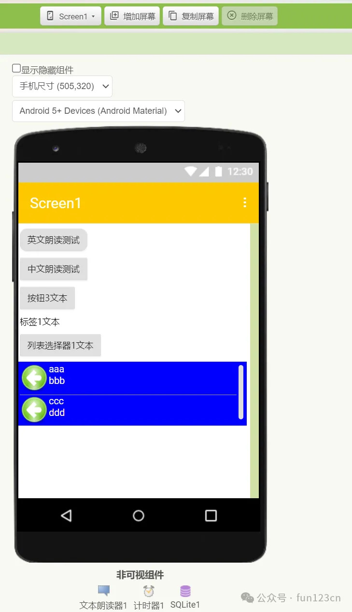
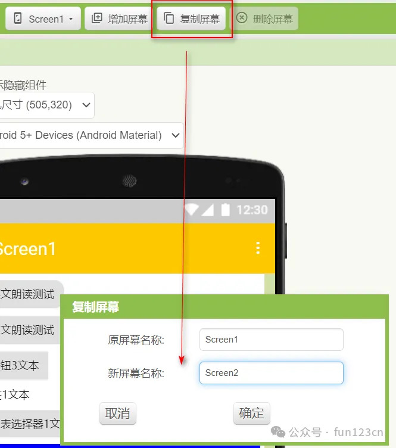
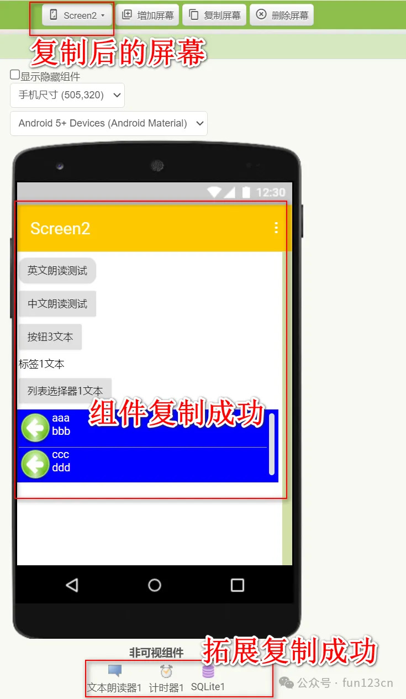
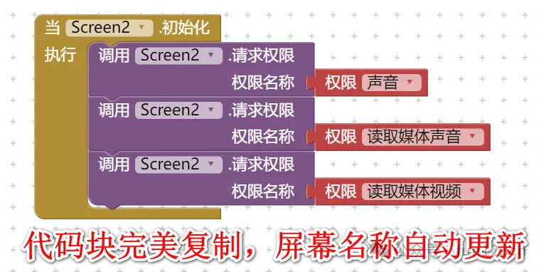

* TOC
{:toc}

[&laquo; 返回首页](index.html)

“复制屏幕”功能全新上线，中文网独有（MIT没有此功能），可以复制屏幕中的普通组件、图片、附件、拓展、代码块。更多升级详情可查看[发布日志](https://www.fun123.cn/reference/info/ReleaseNotes.html?f=copyscreen)。

下面演示一下屏幕的复制效果：

### 1、Screen1屏幕上有若干组件、及一个SQLite拓展：

### 2、点击工具栏上的“复制屏幕”按钮，输入新屏幕名称：

### 3、复制后的Screen2：

### 4、代码块也一并成功复制，且代码块中的屏幕名自动更新为Screen2：

