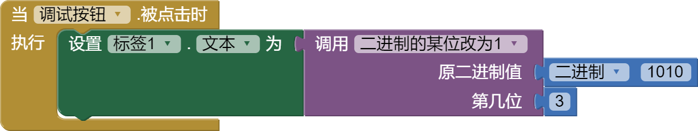
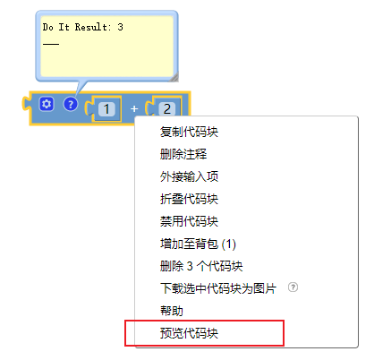

[&laquo; 返回首页](index.html)

# App Inventor 2 调试方式

所有调试App的前提是安装好AI伴侣，并与AI伴侣连接后进行，我们在设计界面的每次改动，都会实时的反映在AI伴侣中。

AI伴侣可以运行在手机上，也可以是安卓模拟器。

AI伴侣具体的安装及连接步骤请参考[《App Inventor 2 连接测试App》](./connect.html?f=debug)。

## “标签”调试法

即输出结果到标签查看变量内容。

这个是最普遍、最常用的调试问题的方式，通过将需要查看的变量输出到屏幕上的”标签“.文本中，便可以方便查看变量的内容，以便程序作出相应的调整。

## ”预览代码块“调试功能

这种方式比较冷门，可能大部分人不太了解，不过它有时比上面标签调试方法更为便捷，直接可以随时输出变量或函数的执行内容：

不过这种方式必须注意以下几点：

1、**必须在与AI伴侣连接成功**后，才可以进行调试。没有连接或连接断开时，”预览代码块“是灰色的，无法执行。

2、可以预览一段代码的运行结果，也可以预览[过程](../blocks/procedures.html)代码块的运行。

3、如果想知道当前某个（全局）变量的值，可以在变量块上右键，预览代码块，就可以在代码块的注释中看到结果了。

  **注意**：只能预览全局变量，不能预览局部变量。如果想知道局部变量的值，只能采用第一种标签调试法。
