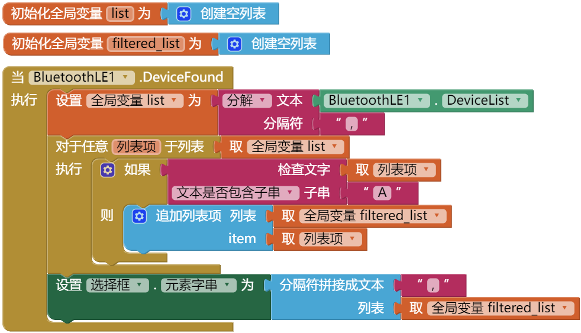

[&laquo; 返回首页](index.html)

## 使用[蓝牙客户端](../components/connectivity.html#BluetoothClient)时：

它返回的设备地址列表就是一个列表对象，直接遍历，然后收集符合我们过滤条件的地址，放入新的列表，最后显示新列表，参考代码如下：

## 使用[BluetoothLE](../extensions/)拓展时：

它返回的不是列表对象，而是CSV格式的一个字符串（多个设备地址以英文逗号分隔）。

可用考虑先转换成列表对象，然后按照和上面一样的处理方式收集出新的列表，最后再使用英文逗号拼接出CSV格式字符串，设置给`选择框`显示设备列表，参考代码如下：

当然如果有其他类型的设备列表需要过滤，大致思路也是一致的。
