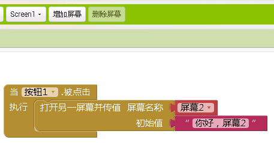

* TOC
{:toc}

[&laquo; 返回首页](index.html)

App Inventor 2 在不同的屏幕之间传值属于很常见的需求，这里提供各种不同的实现思路，供大家参考。

## 通过原生控制块“打开屏幕并传值”

需要用到“打开屏幕并传递初始值”控制块，如下：

屏幕1代码如下：

屏幕2的代码如下：

在屏幕2初始化的时候获取屏幕1传过来的值，代码如下：

## 列表传值

如果有两个变量，该如何操作？这里提供两种思路：

1、多个变量可以用逗号拼在一起当成一个文本传递过去后，然后使用文本里的函数分割开就是多个变量了。

2、使用列表变量传递（列表中可以放多个变量），屏幕2获取的初始值也是一个列表，如下：

## 微数据库传值

当然我们还可以利用[“微数据库”](../components/storage.html#TinyDB)的特性来进行传值，即微数据库在同一个App间共享数据，可在不同屏幕间共享数据（传递数据），不同屏幕**各自的微数据库对象**存储和获取的数据其实是同一份数据。

## 剪贴板传值

通过手机剪贴板也可实现不同屏幕之间的数据共享，具体用法参考 [Clipboard 剪贴板拓展](../extensions/clipboard.html)。
