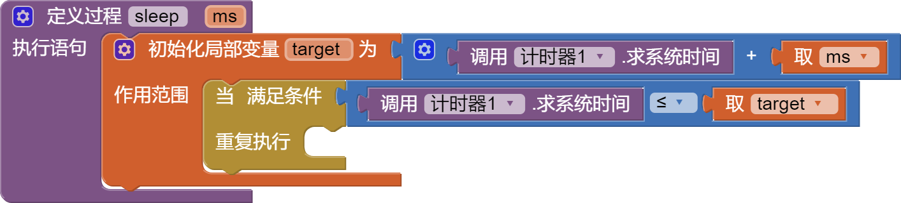

* TOC
{:toc}

[&laquo; 返回首页](index.html)

## App Inventor 2 模拟sleep函数

App Inventor 2 原生没有 sleep 及相关函数，需要模拟实现，经过测试这里给出一个既简单又相对高效率的实现方案：

### 需要用到计时器组件：

### 实现代码如下：

### 测试方法如下：

经过测试，该方法有效，能正常 sleep 指定的毫秒数，但是它是阻塞式的，也就是说等待的过程中其他界面操作均无法进行，不过好在CPU消耗并不高，也算是一种不错的实现方式。

### 代码快速导入技巧

另外，如何将上面的代码快速导入我们的项目中，是有技巧的，无需自已动手一个个拖动哈，请看[这里](../other/download-pngs.html)。
