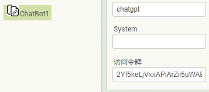

* TOC
{:toc}

[&laquo; 返回首页](index.html)

* [基础数字块 ( 0 )](#number)
* [进制数字块 ( 0 )](#number-radix)
* [等于 ( = )](#eq)
* [不等于 ( ≠ )](#ne)
* [大于 ( > )](#gt)
* [大于等于 ( ≥ )](#gte)
* [小于 ( < )](#lt)
* [小于等于 ( ≤ )](#lte)
* [加 ( + )](#add)
* [减 ( - )](#subtract)
* [乘 ( * )](#multiply)
* [除 ( / )](#divide)

***
### 基础数字块 ( 0 )   {#number}

可用作任何正数或负数，单击该块中的“0”将允许更改数字。

该块支持普通的 10 进制（例如：2、12 和 2.12），以及带前缀的其他机制数字，包括：
* Base-2（`二进制`）数字，例如 `0b`10（等于十进制 2）
* Base-8（`八进制`）数字，例如 `0o`14（等于十进制 12）
* Base-16（`十六进制`）数字，例如 `0x`d4（等于十进制 212）

***
### 进制数字块 ( 0 ) {#number-radix}

默认表示 10 进制的数字，单击“0”将允许更改数字。点击下拉菜单可以切换 `二进制`、`八进制`、`十进制`、`十六进制` 数字。

例如，这三个块是等效的：

下拉列表支持：十进制 (base-10)、二进制 (base-2)、八进制 (base-8) 和十六进制 (base-16) 输入格式。

十进制模式允许输入任何正数或负数（例如 2、-12、2.12）。其他模式仅允许您输入整数（也称为任何正数或零）。

***
### 等于 ( = )   {#eq}

测试两个数字是否相等并返回 `真` 或 `假`。

***
### 不等于 ( ≠ )   {#ne}

测试两个数字是否不相等并返回 `真` 或 `假`。

***
### 大于 ( > )   {#gt}

测试第一个数字是否大于第二个数字并返回 `真` 或 `假`。

***
### 大于等于 ( ≥ )   {#gte}

测试第一个数字是否大于或等于第二个数字并返回 `真` 或 `假`。

***
### 小于 ( < )   {#lt}

测试第一个数字是否小于第二个数字并返回 `真` 或 `假`。

***
### 小于等于 ( ≤ )   {#lte}

测试第一个数字是否小于或等于第二个数字并返回 `真` 或 `假`。

***
### 加 ( + )   {#add}

返回将任意数量的具有数字值的块相加的结果。带有数字值的块包括基本数字块、列表或文本的长度、带有数字值的变量等。

该块是一个[块拓展](../concepts/mutators.html)，可以扩展以允许更多数字相加。

# 访问MIT code服务器

网址：`code.appinventor.mit.edu`，正常情况下访问非常非常的慢，甚至大概率访问不了，有条件使用DL的话请使用DL。VIP会员可联系客服免费获取！

# 新建一个项目，拖

aaa

## 测试

从

### 测试2

选中组件，在右侧的属性栏中查看“访问令牌” 或 “Token”属性，拷贝到中文网相应组件的“访问令牌” 或 “Token” 属性中，回车，保存项目即可。

例如：

# 1111

adfasdf
asdfa
sdf
as

adf

asdf
asdf

asdf

asdf

asdf

asdf

asdf

asdf

asd
f
a
sdf
as
df

as
d

## 222

dfdf

df

d
f

df

# 123

### 3333

df
dsafa
sdaf

df

fd
fd

df
d
f
d
fd

#### 4444

df
d
f
df
df
df

