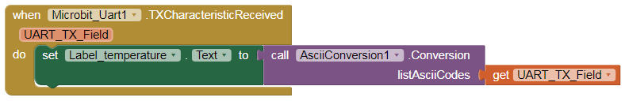

* TOC
{:toc}

[&laquo; 返回首页](index.html)

## AsciiConversion [*拓展*](https://community.appinventor.mit.edu/t/ascii-conversion-extension/80973)  {#AsciiConversion}

* .aix 拓展下载：

{:.vip}
[AsciiConversion.aix](AsciiConversion/AsciiConversion.aix)

* demo程序下载：

{:.vip}
[test_AsciiConversion.aia](AsciiConversion/test_AsciiConversion.aia)

**此扩展允许用户将 Ascii 代码(列表)转换为相应的文本，也可以将指定的字符转换为相应的 Ascii 代码。**

此扩展提供 3个 函数：

***
### **AsciiCode**: 给出字符，返回它相应的 Ascii码。

用法示例：返回字符“A”的Ascii码，结果将是：65。

***
### **GiveCharacter**: 给出 Ascii码，返回它相应的字符。

用法示例：返回Ascii码 48 的字符，结果将是字符：“0”。

***
### **Conversion**: 给出 Ascii码列表，转换后返回相应的文本。

当您使用UART蓝牙接收数据时，此功能非常有用，因为UART接收到的数据是包含Ascii码的列表，必须将其转换为相应的文本。

用法示例1：

该块将在标签1 中写入文本：“A03”，这是 Ascii 码表列表 [65,48,51] 转换后得到的文本。

用法示例2：: with Bluetooth UART

UART_TX_Field：是包含接收到的字符的 Ascii 代码的列表。

如果 UART_TX_Field 是以下列表： [51,48] ，则最后一个块将在 label_Temperature 中写入文本：“30”。详见：[test_AsciiConversion.aia](AsciiConversion/test_AsciiConversion.aia)

***
附：Ascii表一览

