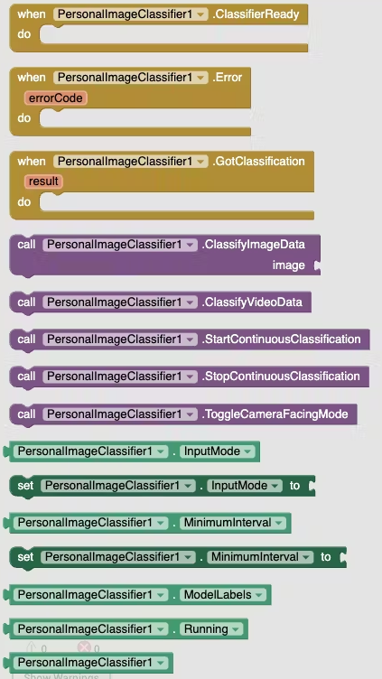
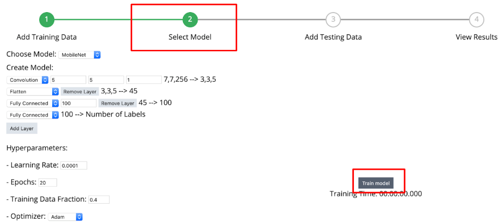
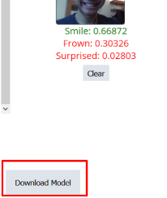

* TOC
{:toc}

[&laquo; 返回首页](index.html)

## PersonalImageClassifier (PIC) 拓展  {#PersonalImageClassifier}
<!--(https://mit-cml.github.io/extensions/)-->

* .aix 拓展下载：

{:.vip}
[PersonalImageClassifier.aix](PersonalImageClassifier/PersonalImageClassifier.aix)

* demo程序下载：

{:.vip}
[Image_Classification_v2.aia](PersonalImageClassifier/Image_Classification_v2.aia)

拓展的事件、方法、属性如下：

<!--(https://github.com/Mjrovai/APP_Inventor-ML_Projects)-->

## 图像分类App原理介绍

这里仅仅介绍一下AI图像分类App的实现原理，AI的基础技术细节不在本文讨论范围。

我们都知道，人工智能AI的基本原理是事先准备好样本数据（这里指的是图片）及数据的标注信息（如图片中的人物是高兴、愤怒、哭泣等图片的判定信息），通过AI算法的训练，对输入的样本及标注进行拟合，形成最终的训练集数据。有了这份训练集数据，当下次我们输入一张新的图像时，AI算法根据训练集数据就能判断出图片中的人物的具体表情，这样就能对图片进行初步的分类。当然，判断的准确率和样本数量是有关系的，也和数据标注的准确性有关，还和具体的AI算法有关。

## 开发步骤

### 在线训练AI模型，生成模型数据，下载给PIC拓展使用

在线AI模型训练网站（国内访问正常）：[https://classifier.appinventor.mit.edu/oldpic/](https://classifier.appinventor.mit.edu/oldpic/)

在线训练详细步骤（英文版）：[https://appinventor.mit.edu/explore/resources/ai/personal-image-classifier-part1](https://appinventor.mit.edu/explore/resources/ai/personal-image-classifier-part1)

这里仅截取部分训练步骤：

最后可以在线对新输入的图片进行AI识别，如：微笑表情：

最后，可以下载训练好的模型数据。

### App Inventor 2 使用拓展及AI模型数据，对图像进行识别和分类

PersonalImageClassifier (PIC) 拓展的用法请参考demo，或直接看英文文档自行研究，这里暂时不做展开，文档如下：

[https://www.hackster.io/mjrobot/app-inventor-edgeml-image-classification-fruits-vs-veggies-b671da](https://www.hackster.io/mjrobot/app-inventor-edgeml-image-classification-fruits-vs-veggies-b671da)

