* TOC
{:toc}

[&laquo; 返回首页](../index.html)

## Encrypt.Security 安全性扩展

这是关于App Inventor和Thunkable安全性的扩展，它提供MD5哈希，SHA1和SHA256哈希，AES加密/解密，RSA加密/解密，BASE64编码/解码方法。

## 权限

此扩展程序不需要任何权限。

## 事件

### OnErrorOccured

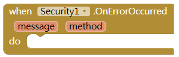

抛出任何异常时将触发此事件。此事件中有两个变量：method和message。变量“method”是发生错误的方法的名称。变量“message”是例外的消息。

### OnRsaKeyPairGenrated

当RSA密钥对成功生成时，将触发此事件。如果密钥对生成失败，则将触发“OnErrorOccured”事件而不是此事件。有两个变量，即RSA私钥和RSA公钥。

## 方法

### BASE64Encode

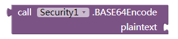

此方法用于BASE64编码一个字符串。输入 plaintext

### BASE64Decode

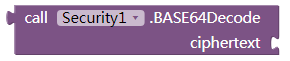

此方法用于BASE64解码字符串。输入 ciphertext

### GenerateRsaKeyPair

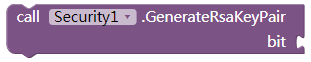

此方法用于生成一对RSA加密/解密密钥（including a private key and a public key），输入密钥的大小，其单位为bit.it可以是512,1024,2048或4096.密钥越长，它就越安全。当已生成密钥对，该事件OnRsaKeyPairGenerated将触发和传递两个variable.At同时，属性RsaPublicKey和RsaPrivateKey将被自动设置。

### GenerateAesKey

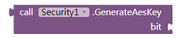

此方法用于生成AES加密/解密的密钥。输入密钥的大小，其单位为bit，可以是128,192或256.密钥越长，它就越安全。它将返回一个字符串值。这是键值的BASE64编码结果。属性AesKey将自动设置。

### AesEncrypt

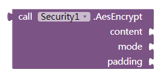

AES加密后使用属性AesKey和IV.Input内容，模式和填充返回结果。

* content：要加密的明文
* 填充：AES加密填充，也可以是PKCS5Padding，PKCS7Padding，ISO10126或ANSIX923
* 模式：AES加密方式，也可以是ECB，CBC，CTR，OFB或CFB
* IV：AES加密IV，它必须是字符串值，并且其长度必须是16个字符，如果选择ECB加密模式，则不需要此值，否则必须设置此属性。

### AesDecrypt

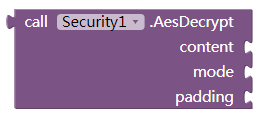

AES解密后使用属性AesKey和IV.Input内容，模式和填充返回结果。

* content：要加密的明文
* 填充：AES加密填充，也可以是PKCS5Padding，PKCS7Padding，ISO10126或ANSIX923
* 模式：AES加密方式，也可以是ECB，CBC，CTR，OFB或CFB
* IV：AES加密IV，它必须是字符串值，并且其长度必须是16个字符，如果选择ECB加密模式，则不需要此值，否则必须设置此属性。

### RsaEncrypt

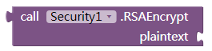

返回使用属性的RSA加密结果RsaPublicKey。输入明文用加密的公钥。

### RsaDecrypt

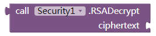

使用属性返回RSA解密结果。RsaPrivateKey输入密文以使用私钥加密。

### MD5Hash

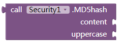

MD5哈希一个字符串值（content），输入内容和大写（true或false[布尔值]），这意味着结果是大写或不是。返回一个包含32个字符（大写或小写）的搅拌器。

### SHA256

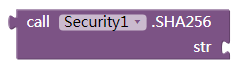

SHA256散列一个字符串。输入一个字符串，它也将返回一个字符串。

### SHA1

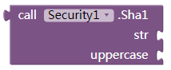

SHA1散列一个字符串。输入一个字符串，一个布尔值是否为大写。

## 属性

可以在Designer视图和Blocks视图中设置所有属性。

### AesKey

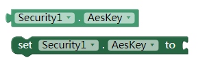

您可以为AES加密/解密方法设置此属性。将在生成AES密钥时自动设置（该方法GenerateAesKey成功调用）。

### RsaPrivateKey

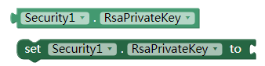

您可以为RSA decrypt方法设置此属性。当生成RSA密钥对时，它将自动设置。

### RsaPublicKey

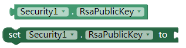

RSA加密方法的属性。当生成RSA密钥对时，它将自动设置。

### IV

AES加密/解密方法的属性。它必须是包含32个字符的字符串。

## .aix 拓展下载：

{:.vip}
[cn.peterzhong.Encrypt.Security.aix](cn.peterzhong.Encrypt.Security.aix)

版权申明：版权归原作者，原网址已失效，本站系归档整理，侵删。
