* TOC
{:toc}

[&laquo; 返回首页](index.html)

##   TaifunImage 拓展  {#TaifunImage}
<!--(https://puravidaapps.com/image.php)-->

* .aix 拓展下载：

{:.vip}
[com.puravidaapps.TaifunImage.aix](TaifunImage/com.puravidaapps.TaifunImage.aix)

* demo程序下载：

{:.vip}

    <a class="ext" href="https://downloads.sourceforge.net/project/puravidaapps/Resize.aia" target="_blank">Download Resize test project (aia file)</a> 
    <a class="ext" href="https://downloads.sourceforge.net/project/puravidaapps/chunks.aia" target="_blank">Download Create Chunks test project (aia file)</a> 
    <a class="ext" href="https://downloads.sourceforge.net/project/puravidaapps/crop.aia" target="_blank">Download Crop test project (aia file)</a> 
    <a class="ext" href="https://downloads.sourceforge.net/project/puravidaapps/rotate.aia" target="_blank">Download Rotate test project (aia file)</a> 
    <a class="ext" href="https://downloads.sourceforge.net/project/puravidaapps/overlay.aia" target="_blank">Download Scale &amp; Overlay test project (aia file)</a> 

* [*案例分享1：*图片压缩](#image-compress)

***

用于基本图像处理的图像扩展。

所需权限：`android.permission.READ_EXTERNAL_STORAGE`、`android.permission.WRITE_EXTERNAL_STORAGE`

### 属性  {#TaifunImage-Properties}

{:.properties}

 
    返回是否隐藏警告。

 
    设置是否隐藏警告。

### 方法  {#TaifunImage-Methods}

{:.methods}

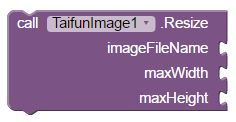 
Resize a jpg image file in the ASD - application specific directory. 
<b>Thank you Tanja</b> for being the sponsor of this block!

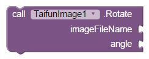 
Rotate a jpg image file  in the ASD - application specific directory by 0, 90, 180 or 270 degrees in clockwise direction. 
<b>Thank you <a class="ext" href="http://www.teen-code.com/" target="_blank">teen-code.com</a></b> for your generous donation!

 
Crop Image. Enter the distance in pixel for left, top, right and bottom. 
<b>Thank you Husain</b> for being the sponsor of this block!

 
Create chunks of a jpg image file in the ASD - application specific directory. 

    
For example rows=4 and columns=3 will create 12 chunks of the original image, see screenshot  

    The chunks will also be stored in the ASD - application specific directory.
    The following name convention will be used: imageFileName_rowNumber_columnNumber.jpg.  
    

 <!-- end: 8 columns -->

     

 <!-- end: 4 columns -->

 <!-- end: row -->

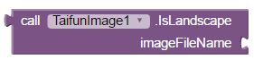 
Return true if image in the ASD - application specific directory is in landscape format, else return false.

 
Scale a jpg image file in the ASD - application specific directory. 
The parameter scalingLogic expects the value FIT or CROP.
CROP keeps the aspect ratio, resulting either in the width or the height of the source image being cropped. 
<b>Thank you Andreas</b> for the <a class="ext" href="https://developer.sonymobile.com/2011/06/27/how-to-scale-images-for-your-android-application/" target="_blank">scaling tutorial and the image scaling code sample project</a>.

 
Overlay images in the ASD - application specific directory. 
The second image should be an image in png format with transparency to get the overlay effect. 
<b>Thank you Christian</b> for being the sponsor of this block!  

<b>Note:</b> Both images must be available in the ASD - application specific directory.

### 事件  {#TaifunImage-Events}

{:.events}

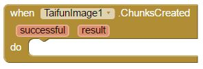 
Event indicating that chunks have been created. A list of filenames will be provided as result.

 
Event indicating that image has been rotated. 
Parameter successful is indicating true (successful) or false. Parameter result provides error message in case of error or filename in case of success.

 
Event indicating that image has been scaled. 
Parameter successful is indicating true (successful) or false. Parameter result provides error message in case of error or filename in case of success.

<h3>Example Use: Resize</h3>

    
<b>before resize</b>  

 <!-- end: 4 columns -->

    
<b>after resize</b>  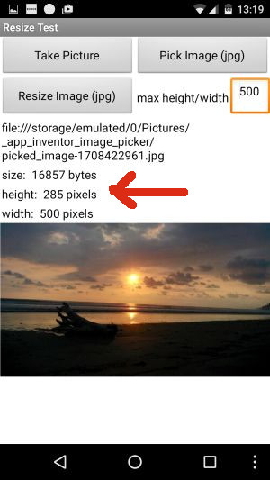

 <!-- end: 4 columns -->

 <!-- end: 4 columns -->

 <!-- end: row -->

Note: the larger image (on the left) looks like it is smaller compared to the shrinked image (on the right).
I currently do not know why this happens, actually the same size in the image component should be displayed...  

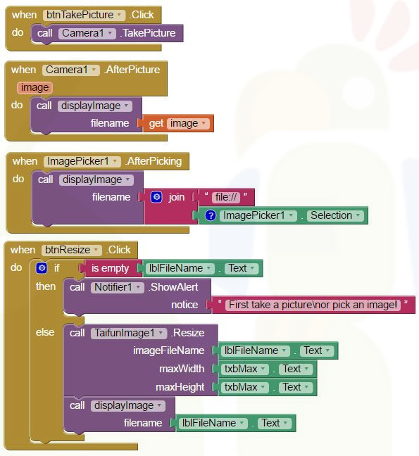 
Some more blocks to get the current image size, width and height using the <a class="info" href="https://puravidaapps.com/metadata.php" target="_top">Image Metadata Extension</a> 
 
 

<h3>Example Use: Create Chunks</h3>

    

    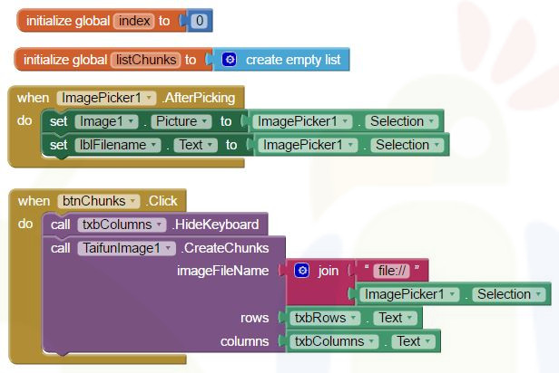 
     
    

 <!-- end: 8 columns -->

    
displaying chunk # 5 out of 12 chunks created (4 rows and 3 columns)
    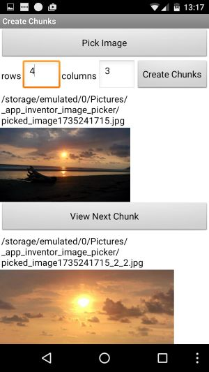
    

 <!-- end: 4 columns -->

 <!-- end: row -->

 

<h3>Example Use: Crop</h3>

    

 <!-- end: 4 columns -->

    
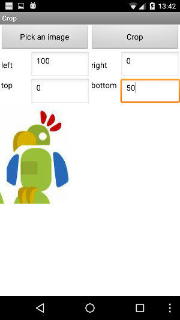

 <!-- end: 4 columns -->

 <!-- end: 4 columns -->

 <!-- end: row -->

 

<h3>Example Use: Rotate</h3>

    
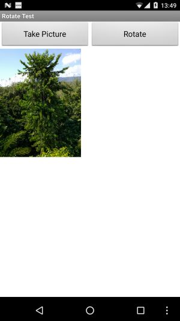

 <!-- end: 4 columns -->

    
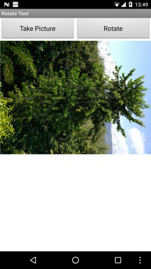

 <!-- end: 4 columns -->

    

 <!-- end: 4 columns -->

 <!-- end: row -->

 

<h3>Example Use: Scale and Overlay</h3>

    
An example overlay image in png format, here size 1200x1800 (portrait), transparent background. 
    

 <!-- end: 4 columns -->

    
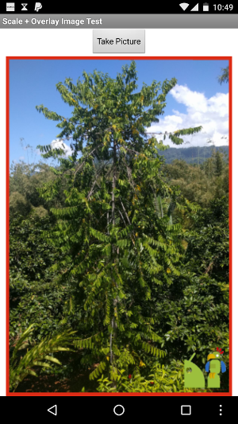

 <!-- end: 4 columns -->

    

 <!-- end: 4 columns -->

 <!-- end: row -->

Scale an image exactly to the size you need and at the same time crop the image to keep the aspect ratio, then add an overlay image (could be for example a watermark or similar). 
 

***
### 图片分辨率压缩   {#image-compress}

参考代码如下：

{:.vip}

