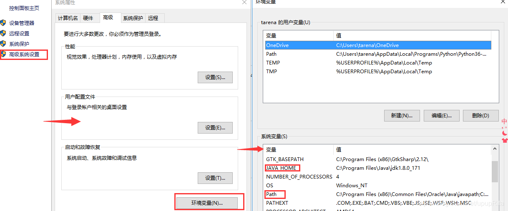
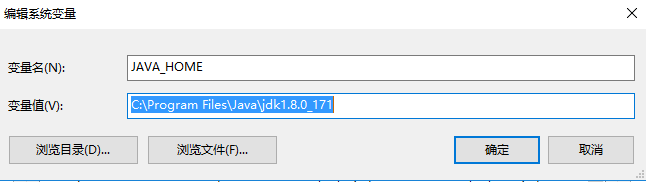
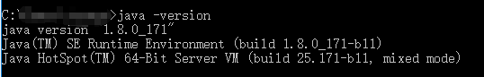
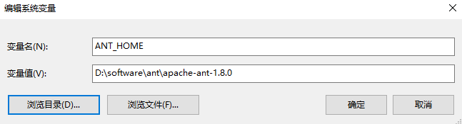
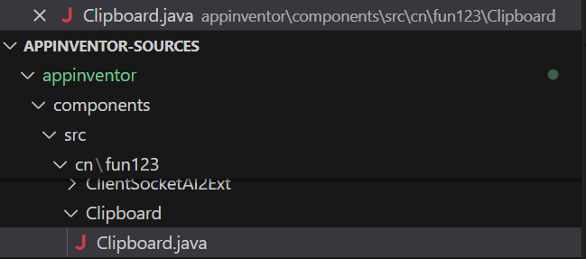
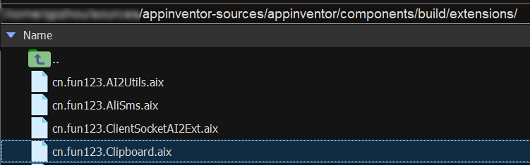
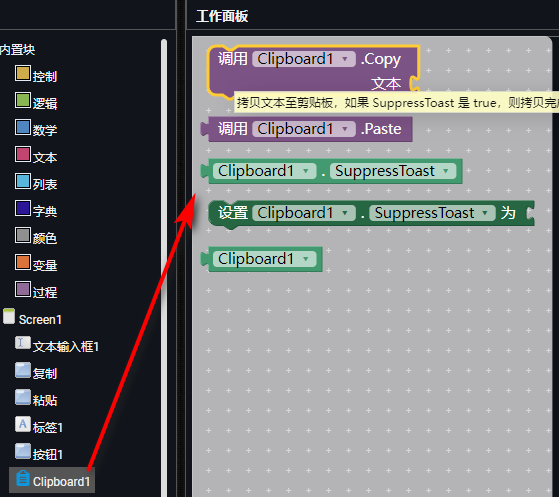

* TOC
{:toc}

[&laquo; 返回首页](index.html)

## 为什么需要开发拓展？

App Inventor 2 是积木式在线安卓开发环境，利用拖拽式的方式实现代码块堆叠，从而完成相应的逻辑。

上手很容易，但是由于代码块提供的功能有限，使用比较单一，在开发上有很大的局限性，但是它提供了拓展Extension特性，开放了源码，使得开发者可以根据自己的需要，自定义开发原生组件实现不了的、更加强大的功能。

一般拓展采用`java`/`kotlin`语言进行开发，由于拓展开发相当于直接使用安卓原生开发语言开发安卓相关功能，因此**理论上拓展可以实现任何的安卓功能**。

**注意：java/kotlin写出来的拓展只能运行于安卓设备上，对于iOS设备需要使用swift开发iOS版本的拓展。**

## 环境配置

1. 安装好 **Java开发环境** 以及 **Ant编译环境**，这里以Windows为例，供参考：

    安装完JDK后配置环境变量  计算机（右键）→属性→高级系统设置→高级→环境变量

    

    新建JAVA_HOME:如果是默认安装路径那么就在这个路径下：C:\Program Files\Java\jdk1.8.0_171

    

    新建Classpath： `.;%JAVA_HOME%\lib;%JAVA_HOME%\lib\tools.jar`

    在Path后面新增：`%JAVA_HOME%\bin;%JAVA_HOME%\jre\bin;` 注意：如果之前的path末尾没有；要手动加上

    配置完成后点击确定；cmd打开命令行，`java -version` ，显示java jdk的版本，配置成功

    

1. 配置ant：ant用来将你的写完的自定义的Extension打包成aix文件，打包完成以后可以直接导入到app inventor中使用

    ANT_HOME    存放你ant的目录

    

    ```
    path           ; %ANT_HOME%\bin;
    classpath      ; %ANT_HOME%\lib;
    ```

    验证：cmd   命令行输入ant命令

    

    出现以上结果证明配置成功。

## 源码下载

[https://github.com/mit-cml/appinventor-sources](https://github.com/mit-cml/appinventor-sources)

国内下载非常非常缓慢，这个项目比较大，也许2天都下载不完，不过没关系，我们早已提供已下载好的工程源码，关注页面底部公众号（或搜索“fun123cn”关注），回复“源码”即可免费下载。

## 代码编写

采用自己较为熟悉的java开发环境就行，这里推荐使用VSCode，拓展目录在 `appinventor-sources/appinventor/components` ，测试代码参考如下：



演示版的完整代码（可编译运行）如下：

{:.vip}
```java
package cn.fun123.Clipboard;

import android.content.Context;
import android.util.Log;
import android.widget.Toast;
import android.content.ClipData;
import android.content.ClipboardManager;
import android.content.Intent;
import android.content.res.AssetFileDescriptor;
import android.net.Uri;

import com.google.appinventor.components.annotations.DesignerComponent;
import com.google.appinventor.components.annotations.DesignerProperty;
import com.google.appinventor.components.annotations.PropertyCategory;
import com.google.appinventor.components.annotations.SimpleFunction;
import com.google.appinventor.components.annotations.SimpleObject;
import com.google.appinventor.components.annotations.SimpleProperty;
import com.google.appinventor.components.common.ComponentCategory;
import com.google.appinventor.components.common.PropertyTypeConstants;
import com.google.appinventor.components.runtime.*;

import java.io.FileInputStream;
import java.io.FileNotFoundException;
import java.io.IOException;
import java.io.InputStreamReader;

@DesignerComponent(version = Clipboard.VERSION,
    description = "App Inventor 2 剪贴板管理拓展。Powered by 中文网(www.fun123.cn)",
    helpUrl = "https://www.fun123.cn/reference/extensions/",       //点“帮助”跳转的页面
    category = ComponentCategory.EXTENSION,
    nonVisible = true,                                             //非可视拓展
    iconName = "aiwebres/small-icon.png")                          //拓展的图标，可以使用相对路径
@SimpleObject(external = true)
@SuppressWarnings("deprecation")
@UsesPermissions(permissionNames = "android.permission.INTERNET")  //拓展需要请求的权限，这里仅展示用
@UsesPermissions({INTERNET})                                       //简洁写法，等同于上面一行
@UsesLibraries(libraries = "okhttp-3.12.13.jar, xxx.jar")          //依赖第三方jar库的，多个英文逗号分隔

public class Clipboard extends AndroidNonvisibleComponent implements Component {

  public static final int VERSION = 1;
  private ComponentContainer container;
  private Context context;
  private static final String LOG_TAG = "CB";
  private boolean suppressToast;


  public Clipboard(ComponentContainer container) {
    super(container.$form());
    this.container = container;
    context = (Context) container.$context();
    Log.d(LOG_TAG, "Clipboard Created");
  }


  @SimpleProperty(category = PropertyCategory.BEHAVIOR,
      description = "操作成功后不显示提示信息，默认 false。")
  public boolean SuppressToast() {
    return suppressToast;
  }


  @DesignerProperty(editorType = PropertyTypeConstants.PROPERTY_TYPE_BOOLEAN,
      defaultValue = "false")
  @SimpleProperty
  public void SuppressToast(boolean suppressToast) {
    this.suppressToast = suppressToast;
  }


  @SimpleFunction(description = "拷贝文本至剪贴板，如果 SuppressToast 是 true，则拷贝完成后不会显示'文本已拷贝'的提示信息。")
  public void Copy(String text) {
    try {
      //演示用，代码省略...
      Log.d(LOG_TAG, "文本已拷贝: " + text);
    } catch (Exception e) {
      Log.e(LOG_TAG, e.getMessage(), e);
    }
  }

  @SimpleFunction(description = "从剪贴板粘贴文本，如果 SuppressToast 是 true，则粘贴完成后不会显示'文本已粘贴'的提示信息。")
  public String Paste() {
    //演示用，代码省略...
    Log.d(LOG_TAG, "文本已粘贴！");
    return "";
  }
}
```

如果拓展中需要请求相关权限，可以在代码中进行申明，有两种方式：

```java
@UsesPermissions(permissionNames = "android.permission.INTERNET")  //拓展需要请求的权限，这里仅展示用
@UsesPermissions({INTERNET})                                       //简洁写法，等同于上面一行
```

如果拓展用到了第三方库，也可以进行申明：

```java
@UsesLibraries(libraries = "okhttp-3.12.13.jar, xxx.jar")          //依赖第三方jar库的，多个英文逗号分隔
```

## 拓展编译

进入目录：`appinventor-sources/appinventor`，执行如下命令：

```shell
ant extensions
```

编译成功后，.aix拓展在 `appinventor-sources/appinventor/components/build/extensions/` 目录下：



## 拓展导入，测试验证



基本的流程大致就是这样的了，如果要开发更为复杂的高级拓展，可以参考源码中官方提供的样例，多研究、多测试一定能够搞得定的，加油~

如果在编译或开发过程中遇到任何问题，欢迎来[社区](https://bbs.tsingfun.com/forum-147-1.html)发帖讨论。

<!--https://blog.csdn.net/upupRita/article/details/98590980-->
