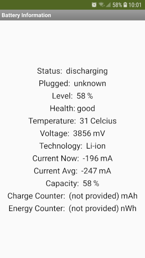
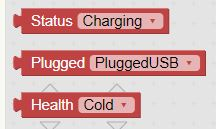
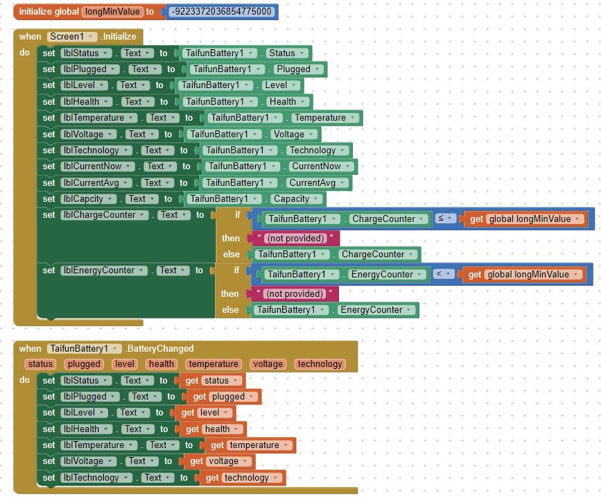

* TOC
{:toc}

[&laquo; 返回首页](index.html)

##  TaifunBattery 电池管理器拓展  {#TaifunBattery}

电池管理器扩展。所需权限：无

demo效果图：

* .aix 拓展下载：

{:.vip}
[com.puravidaapps.TaifunBattery3.aix](battery/com.puravidaapps.TaifunBattery3.aix)

* demo程序下载：

{:.vip}
[battery3.aia](battery/battery3.aia)

版本V3加入了状态的下拉帮助代码块：

### 属性

返回当前健康常量。

可能的值有：冷(cold)、死(dead)、好(good)、过热(overheat)、过压(over voltage)、未知(unknown)、未指定故障(unspecified failure)。

返回电池电量。

可能的值介于 0% 和 100% 之间。

返回电池插入状态。

可能的值包括：usb、ac、无线(wireless)或未知(unknown)。

返回电池状态。

可能的值包括：正在充电(charging)、已充满(full)、正在放电(discharging)、未充电(not charging)或未知(unknown)。

返回电池温度（摄氏度）。

以毫伏为单位返回电池电压水平。

**剩余电量**，返回剩余电池容量占总容量的整数百分比（无小数部分）。

需要 API 级别 21、Android 5、Lollipop。

以微安为单位返回平均电池电流（整数）。正值表示从充电源进入电池的净电​​流，负值表示从电池放电的净电流。计算平均值的时间段可能取决于电量计硬件及其配置。

需要 API 级别 21、Android 5、Lollipop。

以整数形式返回瞬时电池电流（单位为微安）。正值表示从充电源进入电池的净电​​流，负值表示从电池放电的净电流。

需要 API 级别 21、Android 5、Lollipop。

以整数形式返回电池容量（单位为微安小时）。如果平台未提供查询的属性，则此值将为 Long.MIN_VALUE。

需要 API 级别 21、Android 5、Lollipop。

以长整数形式返回电池剩余电量（单位为纳瓦时）。如果平台未提供查询的属性，则此值将为 Long.MIN_VALUE。

需要 API 级别 21、Android 5、Lollipop。

返回电池技术。

### 事件

指示电池已更换的事件。

### 示例App: 电池信息

<!--https://puravidaapps.com/battery.php-->
