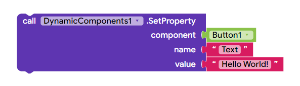
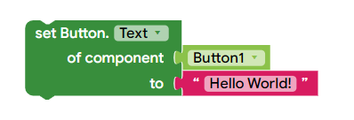

* TOC
{:toc}

[&laquo; 返回首页](index.html)

## DynamicComponents 拓展  {#DynamicComponents}
<!--(https://community.kodular.io/t/f-os-dynamic-components-extension-for-every-component-2-2-2/50789,https://github.com/ysfchn/DynamicComponents-AI2)-->

.aix 拓展下载：

{:.vip}
[com.yusufcihan.DynamicComponents.aix](DynamicComponents/com.yusufcihan.DynamicComponents.aix)

**完全支持 App Inventor 2 的动态组件扩展。它基于 Java 的反射功能，因此只需键入类名称即可搜索类来创建组件。因此，它对特定组件的支持不受限制，因为它支持添加到 App Inventor 发行版中的每个组件！**

此扩展可以根据你的选择异步或同步创建组件。

如果你不想在创建一堆组件期间阻止主应用程序，请转到设计视图（导入扩展后）并在“UI”（异步）和“Main”（同步）之间进行选择。

<table style="width:100%">
    <tr>
        <th width="30%">代码块</th>
        <th>描述</th>
    </tr>
    <!-- CREATE  -->
    <tr>
        <td align="right">
            
        </td>
        <!--<td>
            <table style="width:100%">
                <tr>
                    <td align="right"><code>in</code></td>
                    <td>The arrangement where component will be created in.</td>
                </tr>
                <tr>
                    <td align="right"><code>componentName</code></td>
                    <td>Specifies which component will be created, it can take these values, use one of these: ・ Name of the component.  ・ Block of existing component to create new one from it.  ・ Full class name of the component. </td>
                </tr>
                <tr>
                    <td align="right"><code>id</code></td>
                    <td>An identifier that will be used for other methods. It can be any type of text.</td>
                </tr>
            </table>
        </td>-->
        <td>
            创建一个新的动态组件，它支持添加到当前 AI2 发行版的所有组件。
            <code>组件名称</code> 参数可以是以下值： 
            <table>
                <tr>
                    <td></td>
                    <td><b>组件的名称。</b> ✅ 不需要添加现有组件。  ❌ 只能创建组件。</td>
                </tr>
                <tr>
                    <td></td>
                    <td><b>现有组件块。</b> ❌ 需要现有组件。 ✅ 还可以创建扩展。</td>
                </tr>
                <tr>
                    <td></td></td>
                    <td><b>组件的完整类名。</b> ✅ 不需要添加现有组件。 ✅ 还可以创建扩展。  要了解组件的类名，请使用 <code>GetName</code> 代码块。</td>
                </tr>
            </table>
        </td>
    </tr>
    <!-- CHANGE ID  -->
    <tr>
        <td align="right">
            
        </td>
        <!--<td>
            <table style="width:100%">
                <tr>
                    <td align="right"><code>id</code></td>
                    <td>The old ID that will be changed.</td>
                </tr>
                <tr>
                    <td align="right"><code>newid</code></td>
                    <td>The new ID that old ID will be changed to.</td>
                </tr>
            </table>
        </td>-->
        <td>
            Changes ID of one of created components to a new one. The old ID must be exist and new ID mustn't exist. 
            <blockquote>
                When replacing an ID, it will loop through ALL IDs and replace each one that contains the old ID! Even if the ID you're wanting to replace is "Timmy", but there are IDs like "Timmy-truck". To be clear again, only "Timmy" from "Timmy-truck" will be replaced, the "-truck" part will stay the same!
            </blockquote>
        </td>
    </tr>
    <!-- SCHEMA  -->
    <tr>
        <td align="right">
            
        </td>
        <!--<td>
            <table style="width:100%">
                <tr>
                    <td align="right"><code>in</code></td>
                    <td>The arrangement where the root component will the created in.</td>
                </tr>
                <tr>
                    <td align="right"><code>template</code></td>
                    <td>JSON string of your template.</td>
                </tr>
                <tr>
                    <td align="right"><code>parameters</code></td>
                    <td>Parameters that will be used in template.</td>
                </tr>
            </table>
        </td>-->
        <td>
            Creates components from JSON string. Refer to the <a href="https://github.com/ysfchn/DynamicComponents-AI2/wiki/Creating-Templates">Wiki</a> about creating your own templates.
        </td>
    </tr>
    <!-- REMOVE  -->
    <tr>
        <td align="right">
            
        </td>
        <!--<td>
            <table style="width:100%">
                <tr>
                    <td align="right"><code>id</code></td>
                    <td>The ID of the component that will be deleted.</td>
                </tr>
            </table>
        </td>-->
        <td>
            Removes the component with specified ID from screen/layout and the component list. So you will able to use its ID again as it will be deleted.
        </td>
    </tr>
    <!-- SET PROPERTY  -->
    <tr>
        <td align="right">
            
        </td>
        <!--<td>
            <table style="width:100%">
                <tr>
                    <td align="right"><code>component</code></td>
                    <td>The component that will be modified.</td>
                </tr>
                <tr>
                    <td align="right"><code>name</code></td>
                    <td>Name of the property.</td>
                </tr>
                <tr>
                    <td align="right"><code>value</code></td>
                    <td>Value of the property.</td>
                </tr>
            </table>
        </td>-->
        <td>
            Set a property of a component by typing its property name. Can be known as a Setter property block. 
            It can be also used to set properties that only exists in Designer. 
            It works for common types. For other values, you should use Any Component blocks.
        </td>
    </tr>
    <!-- SET PROPERTIES  -->
    <tr>
        <td align="right">
            
        </td>
        <!--<td>
            <table style="width:100%">
                <tr>
                    <td align="right"><code>component</code></td>
                    <td>The component that will be modified.</td>
                </tr>
                <tr>
                    <td align="right"><code>name</code></td>
                    <td>Name of the property.</td>
                </tr>
                <tr>
                    <td align="right"><code>value</code></td>
                    <td>Value of the property.</td>
                </tr>
            </table>
        </td>-->
        <td>
            Same as SetProperty block, but for setting the properties with Dictionary. 
            Dictionary keys equal to property names and Dictionary values equal to property value.
        </td>
    </tr>
    <!-- GET COMPONENT  -->
    <tr>
        <td align="right">
            
        </td>
        <!--<td>
            <table style="width:100%">
                <tr>
                    <td align="right"><code>id</code></td>
                    <td>The ID of the component that you want to get.</td>
                </tr>
            </table>
        </td>-->
        <td>
            Returns the component's itself for modifying purposes. 
            ID must be a valid ID which is added with Create block. 
            ID --> Component
        </td>
    </tr>
    <!-- GET ID  -->
    <tr>
        <td align="right">
            
        </td>
        <!--<td>
            <table style="width:100%">
                <tr>
                    <td align="right"><code>component</code></td>
                    <td>The component that you want to get its ID.</td>
                </tr>
            </table>
        </td>-->
        <td>
            Returns the ID of component. Component needs to be created by Create block. 
            Otherwise it will return blank string. Also known as reverse of the GetComponent block. 
            Component --> ID
        </td>
    </tr>
    <!-- GET ORDER  -->
    <tr>
        <td align="right">
            
        </td>
        <!--<td>
            <table style="width:100%">
                <tr>
                    <td align="right"><code>component</code></td>
                    <td>The component that property value will get from.</td>
                </tr>
                <tr>
                    <td align="right"><code>name</code></td>
                    <td>Name of the property.</td>
                </tr>
            </table>
        </td>-->
        <td>
            Gets the position of the component according to its parent arrangement.
            Index starts from 1.
        </td>
    </tr>
    <!-- SET ORDER  -->
    <tr>
        <td align="right">
            
        </td>
        <!--<td>
            <table style="width:100%">
                <tr>
                    <td align="right"><code>component</code></td>
                    <td>The component that property value will get from.</td>
                </tr>
                <tr>
                    <td align="right"><code>name</code></td>
                    <td>Name of the property.</td>
                </tr>
            </table>
        </td>-->
        <td>
            Sets the position of the component according to its parent arrangement.
            Index starts from 1.
            Typing 0 (zero) will move the component to the end.
        </td>
    </tr>
    <!-- MOVE  -->
    <tr>
        <td align="right">
            
        </td>
        <!--<td>
            <table style="width:100%">
                <tr>
                    <td align="right"><code>component</code></td>
                    <td>The component that property value will get from.</td>
                </tr>
                <tr>
                    <td align="right"><code>name</code></td>
                    <td>Name of the property.</td>
                </tr>
            </table>
        </td>-->
        <td>
            Moves the component to an another arrangement.
        </td>
    </tr>
    <!-- GET PROPERTY  -->
    <tr>
        <td align="right">
            
        </td>
        <!--<td>
            <table style="width:100%">
                <tr>
                    <td align="right"><code>component</code></td>
                    <td>The component that property value will get from.</td>
                </tr>
                <tr>
                    <td align="right"><code>name</code></td>
                    <td>Name of the property.</td>
                </tr>
            </table>
        </td>-->
        <td>
            Get a property value of a component by typing its property name. Can be known as a Getter property block. It can be also used to get properties that only exists in Designer. 
        </td>
    </tr>
    <!-- GET COMPONENT META  -->
    <tr>
        <td align="right">
            
        </td>
        <td>
            Get meta data about the specified component.
        </td>
    </tr>
    <!-- GET EVENT META  -->
    <tr>
        <td align="right">
            
        </td>
        <td>
            Get meta data about events for the specified component.
        </td>
    </tr>
    <!-- GET PROPERTY META  -->
    <tr>
        <td align="right">
            
        </td>
        <td>
            Get meta data about properties for the specified component.
        </td>
    </tr>
    <!-- GET FUNCTION META  -->
    <tr>
        <td align="right">
            
        </td>
        <td>
            Get meta data about functions for the specified component.
        </td>
    </tr>
    <!-- LAST USED ID  -->
    <tr>
        <td align="right">
            
        </td>
        <td>
            Returns the last component's ID.
        </td>
    </tr>
    <!-- USED IDS  -->
    <tr>
        <td align="right">
            
        </td>
        <td>
            Returns all used IDs of current components as App Inventor list.
        </td>
    </tr>
    <!-- GENERATE ID  -->
    <tr>
        <td align="right">
            
        </td>
        <td>
            Makes a random unique UUID. Use this block in Create block if component ID is not required for you.
        </td>
    </tr>
    <!-- IS DYNAMIC  -->
    <tr>
        <td align="right">
            
        </td>
        <td>
            Returns 'true' if component has created by Dynamic Components extension. Otherwise, 'false'.
        </td>
    </tr>
    <!-- INVOKE  -->
    <tr>
        <td align="right">
            
        </td>
        <td>
            Calls a method of any component. If the return value is not important for you, use with <code>evaluate but ignore result</code> block.
        </td>
    </tr>
    <!-- VERSION  -->
    <tr>
        <td align="right">
            
        </td>
        <td>
            Returns the version of the extension.
        </td>
    </tr>
    <!-- VERSION NAME  -->
    <tr>
        <td align="right">
            
        </td>
        <td>
            Returns the version name of the extension.
        </td>
    </tr>
    <!-- SCHEMA CREATED  -->
    <tr>
        <td align="right">
            
        </td>
        <td>
            Raises after Schema has been created with Schema block.
        </td>
    </tr>
    <!-- COMPONENT BUILT  -->
    <tr>
        <td align="right">
            
        </td>
        <td>
            Raises after a component has been created.
        </td>
    </tr>
</table>

## FAQ

* 如何设置块的属性？

  有两种选择，效果一样：

  `SetProperty`
  
  

  或 `Any Component`

  

* 如何删除所有组件？

  使用 for-each 循环：

  

* 如何制作自己的架构模板？

  为扩展制作 JSON 模板：你可以访问动态组件存储库的 Wiki 部分，了解如何创建动态组件。

  [创建模板 - DynamicComponents-AI2 Wiki](https://github.com/ysfchn/DynamicComponents-AI2/wiki/Creating-Templates)

* 扩展是异步工作还是同步工作？

  它是同步工作的。我在这篇文章中解释了为什么它同步工作。

  现在你可以使用 Thread 属性在异步或同步之间切换！

* 应用程序需要花费大量时间来创建使用 `图像` 组件的组件，我该如何修复它？

  将现有的 Image.Picture 组件替换为 Image Utilities 组件。可以使用扩展来异步加载图像。

* 创建组件需要多少时间？

  我创建了 10000 多个组件，并计算了需要多少秒才能完成创建。
  
  [以下是基准测试结果。](https://community.kodular.io/t/free-open-source-dynamic-components-extension-for-every-component/50789/945)

## 基准测试结果

制作了一个测试应用程序，它创建了许多带循环的 Button 组件，并使用 Clock 计算执行时间。

测试1

平台：Companion / Kodular

测量方式：内置时钟组件

创建：具有默认属性的“按钮”组件

|元件数量|	创建时间（以秒为单位）	|创建时间（以毫秒为单位）|
|---------|---------|---------|
|100	|0 sec	|535 ms|
|200	|1 sec	|1387 ms|
|500	|3 secs	|3718 ms|
|1000	|6 secs	|6992 ms|
|2000	|12 secs	|12748 ms|
|5000	|36 secs	|36925 ms|
|10000	|73 secs	|73849 ms|

测试2

平台：导出应用程序/Kodular

测量方式：内置时钟组件

创建：具有默认属性的“按钮”组件

|元件数量|	创建时间（以秒为单位）	|创建时间（以毫秒为单位）|
|---------|---------|---------|
|100	|0 sec	|593 ms|
|200	|1 sec	|1079 ms|
|500	|2 secs	|2427 ms|
|1000	|6 secs	|6023 ms|
|2000	|12 secs	|12009 ms|
|5000	|25 secs	|25092 ms|
|10000	|64 secs	|64520 ms|

**注意：**

当然，当前运行的应用程序、当前可用内存、设备类型等都会影响执行时间。这只是一个大致的基准测试。
