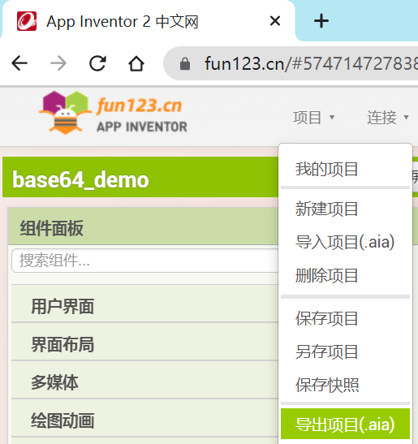
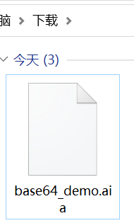
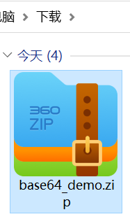

[&laquo; 返回首页](index.html)

# 从.aia项目文件中提取.aix拓展包的步骤

1. 如果看到一个项目中，用到了拓展，但拓展的帮助中没有原链接，这时就可以考虑从项目文件中进行提取：

    

1. 导出项目.aia文件：

    

1. 在电脑的“下载”目录查看.aia项目文件：

    

1. 将.aia文件的后缀改为.zip压缩包文件：

    

1. 解压.zip文件，找到里面的拓展目录 `assets\external_comps`，可以看到所有用到的拓展目录列表：

    

1. 将需要提取的拓展目录进行.zip压缩：

    

1. 最后，将拓展的.zip包的后缀改为.aix，即为真正的拓展包文件。经验证，该.aix拓展包重新导入后，能够正常使用。

    
