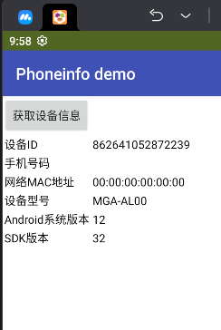
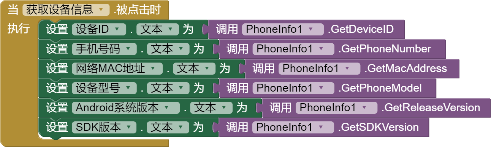

* TOC
{:toc}

[&laquo; 返回首页](index.html)

##  PhoneInfo 拓展  {#PhoneInfo}

此 PhoneInfo 拓展由中文网开发及维护，以上截图是在模拟器上运行的结果。

* .aix 拓展下载：

{:.vip}
[cn.fun123.PhoneInfo.aix](PhoneInfo/cn.fun123.PhoneInfo.aix)

* demo程序下载：

{:.vip}
[PhoneInfo.aia](PhoneInfo/PhoneInfo.aia)

## 使用方法

### GetDeviceID

获取设备ID。**Android 10+不支持！**

### GetPhoneNumber

获取本机手机号码。无SIM卡设备将返回空文本；双SIM卡设备将返回主卡号码。**Android 10+不支持！**

注：这个方法采用的是较常规的方式获取信息，很多手机由于安全性限制，一般来说不允许直接获取本机号码，因此这个方法可能**大概率会获取失败**，也基本上很难有其他的方式可以获取这个信息，建议有获取手机号码需求的可以考虑其他方式，如通过运营商API等。

### GetMacAddress

获取网卡MAC地址信息，**模拟器返回的是空地址**，手机亲测可正常获取。

### GetPhoneModel

获取本机手机型号。

### GetReleaseVersion

获取Android系统版本。

### GetSDKVersion

获取SDK版本。

## 更多信息

如果你需要获取其他信息，可扫码添加客服并反馈给我们，我们会第一时间进行调研并上线新特性，期待您的反馈！
