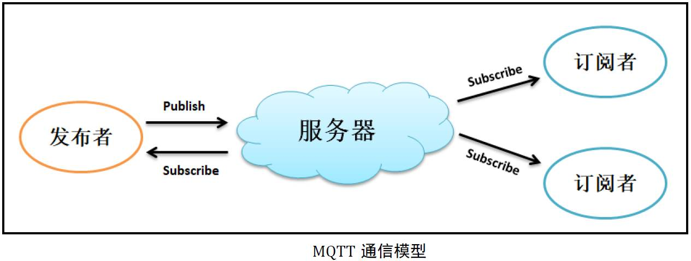
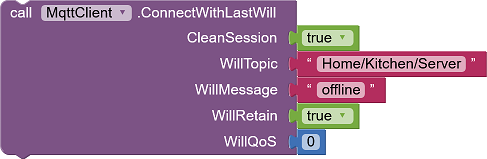
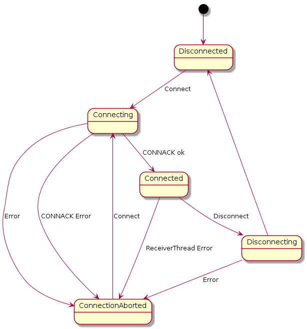
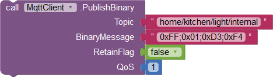
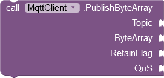
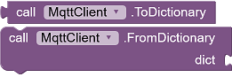
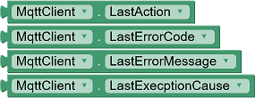

* TOC
{:toc}

[&laquo; 返回首页](index.html)

[《App Inventor 2 MQTT拓展入门（保姆级教程）》](MQTTGuide.html)

最新版拓展下载：

{:.vip}
[de.ullisroboterseite.ursai2pahomqtt.aix](mqtt/de.ullisroboterseite.ursai2pahomqtt.aix)

<!--https://ullisroboterseite.de/android-AI2-PahoMQTT-en.html-->

## MQTT（Message Queuing Telemetry Transport：消息队列遥测传输）

MQTT 发明于 1999 年，为物联网设计的轻量级协议，基于`TCP`协议实现。

* MQTT 协议文档：[https://mqtt.org/](https://mqtt.org/)

<!--https://blog.csdn.net/INT_TANG/article/details/125834594-->

* 虽然 App Inventor 有现成的 MQTT 扩展，但它们需要额外的 JavaScript 或外部配置文件。此处介绍的 MQTT 客户端组件完全独立工作，不需要任何外部元素。它完全支持 MQTT 协议版本 3.1.1（除了这一点例外：订阅和取消订阅只能指定单个主题，而不能是列表。App Inventor 无法很好地处理此类列表）。

* 此版本的 MQTT 客户端基于 [Eclipse Paho Java 客户端](https://www.eclipse.org/paho/index.php?page=clients/java/index.php)。它与以前的版本不兼容，但允许使用 SSL/TLS 连接以满足更高的安全要求。

* 在 MQTT 客户端连接到 MQTT 服务器之前，必须先设置连接参数，然后使用 `Connect` 方法创建与服务器的连接。`ConnectionStateChanged` 事件报告连接状态的任何变化。工作完成后，可以使用 `Disconnect` 方法断开与服务器的连接。

* 使用 `Publish` 方法的不同变体，将消息发送到服务器。`Subscribe` 方法可用于确定客户端想要接收哪些主题消息的推送。可以使用 `Unsubscribe` 方法取消对主题的订阅。通过 `PublishedReceived` 事件报告收到有关订阅主题的消息。该组件还提供错误处理方法。

## 客户端连接参数

要连接到MQTT消息服务器，组件需要设置连接选项，“界面设计”或“程序设计”视图均可进行设置。

### 连接信息

{:.properties}

{:id="UrsPahoMqttClient.Broker" .text} *Broker - MQTT消息服务器*
: 服务器的主机名或 IP 地址。

{:id="UrsPahoMqttClient.Port" .number} *Port - 端口*
: 连接的端口号。默认值为 1883。

{:id="UrsPahoMqttClient.Protocol" .text} *Protocol - 协议*
: 协议类型：允许的值为`TCP`、`SSL`和`TLS`，其他值将被忽略。

### 身份标识

{:.properties}

{:id="UrsPahoMqttClient.ClientID" .text} *ClientID - 客户端ID*
: 可选：唯一客户端标识。如果未指定任何值，则内部会分配一个随机值 (GUID)。同时连接到同一消息服务器的所有客户端，客户端ID必须是唯一的。

### 认证信息

{:.properties}

{:id="UrsPahoMqttClient.UserName" .text} *UserName - 用户名*
: 可选：用于身份验证的用户名。

{:id="UrsPahoMqttClient.UserPasword" .text} *UserPasword - 用户密码*
: 可选：用于身份验证的用户密码。

**SSL/TLS：服务器身份验证**

使用 受信任的证书文件 和 信任库文件 属性设置服务器身份验证（使用 SSL/TLS 协议）。

|   受信任的证书文件     | 信任库文件	  | 测试  |
|---------|---------|---------|
|   文件名     | X	  | 使用指定的证书。  |
|   空     | 文件名	  | 使用信任库中的证书。如果信任库使用密码保护，则需要 TruststorePassword。  |
|   空     | 空	  | 使用服务器在建立连接时传输的 CA 签名证书。  |

{:.properties}

{:id="UrsPahoMqttClient.TrustedCertFile" .text} *TrustedCertFile - 受信任的证书文件*
: 可选：受信任的证书文件的名称。

{:id="UrsPahoMqttClient.TruststoreFile" .text} *TruststoreFile - 信任库文件*
: 可选：信任库文件的名称。

{:id="UrsPahoMqttClient.TruststorePassword" .text} *TruststorePassword - 信任库的密码*
: 可选：打开信任库的密码。

**SSL/TLS：客户端身份验证**

使用 客户端证书文件 和 密钥库文件 属性设置客户端身份验证（使用 SSL/TLS 协议）。

|   客户端证书文件     | 密钥库文件	  | 测试  |
|---------|---------|---------|
|   文件名     | X	  | ClientKeyFile 中指定的证书和私钥。如果 KeyFile 受密码保护，则需要 ClientKeyPassword。  |
|   空     | 文件名	  | 密钥库中的证书和私钥。如果密钥库受密码保护，则需要 ClientKeystorePassword。  |
|   文件     | 空	  | 无客户端身份验证。  |

密钥库可以采用 PKCS#12 格式（文件扩展名“p12”或“pfx”）或[标准格式](https://docs.oracle.com/javase/7/docs/api/java/security/KeyStore.html#getDefaultType())。

**通过证书文件进行身份验证**

{:.properties}

{:id="UrsPahoMqttClient.ClientCertFile" .text} *ClientCertFile - 客户端证书文件*
: 可选：客户端证书文件的名称。

{:id="UrsPahoMqttClient.ClientKeyFile" .text} *ClientKeyFile - 私钥文件*
: 可选：私钥文件的名称。如果通过证书文件进行身份验证，则为必填项。

{:id="UrsPahoMqttClient.ClientKeyPassword" .text} *ClientKeyPassword - 私钥文件密码*
: 可选：打开私钥文件的密码。

{:id="UrsPahoMqttClient.ClientPemFormatted" .boolean} *ClientPemFormatted - 是否PEM格式*
: 可选：证书和私钥是否是 PEM 格式。

**通过密钥库进行身份验证**

{:.properties}

{:id="UrsPahoMqttClient.ClientKeystoreFile" .text} *ClientKeystoreFile - 密钥库文件*
: 可选：密钥库文件的名称。密钥库可以采用 PKCS#12 格式（文件扩展名为“p12”或“pfx”）或[标准格式](https://docs.oracle.com/javase/7/docs/api/java/security/KeyStore.html#getDefaultType())。

{:id="UrsPahoMqttClient.ClientKeystorePassword" .text} *ClientKeystorePassword - 密钥库的密码*
: 打开密钥库的密码。

### 连接控制

{:.properties}

{:id="UrsPahoMqttClient.ConnectionTimeout" .number} *ConnectionTimeout - 连接超时时间*
: 设置连接超时时间（单位：秒），定义客户端等待与 MQTT 服务器建立网络连接的最大时间间隔。默认超时为 30 秒。值为 0 表示禁用超时处理，这意味着客户端将一直等待，直至网络连接成功或失败。

{:id="UrsPahoMqttClient.TimeToWait" .number} *TimeToWait - 等待时间*
: 设置控制权返回给调用App之前等待操作完成的最长等待时间（单位：秒）。在以下情况下将返回控制权：

  * 操作完成
  * 或超时
  * 或客户端断开/关闭

  默认值为 -1，表示操作不会超时。如果发生超时，操作将继续在后台运行，直到完成。超时用于在操作过程中进行阻塞。

{:id="UrsPahoMqttClient.MaxInflight" .number} *MaxInflight - 最大排队数量*
: 最大排队数量指定我们可以在未收到确认的情况下发送的消息数量。默认值为 10。在高流量环境中，请增加此值。

{:id="UrsPahoMqttClient.KeepAlive" .number} *KeepAlive - 保持活动时间*
: 定义发送或接收消息之间的最大时间间隔（单位：秒）。它使客户端能够检测服务器是否不再可用，而无需等待 TCP/IP 超时。

  客户端将确保在每个保持活动期间至少有一条消息通过网络传输，如果在该时间段内没有与数据相关的消息，客户端将发送一个非常小的“ping”消息，服务器将确认该消息。
  
  值为 0 会禁用客户端中的保持活动处理。默认值为 60 秒。

## 连接到服务器

使用 `Connect` 方法建立与消息服务器的连接，并使用 `Disconnect` 方法终止与服务器的连接。外部事件也会影响与服务器的连接，例如与网络的连接/丢失。

可以通过 `ConnectionState` 属性获取当前的连接状态。如果连接状态发生变化，则会触发 `ConnectionStateChanged` 事件。

### 连接建立和终止方法

`Connect` 方法有两种变体，不带后缀 (`Connect`) 和带“Last Will” (`ConnectWithLastWill`)。

{:.vip}
|   |  建立连接，不做其他操作。 **boolean CleanSession** 表示是否链接到先前中止的会话。  |
|    | 建立连接，当连接建立成功后将发送一次消息。 **boolean CleanSession** 表示是否链接到先前中止的会话。WillTopic、WillQoS、WillRetain 和 WillMessage 与 Publish 方法中描述的相同（请参阅发送消息）。  |

终止连接是通过 `Disconnect` 方法完成的，该方法无参数。

注意：只有当连接不定期中断时，使用“Last Will”存储的信息才会生效。如果连接是通过 `Disconnect` 终止的，则将丢弃“Last Will”。在这里，客户端负责在调用 `Disconnect` 之前发送适当的消息。

### 连接状态

可以随时通过 `ConnectionState` 属性查询当前连接状态。

 

可能的状态有：

{:.vip}
|   代码     | 状态	  | 含义  |  允许调用方法  |
|---------|---------|---------|---------|
|   0    | `Disconnected`	  | 客户端未连接到服务器。  |  `Connect`  |
|   1    | `Connecting`	  | 客户端尝试连接到服务器。  |  -  |
|   2    | `Connected`	  | 客户端已连接到服务器。  |  `Subscribe`, `Publish`, `Disconnect`  |
|   3    | `Disconnecting`	  | 客户端正在断开与服务器的连接。  |  -  |
|   4    | `ConnectionAborted`	  | 由于错误或中断，无法建立连接。可以通过属性 `LastErrorCode` 和 `LastErrorMessage` 查看错误原因。  |  `Connect`  |

常量属性：

 

为了简化状态查询，已经实现了 `IsConnected` 和 `IsDisconnected` 属性：

 

下面的状态图解释了连接建立和终止的过程：

 

* MQTT 客户端以 `Disconnected` (0) 状态启动。调用 `Connect` 方法时，客户端进入 `Connecting` (1) 状态。尝试与 MQTT 服务器建立 TCP 连接，并向服务器发送 CONNECT 类型的 MQTT 消息。如果此操作未成功（错误）或服务器未收到 CONNACK 类型的消息，客户端将进入 `ConnectionAborted` (4) 状态。

* 收到 CONNACK 类型的消息时，将验证服务器是否接受来自客户端的连接请求。如果未接受（CONNACK 错误），则网络连接终止，客户端进入 `ConnectionAborted` (4) 状态。如果服务器接受连接（CONNACK ok），客户端将进入 `Connected` (2) 状态。

* 调用 `Disconnect` 方法时，断开连接开始。客户端进入 `Diconnecting` (3) 状态。首先，向服务器发送 DISCONNECT 消息。如果成功，客户端将进入 `Diconnected` (0) 状态。如果发生错误（Error），状态将变为`ConnectionAborted`（4）。

* 如果在操作过程中发生错误（`ReceiverTreadError`），则网络连接断开，状态将变为`ConnectionAborted`（4）。

### 连接状态变更事件

如果连接状态发生变化，则会触发`ConnectionStateChanged`事件。

 

* NewState：状态的数值（0..4，见上文）

* StateString：状态的名称（“Disconnected”等）

### 建立连接时出错

* 在尝试建立连接之前，首先会检查客户端的状态是否允许这样做（状态 = `Disconnected` 或 `ConnectionAborted`）。如果不允许，则中止尝试并触发 `ErrorOccurred` 事件，代码为 32300（“无效状态”）。

* 如果状态允许，则客户端将更改为 `Connecting` 状态。现在，所有其他错误都会导致触发 `ConnectionStateChanged` 事件，状态为 `ConnectionAborted`。有关更多详细信息，请参阅错误处理部分。

## 订阅主题并接收消息

### 订阅主题

订阅主题是通过订阅方法完成的。

* **Topic** 文本：要订阅的主题。允许使用通配符。
* **QoS** 数字：接收这些消息所需的[服务质量](#QoS)。

### 取消订阅

* **Topic** 文本：要取消的订阅。允许使用通配符。

### 接收消息

收到消息时会触发此事件。

* **Topic** 文本：此消息的主题。
* **Payload** 文本：二进制格式的消息内容（见下文）
* **Message** 文本：字符串形式的消息。
* **RetainFlag** 布尔：表示这是否是[保留消息](#RetainFlag)。
* **DupFlag** 布尔：表示是否是重复传递。

MQTT 消息的消息内容是字节字段。这些字节字段以通过 Payload 参数编码的字符串形式提供。编码过程在二进制数据部分中描述。但是，大多数消息都是“UTF-8”格式的文本。因此，尝试将字节字段转换为文本。如果成功，则文本在参数 Message 下可用。否则，Message 包含一个空字符串。

## 发布消息

发布消息有三种方法。

{:.vip}
|   |  <u>默认发布方式</u>  **Topic**: 消息主题。 **Message**: 消息字符串。 **RetainFlag**: 消息是否为保留消息。 **QoS**: 发布消息的服务质量。  |
|    | <u>简单发布</u>  **Topic**: 消息主题。 **Message**: 消息字符串。 **RetainFlag**: 在内部设置为 false，QoS 为 0。  |
|   | <u>发布二进制消息</u>  **Topic**: 消息主题。 **BinaryMessage**: 编码为字符串的二进制值。 **RetainFlag**: 消息是否为保留消息。 **QoS**: 发布消息的服务质量。  |

## 二进制数据

App Inventor 没有字节字段。字节字段很少需要。在此组件中，二进制数据通过字符串进行编码。这是一串由逗号 (',') 或分号 (';') 分隔的编码字节。

每个字节可以编码为“0xff”或“0xFF”或“0Xff”或“0XFF”或“#ff”或“#FF”（十六进制输入）或“255”（十进制输入）或“0377”（八进制输入）。

您可以根据需要混合使用：“0xFF;255,#ff”有效。

您可以在数字前后插入空格：“0xFF ; 255, #ff”也有效。

尾随逗号或分号将被忽略：“0xFF;255,#ff”和“0xFF;255,#ff;”是相同的。

接收数据后，接收到的数据包被转换为以分号分隔的十进制数字字符串，例如“123；33；0；44”。在 AI2 应用程序中，您可以使用 String.Split 获取字节列表。

对于转换，我使用以下算法：
1) 用分号替换所有逗号
2) 用分号拆分字符串
3) 删除前导和尾随空格
4) 使用 Integer.decode () 转换为整数
5) 检查值是否小于 0 或大于 255。

## 二进制数据（字节数组）

对于另一个项目，需要发送和接收 byte[] 类型（字节数组）的字段。App Inventor 无法直接处理字节数组，但它们可以作为扩展之间的通用 Object 类型变量进行交换。对于我的 WebCam 项目，可以通过 MQTT 拍摄和发送 JPEG 图像。Android Camera API 将 JPEG 数据作为字节数组提供。`PublishByteArray`、`SubscribeByteArray` 和 `PublishedByteArrayReceived` 块可用于处理字节数组。

### PublishByteArray

此块对应于 PublishEx 方法。这里不是 Message 参数，而是 ByteArray 参数。这里连接了另一个扩展的输出，它提供了一个字节数组。App Inventor 中的标准块无法创建字节数组。

### SubscribeByteArray

此块对应于订阅方法。所有与指定主题匹配的接收消息都被解释为字节数组并转发到`PublishedByteArrayReceived`事件。Topic参数允许使用通配符。选择主题和订阅时，必须注意传入消息的排序是否正确。MQTT客户端按字节数组订阅的顺序检查是否已在传输的主题下订阅字节数组。一旦命中，就会调用`PublishedByteArrayReceived`。仅当此处未命中时才会触发`PublishedReceived`。

匹配算法基于：[https://github.com/iosphere/mosquitto](https://github.com/iosphere/mosquitto)，来源：lib/util_mosq.c，方法：mosquitto_topic_matches_sub。

### PublishedByteArrayReceived

当收到的消息的主题（参见SubscribeByteArray）检测到已收到字节数组时，将触发此事件。ByteArray 变量可以传递给可以处理字节数组的扩展。App Inventor 标准块无法直接使用。

## 其他方法

### IsNull

使用此功能您可以测试指针是否指向某个对象。

### ToDictionary / FromDictionary

这些函数使管理连接数据变得更加容易。ToDictionary 使用以下键创建一个包含对象所有属性的 Dictionary：Broker、Port、ConnectionTimeout、TimeToWait、KeepAlive、ClientID、UserName、UserPassword、Protocol、MaxInflight、TrustedCertFile、TruststoreFile、TruststorePassword、ClientCertFile、ClientKeyFile、ClientKeyPassword、ClientPemFormatted、ClientKeystoreFile、ClientKeystorePassword。

FromDictionary 允许将来自 Dictionary 的数据加载到 MQTT 客户端对象的属性中。上面指定的所有键必须始终在 Dictionary 中可用。

## 错误处理

以下属性可用于处理错误情况：

 

* LastAction：最后执行的操作的名称，例如“Connect”

* LastErrorCode：最后错误的错误代码（见下文）。

* LastErrorMessage：错误的文本描述，例如“Unacceptable protocol version”

* LastExceptionCause：触发错误的异常的文本。

重要提示：提到的属性仅包含可能的错误事件的指示。许多操作是异步执行的。对于这些，错误跟踪并不总是可能的。1..32203 是 Paho-Clients 的故障编号。

{:.vip}
|   代码     | 含义	  | 文本  |
|---------|---------|---------|---------|
|   0    |    |    |
| 1 | 	服务器不支持请求的协议版本。	 | Invalid protocol version. |
| 2 | 	服务器拒绝了提供的客户端 ID。 | Invalid client ID. |
| 3 | 	服务器无法处理该请求。	 | Broker unavailable. |
| 4 | 	由于用户名或密码错误，服务器身份验证失败。	| Bad user name or password. |
| 5 | 	无权限执行请求操作。	 | Not authorized to connect. |
| 6 | 	发生了意外的错误。	 | Unexpected error. |
| 128 | 	订阅错误 – 从服务器返回。	 | Error from subscribe. |
| 32000 | 	客户端在等待服务器响应时超时。服务器不再响应保持活动（KeepAlive）的消息。	 | Timed out waiting for a response. |
| 32001 |   内部错误，由于没有可用的新消息 ID 而导致。	 | No new message ID available |
| 32002 | 	客户端在等待将消息写入服务器时超时。	 | Timed out at writing. |
| 32100 | 	客户端已经连接。	 | Already connected. |
| 32101 | 	客户端已经断开连接。	 | Already disconnected. |
| 32102 | 	客户端当前正在断开连接，无法接受任何新任务。可能出现在等待认证时断开客户端连接。	 | Currently disconnecting. |
| 32103 | 	无法连接到服务器。	 | Unable to connect to server. |
| 32104 | 	客户端未连接到服务器。必须先调用 `Connect`... 方法。也可能是连接丢失。	 | Not connected. |
| 32105 | 	服务器 URI 与提供的 SocketFactory 不匹配。以“tcp://”开头的 URI 必须使用 javax.net.SocketFactory，以“ssl://”开头的 URI 必须使用 javax.net.ssl.SSLSocketFactory。由于包装器的实现，不会发生此错误。 | URI and SocketFactory do not match. |
| 32106 | 	SSL 配置错误。	 | SSL configuration error. |
| 32107 | 	在 `MessageReceived` 事件中调用 `Disconnect`。此方法由客户端线程调用，不得用于控制断开连接。	 | Disconnecting not allowed. |
| 32108 | 	协议错误：消息未被识别为有效的 MQTT 数据包。可能的原因包括连接到非 MQTT 服务器，或者在客户端未使用 SSL 的情况下连接到 SSL 服务器端口。 | Unrecognized packet. |
| 32109 | 	客户端意外地与服务器断开连接。	 | Connection lost. |
| 32110 | 	连接操作已在进行中，一次只能进行一个连接。由于包装器的实现，此错误不会发生。 | A connect already in progress. |
| 32111 | 	客户端已关闭 - 在此状态下不允许对客户端执行任何操作。由于包装器的实现，因此不会发生此错误。	 | The client is closed. |
| 32201 | 	使用已经关联其他操作的Token发出请求。由于包装器的实现，不会发生此错误。	 | Token already in use. |
| 32202 | 	已发出发送消息的请求，但已达到最大队列中消息数量。	 | Too many publishes in progress. |
| **32300** | 	当前状态不允许执行所需操作。连接建立：状态必须为 `Disconnected`  (代码 0) 或 `ConnectionAborted` (代码 4)。发送 (订阅、取消订阅、发布...)：状态必须为 `Connected`  (代码 2)。	 | Invalid State. |
| 32301 | 	指定的主题为空。使用 `ConnectWithLastWill`、`Subscribe`、`Unsubscribe`、`Publish`... 时必须指定主题。	 | Empty topic. |
| 32302 | 	`PublishBinary` 方法：无法将指定的字符串转换为二进制格式。请参阅二进制数据部分中的说明。	 | Invalid binary code. |
| 32303 | 	`PublishByteArray` 方法：ByteArray 参数不是字节数组类型 (byte[ ])。	 | Not a byte array. |
| 32304 | 	`Connect`...方法：无效的连接数据。	 | Invalid connection parameters. |
| 32305 | 	`FromDictionary` 方法：指定的 Dictionary 不包含所有必填字段。	 | Invalid dictionary content. |
| 32306 | 	`Connect`...方法：无法加载为 TruststoreFile 指定的文件。	 | Cannot load truststore file. |
| 32307 | 	`Connect`...方法：无法加载为 TrustedCertFile 指定的文件。	 | Cannot load trusted certificate file. |
| 32308 | 	`Connect`...方法：无法加载为 ClientCertFile 或 ClientKeyFile 指定的文件。	 | Cannot load client certificate file or key file. |
| 32309 | 	`Connect`...方法：无法加载为 ClientKeystoreFile 指定的文件。	 | Cannot load client keystore file. |

## MQTT服务质量（QoS）：3个等级   {#QoS}

1. QoS0：最低质量等级，最多发送一次消息，在消息发出后，接收者不会发送应答，发送者也不会重发消息，消息可能送达一次、也可能根本没送达。常用于不重要的消息传递，允许消息丢失。
1. QoS1：中等质量等级，最少发送一次消息，消息至少需要送达一次，也可能送达多次，需要接收者返回应答。
1. QoS2：高等质量等级，消息丢失和重复都是不被允许的，要保证此质量等级会有额外的开销，一般用于安全性、可靠性要求高的场景，比如支付。

## 保留消息（RetainFlag）   {#RetainFlag}

* 保留消息定义：如果PUBLISH消息的RETAIN标记位被设置为1，则称该消息为“保留消息”。

* Broker对保留消息的处理：Broker会存储每个Topic的最后一条保留消息及其Qos，当订阅该Topic的客户端上线后，Broker需要将该消息投递给它。

* 保留消息作用：可以让新订阅的客户端得到发布方的最新的状态值，而不必要等待发送。

* 保留消息的删除：
  * 方式1：发送空消息体的保留消息；
  * 方式2：发送最新的保留消息覆盖之前的（推荐）；

<!--
***
官方英文原版文档[点此](https://ullisroboterseite.de/android-AI2-PahoMQTT-en.html)。
-->