* TOC
{:toc}

[&laquo; 返回首页](index.html)

[《App Inventor 2 UrsPahoMqttClient 拓展中文文档（完整版）》](MQTT.html)

<!-- 文章结构参考：https://blog.csdn.net/byhyf83862547/article/details/138785961 -->

## 准备工作

* APPINVENTOR测试平台：AppInventor2中文网（[https://www.fun123.cn](https://www.fun123.cn)）

* MQTT拓展下载：[MQTT中文文档](MQTT.html)页面进行下载。

* MQTT测试平台：

  * 中文平台推荐：[bemfa.com](https://www.bemfa.com)   界面简洁，对入门者友好。当然也可以选择稍复杂的，大厂平台如：阿里云、华为云等都提供物联网云平台。
  * 英文平台推荐：HiveMQ([https://www.mqtt-dashboard.com/](https://www.mqtt-dashboard.com/))、EMQX([broker.emqx.io](https://broker.emqx.io)) 等。有一定基础的可以考虑用英文平台。

    其实，使用哪个平台都可以，甚至自己搭建MQTT服务器，使用自己的平台。不过初学者还是建议用国内中文平台进行测试，熟悉之后可以研究一下其他的或者自己搭建。

  这里以 [bemfa.com](https://www.bemfa.com) 为例，账号注册请自行完成，如果看到的是TCP云，请切换到MQTT云：

  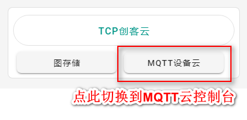

  输入名称（例如：APPMQTT），新建一个订阅主题：

  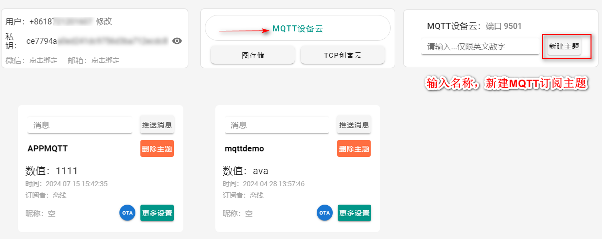

* MQTT客户端测试工具，下载地址：[https://mqttx.app/zh/downloads](https://mqttx.app/zh/downloads)

  <!--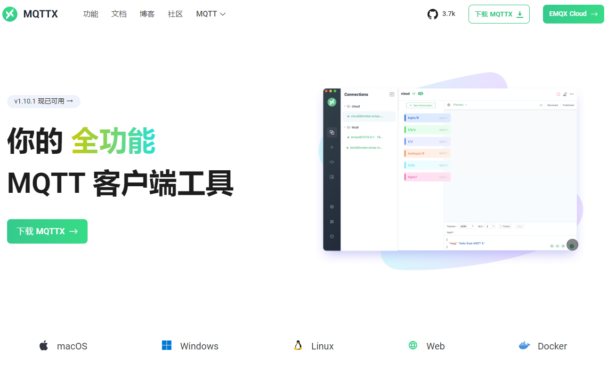-->

  启动MQTTX客户端测试工具，设置语言为中文：

  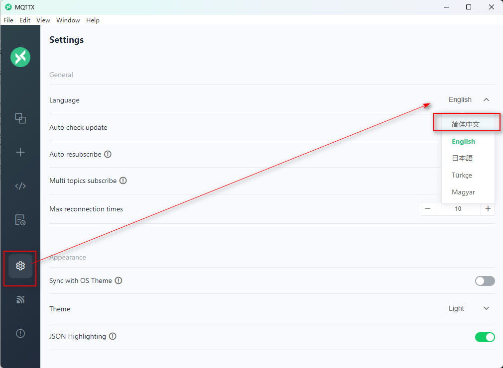

  配置和App一样的连接参数：

  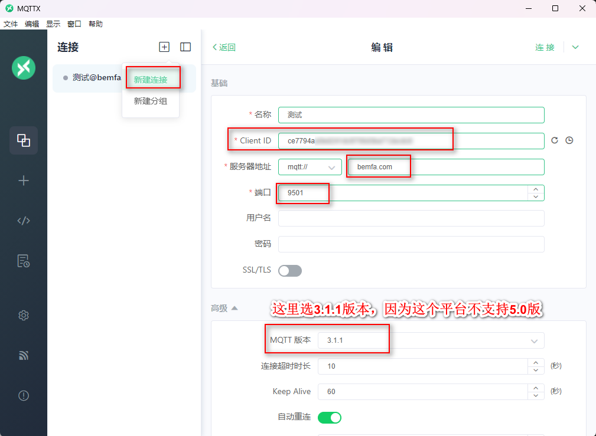

  往指定主题发布一个测试消息，效果如下：

  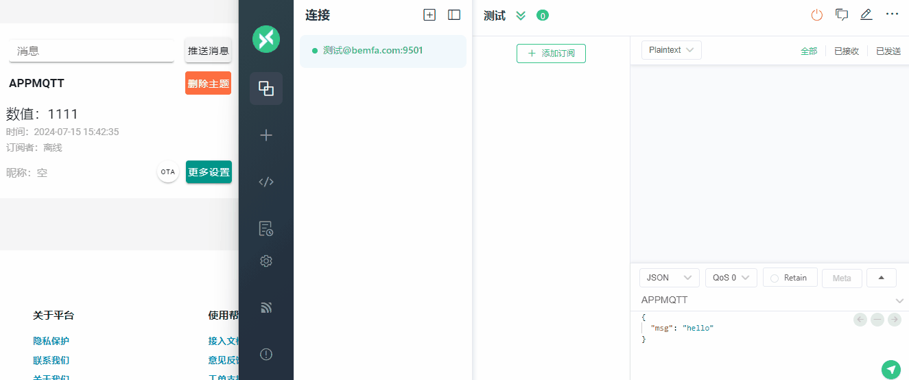

## App设计及代码

> 服务器地址：bemfa.com 
> 端口：9501 
> 客户端ID：（MQTT云控制台获取） 
> 订阅主题：APPMQTT

新建项目，导入MQTT拓展，可在“界面设计”的拓展属性中进行服务器通信基本设置：

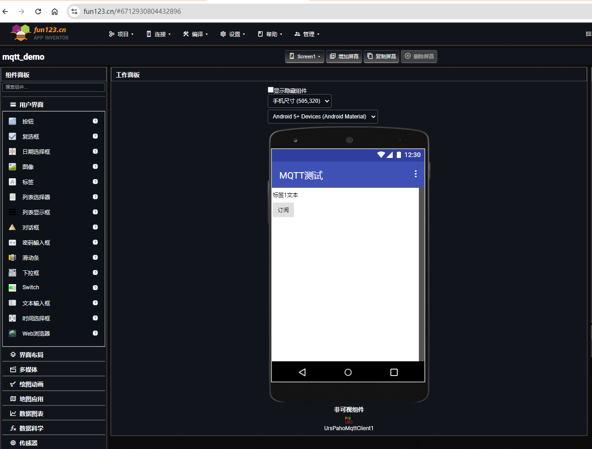

也可以在“程序设计”视图中，屏幕初始化时使用代码块进行设置：

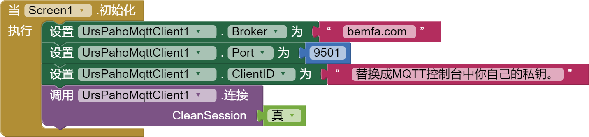

完整代码如下：

{:.vip}
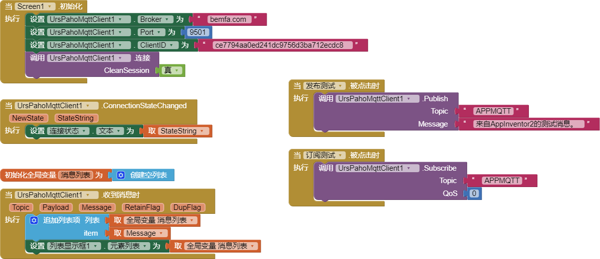

## 测试效果

### App端测试发布消息，效果如下：

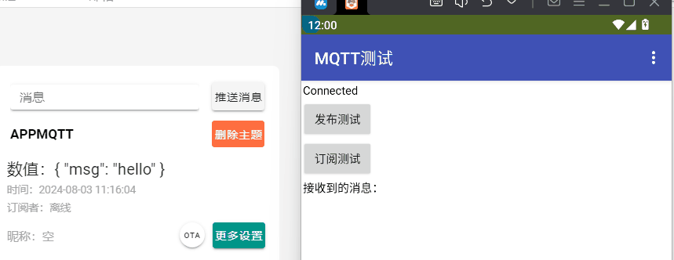

### App与测试客户端联动测试，效果如下：

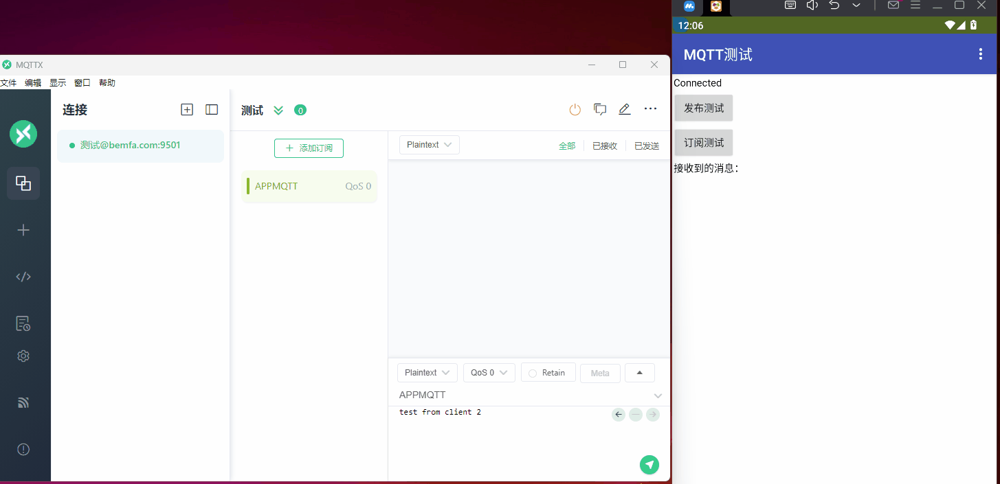

### 云平台服务器端可以查看订阅设备的数量，以及消息的发送历史：

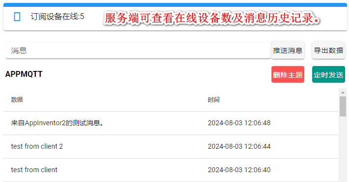

**注意**：由于订阅了同一个主题，客户端发布消息时也会收到自己发出的消息。因为MQTT服务器会将消息转发给所有订阅这个主题的客户端。有两种解决办法：

（1）添加标识，比如添加客户端前缀，再根据前缀进行过滤。

（2）订阅两个主题，一个专门用于接收，一个专门用于发布。 

## .aia 源码下载

{:.vip}
[mqtt_demo.aia](mqtt/mqtt_demo.aia)

