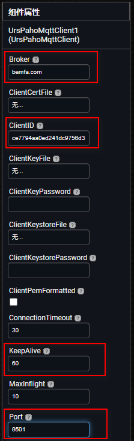

* TOC
{:toc}

[&laquo; 返回首页](index.html)

[《App Inventor 2 UrsPahoMqttClient 拓展中文文档（完整版）》](MQTT.html)

<!-- 文章结构参考：https://blog.csdn.net/byhyf83862547/article/details/138785961 -->

## 准备工作

* APPINVENTOR测试平台：AppInventor2中文网（https://www.fun123.cn）

* MQTT拓展下载：[MQTT中文文档](MQTT.html)页面进行下载。

* MQTT测试平台：

  * 中文平台推荐：[bemfa.com](https://www.bemfa.com)   界面简洁，对入门者友好。
  * 英文平台推荐：HiveMQ([https://www.mqtt-dashboard.com/](https://www.mqtt-dashboard.com/))、EMQX([broker.emqx.io](https://broker.emqx.io)) 等。有一定基础的可以考虑用英文平台。

    其实，使用哪个平台都可以，甚至自己搭建MQTT服务器，用自己的平台。不过初学者还是建议用国内中文平台进行测试，熟悉之后可以研究一下其他的或者自己搭建。

    账号注册请自行完成，如果看到的是TCP云，请切换到MQTT云：

    

    输入名称（例如：APPMQTT），新建一个订阅主题：

    

* MQTT客户端测试工具：[https://mqttx.app/zh](https://mqttx.app/zh)

  

## App设计及代码

新建项目，导入MQTT拓展：

可以在“界面设计”的拓展属性中进行服务器通信基本设置：

也可以在“程序设计”视图中，屏幕初始化时使用代码块进行设置：

## 测试效果

## .aia 源码下载

