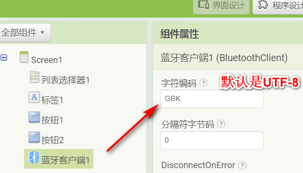

* TOC
{:toc}

[&laquo; 返回首页](index.html)

## 蓝牙通信过程中，数据出现乱码？

发送/接收如果是非预期或随机的乱码，大概率是波特率设置不对，HC-05的话改为9600试试。

## 数据符合预期，但是中文显示乱码？

解决方法：

{:.vip}
串口工具默认是GBK编码，非UTF-8的，如“你好”对应16进制：C4 E3 BA C3。而App Inventor 2的中文字符串默认是UTF-8编码的（E4 BD A0 E5 A5 BD ）。 
将App Inventor 2的蓝牙客户端组件的编码改为GBK即可。

{:.vip}

{:.vip}
当然，将串口编码格式改为UTF-8，App Inventor 2保持默认不变也能解决乱码问题：

{:.vip}

## 乱码的原理

{:.vip}
通信过程中，如果**两方的编码方式不统一，就会出现乱码现象**。就好比硬件发送了A规则的数据，App端用了B规则去解释，当然得不到预想的结果，乱码的原理即是如此。硬件端GBK编码的“你好”（C4 E3 BA C3）发送给了App端，App用UTF-8规则去解码的话，而“E4 BD A0 E5 A5 BD”才是UTF-8的“你好”，App端解析不了GBK版本的二进制数据内容，就乱码显示在界面上了，而改成GBK则按照GBK规则就能正确展示“你好”这个中文字符串。

## 解决乱码问题通用思路

{:.vip}
1、首先，先确定AppInventor收到的数据是否完全是乱的？如果完全不符合预期甚至随机乱码，这个肯定是波特率设置问题。 
2、如果ASCII字符能正常显示，如“15Km”显示正常，证明波特率没问题。 
3、中文显示乱码，那么就是两端编码方式不一致。因为ASCII码是最基本的编码，所有的字符集编码对于它都是通用的，因此英文字母一般不会出现乱码现象。 
小结：遇到乱码问题不用慌张，编码相关的问题不难解决，保证编码端和解码端的编码方式一致就行！

<!--
keil文件编码格式是GB2312 （GBK）    你appinventor 蓝牙客户端编码设置gbk应该就能解析传过来的中文了
串口工具各种中文测试是符合预期的，我没试过 keil，但终究是编码问题，可以尝试把.c 文件用 notepad++改成 utf8 编码试试，这样发送的中文内容就是 utf8，ai2 默认 utf8。
-->
