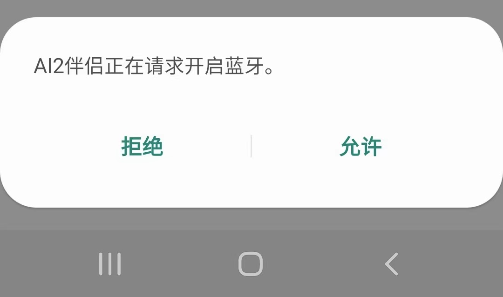

[&laquo; 返回首页](index.html)

有时用户手机没有开启蓝牙权限的情况下，蓝牙连接会失败，需要用户手动开启蓝牙，给用户带来一定的麻烦及学习成本（可能需要研究一下如何开启等），这时我们可以通过代码块实现弹窗提醒，用户同意后自动开启蓝牙功能。

### 1、代码如下：

{:.vip}

* 当蓝牙未启用时，会自动弹出交互框，让用户选择启用手机蓝牙。

* 当蓝牙已启用时，这2个代码块将没有任何效果（不提醒也不报错）。

**注意：**此代码块是右键导出的png，具有还原代码块的功能，无需手动一个个处理，还原方法请参考[这里](../other/download-pngs.html?f=bluetooth_request)。

### 2、当然也可加一个判断更严谨，代码如下：

{:.vip}

### 3、蓝牙开启提醒的交互效果如下：

