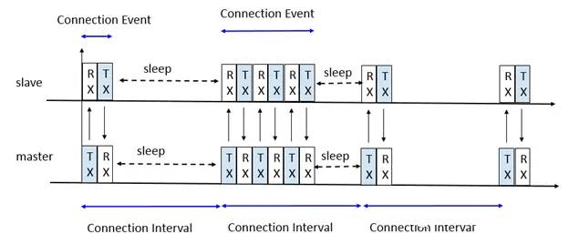
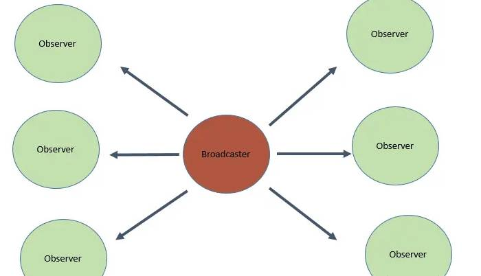

* TOC
{:toc}

[&laquo; 返回首页](index.html)

最新版拓展下载：

{:.vip}
[edu.mit.appinventor.ble-20230728.aix](assets/edu.mit.appinventor.ble-20230728.aix)

低功耗蓝牙，也称为蓝牙 LE 或简称 BLE，是一种类似于经典蓝牙的新通信协议，不同之处在于它旨在消耗更少的功耗，同时保持可比的功能。

因此，低功耗蓝牙是与耗电资源有限的物联网设备进行通信的首选。BluetoothLE 扩展需要 Android 5.0 或更高版本。

## 2种通信方式：扫描和广播

### 扫描

**详细接入步骤：**

{:.vip}
[开始扫描](#StartScanning) -> [获取BLE设备列表](#DeviceList) -> [连接指定设备](#Connect)（也可[指定MAC地址连接](#ConnectWithAddress)）-> 设备指定服务uuid和特征uuid [发送](#WriteBytes) / [接收](#ReadBytes) 数据。

### 广播

现在常规便宜芯片并无蓝牙协议栈，只能通过人工拼包用最简单的蓝牙广播方式通信，可以做到手机与设备进行简单的交互。

* 无连接的
* 是单向的，可以向任何人或者接收器发送数据。
* 使用广播方式通信没有任何安全措施，任何监听设备都能收到，因此它可能不适合于敏感数据，除非在广播数据中采用某种加密方法。
<!--https://zhuanlan.zhihu.com/p/669108821-->

**详细接入步骤：**

{:.vip}
[设置广播扫描周期](#AdvertisementScanPeriod) -> [广播扫描](#ScanAdvertisements) -> [获取广播设备列表](#AdvertiserAddresses) -> [获取设备服务uuids列表](#AdvertiserServiceUuids) -> 设备指定服务uuid [发送](#StartAdvertising) / [接收](#AdvertisementData) 广播数据。

更深入的通信原理请参考：[《BLE协议—广播和扫描》](https://bbs.tsingfun.com/thread-1692-1-1.html)。

## 属性

+ `AdvertisementScanPeriod` – 广播扫描周期：返回广播扫描周期的值（毫秒ms）。

+ `AdvertiserAddresses` – 广播者设备地址列表：返回在广播扫描期间找到的设备地址列表。

+ `AdvertiserNames` – 广播者设备名称列表：返回广播扫描期间找到的设备名称列表。

+ `AutoReconnect` – If true, the application will attempt to reestablish a lost connection to a device due to link loss (e.g., moving out of range). This will not apply to connections that are disconnected by a call to the <a href='#Disconnect'><code>Disconnect</code></a> method. Such disconnects will need to be reconnected via a call to <a href='#Connect'><code>Connect</code></a> or <a href='#ConnectWithAddress'><code>ConnectWithAddress</code></a>.

+ `BatteryValue` – Returns the battery level.

+ `ConnectedDeviceName` – The advertised name of the connected device. If no device is connected or Bluetooth low energy is not supported, this will return the empty string.

+ `ConnectedDeviceRssi` – Returns the RSSI (Received Signal Strength Indicator) of connected device.

+ `ConnectionTimeout` – The amount of time, in seconds, that the BluetoothLE component will wait for a connection to be established with a device after a call to <a href='#Connect'><code>Connect</code></a> or <a href='#ConnectWithAddress'><code>ConnectWithAddress</code></a>. If a connection is not established in the given amount of time, the attempt will be aborted and the <a href='#ConnectionFailed'><code>ConnectionFailed</code></a> event will be run.

+ `DeviceCharacteristics` – A list of triples, one for each characteristic advertised by the connected device, containing the service UUID, characteristic UUID, and the characteristic's name, if known. The format of the list will be ((service1 characteristic1 name1) (service2 characteristic2 name2) ...). If no device is connected or Bluetooth low energy is not supported, then an empty list will be returned.

+ `DeviceList` – Returns a sorted list of BluetoothLE devices as a String.

+ `DeviceServices` – A list of pairs, one for each advertised service, indicating the service's UUID and its name, if known. The format of the list will be ((uuid1 name1) (uuid2 name2) ...). If no device is connected or Bluetooth low energy is not supported, then an empty list will be returned.

+ `IsDeviceAdvertising` – Returns true if the device is currently advertising, false otherwise.

+ `IsDeviceConnected` – Returns true if a BluetoothLE device is connected; Otherwise, returns false.

+ `NoLocationNeeded` – Enable this option to assert that your app does not use Bluetooth to derive location data.
 If enabled, ACCESS_FINE_LOCATION permission will not be needed by the compiled app nor will
 the extension attempt to request permission.

+ `NullTerminateStrings` – Instructs the BluetoothLE component to terminate strings with a null byte (true) or not (false)
 when sending string data to a connected device.

+ `Scanning` – The scanning state of the Bluetooth low energy component.

+ `TxPower` – Returns the transmission power.

## 方法

+ `AdvertisementData` – Returns the advertisement data associated with the specified device address.

 __Parameters__:

     * <code>deviceAddress</code> (<a href="http://appinventor.mit.edu/explore/ai2/support/blocks/text.html#string">_text_</a>) &mdash;
       The Media Access Control (MAC) address of the target Bluetooth low energy device.
     * <code>serviceUuid</code> (<a href="http://appinventor.mit.edu/explore/ai2/support/blocks/text.html#string">_text_</a>) &mdash;
       The unique identifier of the advertised service.

+ `AdvertiserAddress` – Returns the address of the device with the name specified.

 __Parameters__:

     * <code>deviceName</code> (<a href="http://appinventor.mit.edu/explore/ai2/support/blocks/text.html#string">_text_</a>) &mdash;
       The advertised name of the target Bluetooth low energy device.

+ `AdvertiserServiceUuids` – Returns the list of services available on the advertising device.

 __Parameters__:

     * <code>deviceAddress</code> (<a href="http://appinventor.mit.edu/explore/ai2/support/blocks/text.html#string">_text_</a>) &mdash;
       The Media Access Control (MAC) address of the target Bluetooth low energy device.

+ `CanReadCharacteristic` – Tests whether the given characteristic can be read.

 __Parameters__:

     * <code>serviceUuid</code> (<a href="http://appinventor.mit.edu/explore/ai2/support/blocks/text.html#string">_text_</a>) &mdash;
       The unique identifier of the service to test for read capability.
     * <code>characteristicUuid</code> (<a href="http://appinventor.mit.edu/explore/ai2/support/blocks/text.html#string">_text_</a>) &mdash;
       The unique identifier of the characteristic to test for read capability.

+ `CanRegisterForCharacteristic` – Tests whether the given characteristic can be used to register for notifications.

 __Parameters__:

     * <code>serviceUuid</code> (<a href="http://appinventor.mit.edu/explore/ai2/support/blocks/text.html#string">_text_</a>) &mdash;
       The unique identifier of the service to test for notification capability.
     * <code>characteristicUuid</code> (<a href="http://appinventor.mit.edu/explore/ai2/support/blocks/text.html#string">_text_</a>) &mdash;
       The unique identifier of the characteristic to test for notification capability.

+ `CanWriteCharacteristic` – Tests whether the given characteristic can be written.

 __Parameters__:

     * <code>serviceUuid</code> (<a href="http://appinventor.mit.edu/explore/ai2/support/blocks/text.html#string">_text_</a>) &mdash;
       The unique identifier of the service to test for write capability.
     * <code>characteristicUuid</code> (<a href="http://appinventor.mit.edu/explore/ai2/support/blocks/text.html#string">_text_</a>) &mdash;
       The unique identifier of the characteristic to test for write capability.

+ `CanWriteCharacteristicWithResponse` – Tests whether the given characteristic can be written with an acknowledgement by the device.

 __Parameters__:

     * <code>serviceUuid</code> (<a href="http://appinventor.mit.edu/explore/ai2/support/blocks/text.html#string">_text_</a>) &mdash;
       The unique identifier of the service to test for write with response capability.
     * <code>characteristicUuid</code> (<a href="http://appinventor.mit.edu/explore/ai2/support/blocks/text.html#string">_text_</a>) &mdash;
       The unique identifier of the characteristic to test for write with response capability.

+ `CharacteristicByIndex` – Returns Unique ID of selected characteristic with index. Index specified by list
 of supported characteristics for a connected device, starting from 1.

 __Parameters__:

     * <code>index</code> (<a href="http://appinventor.mit.edu/explore/ai2/support/blocks/math.html#number">_number_</a>) &mdash;
       The index of the desired characteristic, which must be between 1 and the length of the characteristic list.

+ `Connect` – Use the <code>Connect</code> method to connect to a Bluetooth low energy device at the given
 index in the device list.

 __Parameters__:

     * <code>index</code> (<a href="http://appinventor.mit.edu/explore/ai2/support/blocks/math.html#number">_number_</a>) &mdash;
       The index of the target device, which must be between 1 and the length of the list.

+ `ConnectToDeviceType` – Connects to the first device found advertising with the given
 <code>name</code> and the service UUID associated with <code>device</code>.

 __Parameters__:

   * <code>device</code> (<a href="">_component_</a>) &mdash;
     A component block that represents a Bluetooth Low Energy device
   * <code>name</code> (a href="">_name_</a>) &mdash;
     The name advertised by the desired device,

+ `ConnectToDeviceWithServiceAndName` – Connects to the first device found advertising with the given
 <code>name</code> and the service UUID associated with <code>device</code>.

 __Parameters__:

   * <code>serviceUuid</code> (<a href="">_text_</a>) &mdash;
     The unique identifier of the service being broadcast by the device(s)
     of interest.
   * <code>name</code> (a href="">_name_</a>) &mdash;
     The name advertised by the desired device,

+ `ConnectWithAddress` – Use the <code>ConnectWithAddress</code> method to connect to a specific Bluetooth low energy
 device if its Media Access Control (MAC) address is known. If none of the devices in the device
 list matches the given address, the <a href="#ConnectionFailed"><code>ConnectionFailed</code></a>
 event will be run. Otherwise, if a connection is successful the
 <a href="#Connected"><code>Connected</code></a> event will be run.

 __Parameters__:

     * <code>address</code> (<a href="http://appinventor.mit.edu/explore/ai2/support/blocks/text.html#string" target="_blank">_text_</a>) &mdash;
       The MAC address of the target device, of the form "12:34:56:78:90:ab"

+ `Disconnect` – Disconnects from the currently connected BluetoothLE device if a device is connected.

+ `DisconnectWithAddress` – Disconnects from a connected BluetoothLE device with the given address.

 __Parameters__:

     * <code>address</code> (<a href="http://appinventor.mit.edu/explore/ai2/support/blocks/text.html#string" target="_blank">_text_</a>) &mdash;
       The Media Access Control (MAC) address of the device to disconnect, of the form "12:34:56:78:90:ab"

+ `FoundDeviceAddress` – Gets the Media Access Control (MAC) address of the found device at the given index in the
 device list. Index specifies the position in the BluetoothLE device list, starting from 1.

 __Parameter__:

     * <code>index</code> (<a href="http://appinventor.mit.edu/explore/ai2/support/blocks/math.html#number">_number_</a>) &mdash;
       The index of the desired device, which must be between 1 and the length of the device list.

+ `FoundDeviceName` – Gets the name of the found device at the given index in the device list.

 __Parameter__:

     * <code>index</code> (<a href="http://appinventor.mit.edu/explore/ai2/support/blocks/math.html#number">_number_</a>) &mdash;
       The index of the desired device, which must be between 1 and the length of the device list.

+ `FoundDeviceRssi` – Gets the Received Signal Strength Indicator (RSSI) of the found device at the given index.
 The returned value will be between -100 and 0 indicating the strength of the connection.

 __Parameter__:

     * <code>index</code> (<a href="http://appinventor.mit.edu/explore/ai2/support/blocks/math.html#number">_number_</a>) &mdash;
       The index of the desired device, which must be between 1 and the length of the device list.

+ `GetCharacteristicsForService` – Returns the list of supported characteristics for the given service. The list will contain
 (UUID, name) pairs for each characteristic provided by the service UUID.

 __Parameters__:

     * <code>serviceUuid</code> (<a href="http://appinventor.mit.edu/explore/ai2/support/blocks/text.html#string">_text_</a>) &mdash;
       The unique identifier of the service passed in the read or register call.

+ `ReadBytes` – Reads one or more 8-bit integer values from a connected BluetoothLE device. Service Unique ID
 and Characteristic UniqueID are required. The <code>signed</code> parameter indicates whether
 the bytes should be interpreted as signed values or not when being converted into App Inventor
 numbers. After the bytes are read, the <a href="#BytesReceived"><code>BytesReceived</code></a>
 event will be run.

 __Parameters__:

     * <code>serviceUuid</code> (<a href="http://appinventor.mit.edu/explore/ai2/support/blocks/text.html#string">_text_</a>) &mdash;
       The unique identifier of the service passed in the read or register call.
     * <code>characteristicUuid</code> (<a href="http://appinventor.mit.edu/explore/ai2/support/blocks/text.html#string">_text_</a>) &mdash;
       The unique identifier of the characteristic in the read or register call.
     * <code>signed</code> (<a href="http://appinventor.mit.edu/explore/ai2/support/blocks/logic.html#true" target="_blank">_boolean_</a>)
       Interpret the bytes as signed (true) or unsigned (false).

+ `ReadConnectedRssi` – Initiates a read of the connected device's Received Signal Strength Indicator (RSSI). The
 resulting value will be reported via the RssiChanged event.

+ `ReadFloats` – Reads one or more IEEE 754 floating point numbers from a connected BluetoothLE device. Service Unique ID
 and Characteristic UniqueID are required. The <code>shortFloat</code> parameter indicates whether
 the floats are either 16-bit half-precision floating point or 32-bit single precision floating point
 numbers. After the floats are read, the <a href="#FloatsReceived"><code>FloatsReceived</code></a>
 event will be run.

 __Parameters__:

     * <code>serviceUuid</code> (<a href="http://appinventor.mit.edu/explore/ai2/support/blocks/text.html#string">_text_</a>) &mdash;
       The unique identifier of the service passed in the read or register call.
     * <code>characteristicUuid</code> (<a href="http://appinventor.mit.edu/explore/ai2/support/blocks/text.html#string">_text_</a>) &mdash;
       The unique identifier of the characteristic in the read or register call.
     * <code>shortFloat</code> (<a href="http://appinventor.mit.edu/explore/ai2/support/blocks/logic.html#true" target="_blank">_boolean_</a>)
       Interpret the floats as 16-bit half-precision (true) or 32-bit single-precision (false).

+ `ReadIntegers` – Reads one or more 32-bit integer values from a connected BluetoothLE device. Service Unique ID
 and Characteristic UniqueID are required. The <code>signed</code> parameter indicates whether
 the integers should be interpreted as signed values or not when being converted into App Inventor
 numbers. After the integers are read, the
 <a href="#IntegersReceived"><code>IntegersReceived</code></a> event will be run.

 __Parameters__:

     * <code>serviceUuid</code> (<a href="http://appinventor.mit.edu/explore/ai2/support/blocks/text.html#string">_text_</a>) &mdash;
       The unique identifier of the service passed in the read or register call.
     * <code>characteristicUuid</code> (<a href="http://appinventor.mit.edu/explore/ai2/support/blocks/text.html#string">_text_</a>) &mdash;
       The unique identifier of the characteristic in the read or register call.
     * <code>signed</code> (<a href="http://appinventor.mit.edu/explore/ai2/support/blocks/logic.html#true" target="_blank">_boolean_</a>)
       Interpret the integers as signed (true) or unsigned (false).

+ `ReadShorts` – Reads one or more 16-bit integer values from a connected BluetoothLE device. Service Unique ID
 and Characteristic UniqueID are required. The <code>signed</code> parameter indicates whether
 the shorts should be interpreted as signed values or not when being converted into App Inventor
 numbers. After the shorts are read, the <a href="#ShortsReceived"><code>ShortsReceived</code></a>
 event will be run.

 __Parameters__:

     * <code>serviceUuid</code> (<a href="http://appinventor.mit.edu/explore/ai2/support/blocks/text.html#string">_text_</a>) &mdash;
       The unique identifier of the service passed in the read or register call.
     * <code>characteristicUuid</code> (<a href="http://appinventor.mit.edu/explore/ai2/support/blocks/text.html#string">_text_</a>) &mdash;
       The unique identifier of the characteristic in the read or register call.
     * <code>signed</code> (<a href="http://appinventor.mit.edu/explore/ai2/support/blocks/logic.html#true" target="_blank">_boolean_</a>)
       Interpret the shorts as signed (true) or unsigned (false).

+ `ReadStrings` – Reads one or more null-terminated strings from a connected BluetoothLE device. Service Unique ID
 and Characteristic Unique ID are required. The <code>utf16</code> parameter indicates whether
 the content should be decoded as UTF-16 (true) or UTF-8 (false) code points when converting to
 App Inventor strings. After the strings are read, the
 <a href="#StringsReceived"><code>StringsReceived</code></a> event will be run.

 __Parameters__:

     * <code>serviceUuid</code> (<a href="http://appinventor.mit.edu/explore/ai2/support/blocks/text.html#string">_text_</a>) &mdash;
       The unique identifier of the service passed in the read or register call.
     * <code>characteristicUuid</code> (<a href="http://appinventor.mit.edu/explore/ai2/support/blocks/text.html#string">_text_</a>) &mdash;
       The unique identifier of the characteristic in the read or register call.
     * <code>utf16</code> (<a href="http://appinventor.mit.edu/explore/ai2/support/blocks/logic.html#true" target="_blank">_boolean_</a>)
       Interpret the string content as UTF-16 (true) or UTF-8 (false) code points.

+ `RegisterForBytes` – Registers to receive updates when one or more 8-bit integer values from a connected BluetoothLE
 device are changed. Service Unique ID and Characteristic Unique ID are required. The
 <code>signed</code> parameter indicates whether the bytes should be interpreted as signed
 values or not when being converted into App Inventor numbers. Whenever a change is received,
 the <a href="#BytesReceived"><code>BytesReceived</code></a> event will be run.

 __Parameters__:

     * <code>serviceUuid</code> (<a href="http://appinventor.mit.edu/explore/ai2/support/blocks/text.html#string">_text_</a>) &mdash;
       The unique identifier of the service passed in the read or register call.
     * <code>characteristicUuid</code> (<a href="http://appinventor.mit.edu/explore/ai2/support/blocks/text.html#string">_text_</a>) &mdash;
       The unique identifier of the characteristic in the read or register call.
     * <code>signed</code> (<a href="http://appinventor.mit.edu/explore/ai2/support/blocks/logic.html#true" target="_blank">_boolean_</a>)
       Interpret the bytes as signed (true) or unsigned (false).

+ `RegisterForFloats` – Registers to receive updates when one or more IEEE 754 floating point numbers from a connected
 BluetoothLE device are changed. Service Unique ID and Characteristic Unique ID are required. The
 <code>shortFloat</code> parameter indicates whether the floats are either 16-bit half-precision
 floating point or 32-bit single precision floating point numbers. Whenever a change is received,
 the <a href="#FloatsReceived"><code>FloatsReceived</code></a> event will be run.

 __Parameters__:

     * <code>serviceUuid</code> (<a href="http://appinventor.mit.edu/explore/ai2/support/blocks/text.html#string">_text_</a>) &mdash;
       The unique identifier of the service passed in the read or register call.
     * <code>characteristicUuid</code> (<a href="http://appinventor.mit.edu/explore/ai2/support/blocks/text.html#string">_text_</a>) &mdash;
       The unique identifier of the characteristic in the read or register call.
     * <code>shortFloat</code> (<a href="http://appinventor.mit.edu/explore/ai2/support/blocks/logic.html#true" target="_blank">_boolean_</a>)
       Interpret the floats as 16-bit half-precision (true) or 32-bit single-precision (false).

+ `RegisterForIntegers` – Registers to receive updates when one or more 32-bit integer values from a connected BluetoothLE
 device are changed. Service Unique ID and Characteristic Unique ID are required. The
 <code>signed</code> parameter indicates whether the integers should be interpreted as signed
 values or not when being converted into App Inventor numbers. Whenever a change is received,
 the <a href="#IntegersReceived"><code>IntegersReceived</code></a> event will be run.

 __Parameters__:

     * <code>serviceUuid</code> (<a href="http://appinventor.mit.edu/explore/ai2/support/blocks/text.html#string">_text_</a>) &mdash;
       The unique identifier of the service passed in the read or register call.
     * <code>characteristicUuid</code> (<a href="http://appinventor.mit.edu/explore/ai2/support/blocks/text.html#string">_text_</a>) &mdash;
       The unique identifier of the characteristic in the read or register call.
     * <code>signed</code> (<a href="http://appinventor.mit.edu/explore/ai2/support/blocks/logic.html#true" target="_blank">_boolean_</a>)
       Interpret the integers as signed (true) or unsigned (false).

+ `RegisterForShorts` – Registers to receive updates when one or more 16-bit integer values from a connected BluetoothLE
 device are changed. Service Unique ID and Characteristic Unique ID are required. The
 <code>signed</code> parameter indicates whether the shorts should be interpreted as signed
 values or not when being converted into App Inventor numbers. Whenever a change is received,
 the <a href="#ShortsReceived"><code>ShortsReceived</code></a> event will be run.

 __Parameters__:

     * <code>serviceUuid</code> (<a href="http://appinventor.mit.edu/explore/ai2/support/blocks/text.html#string">_text_</a>) &mdash;
       The unique identifier of the service passed in the read or register call.
     * <code>characteristicUuid</code> (<a href="http://appinventor.mit.edu/explore/ai2/support/blocks/text.html#string">_text_</a>) &mdash;
       The unique identifier of the characteristic in the read or register call.
     * <code>signed</code> (<a href="http://appinventor.mit.edu/explore/ai2/support/blocks/logic.html#true" target="_blank">_boolean_</a>)
       Interpret the shorts as signed (true) or unsigned (false).

+ `RegisterForStrings` – Registers to receive updates when one or more null-terminated strings from a connected
 BluetoothLE device are changed. Service Unique ID and Characteristic Unique ID are required. The
 <code>utf16</code> parameter indicates whether the content should be decoded as UTF-16 (true)
 or UTF-8 (false) code points when converting to App Inventor strings. Whenever a change is
 received, the <a href="#StringsReceived"><code>StringsReceived</code></a> event will be run.

 __Parameters__:

     * <code>serviceUuid</code> (<a href="http://appinventor.mit.edu/explore/ai2/support/blocks/text.html#string">_text_</a>) &mdash;
       The unique identifier of the service passed in the read or register call.
     * <code>characteristicUuid</code> (<a href="http://appinventor.mit.edu/explore/ai2/support/blocks/text.html#string">_text_</a>) &mdash;
       The unique identifier of the characteristic in the read or register call.
     * <code>utf16</code> (<a href="http://appinventor.mit.edu/explore/ai2/support/blocks/logic.html#true" target="_blank">_boolean_</a>)
       Interpret the string content as UTF-16 (true) or UTF-8 (false) code points.

+ `RequestMTU` – Requests a new minimum transmission unit (MUT) for the BluetoothLE connection. This feature
 is only supported when both devices support Bluetooth 4.2 or higher. If the MTU is changed
 successfully, the MTUChanged event will be run. The default MTU is 20.

 This block is intended for advanced apps that need to change the size of the messages sent
 between the BLE devices. Most developers will not need to adjust this value.

 __Parameters__:

   * <code>bytes</code> (<a href="">_number_</a>) &mdash;
     The desired MTU size.

+ `ScanAdvertisements` – Scans for advertising Bluetooth low energy devices.

 __Parameter__:

     * <code>scanPeriod</code> (<a href="http://appinventor.mit.edu/explore/ai2/support/blocks/math.html#number">_number_</a>) &mdash;
       The amount of time to spend scanning, in milliseconds.

+ `ScanForDevice` – Scans for a particular type of device. The device component must implement
 the BLEDevice interface in order for this method to work.

 __Parameters__:

   * <code>param</code> (<a href="">_component_</a>) &mdash;
     A component block that expects a particular service.

+ `ScanForService` – Scans for devices advertising a particular Bluetooth low energy service
 by UUID.

 __Parameters__:

   * <code>serviceUuid</code> (<a href="">_text_</a>) &mdash;
     The unique identifier of the service being broadcast by the device(s)
     of interest.

+ `ServiceByIndex` – Returns the Unique ID of the service at the given index in the service list.

 __Parameters__:

     * <code>index</code> (<a href="http://appinventor.mit.edu/explore/ai2/support/blocks/math.html#number">_number_</a>) &mdash;
       The index of the desired service, which must be between 1 and the length of the service list.

+ `StartAdvertising` – Creates and publishes a Bluetooth low energy advertisement.

 __Parameters__:

     * <code>inData</code> (<a href="http://appinventor.mit.edu/explore/ai2/support/blocks/text.html#string">_text_</a>) &mdash;
       The data to be included in the service advertisement.
     * <code>serviceUuid</code> (<a href="http://appinventor.mit.edu/explore/ai2/support/blocks/text.html#string">_text_</a>) &mdash;
       The unique identifier of the service passed in the read or register call.

+ `StartScanning` – Starts scanning for Bluetooth low energy devices.

+ `StopAdvertising` – Stops Bluetooth low energy advertisement from a previous call to
 <a href="#StartAdvertising"><code>StartAdvertising</code></a>.

+ `StopScanning` – Stops scanning for Bluetooth low energy devices.

+ `StopScanningAdvertisements` – Stops scanning for Bluetooth low energy advertisements.

+ `SupportedCharacteristics` – Returns a list of supported characteristic for the connected device as a string.

+ `SupportedServices` – Returns the list of supported service for the connected device as a string.

+ `UnregisterForValues` – Unregisters for updates from the given service and characteristic.

 __Parameters__:

     * <code>serviceUuid</code> (<a href="http://appinventor.mit.edu/explore/ai2/support/blocks/text.html#string">_text_</a>) &mdash;
       The unique identifier of the service passed in the read or register call.
     * <code>characteristicUuid</code> (<a href="http://appinventor.mit.edu/explore/ai2/support/blocks/text.html#string">_text_</a>) &mdash;
       The unique identifier of the characteristic in the read or register call.

+ `WriteBytes` – Writes one or more 8-bit integer values to a connected BluetoothLE device. Service Unique ID
 and Characteristic Unique ID are required. The values parameter can either be a single numeric
 value or a list of values. If <code>signed</code> is true, the acceptable values are
 between -128 and 127. If <code>signed</code> is false, the acceptable values are
 between 0 and 255.

 __Parameters__:

     * <code>serviceUuid</code> (<a href="http://appinventor.mit.edu/explore/ai2/support/blocks/text.html#string">_text_</a>) &mdash;
       The unique identifier of the service passed in the read or register call.
     * <code>characteristicUuid</code> (<a href="http://appinventor.mit.edu/explore/ai2/support/blocks/text.html#string">_text_</a>) &mdash;
       The unique identifier of the characteristic in the read or register call.
     * <code>signed</code> (<a href="http://appinventor.mit.edu/explore/ai2/support/blocks/logic.html#true" target="_blank">_boolean_</a>)
       Interpret the bytes as signed (true) or unsigned (false).
     * <code>values</code> (<a href="http://appinventor.mit.edu/explore/ai2/support/blocks/lists.html#makealist">_list_</a>) &mdash;
       A list of values to write to the device.

+ `WriteBytesWithResponse` – Writes one or more 8-bit integer values to a connected BluetoothLE device and waits for an
 acknowledgement via the <a href="#BytesWritten"><code>BytesWritten</code></a> event.
 Service Unique ID and Characteristic Unique ID are required. The values parameter can either
 be a single numeric value or a list of values. If <code>signed</code> is true, the acceptable
 values are between -128 and 127. If <code>signed</code> is false, the acceptable values are
 between 0 and 255.

 __Parameters__:

     * <code>serviceUuid</code> (<a href="http://appinventor.mit.edu/explore/ai2/support/blocks/text.html#string">_text_</a>) &mdash;
       The unique identifier of the service passed in the read or register call.
     * <code>characteristicUuid</code> (<a href="http://appinventor.mit.edu/explore/ai2/support/blocks/text.html#string">_text_</a>) &mdash;
       The unique identifier of the characteristic in the read or register call.
     * <code>signed</code> (<a href="http://appinventor.mit.edu/explore/ai2/support/blocks/logic.html#true" target="_blank">_boolean_</a>)
       Interpret the bytes as signed (true) or unsigned (false).
     * <code>values</code> (<a href="http://appinventor.mit.edu/explore/ai2/support/blocks/lists.html#makealist">_list_</a>) &mdash;
       A list of values to write to the device.

+ `WriteFloats` – Writes one or more IEEE 754 floating point numbers to a connected BluetoothLE device. Service Unique ID
 and Characteristic Unique ID are required. The values parameter can either be a single numeric
 value or a list of values. If <code>shortFloat</code> is true, then each numeric value will be
 compressed to fit into a 16-bit half-precision floating point value. If <code>shortFloat</code>
 is false, then each numeric value will be sent as a 32-bit single precision floating point value.

 __Parameters__:

     * <code>serviceUuid</code> (<a href="http://appinventor.mit.edu/explore/ai2/support/blocks/text.html#string">_text_</a>) &mdash;
       The unique identifier of the service passed in the read or register call.
     * <code>characteristicUuid</code> (<a href="http://appinventor.mit.edu/explore/ai2/support/blocks/text.html#string">_text_</a>) &mdash;
       The unique identifier of the characteristic in the read or register call.
     * <code>shortFloat</code> (<a href="http://appinventor.mit.edu/explore/ai2/support/blocks/logic.html#true" target="_blank">_boolean_</a>)
       Interpret the floats as 16-bit half-precision (true) or 32-bit single-precision (false).
     * <code>values</code> (<a href="http://appinventor.mit.edu/explore/ai2/support/blocks/lists.html#makealist">_list_</a>) &mdash;
       A list of values to write to the device.

+ `WriteFloatsWithResponse` – Writes one or more IEEE 754 floating point values to a connected BluetoothLE device and waits for an
 acknowledgement via the <a href="#FloatsWritten"><code>FloatsWritten</code></a> event.
 Service Unique ID and Characteristic Unique ID are required. The values parameter can either
 be a single numeric value or a list of values. If <code>shortFloat</code> is false,
 then each numeric value will be sent as a 32-bit single precision floating point value.

 __Parameters__:

     * <code>serviceUuid</code> (<a href="http://appinventor.mit.edu/explore/ai2/support/blocks/text.html#string">_text_</a>) &mdash;
       The unique identifier of the service passed in the read or register call.
     * <code>characteristicUuid</code> (<a href="http://appinventor.mit.edu/explore/ai2/support/blocks/text.html#string">_text_</a>) &mdash;
       The unique identifier of the characteristic in the read or register call.
     * <code>shortFloat</code> (<a href="http://appinventor.mit.edu/explore/ai2/support/blocks/logic.html#true" target="_blank">_boolean_</a>)
       Interpret the floats as 16-bit half-precision (true) or 32-bit single-precision (false).
     * <code>values</code> (<a href="http://appinventor.mit.edu/explore/ai2/support/blocks/lists.html#makealist">_list_</a>) &mdash;
       A list of values to write to the device.

+ `WriteIntegers` – Writes one or more 32-bit integer values to a connected BluetoothLE device. Service Unique ID
 and Characteristic Unique ID are required. The values parameter can either be a single numeric
 value or a list of values. If <code>signed</code> is true, the acceptable values are
 between -2147483648 and 2147483647. If <code>signed</code> is false, the acceptable values are
 between 0 and 4294967295.

 __Parameters__:

     * <code>serviceUuid</code> (<a href="http://appinventor.mit.edu/explore/ai2/support/blocks/text.html#string">_text_</a>) &mdash;
       The unique identifier of the service passed in the read or register call.
     * <code>characteristicUuid</code> (<a href="http://appinventor.mit.edu/explore/ai2/support/blocks/text.html#string">_text_</a>) &mdash;
       The unique identifier of the characteristic in the read or register call.
     * <code>signed</code> (<a href="http://appinventor.mit.edu/explore/ai2/support/blocks/logic.html#true" target="_blank">_boolean_</a>)
       Interpret the integers as signed (true) or unsigned (false).
     * <code>values</code> (<a href="http://appinventor.mit.edu/explore/ai2/support/blocks/lists.html#makealist">_list_</a>) &mdash;
       A list of values to write to the device.

+ `WriteIntegersWithResponse` – Writes one or more 32-bit integer values to a connected BluetoothLE device and waits for an
 acknowledgement via the <a href="#IntegersWritten"><code>IntegersWritten</code></a> event.
 Service Unique ID and Characteristic Unique ID are required. The values parameter can either
 be a single numeric value or a list of values. If <code>signed</code> is true, the acceptable
 values are between -2147483648 and 2147483647. If <code>signed</code> is false, the acceptable
 values are between 0 and 4294967295.

 __Parameters__:

     * <code>serviceUuid</code> (<a href="http://appinventor.mit.edu/explore/ai2/support/blocks/text.html#string">_text_</a>) &mdash;
       The unique identifier of the service passed in the read or register call.
     * <code>characteristicUuid</code> (<a href="http://appinventor.mit.edu/explore/ai2/support/blocks/text.html#string">_text_</a>) &mdash;
       The unique identifier of the characteristic in the read or register call.
     * <code>signed</code> (<a href="http://appinventor.mit.edu/explore/ai2/support/blocks/logic.html#true" target="_blank">_boolean_</a>)
       Interpret the integers as signed (true) or unsigned (false).
     * <code>values</code> (<a href="http://appinventor.mit.edu/explore/ai2/support/blocks/lists.html#makealist">_list_</a>) &mdash;
       A list of values to write to the device.

+ `WriteShorts` – Writes one or more 16-bit integer values to a connected BluetoothLE device. Service Unique ID
 and Characteristic Unique ID are required. The values parameter can either be a single numeric
 value or a list of values. If <code>signed</code> is true, the acceptable values are
 between -32768 and 32767. If <code>signed</code> is false, the acceptable values are
 between 0 and 65535.

 __Parameters__:

     * <code>serviceUuid</code> (<a href="http://appinventor.mit.edu/explore/ai2/support/blocks/text.html#string">_text_</a>) &mdash;
       The unique identifier of the service passed in the read or register call.
     * <code>characteristicUuid</code> (<a href="http://appinventor.mit.edu/explore/ai2/support/blocks/text.html#string">_text_</a>) &mdash;
       The unique identifier of the characteristic in the read or register call.
     * <code>signed</code> (<a href="http://appinventor.mit.edu/explore/ai2/support/blocks/logic.html#true" target="_blank">_boolean_</a>)
       Interpret the shorts as signed (true) or unsigned (false).
     * <code>values</code> (<a href="http://appinventor.mit.edu/explore/ai2/support/blocks/lists.html#makealist">_list_</a>) &mdash;
       A list of values to write to the device.

+ `WriteShortsWithResponse` – Writes one or more 16-bit integer values to a connected BluetoothLE device and waits for an
 acknowledgement via the <a href="#ShortsWritten"><code>ShortsWritten</code></a> event.
 Service Unique ID and Characteristic Unique ID are required. The values parameter can either
 be a single numeric value or a list of values. If <code>signed</code> is true, the acceptable
 values are between -32768 and 32767. If <code>signed</code> is false, the acceptable values
 are between 0 and 65535.

 __Parameters__:

     * <code>serviceUuid</code> (<a href="http://appinventor.mit.edu/explore/ai2/support/blocks/text.html#string">_text_</a>) &mdash;
       The unique identifier of the service passed in the read or register call.
     * <code>characteristicUuid</code> (<a href="http://appinventor.mit.edu/explore/ai2/support/blocks/text.html#string">_text_</a>) &mdash;
       The unique identifier of the characteristic in the read or register call.
     * <code>signed</code> (<a href="http://appinventor.mit.edu/explore/ai2/support/blocks/logic.html#true" target="_blank">_boolean_</a>)
       Interpret the shorts as signed (true) or unsigned (false).
     * <code>values</code> (<a href="http://appinventor.mit.edu/explore/ai2/support/blocks/lists.html#makealist">_list_</a>) &mdash;
       A list of values to write to the device.

+ `WriteStrings` – Writes one or more strings to a connected BluetoothLE device. Service Unique ID and
 Characteristic Unique ID are required. The values parameter can either be a single string or a
 list of strings. If <code>utf16</code> is true, the string(s) will be sent using UTF-16 little
 endian encoding. If <code>utf16</code> is false, the string(s) will be sent using UTF-8
 encoding.

 __Parameters__:

     * <code>serviceUuid</code> (<a href="http://appinventor.mit.edu/explore/ai2/support/blocks/text.html#string">_text_</a>) &mdash;
       The unique identifier of the service passed in the read or register call.
     * <code>characteristicUuid</code> (<a href="http://appinventor.mit.edu/explore/ai2/support/blocks/text.html#string">_text_</a>) &mdash;
       The unique identifier of the characteristic in the read or register call.
     * <code>utf16</code> (<a href="http://appinventor.mit.edu/explore/ai2/support/blocks/logic.html#true" target="_blank">_boolean_</a>)
       Send the string encoded as UTF-16 little endian (true) or UTF-8 (false) code points.
     * <code>values</code> (<a href="http://appinventor.mit.edu/explore/ai2/support/blocks/lists.html#makealist">_list_</a>) &mdash;
       A list of values to write to the device.

+ `WriteStringsWithResponse` – Writes one or more strings to a connected BluetoothLE device and waits for an acknowledgement
 via the <a href="#StringsWritten"><code>StringsWritten</code></a> event. Service Unique ID and
 Characteristic Unique ID are required. The values parameter can either be a single string or a
 list of values. If <code>utf16</code> is true, the string(s) will be sent using UTF-16 little
 endian encoding. If <code>utf16</code> is false, the string(s) will be sent using UTF-8
 encoding.

 __Parameters__:

     * <code>serviceUuid</code> (<a href="http://appinventor.mit.edu/explore/ai2/support/blocks/text.html#string">_text_</a>) &mdash;
       The unique identifier of the service passed in the read or register call.
     * <code>characteristicUuid</code> (<a href="http://appinventor.mit.edu/explore/ai2/support/blocks/text.html#string">_text_</a>) &mdash;
       The unique identifier of the characteristic in the read or register call.
     * <code>utf16</code> (<a href="http://appinventor.mit.edu/explore/ai2/support/blocks/logic.html#true" target="_blank">_boolean_</a>)
       Send the string encoded as UTF-16 little endian (true) or UTF-8 (false) code points.
     * <code>values</code> (<a href="http://appinventor.mit.edu/explore/ai2/support/blocks/lists.html#makealist">_list_</a>) &mdash;
       A list of values to write to the device.

## 事件

+ `BytesReceived` – The <code>BytesReceived</code> event is run when one or more byte values are received from a
 connected Bluetooth device. Depending on the <code>sign</code> parameter of the last call to
 <a href="#ReadBytes"><code>ReadBytes</code></a> or
 <a href="#RegisterForBytes"><code>RegisterForBytes</code></a> for the given
 <code>serviceUuid</code> and <code>characteristicUuid</code>, the <code>byteValues</code> list
 will contain numbers ranging from -128 to 127 (<code>signed = true</code>)
 or 0 to 255 (<code>signed = false</code>).

 __Parameters__:

     * <code>serviceUuid</code> (<a href="http://appinventor.mit.edu/explore/ai2/support/blocks/text.html#string">_text_</a>) &mdash;
       The unique identifier of the service passed in the read or register call.
     * <code>characteristicUuid</code> (<a href="http://appinventor.mit.edu/explore/ai2/support/blocks/text.html#string">_text_</a>) &mdash;
       The unique identifier of the characteristic in the read or register call.
     * <code>byteValues</code> (<a href="http://appinventor.mit.edu/explore/ai2/support/blocks/listsU.html#makealist">_list_</a>) &mdash;
       A list of values read from the device. The range of each value will depend on the <code>sign</code> flag previously specified in the call to read or register.

+ `BytesWritten` – The <code>BytesWritten</code> event is run when one or more byte values are written to a
 connected Bluetooth device. <code>byteValues</code> will be a list of values actually written
 to the device. This may be different if the original input was too long to fit into a single
 transmission unit (typically 23 bytes).

 __Parameters__:

     * <code>serviceUuid</code> (<a href="http://appinventor.mit.edu/explore/ai2/support/blocks/text.html#string">_text_</a>) &mdash;
       The unique identifier of the service passed in the read or register call.
     * <code>characteristicUuid</code> (<a href="http://appinventor.mit.edu/explore/ai2/support/blocks/text.html#string">_text_</a>) &mdash;
       The unique identifier of the characteristic in the read or register call.
     * <code>byteValues</code> (<a href="http://appinventor.mit.edu/explore/ai2/support/blocks/lists.html#makealist">_list_</a>) &mdash;
       A list of values written to the device.

+ `Connected` – The <code>Connected</code> event is run after the application successfully connects to a
 Bluetooth low energy device. This can be the result of a call to
 <a href='#Connect'><code>Connect</code></a> or
 <a href='#ConnectWithAddress'><code>ConnectWithAddress</code></a>, or as a result of an
 automatic reconnect if the <a href='#AutoReconnect'><code>AutoReconnect</code></a> property
 was true at the time a connection was requested.

+ `ConnectionFailed` – The <code>ConnectionFailed</code> event is run when an attempt to connect to a device does not
 succeed. If a reason is provided by the Bluetooth low energy stack it will be reported via the
 <code>reason</code> parameter.

 __Parameters__:

     * <code>reason</code> (<a href="http://appinventor.mit.edu/explore/ai2/support/blocks/text.html#string" target="_blank">_text_</a>) &mdash;
       The reason the connection failed, if known.

+ `DeviceFound` – The <code>DeviceFound</code> event is run when a new Bluetooth low energy device is found.

+ `Disconnected` – The <code>Disconnected</code> event is run when a Bluetooth low energy device is disconnected.
 This can be caused by a call to <a href="#Disconnect"><code>Disconnect</code></a> or
 <a href="#DisconnectWithAddress"><code>DisconnectWithAddress</code></a>, or after a device
 is moved away or reset such that a loss of connection occurs.

+ `FloatsReceived` – The <code>FloatsReceived</code> event is run when one or more IEEE 754 floating point values are received from a
 connected Bluetooth device. Depending on the <code>shortFloat</code> parameter of the last call to
 <a href="#ReadFloats"><code>ReadFloats</code></a> or
 <a href="#RegisterForFloats"><code>RegisterForFloats</code></a> for the given
 <code>serviceUuid</code> and <code>characteristicUuid</code>, the <code>floatValues</code> list
 will contain numbers ranging from -65504.0 to 65504.0 (<code>shortFloat = true</code>)
 or -3.402823466E38 to 3.402823466E38 (<code>shortFloat = false</code>).

 __Parameters__:

     * <code>serviceUuid</code> (<a href="http://appinventor.mit.edu/explore/ai2/support/blocks/text.html#string">_text_</a>) &mdash;
       The unique identifier of the service passed in the read or register call.
     * <code>characteristicUuid</code> (<a href="http://appinventor.mit.edu/explore/ai2/support/blocks/text.html#string">_text_</a>) &mdash;
       The unique identifier of the characteristic in the read or register call.
     * <code>floatValues</code> (<a href="http://appinventor.mit.edu/explore/ai2/support/blocks/lists.html#makealist">_list_</a>) &mdash;
       A list of values read from the device. The range of each value will depend on the <code>sign</code> flag previously specified in the call to read or register.

+ `FloatsWritten` – The <code>FloatsWritten</code> event is run when one or more IEEE 754 floating point values are written to a
 connected Bluetooth device. <code>floatValues</code> will be a list of values actually written
 to the device. This may be different if the original input was too long to fit into a single
 transmission unit (typically 11 short floats or 5 regular floats).

 __Parameters__:

     * <code>serviceUuid</code> (<a href="http://appinventor.mit.edu/explore/ai2/support/blocks/text.html#string">_text_</a>) &mdash;
       The unique identifier of the service passed in the read or register call.
     * <code>characteristicUuid</code> (<a href="http://appinventor.mit.edu/explore/ai2/support/blocks/text.html#string">_text_</a>) &mdash;
       The unique identifier of the characteristic in the read or register call.
     * <code>floatValues</code> (<a href="http://appinventor.mit.edu/explore/ai2/support/blocks/lists.html#makealist">_list_</a>) &mdash;
       A list of values written to the device.

+ `IntegersReceived` – The <code>IntegersReceived</code> event is run when one or more 32-bit integer values are received from a
 connected Bluetooth device. Depending on the <code>sign</code> parameter of the last call to
 <a href="#ReadIntegers"><code>ReadIntegers</code></a> or
 <a href="#RegisterForIntegers"><code>RegisterForIntegers</code></a> for the given
 <code>serviceUuid</code> and <code>characteristicUuid</code>, the <code>intValues</code> list
 will contain numbers ranging from -2147483648 to 2147483647 (<code>signed = true</code>)
 or 0 to 4294967296 (<code>signed = false</code>).

 __Parameters__:

     * <code>serviceUuid</code> (<a href="http://appinventor.mit.edu/explore/ai2/support/blocks/text.html#string">_text_</a>) &mdash;
       The unique identifier of the service passed in the read or register call.
     * <code>characteristicUuid</code> (<a href="http://appinventor.mit.edu/explore/ai2/support/blocks/text.html#string">_text_</a>) &mdash;
       The unique identifier of the characteristic in the read or register call.
     * <code>intValues</code> (<a href="http://appinventor.mit.edu/explore/ai2/support/blocks/lists.html#makealist">_list_</a>) &mdash;
       A list of values read from the device. The range of each value will depend on the <code>sign</code> flag previously specified in the call to read or register.

+ `IntegersWritten` – The <code>IntegersWritten</code> event is run when one or more 32-bit integers values are written to a
 connected Bluetooth device. <code>intValues</code> will be a list of values actually written
 to the device. This may be different if the original input was too long to fit into a single
 transmission unit (typically 5 integers).

 __Parameters__:

     * <code>serviceUuid</code> (<a href="http://appinventor.mit.edu/explore/ai2/support/blocks/text.html#string">_text_</a>) &mdash;
       The unique identifier of the service passed in the read or register call.
     * <code>characteristicUuid</code> (<a href="http://appinventor.mit.edu/explore/ai2/support/blocks/text.html#string">_text_</a>) &mdash;
       The unique identifier of the characteristic in the read or register call.
     * <code>intValues</code> (<a href="http://appinventor.mit.edu/explore/ai2/support/blocks/lists.html#makealist">_list_</a>) &mdash;
       A list of values written to the device.

+ `MTUChanged` – The MTUChanged event is run when the two BluetoothLE devices have successfully changed their
 maximum transmission unit (MTU) to a different value. This event will only run in response
 to a call to the method block RequestMTU.

 __Parameters__:

   * <code>bytes</code> (<a href="">_number_</a>) &mdash;
     The new size, in bytes, of the new MTU.

+ `RssiChanged` – Trigger event when RSSI (Received Signal Strength Indicator) of found BluetoothLE device changes

+ `ShortsReceived` – The <code>ShortsReceived</code> event is run when one or more short integer values are received from a
 connected Bluetooth device. Depending on the <code>sign</code> parameter of the last call to
 <a href="#ReadShorts"><code>ReadShorts</code></a> or
 <a href="#RegisterForShorts"><code>RegisterForShorts</code></a> for the given
 <code>serviceUuid</code> and <code>characteristicUuid</code>, the <code>shortValues</code> list
 will contain numbers ranging from -32768 to 32767 (<code>signed = true</code>)
 or 0 to 65535 (<code>signed = false</code>).

 __Parameters__:

     * <code>serviceUuid</code> (<a href="http://appinventor.mit.edu/explore/ai2/support/blocks/text.html#string">_text_</a>) &mdash;
       The unique identifier of the service passed in the read or register call.
     * <code>characteristicUuid</code> (<a href="http://appinventor.mit.edu/explore/ai2/support/blocks/text.html#string">_text_</a>) &mdash;
       The unique identifier of the characteristic in the read or register call.
     * <code>shortValues</code> (<a href="http://appinventor.mit.edu/explore/ai2/support/blocks/lists.html#makealist">_list_</a>) &mdash;
       A list of values read from the device. The range of each value will depend on the <code>sign</code> flag previously specified in the call to read or register.

+ `ShortsWritten` – The <code>ShortsWritten</code> event is run when one or more short integers values are written to a
 connected Bluetooth device. <code>shortValues</code> will be a list of values actually written
 to the device. This may be different if the original input was too long to fit into a single
 transmission unit (typically 11 shorts).

 __Parameters__:

     * <code>serviceUuid</code> (<a href="http://appinventor.mit.edu/explore/ai2/support/blocks/text.html#string">_text_</a>) &mdash;
       The unique identifier of the service passed in the read or register call.
     * <code>characteristicUuid</code> (<a href="http://appinventor.mit.edu/explore/ai2/support/blocks/text.html#string">_text_</a>) &mdash;
       The unique identifier of the characteristic in the read or register call.
     * <code>shortValues</code> (<a href="http://appinventor.mit.edu/explore/ai2/support/blocks/lists.html#makealist">_list_</a>) &mdash;
       A list of values written to the device.

+ `StringsReceived` – The <code>StringsReceived</code> event is run when one or more strings are received from a
 connected Bluetooth device. Depending on the <code>utf16</code> parameter of the last call to
 <a href="#ReadStrings"><code>ReadStrings</code></a> or
 <a href="#RegisterForStrings"><code>RegisterForStrings</code></a> for the given
 <code>serviceUuid</code> and <code>characteristicUuid</code>, the <code>stringValues</code> list
 will contain either a UTF-16 little endian decoded (<code>utf16 = true</code>) or UTF-8
 decoded (<code>utf16 = false</code>) strings. The string length is limited by the maximum
 transmission unit (MTU) of the Bluetooth device, which is typically 23 bytes.

 __Parameters__:

     * <code>serviceUuid</code> (<a href="http://appinventor.mit.edu/explore/ai2/support/blocks/text.html#string">_text_</a>) &mdash;
       The unique identifier of the service passed in the read or register call.
     * <code>characteristicUuid</code> (<a href="http://appinventor.mit.edu/explore/ai2/support/blocks/text.html#string">_text_</a>) &mdash;
       The unique identifier of the characteristic in the read or register call.
     * <code>stringValues</code> (<a href="http://appinventor.mit.edu/explore/ai2/support/blocks/lists.html#makealist">_list_</a>) &mdash;
       A list of values read from the device. The strings will be decoded as UTF-16 or UTF-8 based on the <code>utf16</code> flag previously specified in the call to read or register.

+ `StringsWritten` – The <code>StringsWritten</code> event is run when one or more strings are written to a
 connected Bluetooth device. <code>stringValues</code> will be a list of values actually written
 to the device. This may be different if the original input was too long to fit into a single
 transmission unit (typically 22 bytes).

 __Parameters__:

     * <code>serviceUuid</code> (<a href="http://appinventor.mit.edu/explore/ai2/support/blocks/text.html#string">_text_</a>) &mdash;
       The unique identifier of the service passed in the read or register call.
     * <code>characteristicUuid</code> (<a href="http://appinventor.mit.edu/explore/ai2/support/blocks/text.html#string">_text_</a>) &mdash;
       The unique identifier of the characteristic in the read or register call.
     * <code>stringValues</code> (<a href="http://appinventor.mit.edu/explore/ai2/support/blocks/lists.html#makealist">_list_</a>) &mdash;
       A list of values written to the device.

***
官方英文原版文档[点此](https://iot.appinventor.mit.edu/#/bluetoothle/bluetoothleintro)。
