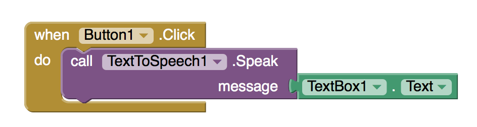
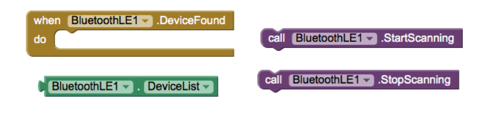
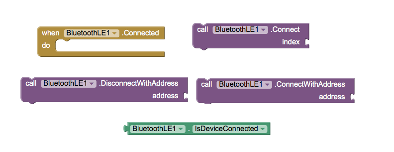
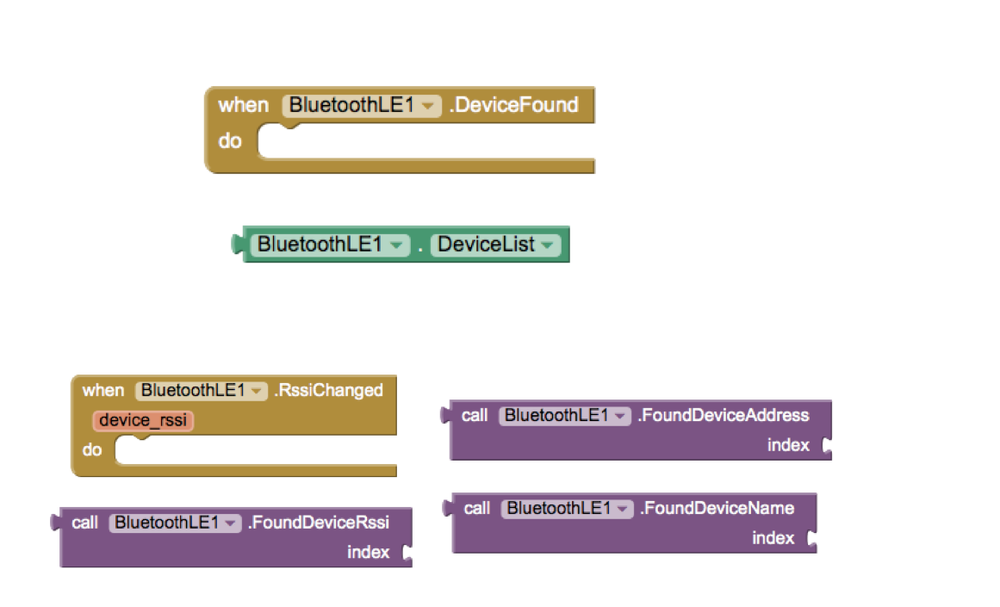
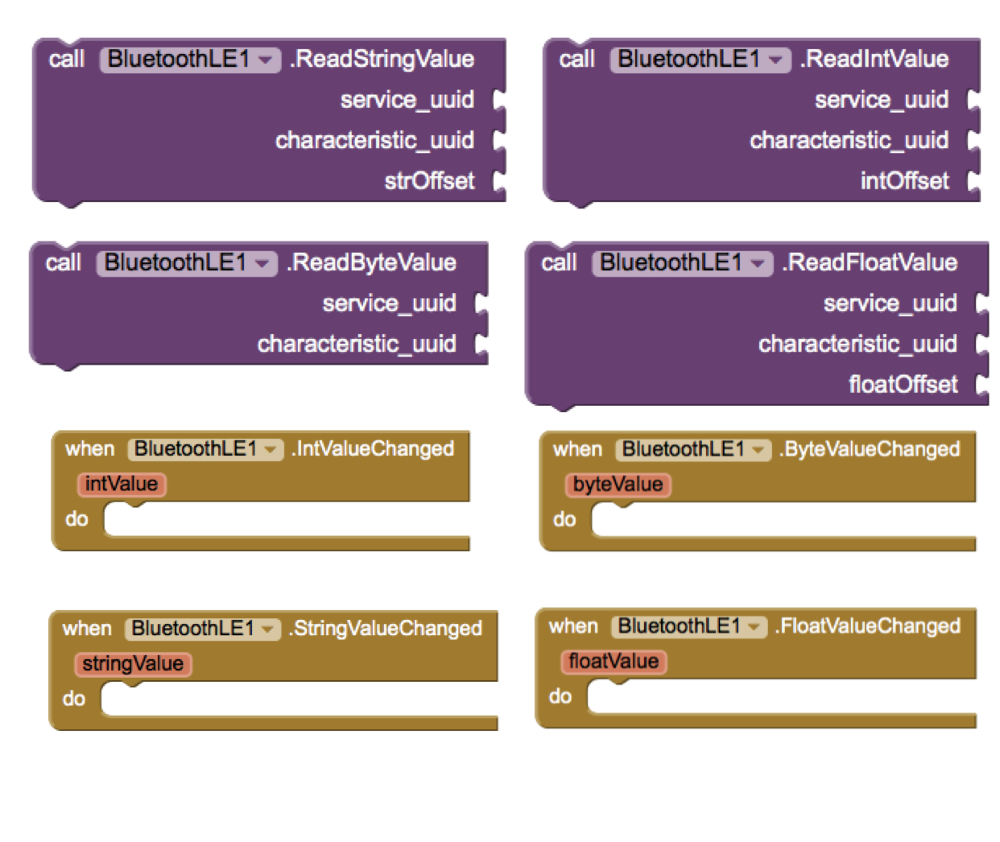
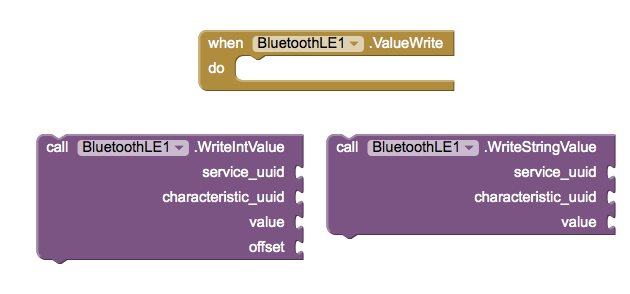

[&laquo; 返回首页](index.html)

## 使用 MIT App Inventor 控制低功耗蓝牙设备

Tiffany Le (tiffanyl@mit.edu)

Hal Abelson (hal@mit.edu)

Andrew McKinney (mckinney@mit.edu)

May 2016

ABSTRACT

This paper describes the initial design and testing of an App Inventor component for working with Bluetooth Low Energy (BLE) devices.

From home appliances to wearable accessories, the rise of Internet of Things devices has led to a growing need for mobile applications that can control and connect these dissimilar devices together. Building these mobile apps, however, generally requires considerable investment of time and knowledge of text-based programming skills. Our work aims to alleviate these constraints by using MIT App Inventor as a common platform to simplify the creation of mobile apps in the Internet of Things development process, thereby making it more accessible to a wider audience. In particular, we develop a novel Bluetooth Low Energy Component (BLE) that integrates into the App Inventor framework. At its core, the BLE Component is designed to allow mobile phones to communicate with Internet of Things devices. Its added capabilities are dynamic detection and support for device-specific functionality, such as a temperature reading from a sensor. The BLE Component interacts in real-time with the sensors on the WICED Sense device and the Arduino 101 board. This overall design enables even those without any programming experience to create their own mobile applications that can communicate seamlessly with the ever-changing world of Internet of Things devices

I. INTRODUCTION

Internet of Things (IoT) devices, ranging from home appliances to wearable accessories, have been proliferating rapidly in recent years and this trend does not appear to be abating. By 2020, it is expected that approximately 24 billion of these interconnected smart devices will be in use [4].  With all of these IoT devices hanging in the balance, there is a need for mobile applications that are able to manage communications between currently existing devices as well as with new devices as they arise. However, despite this need, the development of mobile applications faces several obstacles. Most potential novice developers deterred by their lack of traditional, text-based programming knowledge, and also by the time it takes to complete the development process.

To mitigate these constraints, we develop a BluetoothLE Component for MIT App Inventor to provide a standardized, quick, and easy way to create mobile applications that can connect to IoT devices [1]. In building the BluetoothLE Component, we merge two main technologies: MIT App Inventor and Bluetooth Low Energy (BLE). This paper discusses the technical approach used and the results and implications of the implementation.

MIT App Inventor

MIT App Inventor is ideal for developing IoT applications with its visual, blocks-based programming interface. With App Inventor, users can simply select, drag and drop functional blocks onto the web-browser based platform to create their own Android mobile applications [2]. Supporting over 4.5 million users, this easy and simple programming interface affords everyone, even those without any programming experience, the ability to quickly create their own mobile applications. Unlike traditional Android application development, that typically requires programming in Java, App Inventor encapsulates the Android development model and hides the implementation details through graphical blocks, making the Java programming code is invisible to users.

As a result, building apps in App Inventor need only to combine components of their choice by plugging them together and manipulate the associated blocks that activate the components’ desired functionality. This is done using the two parts of the MIT App Inventor Interface, which are shown in Figure 1:

* Designer - The designer allows users to select the components they will be using in the mobile app and adjust the layout of the app.

* Blocks Editor - The blocks editor allows users to connect the blocks together to provide the app with functionality. Figure 2 shows an example of a set of connected blocks used to create an app that reads aloud a message.

Figure 1: Screenshot of App Inventor Platform with Views of the Designer (top) and Blocks Editor (bottom)

Figure 2: App Inventor Blocks Used to Create an App that Reads  User Input‘

Bluetooth Low Energy

Our work focuses on developing a BluetoothLE Component to provide IoT connectivity since BLE technology plays a significant role in the IoT ecosystem. Building off of traditional Bluetooth technology, also known as Bluetooth Classic, BLE is similarly a standardized, short distance wireless communication protocol that enables devices from across multiple vendors to send and receive data. However, BLE is more suitable for IoT devices because it supports low peak and sleep mode power consumption, allowing these devices to conserve battery power in between connections. In fact, it is this low power consumption when BLE is enabled that makes it ideal for sensors and smaller devices such as headsets and heart rate monitors [6]. Another reason why BLE is a natural fit for the IoT environment is due to the fact that it can directly connect devices to applications on smartphones, PCs or tablets.

 

There are two ways that an interaction between BLE devices can occur, depending on whether a connection has been made. The rules regarding these connections along with device discovery and advertisements are governed by the Bluetooth Generic Access Profile (GAP), a mandatory framework that all BLE devices must adhere to.  

Broadcaster vs. Observer - In this scenario, the sensors embedded in various IoT devices will send periodic advertising packets to the smartphone in listening range. Since the smartphone merely acts as an observer by scanning the frequencies of these devices to receive the advertising packets being broadcasted, there is no connection between the sensors and the smartphone.  

Central vs. Peripheral - In developing the BluetoothLE Component, we primarily focus on providing the blocks to interface with BLE devices via this communication method. When the smartphone finds a device it wants to connect to, it will then initiate a connection. The smartphone now assumes the central or master role by managing the timing and sending or receiving data from the sensor, which only plays a peripheral or slave role during this connection. Being the master, the smartphone can connect to several slaves/peripherals at the same time. On the contrary, the peripheral devices cannot communicate with each other while one of their peers is connected to the master. Peripherals are required to have low power consumption since they have to be inactive for long intervals [10].
 

Once the connection has been established, the smartphone and the peripheral device will start exchanging data according to the Generic Attribute Profile (GATT). This is a specification for sending and receiving short pieces of data to help developers develop their own specific applications. It also has various use cases that developers can incorporate into their apps. For example, a developer can use the GATT heart-rate measurement data for his heart-rate tracker application.

Depending on the data needed, a master smartphone can be the GATT client and the slave sensor can be the GATT Server, or vice versa.

In our work, the smartphone containing the app with the BluetoothLE Component is the GATT client. It requests data from the GATT server, which, in the present implementation, could be a sensor on either the Broadcom WICED Sense devices or the Intel Arduino 101 board. These sensors have a database that stores services, characteristics and other data that the GATT Client needs. A characteristic is analogous to a data type that contains a single value. A service is a grouping of similar characteristics, where each service differentiates itself from the other by a universally unique identifier (UUID). Similarly to services, a characteristic also distinguishes itself with its own unique, numeric UUID [7]. Figure 3 shows the hierarchical nature of services and characteristics, with a characteristic at the lowest level in a GATT transaction.  A client relies on a characteristic to give it a data value so that it can read and write when exchanging data with a server.

Figure 3: BLE GATT Communication Protocol. Taken from [8].

II. PREVIOUS WORK

Prior to our work, the only way to develop a mobile application with BLE functionality was through traditional Android development, as the set of connectivity components in MIT App Inventor to enable mobile apps to interface with various communication protocols did not include BLE. The closest communication protocol to BLE that App Inventor supports is Bluetooth Classic, which is available through a two-component, client-server model, with one component acting as a client and the other as a server. However, despite some similarities between Bluetooth Classic and BLE, BLE is built with entirely different core specifications and design goals. BLE uses a star topology which theoretically would allow connections of billions of devices at a given time. By contrast, Bluetooth Classic only allows up to seven devices at a time with its piconet topology. Furthermore, while Bluetooth Classic is often used for high bandwidth, continuous streaming applications which drain battery power rather quickly because of its intensive data transfer rate, BLE is optimized for small bursts of data exchange typically found in sensors running on coin-sized batteries for months [3]. In light of this difference in power efficiency, App Inventor users cannot use Bluetooth Classic to connect their apps with IoT devices. Hence, our BluetoothLE Component is developed to address the IoT connectivity issue.                  

III. TECHNICAL APPROACH

The BluetoothLE Component is a novel addition to MIT App Inventor. As shown in Figure 4, the BLE Component can be implemented as part of a mobile app when created on the MIT App Inventor platform. This mobile app can then be used to interface with any number of IoT devices via BLE. Like all of the other components currently in MIT App Inventor, the component models the Java-based approach to Android development. In particular, the BluetoothLE Component breaks down the BLE communication process into Java methods to form the blocks on the App Inventor interface.

To implement these Java methods, the BluetoothLE Component uses and builds off of the BLE API provided for Android development. The API allows applications to wirelessly connect with other BLE devices via scanning, querying, connecting through service discovery, transferring data and managing multiple connections [5]. Most importantly, the API enables the creation of blocks that offer these generic, basic communication functionality so that BLE devices are able to establish a connection with the mobile phone.

Figure 4: System Schematic - The Mobile App with the BluetoothLE Component created on App Inventor interacts wirelessly with an IoT Device. Arduino Board taken from [9].

Basic Communication Functionality

The process of enabling a mobile app to communicate with a BLE device is broken down into several main stages, which are reflected in the development of the BluetoothLE Component. First, a GATT client is established on the phone to act as the main communication backbone interfacing a mobile app with BLE devices. Once that step is complete, the app will start to conduct a scan to find possible BLE devices to interface with by requesting information on each device in the vicinity. Only the BLE-enabled devices nearby will be able to respond to this request. Based on the information provided by the BLE devices, the app on the phone will choose a specific device and start to initiate the connection to the GATT server hosted on the discovered BLE device. From here, data transfer can take place once the connection is established between the phone and a BLE device. The data exchange between the GATT client on the smartphone and GATT server on the connected BLE device can occur in four different ways:  

Read  - This operation is requested by the GATT client on a specific characteristic held by the GATT server such as integers. The server complies by providing the requested value.  
Write  - This operation is initiated by the GATT client on a specific characteristic held by the GATT server, providing the server with the new value. The server stores this new value and may or may not send an acknowledgement to the client.  
Notify - This operation is initiated by the GATT server when a new value is written to one of its characteristics, provided that the GATT client has subscribed to notifications on that characteristic. The server returns the new value so that it can be read by the client.        
Indicate - The only difference between this operation and notify is that it is acknowledged.

To manage the data transfer and ensure that the transfer is successful, the BluetoothLE Component contains callbacks to indicate connection status such as when the data has been read, written, or changed. During this callback, the client may retrieve a read or notify value from the server.

Device-Specific Functionality

Beyond the basic communication functionality, however, more support is needed as each BLE device also has its own unique capabilities that vary from device to device. While these diverse capabilities are what makes BLE devices so popular, they also pose a challenge for developers, as consumers do not merely want basic communication between the BLE devices. Consumers expect to be able to capture data to meet their ever changing needs. Thus, the BluetoothLE Component is designed to handle device-specific functionality by including blocks to dynamically detect all of the GATT services and characteristics supported by a particular connected device. The blocks scan for services and characteristics provided by the device and return these services and characteristics in a list.  

Furthermore, in order to provide flexibility and broaden the support of more devices, the BluetoothLE Component was developed with blocks that allow users to choose particular services or characteristic from the entire list of detected services and characteristics. For some of the more commonly used services and characteristics, we used a dictionary that contains a mapping of the UUID of the services and characteristics to a human-readable name. As a result, users can simply select a particular service and characteristic without having to know the exact UUID or details regarding how the services and characteristics work. The selected service and characteristic enables the characteristic data value to be read or written. For example, with a Battery Level Service and Characteristic, the battery level of a connected device can be monitored. This approach allows for compatibility with a large number of BLE devices due to the universal nature of GATT services and characteristics.

Testing

With the BluetoothLE Component development complete, the next step involves testing of the component. This includes developing several sample apps to communicate with the BLE devices. The testing process consists of having testers replicate several sample apps as well as creating their own original apps. These sample apps can range from turning on and off an LED to monitoring the heart rate of a user.

IV. RESULTS

A final set of twenty-eight new blocks was created to form the BluetoothLE Component after a round of testing. These blocks range in capabilities from connecting to a particular device to determining when a value from a characteristic changes. They are grouped into several categories, generally corresponding to the different phases of the mobile app and BLE interaction:

1. Scanning for devices - As seen in Figure 5, the blocks in this category can initiate and end the scanning of BLE devices as well as return the devices found in the scanning process in the form of a callback. Since scanning is a battery-intensive operation, a StopScanning block is needed to prevent the battery from fast drainage.    

1. Establishing a connection with a device - The blocks in this category can connect and disconnect from a BLE device as shown in Figure 6. There are several different mechanisms to do so. The device can be connected by using its address or by an index. There are also blocks to indicate whether the connection is successful.

1. Getting connected device properties - The blocks in Figure 7 provide some basic information about the connected device, including the device name, address, and signal strength.

1. Reading Values: Figure 8 shows the blocks for four different data types - bytes, integers, decimal floats, and text strings - that were created to enable reading from a BLE device. These blocks encompass both reading a single value and reading on a notify when a value has changed. For each instance, the particular data value is returned.

1. Writing Values:  Blocks for two different data types - integers and text strings - were created to enable writing to a BLE device along with a block to ensure the particular value has been written successfully. These blocks can be seen in Figure 9.

1. Getting Services and Characteristics - The blocks from Figure 10 enable the detection of the more device-specific functionality. There are several different mechanisms to achieve this goal. The devices can be discovered by either their characteristics or services.  

Initial testing was done with a group of five users, who all tested this newly developed component with the Intel Arduino 101 or Broadcom WICED Sense devices. The Arduino 101 is an open-source, programmable circuit board that was chosen for the diverse sets of sensors that could interface with it. Users could easily control the circuitry to attach a wide range of sensors to support their own needs. Arduino 101 also has a real-time operating system and framework that supports BLE capabilities. Moreover, due to its battery-charging circuitry, it is a relatively low maintenance system. Finally, Arduino 101 kits are frequently used in classrooms, making them ideal targets for testing with App Inventor, as a majority of App Inventor users are students in the classroom learning programming for the first time.    

At the other end of the spectrum, the WICED Sense was chosen for its integrated set of sensors. The WICED Sense comprises of a BLE-enabled System on a Chip (SoC) and sensors that enable interactions with the environment: gyroscope, accelerometer, magnetometer, pressure sensor, humidity sensor, and temperature sensor. The SoC connects directly to the sensors without the need of an external microprocessor.      

Using the BluetoothLE Component, the testers were able to create a variety of apps that interacted with these two devices. Specifically, all of the testers were able to create apps to scan for nearby BLE devices and connect to them, as shown in Figure 11. Once a device was connected, the user was able to read to or write from the sensor with the services and characteristics supported by that sensor. An example of one app, presented in Figure 12, is the ability to read the battery level of the BLE device using the Battery Level Service and Characteristic. A subset of the blocks used to retrieve battery level is shown in Figure 13. Another sample app that a user created was to turn an LED Light on and off. As another example, users were able to implement an app that would detect whether or not a child was in a car seat and warn parents if they began to walk away from the child by utilizing the magnetometer on the WICED Sense and monitoring the changes in signal strength. Finally, users could also obtain readings from temperature and moisture sensors that would allow them to monitor the quality of their plants.

Figure 5: Blocks used to Scan for Devices

Figure 6:  Blocks Used When Connecting and Disconnecting with a Device

Figure 7:  Blocks Used to Get Connected Device Information

Figure 8: Blocks Used to Read Data Values

Figure 9: Blocks Used to Write Data Values

Figure 10: Blocks Used to Get Device Services and Characteristics

Figure 11: Sample App - BLE Device Scanning

Figure 12: Sample App - Battery service and characteristic to read battery level

Figure 13: Sample Blocks program to read battery level

V. DISCUSSION

From these results, the BluetoothLE Component is functional and can be used with a variety of BLE devices. The strength of this component is that it provides a balance between general and device-specific functionality. The device-specific functionality is critical because it provides flexibility that can be easily extended and added to in the future as the IoT population continues to grow. This scalability feature will add new capabilities to MIT App Inventor, allowing it to continue to stay relevant.

From the initial testing results, it is evident that there are still features that would greatly enhance the usability of the BluetoothLE Component. For example, adding the ability to send a decimal value to a connected device was desired in testing, but missing from the current version of the component. Testing also revealed that it would be beneficial to change some of the block names to make them more accessible for users unfamiliar with BLE. Additionally, testing indicated redundancies in blocks that were unnecessary and areas where several blocks could be made from a single block for a more well-defined functionality. Suggestions from users indicate that further testing with a broader range of devices and a larger number of users would more accurately determine the compatibility and capabilities of the BluetoothLE Component. This large-scale usability testing will also help guide how to refine or modify the blocks to better suit the needs of App Inventor users and determine if the issues from the first round of testing had been resolved.

Overall, while the BluetoothLE Component was successful in testing with the supported services and characteristics of the devices, there are still limitations in what the BluetoothLE Component can do. For instance, most services and characteristics are only able to be identified by UUID, with only a small number of them named. This is problematic only for custom services and characteristics rather than standardized ones.

In the future, implementation of additional functionality for compatibility with wider range of devices and applications can be achieved by adding or modifying new blocks. Additional prototypes can also be created to showcase a wider range of capabilities of the BluetoothLE Component. Finally, App Inventor users will be able to better familiarize themselves with the BluetoothLE Component and use it to create apps connecting to IoT if there are more examples of specific applications along with the tutorials on how to recreate them.

VI. CONCLUSION

In conclusion, developing the BluetoothLE Component contributes new capabilities to MIT App Inventor. This development is essential as the popularity of IoT devices grows, increasing the demand for mobile applications to control them. The BluetoothLE Component addresses this need by providing an easy-to-use tool for connecting a mobile phone and BLE devices. Beyond simply providing basic BLE communication capabilities however, the BluetoothLE Component also adds the ability to detect and manipulate device-specific functions as well. The flexibility in the dynamic design of this component allows for new devices and capabilities to be accommodated as they emerge in the future with minimal development efforts. This feature has enormous implications with the broad variety of IoT applications that are possible.

ACKNOWLEDGEMENTS

The authors would like to thank all of the members of the MIT App Inventor team for their help with the development process.

REFERENCES

[1]    Bandyopadhyay,  D.,  &  Sen,  J.  (2011).  Internet  of  things: Applications and challenges in technology and standardization. Wireless Personal Communications, 58(1), 4969.

[2]    Wolber,  D.,  Abelson,  H.,  Spertus,  E.,  &  Looney,  L.  (2011). App Inventor. ” O’Reilly Media, Inc.”.

[3]    Mackensen,  E.,  Lai,  M.,  &  Wendt,  T.  M.  (2012,  October). Bluetooth low energy (ble) based wireless sensors. In Sensors, 2012 IEEE (pp. 14). IEEE.

[4]    Gubbi, J., Buyya, R., Marusic, S., & Palaniswami, M. (2013). Internet of Things (IoT): A vision, architectural elements, and future directions. Future Generation Computer Systems, 29(7), 1645-1660.

[5]    ”Bluetooth Low Energy - Android Developers”, 2016. [Online]. Available: http://developer.android.com/guide/topics/connectivity/bluetooth-le.html#setup.

[6]    ”The Story Behind Bluetooth Technology - Bluetooth Technology Website”, 2016.

[Online]. Available:https://www.bluetooth.com/what-is-bluetooth-technology/bluetooth.

[7]    ”Introduction to Bluetooth Low Energy - Adafruit Learning System”, 2016. [Online].

Available: https://learn.adafruit.com/introduction-to-bluetooth-low-energy/gatt.

[8]    ”Getting to the bottom of the Android Bluetooth Low Energy API — Lemberg Solutions Blog - Mobile, Drupal, and All Tech”, 2016. [Online]. Available: http://blog.lemberg.co.uk/getting-bottom-android-bluetooth-low-energy-api.

[9]    ”Arduino - Genuino 101 Curie BLE Heart Rate Monitor”, Arduino, 2016. [Online].

Available: https://www.arduino.cc/en/Tutorial/Genuino101CurieBLEHeartRateMonitor.

[10]    Rowberg, J. ”[REFERENCE]: BLE master/slave, GATT client/server, and data RX/TX basics”, Bluegiga Technologies, 2016. [Online]. Available: https://bluegiga.zendesk.com/entries/25053373–REFERENCE-BLE-master-slave-GATT-client-server-and-data-RX-TX-basics.