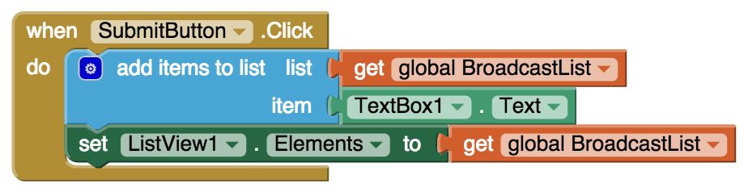

* TOC
{:toc}

[&laquo; 返回首页](index.html)

我们经常会使用列表来存储数据。例如，以下列表存储电话号码：

像 BroadcastList 这样的变量是应用程序的隐藏内存（用户看不到它们），如果你想在设备上显示这样的列表，可以使用 [`列表显示框`](../components/userinterface.html#ListView) 组件。

只需告诉 [`列表显示框`](../components/userinterface.html#ListView) 要显示哪个列表即可，可以通过设置其 [`元素`](../components/userinterface.html#ListView.Elements) 属性来完成此操作，如下面的块所示：重要的是要记住，每次列表中的数据更改时都应该更新 [`列表显示框`](../components/userinterface.html#ListView) 例如，如果用户在 [`文本输入框`](../components/userinterface.html#TextBox) 中添加一个新项目并单击“提交”，应该将该项目添加到列表变量中并重置 [`元素`](../components/userinterface.html#ListView.Elements) 属性，如下例所示：

## 将列表序列化为标签

[`列表显示框`](../components/userinterface.html#ListView) 以固定的垂直方式显示列表数据。 如果你想以不同的方式显示列表，例如使用逗号水平显示列表，或使用装饰文本（例如每个项目前面的数字），你可以将其序列化为 [`标签`](../components/userinterface.html#Label) 组件。

有很多方法可以做到这一点，你可以根据你想要使用序列化结果的方式选择最合适的方法。

### 使用列表转 csv 行

序列化 BroadcastList 的最简单方法是使用列表到 csv 行块。

缺点是这些值都被包在““（双引号）中，解决这个问题很容易，如下所示：

### 使用 while 循环

序列化列表的另一种方法是使用迭代器（foreach、while）块将每个项目以及任何分隔符或装饰连续添加到标签。

下面是在标签中显示 BroadcastList 的示例，项目之间用逗号分隔。 这些块位于一个过程中，只要列表被修改，你就可以调用该过程。

## 代码块如何工作

BroadcastListLabel.Text 首先初始化为“”，因此每次显示列表时都会重新开始。然后，如果列表不为空，则将第一项放入标签中。 然后 while 循环连续添加其他项目，并在每个项目之前放置一个逗号。 请注意 while 循环中的块如何将逗号和新项目附加到 Label 的末尾。

如果列表具有上面的 BroadcastList 变量中显示的项目，则代码将首先将 111-1111 放入 Label 中。 while 块将被执行两次，索引=2 和索引=3。 在第一次迭代期间，块将向标签添加一个逗号和第二项 (,222-2222)，以便它包含 111-1111,222-2222。 在第二次迭代期间，将附加 (,333-3333)，以便标签最终为 111-1111、222-2222、333-3333。

注意：如果你想逐行显示列表元素，只需插入 \n 而不是 , （逗号），标签将如下所示：

111-1111
222-2222
333-3333

## 使用”从范围循环“

while 方法的变体用于每个 from 到 by 或列表中的每个项目。 我们在下面展示了两种方法的块。

请注意，我们必须测试空列表。 如果列表至少有一个元素，那么我们将标签设置为第一项中的任何内容。 然后，对于每次迭代，下一个元素将连接到文本。 如果列表只有一个元素，则 foreach 不会执行任何操作，因为 2 大于列表的长度（在本例中为 1）。

## 使用”从列表循环“

一个稍微简洁的解决方案是使用 for every item in list 块：

结果总是在序列化字符串前面有一个逗号，除非列表为空。 我们删除末尾的 , ，但我们需要检查标签是否确实包含逗号。
