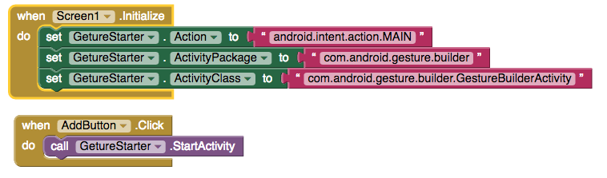
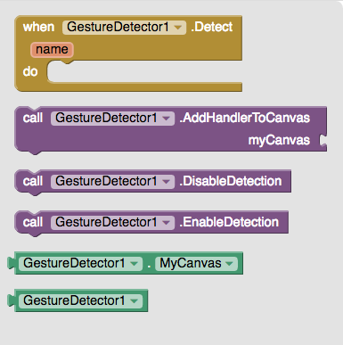
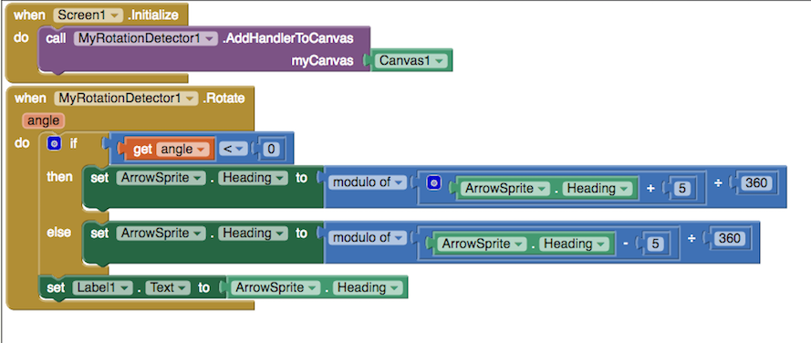
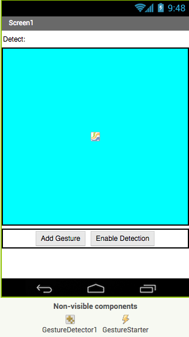
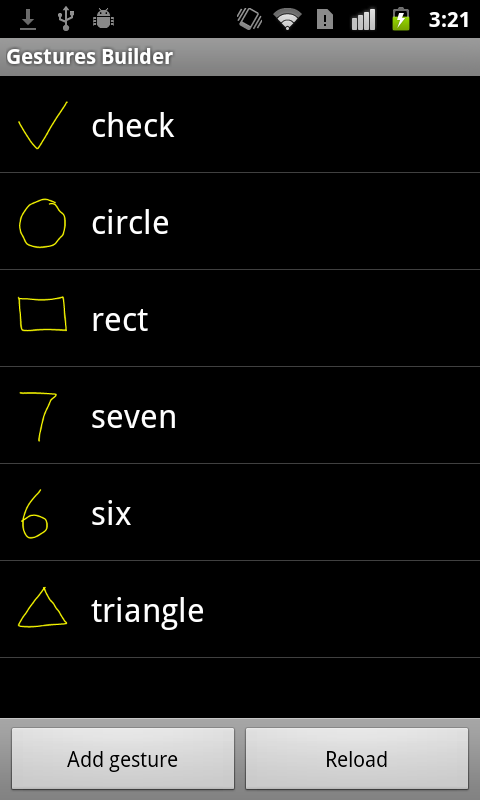
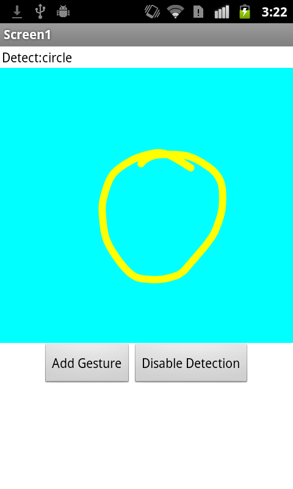

* TOC
{:toc}

[&laquo; 返回首页](index.html)

## 扩展App Inventor：具有多点触控和手势检测功能

Xinyue Deng (dxy0420@mit.edu)

  Hal Abelson (hal@mit.edu)

  Department of Electrical Engineering and Computer Science

  Massachusetts Institute of Technology

  77 Massachusetts Avenue, Cambridge, MA 02139, USA

ABSTRACT

MIT App Inventor is a block-based event-driven programming tool that allows everyone, especially novices, to start programming and building fully functional apps for Android devices. Compared to traditional text programming with Android Studio, it has limited features. We enabled App Inventor with multi-touch gestures detection, such as two-finger rotation, and user-defined custom gestures by building extension components. Our paper illustrates the implementation of components, sample usage of the components and how they will help novices building apps involving gesture recognition.

KEYWORDS

System, Computer Science education, Gesture Recognition, Multi-touch Recognition

Introduction
MIT App Inventor is a block-based event-driven web platform that allows everyone, especially novices, to start programming and building fully functional apps for Android devices. Instead of text-based programming, apps are programmed by Blockly, a visual block-based programming framework. There are basically two parts in an App Inventor app: components and programming blocks. A component is an item that the app can use. It could be visible on the phone screen such as a button or label, or it could be non-visible, such as a camera or a sensor. Each component has a set of blocks that the programmer can use to control its behavior.

Figure 1. Blocks for an App Inventor app that automatically reads the text message aloud when a new message arrives.

Figure 1 shows the blocks of a sample app that automatically reads the text messages aloud when a new text message arrives. Instead of implementing the event listeners with the traditional Java programming in Android, programmers can simply accomplish this by dragging a block and adding corresponding actions they want when a specific event occurs.

Unlike the traditional text-based programming, MIT App Inventor introduces an event-driven programming model. "Event" is a concept in computer science which refers to the user's action, such as touching the screen, clicking a button, etc. Event handling is becoming an important concept, as mobile and web platforms become popular, but it is usually taught late in the CS curriculum. Also, it is hard to handle simple events like button clicking in some computer languages, like Java, used in Android development. In Java, programmers need to handle events by creating listeners, which is a hard concept for novices to understand [1].

However, almost every smart-phone or tablet has a touch screen. According to a report by iSuppli, there were 1.3 billion touch-screen panels shipped worldwide in 2012, and in 2016, 2.8 billion touch-screen panels are expected to be shipped worldwide [2]. Because most touch screens are embedded with multi-touch technology, it is not surprising that multi-touch events play a significant role in our interaction with apps in smartphones or tablets. Common multi-touch events include swiping, pinch and rotation. Some apps also allow users to define their own gestures for later use. For app programmers, it is necessary to know how to detect and handle multi-touch events properly, but for a novice programmer, it is generally hard to build an app with such features using traditional text-based programming languages.

In 2015, App Inventor has around 3 million users representing 195 countries. However, it does not support the functionality to allow programmers to detect multi-touch events. In this paper, we illustrate the implementation of two extension components. The first component detects the two-finger rotation, and the second component enables the user to define gestures and perform them later. These two components and their blocks are designed for and can be used by novice programmers. Programmers are required to have some experience with App Inventor in general, but not required to have knowledge about Java or the Android Software Development Kit (SDK) library.

 

The remainder of the paper is organized as follows. Section II describes the background and related work. Section III illustrates details about design and implementation of two components. Section IV describes the sample app we built with these two components, compares the learning curve of traditional programming and our components, and discusses their limitations. We conclude with our contribution.

Background and Related Work
In this section, we introduce the App Inventor extension, and we discuss the traditional way of implementing gesture detection with Android Studio. Finally, we describe a component we built previously to detect the pinch gesture.

App Inventor Extensions
App Inventor is designed for novice programmers and teenagers as an introduction to computer science, so it supports the basic functionalities of the Android apps, such as button, camera, etc. However, it does not contain the same set of functionality as Android application program interface (API) does, and its components cannot be modified for programmers' special needs.

Due to the large number of user requests for new components, App Inventor has released a new feature called "App Inventor extensions", which let users build their own components using the Android API and the App Inventor source code. The new components are purely user-defined, and they can be imported into apps similar to ordinary components. Users can also change the source code of an existing extension component to meet their specific needs. The App Inventor team has also maintained a public extension library to support some common components, such as image processing.

Our components for rotation detection and custom gesture detection will also be included in a public library of extensions. Users can modify the behavior of detection based on their needs.

Gesture Recognition with App Inventor
Currently, App Inventor can handle gestures including tap, press, scroll, fling, and swipe, but it does not support common multi-touch gestures, such as scale and rotation.

In the current extension library, our team has implemented a "Scale Detector" which can handle scaling events (zoom and pinch). This component was implemented with the ScaleGestureDetector class in Android API. It calculates the distance between two fingers on the screen, and returns the ratio of current distance to previous distance. If the ratio is greater than 1, the detector detects zooming out, and if the ratio is smaller than 1, it detects pinch. The user only needs to take care of the behaviour after they know which gesture is being performed. Figure 2 shows an example usage of "Scale Detector" to change the text corresponding to the ratio [3].

Figure 2. Blocks for an App Inventor app that uses Scale Detector to modify the text based on the ratio.

Gesture Recognition with Android API
The Android API has a built-in implementation for "Scale Detector", but it does not support any rotation detection, so we need to implement a rotation detector. The detailed implementation is in Section III.

For custom gesture detection, the Android API supplies a sample app that the user can use to add user-defined gestures, such as circle, triangle, etc. In our extension component, we will call that app directly to add gestures. The app encodes gestures into a binary file, and this file can be read by the GestureLibraries class in Android API. After reading the file, all gestures are stored in a class called GestureLibrary. The gesture is performed by a class called GestureOverlayView, and detected by a listener that is associated with this View class. In this listener, the input gesture is compared with every stored gesture in GestureLibrary, and the function outputs a list of scores, which indicates the similarity between the input gesture and each gesture in the library. The higher score means greater similarity. The programmer can use this list to determine if this gesture is one of the stored gestures. In general, the gesture with the highest score is the one we want to detect; however, if all scores are below a minimum threshold set by the programmer, the input gesture is not one of the gestures stored in the library [3].

Technical Approach
Gesture recognition is easy to implement with Android Studio, if one is familiar with Java programming and Android API. However, this is not the general case for novice programmers, and the process can be frustrating and difficult for them. With App Inventor and our extension components, we introduce a simple and effective way for novices to use deal with gesture recognition.

We have built two extension components. One component detects two-finger rotations, and the other component detects custom gestures. They should work in the same way as the "Scale Detector", which the user only needs to pay attention to the result of detection, but not the process of detection. Both components work with the Canvas component in App Inventor.

Figure 3. Blocks for an App Inventor app that allows the app user to draw lines on the canvas

Canvas Component
The Canvas component is a touch-sensible rectangular panel, and its size can be defined by users. Canvas can handle app users' touch events, like fling, touching up, and touching down, so that the app user can draw on the canvas [4]. It also contains a set of image sprite which can move to some direction at some speed. The size, speed, and heading of an image sprite can be changed programmatically. Figure 3 shows a sample usage of Canvas. The app allows the app user to draw lines on the canvas. Figure 4 shows the screenshot of an app that uses Canvas object and allows the user to draw lines on an image sprite.

Figure 4. The screenshot of the app that allows user to draw lines on an image sprite.

Canvas can also listen to a  new event in its defined region, if the programmer registers the new event listener to it. The new event listener needs to implement the ExtensionGestureListener interface, and it needs to be added to the list of gesture listeners of Canvas. When a touch event occurs, the Canvas iterates through all gesture listeners and performs the corresponding actions. The components we show in later sections use this feature to add new event listeners to the Canvas.

Rotation Detection
Two-finger rotation is a common multi-touch gesture. It can be used in several cases, like rotating the Google Map to find a place and explore its surroundings, or rotating an image in an app.

Unlike the scale detection, Android API does not support two-finger rotation, so we need to implement a rotation listener. The task is to find the angle when the user rotates the fingers, so that we can rotate an image with correct directions. Each time the user touches the screen with two fingers, there is a line formed by two fingers. When the user rotates with two fingers, a new line will be formed and there is a angle between the previous line and the current line. Figure 5 shows this process. The blue points indicate the previous location of fingers on the screen, and the red points indicate the current location of fingers. The angle between two lines is the angle rotated by the user.

Figure 5. Idea of implementing rotation gesture. Blue points are the previous locations of fingers, and red points are the current locations of fingers. The angle rotated is the angle between the two lines formed by the fingers.

The angles we use are in degrees and they range from -360 to 360 degrees. The sign of the angle indicates the direction of rotation. A positive angle means clockwise rotation, and a negative angle means counter-clockwise rotation.

We use the MotionEvent class in Android API to detect the finger touching and movement. The first finger's position is recorded by an event of $MotionEvent.ACTION_DOWN$, and the second finger's position by an event of $MotionEvent.ACTION_POINTER_DOWN$. The events also assign fingers different IDs, so they can distinguish them later. When fingers move, an event of $MotionEvent.ACTION_MOVE$ is invoked, and it records the current positions of two fingers by their IDs. We can use the current positions and previous positions to compute the angle rotated, and tell the program a rotation gesture is detected. This function returns the angle.

One noteworthy finding when we tested the component is that $MotionEvent.ACTION_MOVE$ is too sensitive. A tiny movement with fingers will invoke this event, so it detects the rotation even when we do not intend it to. In order to solve this problem, we add a buffer when we detect $MotionEvent.ACTION_MOVE$, so that we only fire "rotation" when the positions of two fingers change above some threshold.

Figure 6. Block designed for Rotation gesture component. The function AddHandlerToCanvas attaches a detector to the canvas component, and the function Rotate is fired when a rotation gesture is detected, and it returns the angle the user rotates.

The user should be able to use the components without knowing the process of detection. They need only pay attention to the logic after the rotation is detected. Figure 6 shows the designed blocks for Rotation Detector. The function AddHandlerToCanvas attaches the listener of the detector to the canvas component like we discussed in Section III-A , so that the user can perform the gesture on the canvas. The function Rotate is fired when a rotation gesture is detected, and the user can determine the behavior of the app based on the rotated angle this function returns.

Custom Gesture Detection
Custom gestures are defined by users or programmers for later use. One example of using custom gestures is in games, such as Harry Porter. The player can perform different gestures to cast spells to complete some actions needed. Apps can also use custom gestures as shortcuts to perform certain actions.

Our implementation of custom gesture detection involves two parts: 1) how to add user-defined gestures, and 2) how to detect the gestures.

Add User-defined Gestures

As we mentioned in Section II-C, Android API provides us a built-in app called Gesture Builder to add gestures, and it will store gestures in a binary file, which can be read by the GestureLibraries class. However, we don't want the user to open an additional application when using another app. To make the process seamless, we use an App Inventor component called Activity Starter.

Activity Starter is a component that can launch another application inside an application. In order to use it, the user needs to have both applications installed. To launch the correct application, the programmer needs to set Activity Starter with correct parameters, and then call StartActivity. Figure 7 shows the example app that launches Gesture Builder with one button click.

Figure 7. Blocks for example app that launches Gesture Builder with one button click. When the screen initializes, app needs to set Activity Starter with correct parameters of Gesture Builder.

In Gesture Builder, the user can create a new gesture by providing its name and shape. The user can also rename and delete an existing gesture. All the changes will be stored in a binary file on the SD card of the user's cell phone.

 Detect User-defined Gestures

To detect gestures, we need to load the file of gestures first. There is a built-in function in the GestureLibraries class that reads the binary file stored in the user’s SD card, and transfers it into an instance of GestureLibrary. Each stored gesture is an instance of the Gesture class in GestureLibrary, and identified by its name. The input gesture must be performed on a GestureOverlayView class, and it will be turned into an instance  of Gesture. In the GestureLibrary, there is a function called recognize, which takes the input gesture as the input, compares it with every gesture stored in the library, and outputs a list of scores as the result of comparison. A higher score means greater similarity.

To integrate this detecting process to our component, we need to add a GestureOverlayView on top of a Canvas Object. However, when there is a GestureOverlayView on top of the Canvas component, all fingers' movements are used to predict which gesture is performed, so it will affect other functionalities of the Canvas component. For example, users might want to draw on the canvas and only use custom gesture detection under some conditions. Therefore, we provide the user with the ability of switching on or off the custom gesture detection, so that the user can enable the gesture detection when needed and disable it to perform other actions, such as drawing and rotating.

When we initialize the custom gesture detector, we make it with the same size and position as the Canvas component it attaches. To add a GestureOverlayView on top of the Canvas component, we need to change the layout of the app. Layouts are defined in the Android API, which contains a set of views, and the programmer can change the configuration of layouts to change positions of views. The Canvas component itself is part of LinearLayout in the Android API, which is hard to add another view on top of it, but this LinearLayout is part of a FrameLayout, which can be used in our case [5].

In order to enable the gesture detection, we insert a GestureOverlayView into the FrameLayout, and it is stacked on the top of the LinearLayout that holds the Canvas component. After a gesture inputted by user, it will use the process we discussed in Section II-C to detect which stored gesture is performed. To disable the custom gesture detection, we simply remove this GestureOverlayView from the FrameLayout.

Figure 8. Block structure of the Gesture Detector component. The function AddHandlerToCanvas is called when the screen initializes, to associate the detector with Canvas Component. The function Detect is fired when the user performs a gesture, and returns a string which is the name of the recognized gesture. If no gesture is detected, the returned string is empty. The function EnableDetection and DisableDetection are used to switch on and off the detection respectively.

Figure 8 shows the basic block structure of the Gesture Detector component. The function AddHandlerToCanvas is called when the screen initializes, to associate the detector with Canvas Component. In our component, the user should not need to know the intermediate steps, and they only care about the actions after performing the gesture, when the stored gesture is corresponding to the input gesture. Therefore, we provide the user a function called Detect, which is fired when the app user performs a gesture. The Detect function provides the programmer with the name of the gesture that the user performed, which is determined by the highest score among the stored gestures compared with the input gesture.  However, if all scores of stored gestures are below a minimum threshold, the input gesture is probably none of the stored gestures. In such a scenario, the function returns an empty string as the name. This will not affect the performance the detector, because the Gesture Builder does not allow empty strings as the name of a gesture. There are also two functions called EnableDetection and DisableDetection. They switch on or off the gesture detection respectively. When users want to perform other actions with the same canvas, such as drawing, they need to disable the gesture detection. When they want to use the gesture detection, they need to enable the gesture detection.

Results
We tested our components by importing them into the extension server of the App Inventor. The extension server contains the App Inventor extensions, but it is still under development and has not been released to the public. We built two sample mobile apps with each component to illustrate the usage of the components and tested their functionality. We tested two components with students in the App Inventor group to understand their usability, and we used the test results to compare the learning curve of our components against the traditional text-based programming.

Sample App for Rotation Detection
The rotation detector can be used to rotate an image sprite on a canvas. We used it to rotate an arrow image on the screen. Figure 9 shows the user interface of the sample application. The label shows the current heading of the arrow. The arrow is an image sprite, and its heading can be changed by two-finger rotation. The apps will rotate the arrow clockwise or counterclockwise corresponding to the rotated angle the detector returns.

Figure 10 shows the blocks for the sample app. When the screen initializes, it attaches the canvas to the detector. When a rotation gesture is detected and an angle is returned, the app uses the angle to determine the heading of the arrow sprite. With the sample app, the user can successfully rotate the arrow sprite with two fingers.

Figure 9. The user interface of sample app using the rotation detector. The label shows the current heading of the arrow, and the heading of arrow sprite can be changed by two-finger rotation.

Figure 10. Blocks for sample application that rotates an arrow sprite based on the user's gesture. When user rotates clockwise, the heading of the arrow increases; when user rotates counterclockwise, the heading of the arrow decreases.

Sample App for Custom Gestures Detection
In this section, we show a sample app designed for detecting user-defined custom gestures. The app allows user to add, rename and delete a gesture. When the user performs a gesture on the canvas, it is able to detect it and show its name if the gesture is in the library. In addition, the user can switch on and off the detection. When the detection is switched off, the app should do nothing.

Figure 11. The user interface of the sample app using the custom gesture detector. The blue rectangle is the canvas, and the label shows the name of the gesture detected. There are two buttons under the canvas. The "Add Gesture" button is used to invoke Gesture Builder app supplied by the Android API, and the "Enable Detection" button is used to switch on/off the gesture detection.

Figure 11 shows the user interface of the sample app. The blue rectangle is the canvas. The user can perform gestures on the canvas, and the stroke they draw is yellow. The detection can be switched on and off based on user's needs by clicking the "Enable Detection" button. When the detection is enabled, all fingers' movements on the canvas are considered as part of gestures, and they are used to distinguish which gesture the user performed. When the detection is disabled, the user's input is ignored by the detector, and there will be no yellow stroke showed when the user draws.

Figure 12. Blocks for the sample application designed in Figure 11 which detects custom gestures . When the screen is initialized, the programmer sets the parameters to call Gesture Builder app, and attaches the canvas to Gesture Detector. When the "AddGesture" button is clicked, the app invokes Gesture Builder app. When the "Enable Detection" button is clicked, it toggles the state of the gesture detection, and switches it on or off correspondingly. The function Detect is called when the gesture detection is enabled and a gesture is performed by the user. The programmer uses the name returned by Detect to change the content of the label.

Figure 12 shows the block for the sample application. Programmer does not need to know how the gestures are detected, and they need only to take care of the actions after the gesture detection. When the screen is initialized, the programmer sets the parameters to call Gesture Builder app, and attaches the canvas to Gesture Detector. When the "AddGesture" button is clicked, the app invokes Gesture Builder app. When the "Enable Detection" button is clicked, it toggles the state of the gesture detection, and switches it on or off correspondingly. The function Detect is called when the gesture detection is enabled and a gesture is performed by the user. The programmer uses the name returned by Detect to change the content of the label.

   Add Gesture                           (b)  Detect Circle                    (c)  Detect Triangle
Figure 13. Screenshots of the sample application. 13(a) is the screenshot of Gesture Builder app. It shows all gestures in the library. 13(b) shows the app detects "circle" when the user draws a circle, and 13(c) shows the app detects "triangle" when the user draws a triangle. The yellow lines are the gesture strokes the user performed.

Figure 13 shows the screenshots of the sample application. Figure 13(a) is the screenshot of Gesture Builder app. It is invoked by clicking "Add Gesture" button, and it shows all gestures the user defined on their device. Figure 13(b) and Figure 13(c) show the detection of Circle gesture and Triangle gesture respectively. The yellow lines are the gesture strokes the user performed.

Discussion
In this section, we discuss about our testing survey about two components within the MIT App Inventor team, and we talks about the limitation of our components.

Test survey
For each component, we distributed a test survey in the MIT App Inventor team. The participants are mainly students who worked in the MIT App Inventor team as undergraduate researchers. They have backgrounds in computer science and Android programming, and they know how to use the App Inventor and its extensions.

We asked them to implement the sample apps for each component we showed in Section IV with detailed instructions. At the end of the survey, we asked how long it took to complete each app, and if it is easy to use our components for the task we gave them. The average time took is half of an hour for each app, and most students agree that our component is easy to use with instructions we provide. Even considering the time took for learning App Inventor, creating apps involving multi-touch gesture and custom gesture detection with our component would be much easier for novice programmers compared to traditional text-based programming.

Limitations and Future Work
Our custom gesture detection uses the Android API to classify the gestures performed by user. During the test, we find that the Android API works worse with multi-stroke gestures, even though it allows multi-stroke gestures. Also, gestures are stored as a trajectory of fingers' movements. Therefore, drawing a circle clockwise and counterclockwise are two different gestures, even though they have the same shape.

One potential possibility is developing our own gesture recognition algorithm to fit specific needs, but this is not necessary for novice programmers.  

Conclusion
In this paper, we have extended the MIT App Inventor with two extension components:1) a rotation gesture detector, and 2) a custom gesture detector. Our contribution includes 1) designing the blocks, 2) implementation and testing, 3) and creating sample apps, tutorials and documentation for each component. We find that it is easier for novice programmers to create apps involving multi-touch gesture and custom gesture recognition using the MIT App Inventor and our extension components.

ACKNOWLEDGEMENT

This research was supported by MIT App Inventor Team. We thank our students from the team who provided insight and expertise that greatly assisted the research.

We thank Professor Hal Abelson, Andrew Mckinney, and Jeff Schiller for assistance with debugging of the component, and Benji Xie for comments that greatly improved my writing and the structure of paper.

REFERENCES

[1] Turbak, Franklyn, David Wolber, Mark Sherman, Fred Martin, and Shaileen Crawford Pokress. ``EVENTS-FIRST PROGRAMMING IN APP INVENTOR", Journal of Computing Sciences in Colleges 29.6 (June 2014): 81-89. Print.

[2] iSuppli. ``Global Shipment Forecast for Touch-screen Displays from 2012 to 2016 (in Billion Units)." in Statista - The Statistics Portal. Statista. 08 Oct 2015. http://www.statista.com/statistics/259983/global-shipment-forecast-for-touch-screen-displays

[3] Smyth, Neil ``Android Studio Development Essentials" Chapter 23 CreateSpace Independent Publishing Platform, USA, 2014

[4] "Drawing and Animation Components - App Inventor for Android." Drawing and Animation Components - App Inventor for Android. Web. 05 May 2016.

[5] Smyth, Neil ``Android Studio Development Essentials" Chapter 14 CreateSpace Independent Publishing Platform, USA, 2014
