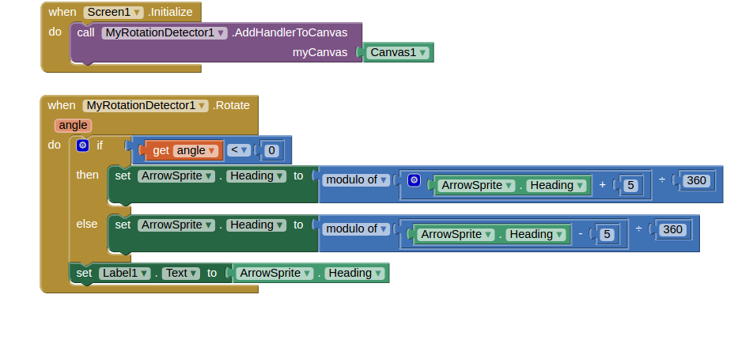

[&laquo; 返回首页](index.html)

Using App Inventor extensions to implement multitouch:  Rotation Detector

Xinyue Deng <dengxinyue0420@gmail.com>

DRAFT (March 6, 2016):  Building extensions requires the [App Inventor extensions](extensions.html) capability, which is not yet incorporated into the App Inventor release.  But you can try some ofary AI2 server.

You can implement the RotationDetector.aix extension as described in part 2 below using the extension test send (2) may need to be rebuilt as the system evolves.

Contents

rver.

Keep in mind that the extensions mechanism is still unstable and under development.   Any aia files you build in steps (1) a

Using [App Inventor extensions](extensions.html) to implement multitouch:  Rotation detector

A demo app with rotation detector extension component

How to build rotation detector extension

App Inventor does not have multitouch capabilities built in.  Adding multitouch is a popular request, and MIT App Inventor might eventually include it in the system. This note illustrates how to use [App Inventor extensions](extensions.html) to implement a RotationDetector component that people can use to create apps that react to two-finger rotation gestures.

This note is interesting for two aspects:

For App Inventor users, it provides a functioning Rotation Detector component that can be shared and incorporated into projects.
For App Inventor developers, it can serve as a template for a general  rotation detector component that can be modified to fulfill specific requirements.

The implementation approach for multitouch here follows  Using [App Inventor extensions](extensions.html) to implement multitouch: [Scale Detector](extensionsMultitouch.html), which contains a more detailed explanation of the technique.   It would be useful to work through that example first, before building the Rotation Detector.

A demo app that uses the RotationDetector extension component
        The Rotation detector enables programmer to detect two-finger rotation gestures performed on a Canvas. The demo app here, called rotationSprite,  is a simple demonstration of detecting rotation gestures.  You can download the apk file of the demo app from here. The demo app simply illustrates how to use the RotationDetector component to rotate an ImageSprite on canvas.  The Designer view and block view of this demo app are shown below.

Here’s how to implement the rotationSprite app:

On Screen1, there is a Canvas, Canvas1, which contains an ImageSprite (ArrowSprite) that we want to rotate. Label1 will show  the Arrow’s heading in text format. Heading 0 points to right.  We also add a RotationDetector (MyRotationDetector1) as a non-visible component.

The first key part of using Rotation Detector is to associate the canvas to it by calling the method MyRotationDetector1. AddHandlerToCanvas, which configures the detector to listen the finger movements on Canvas1. This step should be done when screen is initialized.

The main feature of the RotationDetector component is the event handler Rotate, which is called with a number angle. The variable indicates the angle in radians[a] that the two fingers rotate. When the angle is smaller than 0, it means that fingers rotate clockwise; when the angle is bigger than 0, it means that the fingers rotate counterclockwise. It changes the heading of ArrowSprite corresponding to the angle it returns. At the end of Rotate, it updates the text in Label1 to show the current heading of ArrowSprite.

You can use the RotationDetector extension component to create your own multitouch apps that respond to rotation gestures.   You’ll need to import the MyRotationDetector.aix extension file as described in [App Inventor extensions](extensions.html), and then build with the MyRotationDetector component, just as with any component.   The MyRotationDetector.aix extension is available here:

https://drive.google.com/drive/folders/0B3jsksMcCW5bLVZCNjZmQ3FSS2M

We’ve also provided the complete aia source for this demo app to save you the effort of assembling the blocks from scratch.  If you load this aia file into App Inventor, you will not have also separately install the MyRotationDetector.aix extension.  The extension is included in with the source.  In general, project source files include any extensions the project uses.

How to build rotation detector extension
The previous section showed how to create an app using the supplied MyRotationDetector extension aix file.  You can also practice implementing or modify the extension itself.

The MyRotationDetector extension is implemented as Java code, which is compiled and processed to produce the aix file, as explained in [App Inventor extensions](extensions.html).    The Java code file
MyRotationDetector.java is available here:

https://drive.google.com/open?id=0B3jsksMcCW5bUU1rOGlNSGpTVE0

Unlike the ScaleDetector, the Android SDK does not have built-in Rotation Detector to use. Therefore, before we implement the extension component for App Inventor, we need to implement a rotation detector module, which can detect the rotation and calculate the angle rotated. We implement the Rotation Detector with the following code:

public class RotationDetector {

        protected final Context mContext;

        private static final int INVALID_POINTER_ID = -1;

        private float fX, fY, sX, sY,oldval,newval;

        private int ptrID1, ptrID2;

        private float mAngle;

        private OnRotationGestureListener mListener;

   

        public float getAngle() {

            return mAngle;

        }

        public RotationDetector(Context c, OnRotationGestureListener listener){

            mContext = c;

            mListener = listener;

            ptrID1 = INVALID_POINTER_ID;

            ptrID2 = INVALID_POINTER_ID;

        }

        public boolean onTouchEvent(MotionEvent event){

            switch (event.getActionMasked()) {

            case MotionEvent.ACTION_DOWN:

                ptrID1 = event.getPointerId(event.getActionIndex());

                break;

                //Detect the second finger pointer

            case MotionEvent.ACTION_POINTER_DOWN:

                ptrID2 = event.getPointerId(event.getActionIndex());

                sX = event.getX(event.findPointerIndex(ptrID1));

                sY = event.getY(event.findPointerIndex(ptrID1));

                fX = event.getX(event.findPointerIndex(ptrID2));

                fY = event.getY(event.findPointerIndex(ptrID2));

                oldval = sX+sY+fY+fX;

                break;

            case MotionEvent.ACTION_MOVE:

                Log.i("Rotate","Action Move");

                if(ptrID1 != INVALID_POINTER_ID && ptrID2 != INVALID_POINTER_ID){

                    float nfX, nfY, nsX, nsY;

                    nsX = event.getX(event.findPointerIndex(ptrID1));

                    nsY = event.getY(event.findPointerIndex(ptrID1));

                    nfX = event.getX(event.findPointerIndex(ptrID2));

                    nfY = event.getY(event.findPointerIndex(ptrID2));

                             

                    newval = nsX+nsY+nfX+nfY;

                    //Create a buffer for detection.

                    //Otherwise, even the tiny change will trigger the event

                    if(Math.abs(newval-oldval)>5){

                        Log.i("Rotate", "Fire Rotation");

                        mAngle = angleBetweenLines(fX, fY, sX, sY, nfX, nfY, nsX, nsY);

                       

                        if (mListener != null) {

                            mListener.OnRotation(this);

                        }

                        oldval = newval;

                    }

                }

                break;

            case MotionEvent.ACTION_UP:

                ptrID1 = INVALID_POINTER_ID;

                break;

            case MotionEvent.ACTION_POINTER_UP:

                ptrID2 = INVALID_POINTER_ID;

                break;

            case MotionEvent.ACTION_CANCEL:

                ptrID1 = INVALID_POINTER_ID;

                ptrID2 = INVALID_POINTER_ID;

                break;

            }

            return true;

        }

        private float angleBetweenLines (float fX, float fY, float sX, float sY, float nfX, float nfY, float nsX, float nsY)

        {

            float v1x = fX-sX;

            float v1y = -(fY-sY);

            float v2x = nfX-nsX;

            float v2y = -(nfY-nsY);

            float angle1 = normalizeAngle((float) Math.atan2(v1y, v1x),v1x,v1y);

            float angle2 = normalizeAngle((float) Math.atan2(v2y, v2x),v2x,v2y);

            Log.i("Rotate", String.format("Vector1 (%f,%f) Vector2 (%f,%f)", v1x,v1y,v2x,v2y));

            float angle = (float)Math.toDegrees(angle1-angle2);

            return angle;

        }

        private float normalizeAngle(float angle,float x, float y){

            if(x>=0&&y>=0){

                return angle;

            }else if(x>=0&&y<0){

                return angle;

            }else if(x<0&&y>=0){

                return (float)Math.PI-angle;

            }else{

                return -(float)Math.PI+angle;

public class RotationDetector {

        protected final Context mContext;

        private static final int INVALID_POINTER_ID = -1;

        private float fX, fY, sX, sY,oldval,newval;

        private int ptrID1, ptrID2;

        private float mAngle;

        private OnRotationGestureListener mListener;

   

        public float getAngle() {

            return mAngle;

        }

        public RotationDetector(Context c, OnRotationGestureListener listener){

            mContext = c;

            mListener = listener;

            ptrID1 = INVALID_POINTER_ID;

            ptrID2 = INVALID_POINTER_ID;

        }

        public boolean onTouchEvent(MotionEvent event){

            switch (event.getActionMasked()) {

            case MotionEvent.ACTION_DOWN:

                ptrID1 = event.getPointerId(event.getActionIndex());

                break;

                //Detect the second finger pointer

            case MotionEvent.ACTION_POINTER_DOWN:

                ptrID2 = event.getPointerId(event.getActionIndex());

                sX = event.getX(event.findPointerIndex(ptrID1));

                sY = event.getY(event.findPointerIndex(ptrID1));

                fX = event.getX(event.findPointerIndex(ptrID2));

                fY = event.getY(event.findPointerIndex(ptrID2));

                oldval = sX+sY+fY+fX;

                break;

            case MotionEvent.ACTION_MOVE:

                Log.i("Rotate","Action Move");

                if(ptrID1 != INVALID_POINTER_ID && ptrID2 != INVALID_POINTER_ID){

                    float nfX, nfY, nsX, nsY;

                    nsX = event.getX(event.findPointerIndex(ptrID1));

                    nsY = event.getY(event.findPointerIndex(ptrID1));

                    nfX = event.getX(event.findPointerIndex(ptrID2));

                    nfY = event.getY(event.findPointerIndex(ptrID2));

                             

                    newval = nsX+nsY+nfX+nfY;

                    //Create a buffer for detection.

                    //Otherwise, even the tiny change will trigger the event

                    if(Math.abs(newval-oldval)>5){

                        Log.i("Rotate", "Fire Rotation");

                        mAngle = angleBetweenLines(fX, fY, sX, sY, nfX, nfY, nsX, nsY);

                       

                        if (mListener != null) {

                            mListener.OnRotation(this);

                        }

                        oldval = newval;

                    }

                }

                break;

            case MotionEvent.ACTION_UP:

                ptrID1 = INVALID_POINTER_ID;

                break;

            case MotionEvent.ACTION_POINTER_UP:

                ptrID2 = INVALID_POINTER_ID;

                break;

            case MotionEvent.ACTION_CANCEL:

                ptrID1 = INVALID_POINTER_ID;

                ptrID2 = INVALID_POINTER_ID;

                break;

            }

            return true;

        }

        private float angleBetweenLines (float fX, float fY, float sX, float sY, float nfX, float nfY, float nsX, float nsY)

        {

            float v1x = fX-sX;

            float v1y = -(fY-sY);

            float v2x = nfX-nsX;

            float v2y = -(nfY-nsY);

            float angle1 = normalizeAngle((float) Math.atan2(v1y, v1x),v1x,v1y);

            float angle2 = normalizeAngle((float) Math.atan2(v2y, v2x),v2x,v2y);

            Log.i("Rotate", String.format("Vector1 (%f,%f) Vector2 (%f,%f)", v1x,v1y,v2x,v2y));

            float angle = (float)Math.toDegrees(angle1-angle2);

            return angle;

        }

        private float normalizeAngle(float angle,float x, float y){

            if(x>=0&&y>=0){

                return angle;

            }else if(x>=0&&y<0){

                return angle;

            }else if(x<0&&y>=0){

                return (float)Math.PI-angle;

            }else{

                return -(float)Math.PI+angle;

            }

        }

}

The basic idea is that if we have two pointers on the screen, and they can form a line. If they move, they will form a new line. We can calculate the angle between these two lines to detect if it is a rotation detector or not. The angle can also be used to determine the direction of the rotation.

In addition to the RotationDetector, we also create an interface OnRotationGestureListener.

public static interface OnRotationGestureListener {

                         public void OnRotation(RotationDetector rotationDetector);

             }

Once we have the rotation detector, we can implement extension component.  We create a simple event Rotate, which lets our users to create handlers for rotation events.

@SimpleEvent

          public void Rotate(double angle) {

            EventDispatcher.dispatchEvent(this, "Rotate", angle);

          }

We also created MyOnRotationGestureListener, a class implements OnRotationGestureListener. In its OnRotation block, it detects rotation gesture, and returns the angle as a callback parameter for our Rotate event.

 // Here's the gesture listener.

         public class MyOnRotationGestureListener implements

                    OnRotationGestureListener {

                 @Override

                 public void OnRotation(RotationDetector rotationDetector) {

                         float angle = rotationDetector.getAngle();

                         Rotate((double) angle);

                 }

         }

Next, we create the new gesture detector class, that extends the RotationDetector we created above, for adding to the Canvas. It’s built from a  gesture listener, together with a context where the listening should occur:

public class ExtensionRotationDetector extends RotationDetector

                 implements Canvas.ExtensionGestureDetector {

                   public ExtensionRotationDetector(Context c, OnRotationGestureListener l ) {

                             super(c,l);

                   }

         }

A key step here is to declare the the class as implements Canvas.ExtensionDetector.   Canvas.ExtensionDetector is an interface provided by Canvas. Each Canvas has a list of gesture processors that are called when the Canvas is touched. Classes implementing the ExtensionDetector interface can be added to the Canvas’ list with Canvas.registerCustomGestureDetector.

Finally, we created the function AddHandlerToCanvas,

@SimpleFunction

public void AddHandlerToCanvas(Canvas myCanvas) {

this.myCanvas = myCanvas;

        ExtensionRotationDetector myDetector =

new ExtensionRotationDetector(myCanvas.getContext(), new MyOnRotationGestureListener());

        myCanvas.registerCustomGestureDetector(myDetector);

}

Here, we create an instance of ExtensionRotationDetector and register it to myCanvas.

You can modify the source code to fulfill your own needs.