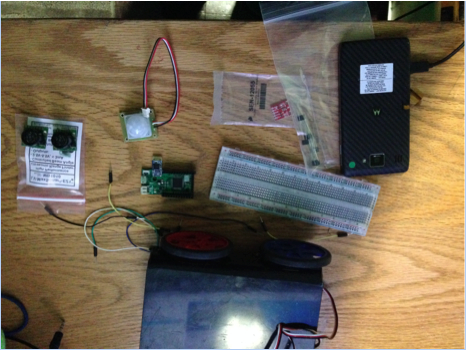
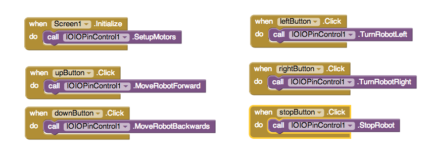

[&laquo; 返回首页](index.html)

## 将 App Inventor 2 项目连接到外部传感器

Note:  This report describes work carried out in Spring 2014 for an Undergraduate Advanced Project in the MIT Department of Electrical Engineering and Computer Science.  Funding to support this work was provided by Google ATAP

### Introduction
App Inventor is a visual “blocks” based language for programming Android apps. It gives users the ability to easily learn, create, and prototype in a plug-and-play environment by connecting various blocks of code.

Currently, AppInventor’s toolset primarily focuses on enabling prototyping of software experiences, with many blocks created to utilize Android system services such as sending and receiving SMS messages or reading information from the web. The focus of this effort was to extend AppInventor’s toolset into the physical space, allowing users to easily interface with external sensors, actuators, and other hardware.

The MOIO board[1] is a low-cost, programmable microcontroller and can provide input/output functionality for a wide range of applications. By building out IOIO/MOIO board support for AppInventor, creating a robotics kit and accompanying tutorials, we hope to make hardware programming more accessible.

### The Kit
For sensors, the kit includes one light sensor, some photoresistors, and two ultrasonic sensors.  These should suffice for a variety of applications, such as light-following and wall-following.  Here is an image of the finished kit:

MOIO board (schematics available here)[2]
Android phone (running 4.3 or higher)[3]
(1) light sensor
photoresistors
(2) ultrasonic sensors

Here is an image of the finished kit:

### The Blocks
The App Inventor blocks designed for this kit are simple, easily parsable methods such as “MoveRobotForward”, “TurnRobotRight”, and “StopRobot”. These blocks also do not take in any parameters to reduce user confusion. One consequence of this approach is that the hardware must be the same for all users and follow a prescribed wiring schematic. The pre-determined, hardcoded ports are as follows:

Front right motor: port 10

Front left: port 11

Back right: port 12

Back left: port 13.

Ultrasonic sensors: port 36

Luminosity sensor: TwiMaster 1 

In order to initialize all of the motors for use, the method “SetupMotors” must be called when the app starts and the screen is initialized. Here is an example of how simple the new blocks are to use:

Tutorials

                                                                                

A tutorial for using the blocks has can be found  here                                                                                                                                                          

### Ports, Wiring, and API

For reference, the front right motor is port 10, the front left is port 11, the back right is port 12, and the back left is port 13. The ultrasonic sensors have been wired to port 36, and the luminosity sensor is set up to use the TwiMaster 1.

 Dimensional Diagram

 Schematic Diagram

 API Github                 

                                                                                                         Code
                                                                

The code for the project is available on GitHub. The main source is here and the main class/highlight of the project is here

### Citations                                                                                
Aside from App Inventor code, the following website provided code to hook up the luminosity sensor to the IOIO board. Code from this blog was directly used and modified. BrianDorey.com                                                                                 

                                                                                                         Acknowledgements
I would like to first and foremost thank Professor Hal Abelson for sponsoring and supervising the project, as well as providing guidance and feedback as to the direction of the project. I would also like to thank José Dominguez for assisting with software aspect of the project, and Ilaria Liccardi for assisting with the hardware aspect of the project. I would finally like to thank the entire App Inventor team for their continued work on the platform.

