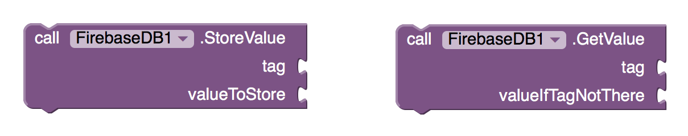
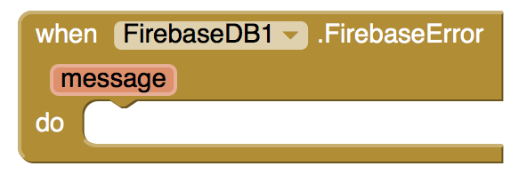

[&laquo; 返回首页](index.html)

## Brief introduction to cloud data and the FirebaseDB component

Using cloud data

ShareValue: A simple app with cloud data

FirebaseDB versus TinyWebDB

More general sharing

Jan. 24: The Firebase component and cloud data is an experimental feature of App Inventor. We are publishing some preliminary documentation so people  can experiment with this feature as we’re working on it. You are welcome and encouraged to build apps with this for experimental use, but please note that the behavior may change significantly and your apps will stop working.   Also, the emulator provided with App Inventor does not support the Firebase component.

One popular feature of mobile apps is that people using the same app on different devices can share information within the app. For example, a game app might keep track of the highest score among all users of the game so that every user can see it. That game app must keep track of the scores of each user from each separate device. It is not enough to just store data (locally) on each device independently.

To store the global high score across all users of the app, across any connected device, the app’s inventor should store it online. It should be stored so that every copy of the game app can read and write the data about the high score.

Data stored online, on the Web, is called cloud data. One piece of cloud data is a cloud value.

App Inventor’s FirebaseDB component provides a way to use cloud data in apps you invent. The data is stored and maintained using the Firebase database service http://www.firebase.com, which is part of Google. In general, using the Firebase service requires having access to a Firebase account, and this costs money. But any MIT App Inventor user can use the FirebaseDB component cost-free through a special default account provided by MIT.  

This MIT account is intended only for personal work and testing. You’ll need to get your own Firebase account in order to make apps for heavy use and for distribution to large numbers of users.

This current release of the FirebaseDB component is experimental, and its properties may change in response to user comments. In particular, this experimental release does not include the ability to use it with your own Firebase account, but only with MIT’s default account. MIT plans to provide a way for people to obtain their own Firebase accounts after we gain more experience using the component.  

Note:  The FirebaseDB component requires Android API Level 10 (GINGERBREAD_MR1) or greater, both for live-testing apps as you develop them and for running apps (.apk’s) that use the component.

The FirebaseDB component is based on an MIT undergraduate project by Kristin Asmus, subsequently modified by William Byrne and Jeffrey Schiller. Kristin’s report on her work can be found here.

### Using cloud data

Adding the FirebaseDB component to a project provides access to several blocks. To make an app store data in the cloud, use the StoreValue block. StoreValue takes a tag (which must be a text string) and a value (which can be text, a number, a list, or a boolean), and stores that value in the Firebase Web service under the tag. To retrieve the value stored under a tag, use the GetValue block. GetValue takes the tag and requests the stored value from the Firebase service. All users who have installed that same app (apk file) will get the same stored value. 

Note: When we say “the same app” we mean an app with the same name, created by the same developer. For example, if you build an app with FirebaseDB and later modify that app and rebuild it, the new app will still share values with the old app. On the other hand, if you change the name of your project, the old values will become inaccessible.   Also, if another developer uses your app source code (AIA file), the resulting app will not share variables with your app, even if the two apps have the same name.

You can also specify a valueIfTagNotThere that GetValue should return if there is nothing stored under the given tag.  If you omit valueIfTagNotThere the default will be the empty string.

When the value is received from the service, the GotValue event is signaled with the tag requested and the value stored for that tag:

The Firebase service also tracks any changes to an app’s cloud data. When a value associated with any tag is changed, the DataChanged event happens, and sends the original tag and the new value to all running copies of the app.

There’s a final event called FirebaseError that lets the Web service report an error, which is usually the result of a communication problem:

### ShareValue: A simple app with cloud data

ShareValue is a simple app that uses the FirebaseDB component. It lets anyone who has the app installed set a shared cloud value and see when the value changes.

The app has a button, a textbox called ValueToSet, and a label called ReceivedValue. You enter a value in the text box and press the button. Everyone else using the same app will see their ReceivedValue label change to the new value that you entered in the ValueToSet textbox.

|  Component type   | Name  |  Purpose  |
|  ----  | ----  |
| Textbox  | ValueToSet |  enter the value to be stored |
| Button | Button1 | Click to store the value  |
|  |  |   |
| Label | ReceivedValue |  show the current cloud data |
| FirebaseDB | FirebaseDB1 | store the cloud data and signal when it changes  |

Here are the blocks for ShareValue:  

All that’s required is to store the value when the button is pressed, and set the ReceivedValue when the data is changed.  Before changing ReceivedValue, the DataChanged handler checks that the tag is equal to mySharedData, which is the tag for the cloud data that was stored. The check here is actually not necessary because mySharedValue is the only cloud data for this app. If there were several cloud values, then the tag would let us distinguish among them.

This is the entire app: it doesn’t even have to use GetValue, because the FirebaseDB component automatically pushes the changed value to all the users.

Even this simple app is already interesting. If you build it and distribute it to your friends, you have a simple chat program that all users of the app can use to send a single message (the value of mySharedData) to all other users.  

A more elaborate chat program could keep a historical list of the messages, and use that list as the shared variable. Pressing the button could add a message to the list and store the extended list in Firebase.  All users would then see the complete history list when a new message is added.  

In contrast, other apps cannot access those variables. A different app that uses the FirebaseDB component will have its own separate store of cloud variables, and will not interfere, even if it uses the same tags. Each app has its own data store.

### A collaborative drawing app

Here’s another example by Hossein Amerkashi that shows how to use Firebase to combine chat with a drawing program for collaborative sketching: Firebase Chat with Interactive Drawing.

### FirebaseDB versus TinyWebDB

If you are familiar with App Inventor’s TinyWebDB component, you’ll see that the StoreValue, GetValue, and GotValue methods for FirebaseDB work almost the same as the corresponding methods for TinyWebDB.  The difference between the two components, other than FireBaseDB’s DataChanged event, is whether the variables from different apps can interfere. With TinyWebDB, MIT App Inventor provides a single demonstration data storage that is used by all App Inventor apps. If you use that storage, then any App Inventor app can change your values, provided it uses the same tag. If you want more isolation than that, you’ll need to deploy a custom TinyWebDB service, as explained in the MIT App Inventor Documentation. With FirebaseDB, each app has its individual data store so that variables from other apps cannot interfere. The isolation is provided by the Firebase Web service.

### More general sharing

The example above shows how the FirebaseDB sharing can be simple and useful, but it’s limited. There’s no way for two different apps to share variables, whether from the same developer or different developers.  There’s also no way to use your own Firebase account instead of MIT’s shared account. These things can all be done: they are controlled by the FirebaseDB component’s properties. If you leave the properties set to their default values, you’ll get only the simple sharing described here. MIT is still updating the component and will provide documentation.  Meantime, you are on your own to experiment.
