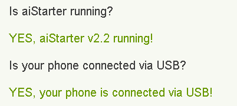
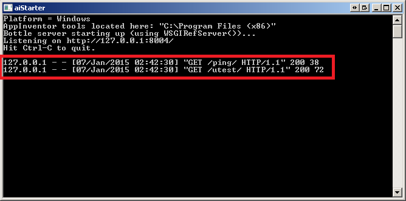

[&laquo; 返回首页](index.html)

请注意，截至 2023 年 5 月：MIT 不再支持 App Inventor 的 Genymotion 模拟器，但欢迎您继续尝试 Genymotion 和其他模拟器。

## 将Genymotion模拟器与App Inventor一起使用

The Google Android emulator distributed with App Inventor runs slowly.  Some people prefer using other emulators, such as one produced by Genymotion.

MIT’s App Inventor setup package does not include the Genymotion emulator, because MIT does not have permission to distribute it.   But you can download and install Genymotion on your own, after registering for a free license (free for personal use).   Unfortunately, this needs to be done individually  for each computer, which makes it awkward for classroom use, and Genymotion does not provide free educational use licenses.  Once Genymotion is installed, you’ll see a gain in speed and also flexibility, since you can configure the emulator to provide multiple screen sizes and form factors using different AVDs (Android Virtual Devices).

Here are the steps involved in installing and using Genymotion:

1. Step 1: Installing Genymotion and creating an Android Virtual Device (AVD)

1. Step 2: Deploying an APK file into an AVD

1. Step 3: Connecting Genymotion to MIT App Inventor through USB

1. Going further

### Step 1: Installing Genymotion and creating an Android Virtual Device (AVD)

1. Click here to create a Genymotion user account.

1. Download Genymotion's user guide [a] and follow the Installing Genymotion Section and then scroll down to the Getting Started section to set up an Android Virtual Device (AVD). You can ignore all the other pages.

### Step 2: Deploying an APK file into an AVD
Once Genymotion is installed, you can use it to run packages apps (APK files), including apps that you have built and packaged with App Inventor.  Here is an example:

1. Start an AVD in Genymotion:
        
  

1. Go back to MIT App Inventor and download the HelloPurr project as an APK file.

  

1. Drag and drop the APK file to the window of the running AVD. The HelloPurr application should launch:

  

### Step 3: Connecting Genymotion to MIT App Inventor through USB
You can also use Genymotion in live development in App Inventor, just as with the Google emulator.  When doing this tell  App Inventor that your are connecting “USB” rather than “emulator”, but you won’t be using a real USB device (or cable) - it’s just that the Android interface (ADB) will see the Genymotion through the USB interface.    

Here’s how to set up Genymotion for live development in App Inventor.

1. Install the App Inventor Setup Software (see step 1 on this page) on your computer., if you have not already done so.

1. Make sure that you are using the latest version of the App Inventor setup package:  versions before fall 2014 are not compatible with Genymotion.

1. To test that everything is working OK, start the Genymotion AVD following the Genymotion directions, make sure that  aiStarter is running, and visit the page http://appinventor.mit.edu/test.html . You should see[b]:

  

  If the aiStarter console is visible, there should see some activity as well:

  

  Leave the AVD and aiStarter running.

1. Download the MIT AI2 Companion App [c]http://ai2.appinventor.mit.edu/companions/MITAI2Companion.apk and drag and drop it into the running Genymotion AVD. You should get something like:

  

1. Now it's time to connect App Inventor to Genymotion: start an App Inventor project and  click on connect > USB.

  

  The project application should appear in Genymotion after 10 or 20 seconds:

### Going further
Here is some additional documentation from Genymotion:

<ul class="c5 lst-kix_i5lb564h5en9-0 start"><li class="c0 c7 li-bullet-0"><a class="c3" href="https://www.google.com/url?q=http://stackoverflow.com/a/20013322/395857&amp;sa=D&amp;source=editors&amp;ust=1692258966348971&amp;usg=AOvVaw1i96u0eZEJQkZEiuDfIhVj">How do you install Google frameworks (Play, Accounts, etc.) on a Genymotion virtual device?</a></li><li class="c0 c7 li-bullet-0"><a class="c3" href="https://www.google.com/url?q=http://stackoverflow.com/a/17530410/395857&amp;sa=D&amp;source=editors&amp;ust=1692258966349277&amp;usg=AOvVaw0Icvr_e-6KQAaHFL3CCTjr">How to use adb with a Genymotion virtual device?</a></li><li class="c0 c7 li-bullet-0"><a class="c3" href="https://www.google.com/url?q=http://stackoverflow.com/a/24076795/395857&amp;sa=D&amp;source=editors&amp;ust=1692258966349492&amp;usg=AOvVaw35ppef-ncj8dYTeu0LrCMR">How to solve the "failure install failed cpu api incompatible" error message when installing an APK file in Genymotion?</a></li><li class="c0 c7 li-bullet-0"><a class="c3" href="https://www.google.com/url?q=http://stackoverflow.com/q/17538686/395857&amp;sa=D&amp;source=editors&amp;ust=1692258966349687&amp;usg=AOvVaw1mcUrNleb4EPzIGuzRuGpl">How to copy virtual devices downloaded by Genymotion to another machine?</a></li><li class="c0 c7 li-bullet-0"><a class="c3" href="https://www.google.com/url?q=http://stackoverflow.com/a/22803803/395857&amp;sa=D&amp;source=editors&amp;ust=1692258966349888&amp;usg=AOvVaw17tgwLzaeADOpLHt6vWUh-">How to transfer folder/files from your computer to the Genymotion instance?</a></li></ul>

