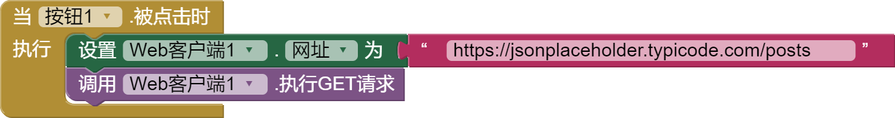
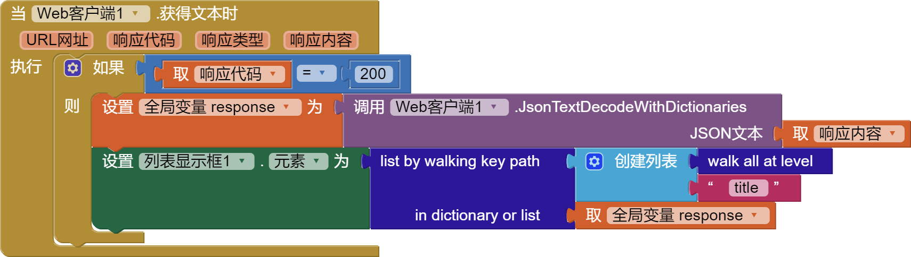

JavaScript对象表示法(JSON)广泛用于与 Web 上的应用程序接口(API)进行交互，JSON提供了不同的数据类型，同样App Inventor也支持这些值。
* JSON 布尔值`true`和`false` 对应 App Inventor`真`{:.logic.block}和`假`{:.logic.block}
* JSON 数字（整数和小数）对应 App Inventor `数字`{:.math.block}
* JSON 字符串 对应 App Inventor `文本`{:.text.block}
* JSON 数组 对应 App Inventor `列表`{:.list.block}
* JSON 对象 对应 App Inventor `字典`{:.dictionary.block}

一个简单的JSON消息例子如下：

```json
{
  "name": "张三",
  "likes": ["reading", "music"],
  "hasTowel": true,
  "widgets": 42
}
```

此 JSON 声明了一个对象（由 `{` 和 `}` 表示），key是冒号 (`:`) 前的带引号的字符串（例如，`"name"`），有不同的值，包括数组（方括号`[...]`之间的逗号分隔值）、数字（例如`42`）和布尔值（例如`true`）。

对于本文档的其余部分，我们将使用 [JSONPlaceholder](https://jsonplaceholder.typicode.com) 服务生成示例JSON响应，实际上并不存储任何数据。

***
## 本文档中使用的组件

以下示例使用了这些组件：

* [按钮](../components/userinterface.html#Button)
* [标签](../components/userinterface.html#Label)
* [列表显示框](../components/userinterface.html#ListView)
* [Web客户端](../components/connectivity.html#Web)

***
## 获取数据

Web客户端组件提供了一个 `执行GET请求`{:.method.block} 方法，当请求完成时Web客户端的 `获得文本`{:.event.block} 事件块将触发，该事件有两个重要参数：

* `响应代码`{:.variable.block}: 服务器提供的HTTP状态码，常见的有 `200`{:.math.block}（OK）或 `201`{:.math.block}（已创建），也可能是 `400`{:.math.block} 之类的值 （错误请求）、`403`{:.math.block}（禁止访问）和 `404`{:.math.block}（未找到）。根据你在应用程序中使用的 API，你应该检查状态代码以了解您的请求是否成功。
* `响应内容`{:.variable.block}：服务器返回的响应内容为`文本`{:.text.block}，让我们看看如何将其作为JSON进行处理：

Web客户端组件提供了方法[`将JSON文本解码为字典`{:.method.block}](../components/connectivity.html#Web.JsonTextDecodeWithDictionaries) 获取`文本`{:.text.block}的内容，比如 `响应内容`{:.variable.block} 参数，并将其转换为适当的 App Inventor 类型。根据返回的内容，`将JSON文本解码为字典`{:.method.block} 的输出可能会返回不同的类型，例如`列表`{:.list.block} 或`字典`{:.dictionary.block}。 App Inventor 提供了诸如`是列表?`{:.list.block} 和`是字典?`{:.dictionary.block} 之类的代码块，如果 API 允许多种类型，你可以使用它们来测试返回值的类型。

***
### 示例 - 成功获取

通过相应地设置 `Url`{:.setter.block} 属性并调用 `执行GET请求`{:.method.block} 来执行第一次请求：


成功时，`获得文本`{:.event.block} 事件的 `响应代码`{:.variable.block} 为 `200`{:.math.block}，我们可以使用 `将JSON文本解码为字典`{:.method.block} 方法解析 `响应内容`{:.variable.block} ，一旦我们有了包含结果的字典，我们就可以访问如下示例中的 `title`{:.text.block} 和 `body`{:.text.block} 属性。

**JSON 示例**

```json
{
  "userId": 1,
  "id": 1,
  "title": "sunt aut facere repellat provident occaecati excepturi optio reprehenderit",
  "body": "quia et suscipit\nsuscipit recusandae consequuntur expedita et cum\nreprehenderit molestiae ut ut quas totam\nnostrum rerum est autem sunt rem eveniet architecto"
}
```

**代码块**


运行上述块后，标签1 将包含 JSON 中的标题（即`"sunt aut facere..."`），标签2 将包含 JSON 中的正文（即`"quia et sucipit..."`）。

***
### 示例 - 获取失败

如果您请求一个不存在的资源（示例中的 post 101），那么你将得到一个错误：


HTTP 使用错误代码 `404`{:.math.block} 表示服务器找不到资源，我们对此进行测试并向用户报告错误。


***
### 示例 - 跟踪响应数据

如果您调用 `执行GET请求`{:.method.block} 并将 `Url`{:.setter.block} 设置为 `https://jsonplaceholder.typicode.com/posts`{:.text.block}，那么您将 获取包含 100 个条目的列表。



如果您想在 列表显示框(ListView) 中显示有关这些项目的一些信息，一种方法是使用`for each item`{:.control.block} 块来遍历列表。


但是，[`list by walking key path`{:.dictionary.block}](../blocks/dictionaries.html#list-by-walking-key-path) 使这更容易，这个块的工作原理是从给定的对象开始，然后按照以`列表`{:.list.block} 的形式提供给它的后续步骤。在下面的例子中，我们给它 `walk all at level`{:.dictionary.block} 和 `title`{:.text.block} 的关键路径来获取列表中每个帖子的标题（按appearance排序）。这段代码在功能上等同于上面使用 `for each`{:.control.block} 块的代码，但它更简洁。



***
## 发送数据

将数据发送到 Web API 进行处理通常涉及两件事。首先，你必须构建需要发送到 API 的消息，API 开发人员通常会提供有关如何使用其 API 的详尽文档；其次，根据操作是否敏感，例如更改或删除数据，你需要提供一些身份验证令牌。

要使用 JSON 的 Web API，您需要使用 App Inventor 的列表和字典类型，例如：

### 例子

我们可以使用 Web客户端 组件的 [`PostText`{:.method.block}](../components/connectivity.html#Web.PostText) 方法将内容发送到基于 JSON 的 Web API。 对于 JSONPlaceholder，帖子应包含 3 个键：`"userId"`、`"title"` 和 `"body"`。


成功时，`获得文本`{:.event.block} 中的`响应代码`{:.variable.block} 将为 `201`{:.math.block}，表示“已创建”。


***
## 更多信息

要了解有关 HTTP 响应代码的更多信息，请参阅 [HTTP 响应状态代码](https://developer.mozilla.org/zh-CN/docs/Web/HTTP/Status)。
