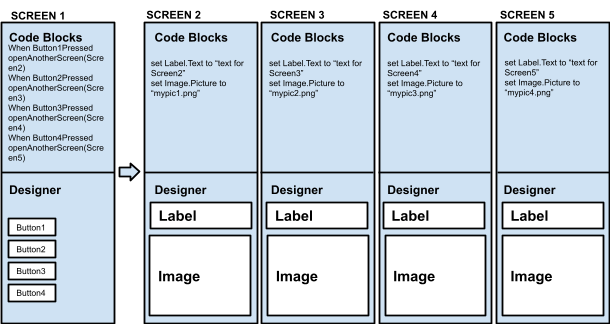
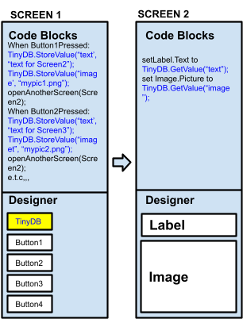

[&laquo; 返回首页](index.html)

## 构建具有多个屏幕的应用程序

App Inventor 可以轻松地向应用程序添加更多屏幕，但最好也不要添加太多屏幕，因为多个屏幕的应用程序将非常消耗计算资源，并且很容易超出 App Inventor 的限制。

根据经验，任何单个应用程序中的**屏幕不应超过 10 个**，当你尝试超过此限制时，App Inventor 会警告你。

在向应用程序添加其他屏幕之前，可以考虑使用通过在 Screen1 上使用垂直或水平排列创建的“虚拟”屏幕，并以与“切换屏幕”大致相同的方式管理其可见性。

**“虚拟”屏幕**

你可以使用单个屏幕，并在屏幕图像更改时显示和隐藏按钮（通过 ”可见性“ 属性），而不是构建具有实际多个屏幕的应用程序。

下面是一个应用程序的示例，该应用程序的一个视图包含四个按钮，另一个视图包含一个标签和一张图像。不是使用两个屏幕，而是一个具有两个垂直排列的屏幕，它们交替可见和隐藏。

当然，所有这些都是以增加处理视图切换的块中的程序复杂性为代价的 —— 为每个新视图添加一个新的“虚拟”屏幕要简单得多，而不必担心屏幕切换逻辑。你可以通过这种方式处理任意数量的“虚拟”屏幕。

**多屏幕：请谨慎！**

App Inventor 不会阻止你创建具有超过 10 个屏幕的应用程序。 但请注意，如果你这样做，你将面临超出大多数 Android 设备以及浏览器的处理和内存限制的危险。 

精确的限制取决于几个不同的因素，例如应用程序的大小、声音和图像占用的存储空间、网络连接的速度以及 Web 浏览器的配置。 但当你不断添加屏幕时，你会遇到一个或多个这些因素，而后果可能会非常令人不快。 这可能包括：

* 块编辑器运行越来越慢，
* 以及 App Inventor 无法构建你的项目。 
* 在极端情况下，你可能会超出 App Inventor 保存或加载项目的能力：你将无法查看甚至无法修复你的项目，你必须在论坛上寻求帮助，甚至向人们寻求帮助 可能无法提供帮助。

如果你正在构建具有超过 10 个屏幕的应用程序，请在每次进行重大更改时将项目（aia 文件）保存到本地计算机（而不仅仅是 App Inventor 服务器）。 最好将项目的版本保存在不同的名称下，例如 MyAppV1、MyAppV2 等。 这样，如果你确实遇到问题，你就可以检查版本的历史记录。 **如果你一次向项目添加大量屏幕，请特别小心，这很可能会遇到问题**。

进行一系列这样的备份是一个好主意，不仅在多个屏幕的情况下，而且在你处理大型复杂项目时也是如此。

总是存在丢失工作的风险，因此值得努力进行备份作为预防措施。

**设计你的应用程序以限制屏幕数量**

如果你的应用程序需要大量屏幕，你可能会考虑重新设计它以不使用这么多屏幕。 例如，假设你的应用程序必须显示多个具有相同功能的不同屏幕图像，但每个图像具有不同的背景。 对此进行编码的一种方法是为每个图像使用不同的 App Inventor 屏幕，每个屏幕都有自己的背景图像。 使用这种方法，你需要的屏幕数量与图像数量一样多。 但另一种编码方法是只有一个屏幕并更改屏幕背景。

类似的想法适用于其他类型的元素：如果每个屏幕图像都有一个带有自己的文本消息的标签，那么你可以拥有一个屏幕和一个标签，而不是拥有多个屏幕，每个屏幕都有自己的标签，只需更改标签的 文本。 例如：

**不要这样设计你的应用程序：**

**而是像这样设计：**

也许有一天我们会让 App Inventor 足够智能，能够自动处理视图切换逻辑，或者增强系统的功能并放宽对屏幕数量的限制。 但目前，请注意具有大量屏幕的应用程序的限制，并准备好应对这些限制。
