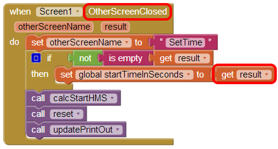
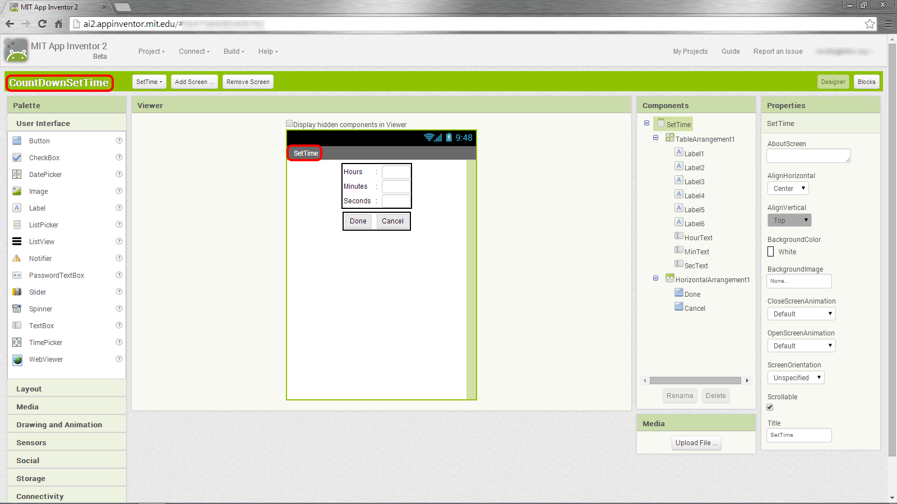
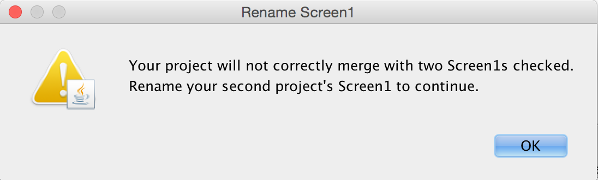
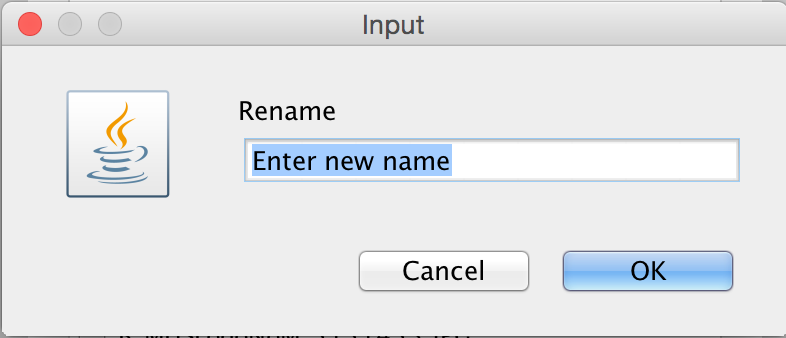

[&laquo; 返回首页](index.html)

### App Inventor 2 项目合并工具

本文档最初由米尔斯学院（Mills College）的 Kate Feeney 为 AI Classic 编写。该计划在她的论文[通过 App Inventor 鼓励协作](http://appinventor.mit.edu/explore/sites/all/files/Resources/EncourageCollaborationFeeneyThesis.pdf) 中进行了讨论。

该工具作为 Java 程序在 App Inventor 外部运行，需要在计算机上安装 Java 才能使用它。

### 如何使用 App Inventor 合并工具进行团队开发

在团队内开发应用程序时，App Inventor 合并工具非常有用。该工具允许多个开发人员在应用程序的不同屏幕上工作，然后将它们合并在一起。请记住，整个组合应用程序仍然受到 App Inventor 建议的总共最多 10 个屏幕的限制。

本文档概述了使用 App Inventor 合并工具在团队环境中开发应用程序的过程。它将使用由两个不同开发人员开发的简单双屏应用程序的示例来演示此过程。

***
概述

Dividing Work

Developer 1 Work In App Inventor

Design View

Blocks Editor

Download Source Code

Developer 2 Work In App Inventor

Design View

Blocks Editor

Download Source Code

Merging into one Project

Launch the App Inventor Merger

Find and Load Both Projects

Merge the Projects

Upload Final Project to App Inventor

Extras

Universal Assets and Databases

Assets

Databases

Merging More Than Two Projects

Renaming Second Project’s “Screen1”

Appendix

Appendix A: Complete Blocks for Screen1 of CountDownScreen1

Appendix B: Complete Blocks for SetTime Screen

### Overview
Each developer will work on their own separate project file.  These project files can be either under the same username or different usernames.  There can only be one “Screen1” per project, therefore only the developer designing the first screen to appear on the app should populate “Screen1.” All other developers should leave “Screen1” blank and only develop additional screens. In the case that another developer does populate “Screen1”, the merger tool will allow that screen to be renamed so it can be merged into the final project.

Developers can write code to call a screen they are not developing but they must know the name that has been assigned to that screen by its developer.  Also, two different developers/screens can use the same database or asset but they must be named the same (for more details on this see the [Universal Databases and Assets](#Universal-Assets-and-Databases) section below). Finally, no two different screens or assets can have the same name (with the exception of “Screen1” which can be renamed). For these reasons it is important to decide beforehand the name of each screen and a naming convention for assets that will insure no unwanted duplicates.

Once separate projects are complete they can be merged together using the App Inventor Merger Tool.

## Dividing Work
Work should be divided by screens.  Each screen should be assigned to a developer and there should be only one version of each screen to be merged into the final app.  This document will follow an example for which there are two screens and two developers working on an app named “CountDown.” The CountDown app will work like a timer.  The first screen shows the time counting down and allows the user to start, stop or reset the timer. From the first screen the user can also switch to a second screen to set the amount of time to count down.

Developer1 will work on the first screen and call it “Screen1”.   Developer2 will work on the second screen and call it “SetTime”.  The naming convention for assets will be the screen name followed by the asset name.  There are no universal assets or databases. Screen1 will open the SetTime screen and when the SetTime screen is closed it will pass a number, representing the total number of seconds to countdown to Screen1.

## Developer 1 Work In App Inventor
Developer1 will log into App Inventor using their account and create a new project called “CountDownScreen1.”  

### Designer View
The Designer view for CountDownScreen1’s Screen1 is shown below in Figure 1. Note that the project name, the screen name and assets follow the predetermined naming convention.

Figure 1: CountDownScreen1’s Screen1 Designer View

### Blocks Editor
Developer1 then creates the blocks needed for Screen1.  These blocks included a block to open the SetTime screen when the “Set Time” button is clicked and a block to handle when the SetTime screen is closed. Views of the SetTime.Click block and the Screen1.OtherScreenClosed  block are shown in Figure 2 and 3 respectively. The complete set of blocks for Screen1 are shown in Appendix A.

Figure 2: CountDownScreen1’s Screen1 SetTime.Click block

The SetTime.Click block opens the SetTime screen. Note that the string assigned to screenName must be exactly what was decided in advance as the name of the second screen.

Figure 3: CountDownScreen1’s Screen1 OtherScreenClosed block

The Screen1.OtherScreenClosed receives the number of seconds to countdown from the SetTime screen when the screen is closed and sets the startTimeInSeconds variable to it.

### Download Source Code
Once Developer1 completes Screen1 they download the source code.  This is done by going to the My Projects view and checking the checkbox next to the CountDownScreen1 project, then clicking on the “Project” dropdown and selecting “Export selected project (.aia) to my computer”. Figure 4 shows how to select a project and where to click to download the project.

Figure 4: Steps to download the CountDownScreen1 project

## Developer 2 Work In App Inventor
Developer2 will log into App Inventor using their account and create a new project called “CountDownSetTime.”  

### Designer View
The Designer view for CountDownSetTime’s Screen1 is shown below in Figure 5. The Screen1 is empty except for a button that takes you to the SetTime screen.  This button is only for Developer2 to get to the SetTime screen during testing and debugging. This Screen1 will not be merged into the final app.

Figure 5: CountDownSetTime’s Screen1 Designer View

The Designer view for CountDownSetTime’s SetTime screen is shown below in Figure 6. Note that the project name and the screen name follow the predetermined naming convention.

Figure 6: CountDownSetTime’s SetTime screen Designer View

### Blocks Editor
Developer2 then creates the blocks needed for the SetTime screen.  These blocks include a block to send the number of seconds to countdown to Screen1 when the SetTime screen is closed. This block is the Done.Click block shown in Figure 7. A complete set of blocks for the SetTime screen are shown in Appendix B.

Figure 7: Done.Click block for CountDownSetTime’s SetTime screen

### Download Source Code
Developer2 downloads the CountDownSetTime project following the same steps Developer1 followed to download the CountDownScreen1 project.

### Merging into one Project
Once both developers have downloaded their respective projects, the two projects can be merged into the final app using the following steps.

### Launch the App Inventor 2 Merger
If not already done, downloaded the latest version of the App Inventor Merger.   This is a Java jar file.  You can find a link to the file on the MIT App Inventor Web site at

[http://appinventor.mit.edu/explore/resources/ai2-project-merger.html](http://appinventor.mit.edu/explore/resources/ai2-project-merger.html)

Download the jar file and save it to your computer.   To launch the Project Merger simply double click on the jar file.

### Find and Load Both Projects
The main project will be CountDownScreen1 since Screen1 from this project will be the Screen1 for the final app and the second project will be CountDownSetTime.  

Select the browse button for the main project.  A file browser window will appear.  Find and select the CountDownScreen1.aia file, then click Open to load the project into the App Inventor Merger.  A list of the main project’s assets (including their extensions) and screens will appear in the lower left hand corner of the screen and this means that the main project has been loaded into the App Inventor Merger.

Click the browse button for the second project.  A file browser window will appear.  Find and select the CountDownSetTime.aia file, then click Open to load the project into the App Inventor Merger.  A list of the second project’s assets (including their extensions) and screens will appear in the lower right hand corner of the screen and this means that the second project has been loaded into the App Inventor Merger.

### Merge the Projects
Once two projects have been loaded a Merge button will appear between them as shown in Figure 8 below.

Figure 8: The App Inventor Merger Tool showing the projects loaded and ready to merge.

Check the boxes next to all of the screens and assets you wish to merge into the final app. For this example all assets and screens are selected except Screen1 from the second project.

In this case only one screen is being selected from each project and the second project’s Screen1 is not being used, but in other cases multiple screens can be merged from the same project file and the second project’s Screen1 can be renamed and included.  For more information about renaming your second project’s Screen1 see the Renaming Second Project’s “Screen1” section below. 

Click Merge.  A save dialog window will appear.  Browse to where you would like to save the project, enter the project’s name and then click Save. The project will be saved as an .aia file.

A dialog box will appear letting you know that your projects have been successfully merged.  There will now be a new .aia file saved at the location you specified. The dialog box will also ask if you would like to merge another project.  Since this example only has two developers working on two different project files, there is no need to merge another project. Click No and confirm that you want to close the merger. For more information about merging more than two project see the Merging More Than Two Projects section below.

## Upload Final Project to App Inventor
The .aia file created by the App Inventor Merger is your new project file. This project file can be uploaded to App Inventor so that you have a complete project in App Inventor.

To upload the file, launch App Inventor and go to the My Projects page. Click on the “Projects” dropdown and select “Import project (.aia) from my computer...”

Figure 9: The My Projects page where you will upload the merged project file.

A dialog box will appear.  Select Choose File. A file browsing window will appear.  Find and select the .aia file that was just created by the App Inventor Merger and then click Open followed by OK.  Your new project will now appear in your list of projects and will open in the App Inventor window.

## Extras
### Universal Assets and Databases {#Universal-Assets-and-Databases}

Assets
If your app uses the same asset on multiple screens, then you can make that asset universal. This is done by giving it a name that does not follow the normal naming convention but instead is repeated by all screens. When the projects are merged the universal asset will only need to be selected from one of the projects.

For example, imagine you have a logo, which is an image, that should appear at the top of every screen. Instead of having every developer name the logo something different (Screen1Logo, Screen2Logo …), as the naming convention would require, every developer can simply name it Logo. When the projects are merged only check the Logo asset listed under the main project so that the asset is only loaded into the final app once but all the screens will be able to access it.

Databases
Apps that use databases can be merged using the App Inventor Merger very easily.  Different developers can even work on different screens that use the same database separately and then merge them together at the end.

The only requirement for merging screens that share a database is that the name assigned to the database for each screen is the same.  Once the projects are merged the same database will work for all the screens.

### Merging More Than Two Projects
The App Inventor Merger is still a very useful tool even if there are more than two developers working on more than two project files. The process is exactly the same as the two developer process, described above, until the dialog box letting you know your project has been successfully merged pops up (shown in Figure 10 below).  

Figure 10: Dialogue box that appears after successfully merging an project.  You can merge more projects by clicking “Yes.”

When there were only two developers we selected No but for the case of more than two developers select Yes since there are more projects to be merged.  A new dialog box will appear asking if you would like to use the project you just created as the new main project.  If you select No, the App Inventor Merger will restart with no projects loaded, the same as if you just launched it. This would be used to merge two new projects together.

If you select Yes, the App Inventor Merger will restart with the project you just created loaded as the main project and the second project is blank (as shown in Figure 11 below).  This option can be used if you would like to merge a third project with the first two projects you previously merged.

Figure 11: By selecting “Yes” to merge another project with the one you just created will pre-populate the Main Project.

### Renaming Second Project’s “Screen1”
In the case that two developers populate “Screen1”, the merger tool will allow the “Screen1” of the second project to be renamed so it can be merged into the final project.  The process for merging the projects is exactly the same as described above, except you will check both Screen1s. Once you click merge, a dialog box will appear indicating that you have chosen more than one Screen1 (shown in Figure 12 below, left) and will direct you to enter a new name for the second project’s Screen1 (shown in Figure 13 below, right).  

Figure 12: The dialogue that appears when you click merge with both Screen1s checked.

Figure 13: Rename the second project’s Screen1 by entering a new name in this textbox.

Once you’ve renamed your second project’s Screen1, the App Inventor Merger will combine your projects and offer the same options as discussed above.

## Appendix

### Appendix A: Complete Blocks for Screen1 of CountDownScreen1

### Appendix B: Complete Blocks for SetTime Screen

